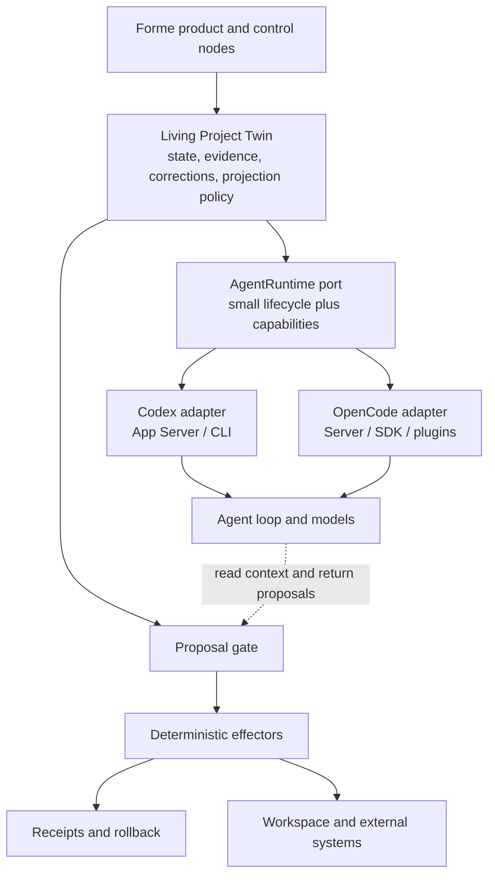

# Agent Runtime Strategy

> How Codex, OpenCode, and the Living Project Twin fit together

- Status: Proposed architecture input for D2/D3
- Updated: 2026-07-15
- Decision source: `Forme_MVP_Decision_State_Revised.md`
- Scope: agent runtime integration; this document does not replace the product or Twin semantic specifications

## Decision

Forme will use mature agent runtimes from the beginning. It will not rebuild a generic agent loop and will not fork Codex or OpenCode for the MVP.

Codex and OpenCode are both first-class integration targets:

- **Codex** gives Forme the strongest path into the OpenAI ecosystem and a security-oriented coding-agent substrate.
- **OpenCode** gives Forme a highly embeddable TypeScript SDK, public plugin hooks, custom tools, and broad provider support.
- **Forme** owns the durable project model, evidence, corrections, projection policy, deterministic effects, and product-level receipts.

The architecture is **runtime-neutral at the Twin boundary and runtime-native inside each adapter**. A shared port must not erase Codex-specific or OpenCode-specific advantages.

## The boundary that matters

Codex and OpenCode already provide most of the commodity harness shape:

- model authentication and provider calls;
- streaming and structured responses;
- session, thread, turn, and message lifecycles;
- tool execution, cancellation, retry, and compaction;
- shell, file, search, MCP, skill, plugin, and subagent surfaces;
- approvals or permissions;
- event streams, usage data, diffs, snapshots, or undo primitives.

The Living Project Twin solves a different problem:

- what the project currently is;
- which evidence supports a claim;
- what the owner confirmed versus what an agent inferred;
- how corrections invalidate or revise downstream interpretations;
- how one private state produces role-scoped projections;
- how continuity survives a runtime, session, or model change.

A runtime session is disposable computation. The Twin is durable semantic state.



Invariant: **the runtime may observe a scoped Twin projection and request an effect, but it may not bypass Forme's deterministic write boundary.**

## Responsibility split

| Capability | Runtime owns | Forme owns |
|---|---|---|
| Provider and model invocation | Yes | Selection and policy |
| Streaming, retry, cancel, compaction | Yes | Normalized lifecycle events |
| Runtime session history | Yes | Mapping only; never canonical truth |
| Generic shell and file tools | Provides | Deny or narrowly authorize |
| Permission mechanism | Provides | Product policy and hard write boundary |
| OS containment | Runtime or external sandbox | Required effective containment |
| Project facts and evidence | Context only | Canonical ownership |
| Confirmed versus inferred state | No domain guarantee | Canonical ownership |
| Correction propagation | No domain guarantee | Canonical ownership |
| Projection policy | No domain guarantee | Canonical ownership |
| Project mutation | Generic tools | Deterministic effectors |
| Low-level event history | Yes | Product-level action receipt |
| Runtime portability | No | `AgentRuntime` port and contract tests |

## Codex findings

Research snapshot:

- Upstream: `openai/codex`
- Inspected commit: `2e1607ee2fa8099a233df7437adee5f16a741905`

### Strengths for Forme

- App Server is an explicit application-integration boundary for threads, turns, approvals, tools, and events.
- Codex invests deeply in approval flows and platform-specific operating-system sandboxing.
- Its thread/turn/item lifecycle maps cleanly to execution records and cancellation.
- MCP, skills, and multi-agent capabilities reduce the amount of generic infrastructure Forme must build.
- OpenAI authentication and model integration are strategically valuable product choices for Forme users.

### Constraints

- The implementation is primarily Rust; native embedding has a higher integration cost for a TypeScript MVP.
- App Server is the appropriate external boundary. Internal crates should not be treated as a stable third-party SDK without an explicit upstream guarantee.
- Product-specific semantic hooks remain Forme's responsibility.

### MVP integration level

Use Codex App Server or the supported one-shot CLI surface. Do not fork and do not bind product logic directly to internal crates.

References: [Codex repository](https://github.com/openai/codex), [Codex App Server source](https://github.com/openai/codex/tree/main/codex-rs/app-server).

## OpenCode findings

Research snapshot:

- Upstream: `anomalyco/opencode`
- Branch inspected: `dev`
- Commit: `05c3e40a4e641732b991499000ca479e5dad4b02`
- Package version: `1.18.1`
- License: MIT

### Strengths for Forme

OpenCode exposes its client/server split as a public architecture:

- `opencode serve` provides a headless HTTP server;
- the TUI uses the same server as a client;
- an OpenAPI description is available at `/doc`;
- an official TypeScript SDK can connect to or start a local server;
- the API covers projects, sessions, messages, prompts, permissions, agents, providers, MCP, files, diffs, forks, revert, and SSE events;
- prompt calls accept JSON Schema structured output;
- context can be injected without triggering a reply.

References: [OpenCode Server](https://opencode.ai/docs/server/), [OpenCode SDK](https://opencode.ai/docs/sdk/).

OpenCode's plugin and custom-tool surfaces are especially useful:

- project-local and package plugins;
- message, parameter, permission, tool, environment, and compaction hooks;
- custom TypeScript tools with schemas and session/worktree context;
- deterministic plugin ordering.

These allow Forme to expose only narrowly scoped tools such as:

- `forme_read_twin`
- `forme_propose_observation`
- `forme_request_confirmation`
- `forme_propose_projection`
- `forme_request_action`
- `forme_read_action_receipt`

References: [OpenCode Plugins](https://opencode.ai/docs/plugins/), [OpenCode Custom Tools](https://opencode.ai/docs/custom-tools/).

OpenCode also records workspace snapshots, patches, diffs, and revert state around session steps. These primitives can contribute to low-level action receipts and undo, but workspace state is not Twin semantic state.

### Security constraint

OpenCode provides application-level `allow / ask / deny` permission rules, agent-specific policy, external-directory controls, and permission hooks. In the inspected official documentation and source, no built-in operating-system containment boundary equivalent to Codex's platform sandbox was found.

Therefore an OpenCode adapter must:

1. deny generic shell, edit/write, task, and external-directory access by default;
2. expose only the minimum Forme tools required by the pass;
3. keep schema validation, preconditions, idempotency, effects, and receipts outside the runtime;
4. add an external OS/container sandbox for risky execution;
5. prove with tests that prompts, plugins, and built-in tools cannot bypass the write gate.

References: [OpenCode Permissions](https://opencode.ai/docs/permissions/), [OpenCode Agents](https://opencode.ai/docs/agents/).

## Comparison for Forme

| Dimension | Codex | OpenCode | Architectural consequence |
|---|---|---|---|
| External integration | App Server and CLI | HTTP server, OpenAPI, TS SDK | Both support non-fork integration |
| Product embedding | Moderate | Strong | OpenCode is fast to prototype in TypeScript |
| Extension surface | MCP, skills, protocol items | Public plugins and custom tools | Preserve native capabilities |
| Provider strategy | OpenAI-centered | Multi-provider, including OpenAI | Runtime choice need not equal model choice |
| Structured output | Supported through runtime/model surfaces | Prompt API accepts JSON Schema | Both feed Forme's proposal gate |
| Session and events | Strong | Strong | Normalize only the lifecycle Forme needs |
| Diff/revert | Strong coding workflow support | Direct session diff/revert APIs | Useful evidence, not Twin truth |
| Application permission | Strong | Strong and hookable | Neither replaces the domain write gate |
| OS-level sandbox | Explicit platform implementations | No equivalent verified in inspected source | Declare and test containment capability |
| Distinct advantage | OpenAI ecosystem and secure execution | Embeddability, plugins, providers | Do not force feature parity |

## Integration ladder

Use the shallowest upstream-supported boundary that satisfies the product:

1. configuration and permission policy;
2. MCP, skills, or custom tools;
3. plugin hooks;
4. Server/SDK adapter;
5. upstream contribution of a general extension point;
6. native host/core integration;
7. fork only after every earlier level is proven insufficient.

A fork requires a concrete, demonstrated, core-experience blocker and an explicit maintenance budget. Convenience is not sufficient.

## Runtime port

The shared port should remain small:

```ts
interface AgentRuntime {
  inspect(): Promise<RuntimeDescriptor>
  start(input: RuntimeStartInput): Promise<RuntimeHandle>
  runPass(input: RuntimePassInput): AsyncIterable<RuntimeEvent>
  respondToPermission(input: PermissionResponse): Promise<void>
  cancel(runId: string): Promise<void>
  close(): Promise<void>
}
```

`RuntimeDescriptor` declares capabilities rather than pretending both runtimes are identical:

```ts
interface RuntimeCapabilities {
  structuredOutput: boolean
  applicationPermissions: boolean
  osSandbox: "native" | "external" | "none" | "unknown"
  sessionResume: boolean
  workspaceDiff: boolean
  revert: boolean
  plugins: boolean
  skills: boolean
  mcp: boolean
  subagents: boolean
}
```

The base event contract includes only:

- run started, completed, failed, and cancelled;
- assistant output delta;
- structured proposal;
- tool requested and completed;
- permission requested and resolved;
- usage update;
- workspace diff reference.

Adapter-native features may be exposed behind declared capabilities. They must not leak into Twin state.

## Runtime gate

Codex and OpenCode must run the same golden scenario:

| Test | Pass condition |
|---|---|
| Start and health | Forme can discover, connect, and diagnose the runtime |
| Scoped context | Only the requested Twin slice is visible |
| Structured proposal | Invalid output cannot enter the Twin |
| Tool boundary | Only explicitly allowed Forme tools are callable |
| Unauthorized write | Generic write and external paths are blocked with test evidence |
| Permission lifecycle | Ask/allow/deny maps to stable Forme events |
| Cancel | Cancellation ends the run without a hanging effect |
| Crash equivalence | A crash cannot create a half-written Twin mutation |
| Receipt | Proposal, approval, effect, and diff are correlated |
| Restart | A new session resumes from Twin state, not transcript truth |
| Upgrade contract | Pinned versions fail clearly when upstream contracts change |

The MVP may complete one vertical slice on Codex before OpenCode reaches equal depth, but both adapters must remain first-class architecture targets. Runtime sequencing is an implementation decision, not product hierarchy.

## Immediate build sequence

1. Define the minimal runtime-neutral event and proposal contracts.
2. Implement discovery and a one-pass smoke adapter for Codex.
3. Implement discovery and the same one-pass smoke adapter for OpenCode.
4. Run the golden scenario and record capability differences.
5. Complete the first Living Project Twin vertical slice on the runtime that best satisfies the current scene.
6. Keep the second adapter under contract tests and deepen it when the product exercises its distinct advantage.

The research checkouts are evidence snapshots, not Forme dependencies. Production integration must pin a released version or commit and protect upgrades with contract tests.
