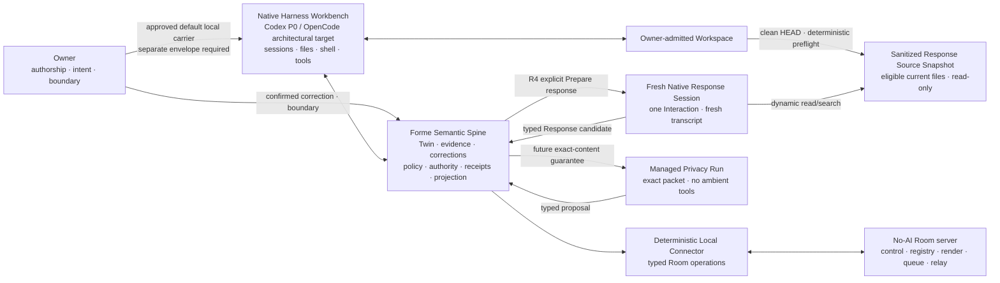

# Architecture boundaries

> **Paused-contract notice — 2026-09-17:** This document records the
> architecture used by the first build phase. It is not current authority to
> continue implementation; the durable Twin and judgment architecture is under
> review. See [the project checkpoint](./CHECKPOINT-2026-09-17.md).

- Status: R1, R2, and R3 owner-accepted; privacy-first P human-boundary model,
  R4 product topology, T1 public/private Room correction, and T2 Room control
  contract owner-approved; NH1 option 1 and NH2 option 1 owner-approved;
  Fresh Native Response Session (Option 2B) exact T3 contract and T4 public
  lifecycle contract owner-approved; the complete T5 async, notification,
  deletion, retention, and P0-cut contract owner-approved, including four
  Owner-selected Guest continuation presets; reconciled Packet v0.2 passed
  independent audit at `sha256:e417836b…adfff5` and was Owner-approved on
  2026-08-03; Gate A repository-only implementation is current
- Updated: 2026-08-03

The rebuild begins from product behavior and contracts. It does not copy the archive's directory structure or implementation by default.

## System shape — Harness-native, Twin-governed



This is the global architecture clarification. The accepted R1–R3 code proves
a deliberately narrow managed-pass slice:

```text
bounded source → durable Twin → exact packet → no-tools Codex proposal
→ Forme admission/Owner gate → deterministic effect/receipt → Twin
```

That slice remains valid. It is one **Managed Privacy Run** and the first
Forme-authoritative effect proof, not the permanent shape of all local work.
See
[`NATIVE-HARNESS-ARCHITECTURE.md`](./NATIVE-HARNESS-ARCHITECTURE.md).
The NH1/NH2 approval chooses roles and boundaries; it grants no concrete
runtime, file, shell, tool, network, provider, credential, Guest, or Room
authority.

## Responsibility boundary

### Native Harness Workbench owns

- model/provider invocation and interactive runtime sessions;
- planning, compaction, streaming, cancellation, and runtime events;
- native files, shell, tools, MCP, Skills, plugins, subagents, permissions,
  and diffs inside an Owner-admitted capability envelope;
- ordinary Workspace work only when a separate, concrete Owner-approved
  runtime envelope allows it. NH1/NH2 grant no such envelope by themselves.

### Forme Semantic Spine owns

- durable entity state and revision history;
- evidence references and provenance;
- confirmed versus inferred meaning;
- corrections and dependent-output invalidation;
- context planning, minimization, and declared visibility class;
- schema validation and proposal admission;
- authorization policy;
- Forme-authoritative semantic/external effects and the receipts, verification,
  recovery, and rollback guarantees Forme claims for them;
- projection allowlists and versions.

### Fresh Native Response Session, Managed Privacy Run, and connector

The selected R4 P0 direction uses one Fresh Native Response Session per exact
Interaction: a new/non-resumed transcript receives the exact request and typed
body/path-free current Twin orientation, then may dynamically read/search only
a sanitized read-only snapshot of current eligible Forme files. P0 does not
expose Git history. It receives no generic writer,
Web/network tool, other Interaction, Guest store, sibling root, secret
environment, connector credential, Room tool, or publish authority. Forme
records this Session Envelope honestly; dynamic reads do not support an exact
provider-visible byte-manifest claim. Its output remains an untrusted typed
candidate requiring exact Owner publication approval.

A Managed Privacy Run receives one exact compiled packet as the complete
manifest of Forme-selected Owner/Guest/workspace content and no ambient tools.
Runtime-owned system/safety instructions, output schema, and operational
metadata remain separately disclosed/audited rather than hidden inside that
guarantee. The deterministic local connector holds exact T2 Room credentials
and executes only admitted typed operations; a generic model session never
receives that secret by implication.

Runtime transcripts are disposable computation. They are never the Project Twin.

### Harness ownership test

A mature Harness may natively provide model invocation, sessions, tools,
sandboxing, permission prompts, streaming, undo, MCP, and event APIs. Forme
should consume those capabilities through replaceable CLI/API/MCP/Skill/Plugin
adapters rather than reproduce a general agent runtime.

Forme's boundary begins where operational runtime state becomes durable product
meaning or Forme-authoritative effect: the Living Project Twin, evidence and
correction, canonical proposal admission, revision-bound authorization,
product-level verification/receipts/recovery, and projection/Room policy.
Ordinary Workspace source-of-truth files and Forme-authoritative semantic state
are not the same object. Under the approved NH2 two-class boundary, native
ordinary work remains ordinary work; a result may be offered and admitted as
evidence only through a separate typed Forme contract, and is never
auto-ingested as canonical meaning or a Forme-authoritative effect.

The same visible action may therefore be possible in Codex or OpenCode without
Forme. It carries Forme's semantic/authority guarantees only when it returns
through these contracts. See [`VALIDATION.md`](./VALIDATION.md) for the current
wheel-reinvention and product-differentiation assessment and the dated
[`agent runtime strategy`](./research/agent-runtime-strategy-2026-07-15.md) for
the adapter integration ladder.

## Initial invariants

These invariants include both constitutional boundaries and slice-specific
mechanisms used to prove R1–R3 safely. The exact one-use approval, packet-only
runtime, and no-tools choices remain valid evidence for those slices; they are
not a permanent ceiling that requires every future Agent action to be approved
one at a time.

1. Source, provider, audience, and capability access is explicit and bounded.
2. The first demo has one workspace and one Twin.
3. Every run declares its context contract. A Native Workspace Session may
   dynamically inspect only an Owner-admitted Workspace envelope and cannot
   claim an exact manifest of dynamically selected content; a Managed Privacy
   Run receives only its exact Forme-selected content packet and no ambient
   repository access. The R4 Fresh Native Response profile additionally binds
   one exact Interaction, a new transcript, a sanitized read-only current
   Forme source snapshot and typed body/path-free Twin orientation while
   excluding ambient conversation, other Guest bodies,
   writers, network tools, credentials, and publication authority.
   Runtime-owned instructions/schema/metadata remain separately disclosed.
4. A runtime may perform ordinary Workspace work only under its native Owner
   permissions. It cannot directly admit Twin meaning, manufacture Owner
   approval, expand authority, or bypass a Forme-authoritative gate/effect.
5. Every proposal names its base revision and evidence.
6. Invalid, stale, oversized, or unauthorized output fails closed.
7. Effects for which Forme claims authority guarantees are idempotent or
   explicitly non-retryable, terminally receipted, and reversible where
   feasible.
8. Projection rendering has no private-source handle and consumes only an explicit allowlist.
9. Product behavior does not depend on a resident runtime session.
10. Codex is the P0 live carrier; OpenCode remains a first-class architectural
    compatibility target whose live path is P1. P0 requires only the minimum
    Codex integration needed by the walking slice, not every adapter surface
    or a live OpenCode path.
11. R1 Continuity is deterministic and invokes no model runtime; the first live Codex path begins in R2 through a scoped Context Packet.
12. R1 durable state is project-local and Git-ignored. It must be excluded from source observation and remain replaceable by a future storage adapter.
13. The R1 owner surface is generated Markdown. It renders the Twin but never becomes canonical state.
14. R2 historical input is limited to explicit reachable Git commits, allowlisted UTF-8 paths, bounded bytes, and resolvable line evidence.
15. R2 runs Codex from an isolated packet root with an exact readable-root permission profile; shell, MCP, apps, hooks, multi-agent, and web capabilities are disabled, and any unauthorized audit item prevents admission.
16. `TwinRevisionV2` begins only with a validated Reflection. It preserves V1 revisions and stores evidence coordinates, labeled meaning, owner correction, invalidation, and minimal receipts—never source bodies or runtime transcripts.
17. Owner correction creates a new immutable revision, supersedes the active interpretation, invalidates dependent output, and becomes input to later Context Packets.
18. In the accepted R3 slice, Codex output remains a schema-only intent
    proposal. V2 recommends by default, exposes one to three editable
    judgments, and may ask one blocking owner question only at low confidence.
    Forme alone compiles the fixed effect plan; `ask_owner` compiles none, and
    that Managed Privacy Run receives no writer.
19. The accepted R3 project's Forme-authoritative source effect is limited to
    one named managed block in `README.md`; arbitrary paths, patches, commands,
    Git, network, and external actions remain unavailable to that effect path.
20. Owner approval binds one immutable proposal and effect-plan hash to an unbroken Twin revision chain and one execution.
21. Execution and rollback use target hashes, atomic replacement, a write-ahead journal, terminal receipts, and fail-closed recovery so retries cannot duplicate effects and human edits cannot be overwritten.

### Approved P human-boundary invariants; proposed egress direction

The Owner approved this privacy-first/minimum-friction architecture
interpretation for R4 on 2026-07-28:

- privacy is the primary source, provider, and audience perimeter;
- human authorization establishes or widens an exact, inspectable, revocable
  envelope; inside it, routine transport and explicitly predelegated,
  deterministic monotonic exposure-reducing enforcement proceed
  review-by-exception;
- confidence, history, account access, or authority in another Room cannot
  expand the envelope;
- companion human representation/commitment and irreversible/materially
  high-impact consequence guards, plus a no-self-expansion rule, protect the
  human without turning routine operations back into per-action approval.

The following remains a proposed long-term egress direction, not part of the P
approval or current R4 implementation authority:

- content-bearing egress is eventually admitted as a policy-compiled artifact
  bound to exact audience, policy generation, disclosure attestation,
  attribution, hash, and receipt lineage. Model/tool separation remains
  defense in depth rather than the only policy fence.

## Approved R3 implementation boundary

- one `ActionContextPacketV1` containing the current owner frame, active corrected Reflection, evidence coordinates, explicit owner action goal, and the fixed action contract—but no README body or ambient repository content;
- additive `ActionIntentProposalV2` with one recommendation by default, one to three editable judgments, explicit confidence, and a low-confidence `ask_owner` fallback; V1 remains valid and reconstructible, and neither version may contain a path, patch, command, tool request, approval, or raw Markdown effect;
- deterministic Forme compilation into one exact `README.md` marker-block plan with before/after and plan hashes;
- a separate, one-use owner approval bound to the immutable effect-plan hash and strict current Twin revision;
- additive `TwinRevisionV3` agency state containing proposals, approvals, minimal runtime receipts, execution/rollback receipts, verification, invalidation, and hashes—not source bodies or runtime transcripts;
- a Forme-only exact-marker executor with atomic replacement, write-ahead journal recovery, idempotent retry, verified source evidence, and explicit hash-guarded rollback;
- no arbitrary file effectors, shell, Git staging/commit/push, GitHub mutation, server, background execution, delegated authorization, or OpenCode live R3 path.

The implemented V3 validator deliberately composes the complete persisted V2 schema with `AgencyStateV1`: old V1/V2 snapshots remain byte-unchanged, while every V3 snapshot must validate both inherited cognition and the additive agency records. Source mutation uses a second write-ahead journal coordinated with the existing immutable-revision transition, so restart can reconcile either side of the source/Twin boundary without granting the runtime a writer.

## Required continuity bridge from R3 to R4

R4 is not a separate social profile or mailbox product. Its public presence and
deeper response path must be causally derived from the same accepted Living
Project Twin:

```text
current validated TwinRevisionV3
  → locally selected eligible bases
  → deterministic Projection Candidate
  → exact Owner publication decision
  → immutable Projection Capsule
  → Room and optional Third Place admission
  → Guest Interaction
  → untrusted local Signal Box import
  → selected current Twin context + local judgment
  → exact Owner-reviewed Response Capsule
  → hosted and local receipts
```

The reconciled R4 Control Packet v0.2 encodes these continuity requirements.
Final machine-schema names remain part of its later, separately hashed Schema
& Migration Manifest.

### Local Projection basis

Every public claim keeps a local-only basis record containing:

- exact current Twin revision number and revision hash;
- workspace-contract hash and projection-policy generation;
- claim text, public slot, attribution class, disclosure class, and
  transformation/Owner-edit classification;
- exact source kind, internal source reference, source content hash, and
  current semantic/effect status;
- exact publication payload hash, Owner decision, and receipt lineage.

Only a Projection-scoped opaque `publicBasisId` may leave the local edge. The
hosted service never receives a local workspace ID, Twin revision, Reflection
ID, correction body, evidence path/body, workspace-contract hash, or policy
hash.

For P0, the exact selected basis records and any separately hashed,
Owner-admitted Projection-only text form the complete Projection allowlist.
No ambient Twin field, workspace source, model-generated claim, or freehand
server text enters the candidate.

The local eligibility floor is:

| Twin basis | P0 Projection eligibility |
|---|---|
| Current Owner Frame field or unresolved item | allowed as exact Owner-authored current state |
| Active Owner-corrected Reflection | allowed as `owner_confirmed` when explicitly selected |
| Active inferred Reflection | allowed only when explicitly admitted and visibly labeled `inferred_allowed` with uncertainty |
| Superseded or invalidated Reflection | prohibited |
| Proposed or merely approved R3 action | cannot appear as a completed/current accomplishment |
| Successfully executed and still-current R3 effect | may support an exact current fact |
| Rolled-back R3 effect | may support only an exact historical “tested and rolled back” fact, never a current accomplishment |
| Invalidated or indeterminate effect | prohibited as a positive current claim |
| New Owner-authored Projection-only wording | allowed only as separately hashed text in the exact Owner-admitted Projection input manifest and labeled locally as Owner-authored; it must not masquerade as Twin-derived cognition |

This table prevents a hand-authored page from satisfying R4 merely by looking
like Forme. Owner authorship remains valid, but the system must distinguish it
from a claim derived from R1 Continuity, R2 Cognition, or R3 Agency.

### Freshness and correction

- Immediately before first publication, Forme rechecks the exact Twin HEAD,
  policy generation, every selected basis, semantic/effect status, payload
  hash, and still-current Owner decision.
- An actual new Twin revision conservatively makes the P0 Projection stale; a
  no-op observation does not.
- A correction, invalidation, rollback, source-boundary change, or disclosure
  policy change invalidates an unsubmitted candidate whose basis it changes.
- A submitted-unknown publication first reconciles its original idempotency
  key. If it committed against an older Twin, Forme receipts it and marks it
  stale rather than pretending it never existed.
- Hosted Presence and the local Presence ledger remain derived transport and
  publication state. Neither becomes canonical Twin meaning.

### Signal return boundary

An imported Guest Interaction remains untrusted Presence input. Sync, ACK,
drafting, response publication, or Guest deletion creates no Twin revision in
R4 P0. Ordinary Workbench sessions receive only opaque/body-free status. After
an explicit Owner `Prepare response`, one exact request may enter only its
Fresh Native Response Session, which may dynamically inspect only a sanitized
read-only snapshot of current eligible Forme files plus typed body/path-free
Twin orientation. Guest-approved provider visibility does not
grant other inbox, source, tool, connector, publication, or canonical-meaning
authority. Admitting any external signal into canonical Twin meaning is a
future Owner/policy stop gate.

### Required causal acceptance evidence

The R4 demo and tests must prove:

1. the real Forme Projection is compiled from a freshly observed real Forme
   Twin, not only from a fixture or freehand public page;
2. its local basis includes at least one R1 Owner Frame fact, one eligible R2
   corrected meaning, and one truthful R3 receipt/effect fact;
3. superseded/invalidated meaning and rolled-back/indeterminate action cannot
   masquerade as current;
4. a candidate approved at revision N cannot publish as current at N+1, while
   a no-op observation does not create false staleness;
5. Guest import creates no Twin revision;
6. a normal Codex Workbench session invokes one minimum Forme CLI/Skill
   surface and receives durable Twin orientation or body-free typed operation
   status without a Forme-built chat shell;
7. Guest bodies and body-bearing drafts stay outside the ordinary Native
   Workspace read surface and Agent-callable tool output; one exact request is
   released only after Owner start to a new/non-resumed response session that
   cannot browse the Guest store;
8. that response session receives typed body/path-free current Twin
   orientation, dynamically reads/searches only a sanitized read-only snapshot
   of current eligible Forme files, and
   physically fails attempts to write, use Web/network, read secret/sibling/
   cross-Room roots, obtain connector credentials, or publish;
9. its receipt records the Session Envelope and best-effort access evidence
   without claiming a complete byte manifest; the full deeper Response path
   still binds current Twin basis and exact Owner outgoing approval;
10. private/excluded-root canaries remain absent from candidates, capsules,
    responses, hosted state, prompts/tool output outside their admitted
    envelope, and receipts.

These requirements preserve the causal R1 → R2 → R3 → R4 product story. They
do not authorize an R4 schema, Presence store, model call, credential,
publication, hosted mutation, deployment, or external interaction. A visibly
labeled manual/static Response may remain a degraded schedule fallback, but it
does not satisfy the full causal R4 acceptance criterion.

## Accepted R2 implementation boundary

- deterministic `ContextPacketV1` from two full Git commit IDs, one explicit allowlisted path, and two line ranges;
- `ReflectionProposalV1` as the only runtime output, with a deterministic proposal ID, two-timepoint evidence, uncertainty, an alternative, an implication, and an owner question;
- `codex exec` through an internal replaceable runtime interface, using ephemeral sessions, JSONL audit, structured output, isolated `CODEX_HOME`, packet-only readable roots, no model-generated tools, and the authenticated catalog's highest-priority visible model for the first demo;
- `TwinRevisionV2` as an additive upgrade over immutable V1 history;
- generated Markdown as the first Reflection/correction owner surface;
- no OpenCode live path, actions, source writes, projection, notes, server, automatic history selection, or generalized memory in R2.

## Accepted R1 implementation boundary

- one root TypeScript / Node 24 npm package;
- Node's built-in test runner and TypeScript constrained to directly executable erasable syntax;
- Ajv and `ajv-formats` as the only runtime dependencies, for persisted JSON Schema validation;
- `.forme/` as the project-local, Git-ignored state root;
- a validated owner workspace contract, immutable full revisions, atomic `HEAD`, reconstructible Markdown, and idempotent pending-transition recovery;
- one explicit Forme repo source allowlist; no ambient repo-wide extension discovery;
- one local file-store implementation behind a small internal storage boundary, not a storage plugin system;
- selective port of reviewed archive path-safety, hashing, no-op, recovery, and privacy tests or algorithms only.

The archived broad claim schema, `98_Forme/` layout, notes mirror, runtime adapters, console, launchd, projection, and multi-agent concepts are not inherited by R1.

## Decisions intentionally deferred

- package or service topology beyond the single R1 package;
- storage backends, backup, sync, and cross-device durability beyond the R1 local file store;
- long-term CLI, local web, or native primary surface beyond the approved R1 Markdown view;
- runtime adapter protocol beyond the accepted internal Codex boundary;
- background scheduling;
- server deployment.

Each is selected only when the next walking slice requires it and after its Control Packet is reviewed.

## Cross-cutting contracts and approved R4 product boundary

Four connected briefs make previously implicit highest-vision mechanics
explicit. The privacy-first agency direction and P boundary model are
Owner-approved for R4; the R4 product topology is owner-approved; Stewardship
remains an owner proposal. None grants implemented R4 authority yet.

### Agency and trust

[`AGENCY-TRUST.md`](./AGENCY-TRUST.md) records the Owner-approved
privacy-primary P boundary and still-proposed **agency-forward,
boundary-strict** application guidance. P keeps confidence and historical
agreement from creating authority. The proposed guidance treats Routine,
Collaborative, and Exploratory cognition as independent from effect authority
and lets the Owner grant a useful standing envelope directly rather than
requiring a mandatory maturity ladder.

### Stewardship and entropy

[`STEWARDSHIP.md`](./STEWARDSHIP.md) treats Entropy Reduction as a cross-cutting metabolism rather than a Knowledge Vault directory convention. The universal Twin substrate would preserve evidence, lifecycle, policy, receipts, and health observations; an explicit Workspace Stewardship Profile would define artifact roles, drift, maturity, allowed maintenance, triggers, and metrics for a code repo, vault, file repo, or project workspace. No scheduler, repo-wide inference, or autonomous maintenance is authorized.

### Hosted Social Presence

[`R4-SOCIAL-PRESENCE.md`](./R4-SOCIAL-PRESENCE.md) and
[`R4-HERO-ENCOUNTER-DECISION-BRIEF.md`](./R4-HERO-ENCOUNTER-DECISION-BRIEF.md)
define this owner-approved product boundary:

```text
private local Twin
  → locally prepared projection candidate
  → owner publication gate
  → immutable Projection Capsule
  → owner-controlled Room
      ├─ third_place_public Room
      │    → separate curator admission
      │    → Third Place registry + deterministic room renderer
      └─ private_grant_only Room
           → exact Owner Grant required for Projection read

guest
  → public capsule exploration / one public encounter
    OR exact Private Room Grant
  → optional guest-side agent reasoning
  → Interaction Request when deeper context is needed
  → server Signal Queue
  → local Signal Box
  → local Forme Agent draft + owner review
  → Response Capsule
  → server relay
  → guest
```

The R4 server target is minimal identity/control, a Capsule and Room Registry,
curation listing, deterministic Third Place/Room rendering, Signal Queue, and
Response Relay. It has no LLM, inference authority, local source handle, Twin
store, source-writing authority, commitment authority, or autonomous-reply
grant. Intelligence remains at the owner-local edge and, optionally, the guest
edge.

The Owner-approved T2 contract makes the hosted system an API-first control
plane.
Every P0 hosted Room read and state transition must have one versioned API
contract; the human Web surface and an agent-friendly CLI are clients of that
same contract, not separate authority paths. The CLI remains thin and the
server remains no-AI: API coverage does not create a generic execution
endpoint or move private reasoning to the server.

The approved T2 contract establishes Owner-local
connector authority through explicit, revocable per-Room bindings rather than
inferred from a filesystem path, Git remote, account login, or current working
directory. The local workspace maps one Twin/entity to any number of
independent bindings; each hosted binding names only one exact Room, opaque
Room-scoped host ID, credential digest, action scopes, and lifetime. The server
never receives the local workspace ID or path. Public and Private Room
credentials can therefore rotate or revoke independently. Account-wide Agent
wildcards, ambient Room discovery, self-expanding scopes, multi-Room bearer
credentials, and cross-entity batch authority are outside P0.

Under the agency-first recalibration, the approved P0 binding is a fixed
standing `room_operator.v1` scope bundle for routine transport and
deterministic lifecycle enforcement: inspect, typed sync/pull, ACK,
idempotent recovery, exact Owner-approved artifact push, and deterministic
stale attestation. Each binding expires 30 days after pairing, never
auto-renews, and may be revoked earlier. Web is the supervisory cockpit, not a
per-call approval queue. P0 boundary actions execute directly under a
stepped-up Owner/Curator Web session; Agent handoff for those actions remains
P1. The Room Operator cannot create/discover Rooms, widen scope/audience, issue
Grants, change intake or Interaction disposition, author new Owner content,
curate, revoke content, or irreversibly retire/delete. This semantic bundle is
approved; exact wire verbs, endpoints, rotation
races, storage adapters, schemas, and implementation remain for the reconciled
Packet and later gates. See
[`R4-AGENCY-FIRST-RECALIBRATION.md`](./R4-AGENCY-FIRST-RECALIBRATION.md).

Under that contract, the paired credential belongs to the deterministic
local connector, is not injected into a Forme-managed model
prompt/environment or generic tool result, and grants no context visibility by
itself. An allowed Agent requests typed CLI/API operations through a validated
gateway. A Native Workbench may be a legitimate local actor, but Workspace
access never implies connector-secret, Guest-inbox, or Room-mutation access.
With NH1/NH2 closed, the Owner selected Fresh Native Response Session (Option
2B) as the R4 P0 direction on 2026-08-01 and approved its exact T3 consent,
source/provider/capability envelope, session budget, physical isolation, and
session-lifecycle contract on 2026-08-03. The approved contract keeps content-bearing response work in a
new per-Interaction session and separate from Room mutation tools; it does not
reuse the Owner's current conversation. A Managed Privacy Run remains an
R2/R3 proof and P1/future sensitive lane, not a P0 trust tier. Long-term, a
policy-compiled artifact may cross the model/connector split only when its
disclosure, attribution, policy generation, and content hash are independently
admitted; ordinary model output is never hosted authority.

Account identity proves control and attribution, not personhood. Twin/entity,
Room, immutable capsule, Agent delegation, Guest, and Curator identities remain
distinct. Public reading requires no account; durable controllers are
invite-only; local publishing requires an explicit revocable pairing. Under
approved T2, the local connector receives exact Room-scoped delegated authority
with useful standing freedom inside its perimeter. The owner-approved T3 contract
governs how one Guest request may enter its fresh response session; the
connector credential grants no such visibility.

Public and private are first-class, separate Room instances under the same
entity and implementation primitive. They use different Room IDs and
separately approved Projections; a Private Room can never be curator-admitted.
`unlisted` is a public discovery state, not privacy. Third Place may allow one
anonymous public encounter per bearer capability/session, while both the
request and Response remain private. Continued or Private Room access requires
an exact Owner Grant. Curator admission controls shared-place discovery; Owner
actions control intake mode, Grant issue/revoke, and Grant Offers.

Guest identity, capability, and contact remain separate. P0 does not establish
a reusable Guest account or verify personhood: it recognizes the holder of an
exact Room + Projection capability. Owner-facing continuation is limited to
four presets—24 hours / 1 Interaction, 3 days / 2, familiar collaborator at 7
days / 3, or trusted collaborator at 7 days / 10. Both relationship labels are
explicit Owner selections rather than system-inferred trust; neither label
grants Private Room access by itself. An exact Interaction may additionally
store one confirmed `response_ready_email` endpoint in a mutable hosted
notification envelope. The generic notice carries no hosted body or reply
secret and cannot create or recover authority; the original private reply
capability remains canonical.

The Owner-approved T5 contract makes asynchronous operation explicit rather
than ambient. An Agent's standard Room workflow may explicitly call typed
`room sync` without another per-call Owner approval, and the Owner may run the
same command manually for recovery; read-only commands never hide a pull or
durable write, and P0 adds no local daemon, live chat, WebSocket, or remote
tunnel. Hosted Interaction/inline Guest Capsule bodies have a 30-day maximum;
published Response bodies have a seven-day maximum and never outlive their
Interaction. A typed unpublished local Response candidate may remain for at
most seven days behind the approved Workbench/model-deny boundary, while the
body-bearing Fresh Session runtime root is cleaned after normal completion or
before any later session following crash recovery. Earlier T4 terminal state,
deletion, expiry, or invalidation shortens those ceilings immediately.
Production interaction remains blocked until the later Production Grant names
the actual backup, Cloudflare/Caddy/app/PostgreSQL log, and outbound-email
provider retention and disclosure values.

Durable sync preserves one atomic receipt boundary: the domain step freezes
and returns the exact event/tombstone page but does not mutate the reserved
receipt. Finalization commits the frozen page, source expiry and committed
status together. A reserved receipt therefore remains body-free and
snapshot-free even inside the transaction, while replay reads only the frozen
committed page rather than mutable events.

The Owner-approved T4 lifecycle keeps those authorities distinct. Third Place
discovers only a current, fresh, admitted Projection. A current public
Projection that is never admitted or later unlisted remains direct-readable,
but unlisting ends discovery and new public knocks without revoking an
otherwise-valid Owner Grant or GrantOffer. A stale Projection permits at most
seven days of warning-only direct-read and no new Interaction. Projection
revoke immediately hides its body and linked published Response bodies; Room
retirement does the same for the whole Room and stops all new writes. A public
successor requires new Curator admission, and no public or private successor
inherits a Guest Grant. These are lifecycle semantics rather than retention or
purge timings. The separately Owner-approved T5 contract now governs those
timings, local cleanup, notification, and offline-sync behavior.

“Signal Box” names two connected boundaries: server-side transport and lifecycle state, then local private-context judgment and owner review. Deeper interaction exchanges reviewed capsules; it does not create a permanent server-to-local tunnel.

The product boundary, T2 Room authority contract, NH1/NH2 architecture
contract, exact Fresh Native Response Session T3 contract, T4 lifecycle
contract, and complete T5 async/notification/deletion/retention/P0-cut
  contract are approved. They are reconciled in independently audited
  [`R4-TECHNICAL-CONTROL-PACKET.md`](./R4-TECHNICAL-CONTROL-PACKET.md) v0.2 at
  `sha256:e417836bd67bdef73f401919e83de3d58f68960499bd5c356951b48408adfff5`.
  The Owner approved that exact object on 2026-08-03, opening only Gate A
  repository work. The confirmed production target is the supplied
Cloudflare → Caddy → Hetzner → PostgreSQL path; this architecture governs only
how Forme integrates with it. Real durable writes additionally require the
Schema & Migration Manifest, and production deployment/public behavior require
the Production Deployment & Provisioning Grant.

## Archive policy

Archived code can supply evidence, tests, algorithms, and lessons. Reuse requires an explicit statement of:

- the behavior being imported;
- the contract it now satisfies;
- assumptions removed or retained;
- why reuse is clearer and safer than a new implementation.
