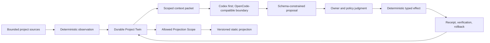

# Architecture boundaries

- Status: R1, R2, and R3 owner-accepted; R4 product topology and T1
  public/private Room correction owner-approved, T2–T5 Technical Owner Review
  active; implementation packet unreconciled
- Updated: 2026-07-26

The rebuild begins from product behavior and contracts. It does not copy the archive's directory structure or implementation by default.

## System shape



## Responsibility boundary

### Forme owns

- durable entity state and revision history;
- evidence references and provenance;
- confirmed versus inferred meaning;
- corrections and dependent-output invalidation;
- context minimization;
- schema validation and proposal admission;
- authorization policy;
- deterministic effects, receipts, verification, and rollback;
- projection allowlists and versions.

### Agent runtimes own

- model invocation and provider integration;
- runtime-native sessions, streaming, cancellation, and supported tools;
- generation of proposals within the context and schema Forme supplies.

Runtime transcripts are disposable computation. They are never the Project Twin.

### Harness ownership test

A mature Harness may natively provide model invocation, sessions, tools, sandboxing, permission prompts, streaming, undo, MCP, and event APIs. Forme should consume those capabilities through replaceable adapters rather than reproduce a general agent runtime.

Forme's boundary begins where operational runtime state becomes durable product meaning and authority: the Living Project Twin, evidence and correction, canonical proposal admission, revision-bound owner authorization, deterministic effect compilation, durable receipts and recovery, and projection policy.

The same visible action may therefore be possible in Codex or OpenCode without Forme. It counts as Forme behavior only when it is derived from and returns to the Twin under these contracts. See [`VALIDATION.md`](./VALIDATION.md) for the current wheel-reinvention and product-differentiation assessment, and the dated [`agent runtime strategy`](./research/agent-runtime-strategy-2026-07-15.md) for the adapter integration ladder and runtime-gate questions.

## Initial invariants

1. Source access is explicit and bounded.
2. The first demo has one workspace and one Twin.
3. Runtime input is the minimum required projection of the Twin, not ambient repository access.
4. The model cannot write canonical state directly.
5. Every proposal names its base revision and evidence.
6. Invalid, stale, oversized, or unauthorized output fails closed.
7. Meaningful effects are idempotent or explicitly non-retryable, terminally receipted, and reversible where feasible.
8. Projection rendering has no private-source handle and consumes only an explicit allowlist.
9. Product behavior does not depend on a resident runtime session.
10. Codex is the first live demo path; OpenCode remains an architectural integration target without forced MVP parity.
11. R1 Continuity is deterministic and invokes no model runtime; the first live Codex path begins in R2 through a scoped Context Packet.
12. R1 durable state is project-local and Git-ignored. It must be excluded from source observation and remain replaceable by a future storage adapter.
13. The R1 owner surface is generated Markdown. It renders the Twin but never becomes canonical state.
14. R2 historical input is limited to explicit reachable Git commits, allowlisted UTF-8 paths, bounded bytes, and resolvable line evidence.
15. R2 runs Codex from an isolated packet root with an exact readable-root permission profile; shell, MCP, apps, hooks, multi-agent, and web capabilities are disabled, and any unauthorized audit item prevents admission.
16. `TwinRevisionV2` begins only with a validated Reflection. It preserves V1 revisions and stores evidence coordinates, labeled meaning, owner correction, invalidation, and minimal receipts—never source bodies or runtime transcripts.
17. Owner correction creates a new immutable revision, supersedes the active interpretation, invalidates dependent output, and becomes input to later Context Packets.
18. R3 Codex output remains a schema-only intent proposal. V2 recommends by default, exposes one to three editable judgments, and may ask one blocking owner question only at low confidence. Forme alone compiles the fixed effect plan; `ask_owner` compiles none, and no harness runtime receives the writer.
19. The first project-source authority is limited to one named managed block in `README.md`; arbitrary paths, patches, commands, Git, network, and external actions remain unavailable.
20. Owner approval binds one immutable proposal and effect-plan hash to an unbroken Twin revision chain and one execution.
21. Execution and rollback use target hashes, atomic replacement, a write-ahead journal, terminal receipts, and fail-closed recovery so retries cannot duplicate effects and human edits cannot be overwritten.

## Approved R3 implementation boundary

- one `ActionContextPacketV1` containing the current owner frame, active corrected Reflection, evidence coordinates, explicit owner action goal, and the fixed action contract—but no README body or ambient repository content;
- additive `ActionIntentProposalV2` with one recommendation by default, one to three editable judgments, explicit confidence, and a low-confidence `ask_owner` fallback; V1 remains valid and reconstructible, and neither version may contain a path, patch, command, tool request, approval, or raw Markdown effect;
- deterministic Forme compilation into one exact `README.md` marker-block plan with before/after and plan hashes;
- a separate, one-use owner approval bound to the immutable effect-plan hash and strict current Twin revision;
- additive `TwinRevisionV3` agency state containing proposals, approvals, minimal runtime receipts, execution/rollback receipts, verification, invalidation, and hashes—not source bodies or runtime transcripts;
- a Forme-only exact-marker executor with atomic replacement, write-ahead journal recovery, idempotent retry, verified source evidence, and explicit hash-guarded rollback;
- no arbitrary file effectors, shell, Git staging/commit/push, GitHub mutation, server, background execution, delegated authorization, or OpenCode live R3 path.

The implemented V3 validator deliberately composes the complete persisted V2 schema with `AgencyStateV1`: old V1/V2 snapshots remain byte-unchanged, while every V3 snapshot must validate both inherited cognition and the additive agency records. Source mutation uses a second write-ahead journal coordinated with the existing immutable-revision transition, so restart can reconcile either side of the source/Twin boundary without granting the runtime a writer.

## Accepted R2 implementation boundary

- deterministic `ContextPacketV1` from two full Git commit IDs, one explicit allowlisted path, and two line ranges;
- `ReflectionProposalV1` as the only runtime output, with a deterministic proposal ID, two-timepoint evidence, uncertainty, an alternative, an implication, and an owner question;
- `codex exec` through an internal replaceable runtime interface, using ephemeral sessions, JSONL audit, structured output, isolated `CODEX_HOME`, packet-only readable roots, no model-generated tools, and the authenticated catalog's highest-priority visible model for the first demo;
- `TwinRevisionV2` as an additive upgrade over immutable V1 history;
- generated Markdown as the first Reflection/correction owner surface;
- no OpenCode live path, actions, source writes, projection, notes, server, automatic history selection, or generalized memory in R2.

## Accepted R1 implementation boundary

- one root TypeScript / Node 24 npm package;
- Node's built-in test runner and TypeScript constrained to directly executable erasable syntax;
- Ajv and `ajv-formats` as the only runtime dependencies, for persisted JSON Schema validation;
- `.forme/` as the project-local, Git-ignored state root;
- a validated owner workspace contract, immutable full revisions, atomic `HEAD`, reconstructible Markdown, and idempotent pending-transition recovery;
- one explicit Forme repo source allowlist; no ambient repo-wide extension discovery;
- one local file-store implementation behind a small internal storage boundary, not a storage plugin system;
- selective port of reviewed archive path-safety, hashing, no-op, recovery, and privacy tests or algorithms only.

The archived broad claim schema, `98_Forme/` layout, notes mirror, runtime adapters, console, launchd, projection, and multi-agent concepts are not inherited by R1.

## Decisions intentionally deferred

- package or service topology beyond the single R1 package;
- storage backends, backup, sync, and cross-device durability beyond the R1 local file store;
- long-term CLI, local web, or native primary surface beyond the approved R1 Markdown view;
- runtime adapter protocol beyond the accepted internal Codex boundary;
- background scheduling;
- server deployment.

Each is selected only when the next walking slice requires it and after its Control Packet is reviewed.

## Cross-cutting proposals and approved R4 product boundary

Three connected briefs make previously implicit highest-vision mechanics
explicit. Agency/Trust and Stewardship remain owner proposals. The R4 product
topology is owner-approved, but none changes implemented authority yet.

### Agency and trust

[`AGENCY-TRUST.md`](./AGENCY-TRUST.md) separates the cognitive modes Routine, Collaborative, and Exploratory from the effect-authority ladder `observe → propose → shadow → owner-confirmed effect → authorized autonomous effect`. Confidence and shadow agreement inform review but cannot grant permission. Any later autonomy remains scoped, expiring, reversible where feasible, and explicitly promoted by the owner.

### Stewardship and entropy

[`STEWARDSHIP.md`](./STEWARDSHIP.md) treats Entropy Reduction as a cross-cutting metabolism rather than a Knowledge Vault directory convention. The universal Twin substrate would preserve evidence, lifecycle, policy, receipts, and health observations; an explicit Workspace Stewardship Profile would define artifact roles, drift, maturity, allowed maintenance, triggers, and metrics for a code repo, vault, file repo, or project workspace. No scheduler, repo-wide inference, or autonomous maintenance is authorized.

### Hosted Social Presence

[`R4-SOCIAL-PRESENCE.md`](./R4-SOCIAL-PRESENCE.md) and
[`R4-HERO-ENCOUNTER-DECISION-BRIEF.md`](./R4-HERO-ENCOUNTER-DECISION-BRIEF.md)
define this owner-approved product boundary:

```text
private local Twin
  → locally prepared projection candidate
  → owner publication gate
  → immutable Projection Capsule
  → owner-controlled Room
      ├─ third_place_public Room
      │    → separate curator admission
      │    → Third Place registry + deterministic room renderer
      └─ private_grant_only Room
           → exact Owner Grant required for Projection read

guest
  → public capsule exploration / one public encounter
    OR exact Private Room Grant
  → optional guest-side agent reasoning
  → Interaction Request when deeper context is needed
  → server Signal Queue
  → local Signal Box
  → local Forme Agent draft + owner review
  → Response Capsule
  → server relay
  → guest
```

The R4 server target is minimal identity/control, a Capsule and Room Registry,
curation listing, deterministic Third Place/Room rendering, Signal Queue, and
Response Relay. It has no LLM, inference authority, local source handle, Twin
store, source-writing authority, commitment authority, or autonomous-reply
grant. Intelligence remains at the owner-local edge and, optionally, the guest
edge.

Account identity proves control and attribution, not personhood. Twin/entity,
Room, immutable capsule, Agent delegation, Guest, and Curator identities remain
distinct. Public reading requires no account; durable controllers are
invite-only; local publishing requires an explicit revocable pairing; agents
receive narrow delegated credentials.

Public and private are first-class, separate Room instances under the same
entity and implementation primitive. They use different Room IDs and
separately approved Projections; a Private Room can never be curator-admitted.
`unlisted` is a public discovery state, not privacy. Third Place may allow one
anonymous public encounter per bearer capability/session, while both the
request and Response remain private. Continued or Private Room access requires
an exact Owner Grant. Curator admission controls shared-place discovery; Owner
actions control intake mode, Grant issue/revoke, and Grant Offers.

“Signal Box” names two connected boundaries: server-side transport and lifecycle state, then local private-context judgment and owner review. Deeper interaction exchanges reviewed capsules; it does not create a permanent server-to-local tunnel.

The product boundary is approved. The Owner now reviews
[`R4-TECHNICAL-OWNER-REVIEW.md`](./R4-TECHNICAL-OWNER-REVIEW.md). Repository
implementation remains blocked until the remaining cards are reconciled into a
new exact
[`R4-TECHNICAL-CONTROL-PACKET.md`](./R4-TECHNICAL-CONTROL-PACKET.md) and the
Owner approves it. The confirmed production target is the supplied
Cloudflare → Caddy → Hetzner → PostgreSQL path; this architecture governs only
how Forme integrates with it. Real durable writes additionally require the
Schema & Migration Manifest, and production deployment/public behavior require
the Production Deployment & Provisioning Grant.

## Archive policy

Archived code can supply evidence, tests, algorithms, and lessons. Reuse requires an explicit statement of:

- the behavior being imported;
- the contract it now satisfies;
- assumptions removed or retained;
- why reuse is clearer and safer than a new implementation.
