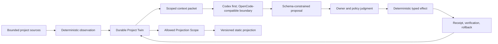

# Architecture boundaries

- Status: owner-approved R1 boundaries, not a frozen long-term implementation design
- Updated: 2026-07-18

The rebuild begins from product behavior and contracts. It does not copy the archive's directory structure or implementation by default.

## System shape

## Responsibility boundary

### Forme owns

- durable entity state and revision history;
- evidence references and provenance;
- confirmed versus inferred meaning;
- corrections and dependent-output invalidation;
- context minimization;
- schema validation and proposal admission;
- authorization policy;
- deterministic effects, receipts, verification, and rollback;
- projection allowlists and versions.

### Agent runtimes own

- model invocation and provider integration;
- runtime-native sessions, streaming, cancellation, and supported tools;
- generation of proposals within the context and schema Forme supplies.

Runtime transcripts are disposable computation. They are never the Project Twin.

## Initial invariants

1. Source access is explicit and bounded.
2. The first demo has one workspace and one Twin.
3. Runtime input is the minimum required projection of the Twin, not ambient repository access.
4. The model cannot write canonical state directly.
5. Every proposal names its base revision and evidence.
6. Invalid, stale, oversized, or unauthorized output fails closed.
7. Meaningful effects are idempotent or explicitly non-retryable, terminally receipted, and reversible where feasible.
8. Projection rendering has no private-source handle and consumes only an explicit allowlist.
9. Product behavior does not depend on a resident runtime session.
10. Codex is the first live demo path; OpenCode remains an architectural integration target without forced MVP parity.
11. R1 Continuity is deterministic and invokes no model runtime; the first live Codex path begins in R2 through a scoped Context Packet.
12. R1 durable state is project-local and Git-ignored. It must be excluded from source observation and remain replaceable by a future storage adapter.
13. The R1 owner surface is generated Markdown. It renders the Twin but never becomes canonical state.

## Accepted R1 implementation boundary

- one root TypeScript / Node 24 npm package;
- Node's built-in test runner and TypeScript constrained to directly executable erasable syntax;
- Ajv and `ajv-formats` as the only runtime dependencies, for persisted JSON Schema validation;
- `.forme/` as the project-local, Git-ignored state root;
- a validated owner workspace contract, immutable full revisions, atomic `HEAD`, reconstructible Markdown, and idempotent pending-transition recovery;
- one explicit Forme repo source allowlist; no ambient repo-wide extension discovery;
- one local file-store implementation behind a small internal storage boundary, not a storage plugin system;
- selective port of reviewed archive path-safety, hashing, no-op, recovery, and privacy tests or algorithms only.

The archived broad claim schema, `98_Forme/` layout, notes mirror, runtime adapters, console, launchd, projection, and multi-agent concepts are not inherited by R1.

## Decisions intentionally deferred

- package or service topology beyond the single R1 package;
- storage backends, backup, sync, and cross-device durability beyond the R1 local file store;
- long-term CLI, local web, or native primary surface beyond the approved R1 Markdown view;
- runtime adapter protocol details;
- background scheduling;
- server deployment.

Each is selected only when the next walking slice requires it and after its Control Packet is reviewed.

## Archive policy

Archived code can supply evidence, tests, algorithms, and lessons. Reuse requires an explicit statement of:

- the behavior being imported;
- the contract it now satisfies;
- assumptions removed or retained;
- why reuse is clearer and safer than a new implementation.
