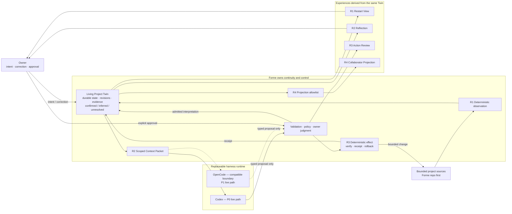

# Owner technical cockpit

- Updated: 2026-07-18
- Active gate: **R2 — Cognition Control Packet; implementation not yet approved**
- Active issue: [#50 — Cognition: evidence-backed Reflection and correction](https://github.com/formehq/forme/issues/50)
- P0 implementation: **R1 owner-accepted; R2–R5 not started**
- First real workspace: **Forme repo — owner confirmed**
- Next action: review and approve or challenge the R2 Cognition boundary

This is the owner's single re-entry page. Read it before implementation details. It should answer, in a few minutes: what Forme is, where the build is, what truth is durable, what an agent may see or change, and what the owner must decide next.

## Product claim

The August MVP is one Living Project Twin for one real project:

> It remembers where the project is, notices what it is becoming, acts once within explicit and reversible trust, and produces one controlled collaborator projection.

The four required effects are **Continuity, Cognition, Bounded Agency, and Controlled Presence**. They are one causal story built on one Twin, not four disconnected features.

## You are here

```text
R0 Shared understanding   ✓ COMPLETE
  ↓
R1 Continuity             ✓ DONE · OWNER ACCEPTED 2026-07-18
  ↓
R2 Cognition              ← YOU ARE HERE · CONTROL PACKET NEXT
  ↓
R3 Bounded Agency         approved effect → receipt → rollback
  ↓
R4 Controlled Presence    allowlist → static collaborator projection
  ↓
R5 Demo hardening         clean run → privacy → recovery → rehearsal
```

Current truth:

- the new `main` contains the owner-accepted R1 Continuity substrate;
- the previous implementation is preserved in the archive as evidence and a parts library;
- archived code is not the default architecture and is not reused without an explicit contract;
- #47 tracks the whole MVP; #48 records the completed R0 Control Packet;
- #49 contains the completed R1 contract, technical evidence, and owner acceptance;
- #50 is the next gate and must define Codex visibility, evidence, durable semantic state, correction, and invalidation before implementation;
- the deterministic walking skeleton exists without Codex, OpenCode, source-write, network, or server authority;
- R1 is Done; R2 has no implementation authority until its Control Packet is owner-approved.

## System map



### How to read the map

- **Sources** say what happened in files; they remain authoritative for their own content.
- **The Twin** is Forme's durable, versioned understanding of the project. It is not a chat transcript, runtime session, file copy, or summary page.
- **Codex and OpenCode** are replaceable cognition runtimes. They receive scoped context and return proposals; they do not own the Twin or write canonical state directly.
- **The gate and executor** keep interpretation probabilistic but effects deterministic, authorized, inspectable, and reversible where feasible.
- **Surfaces** are views of one Twin. They must not create private parallel truths.

## Owner architecture checksum

The owner has decision-grade technical understanding of a slice when these five questions have clear answers:

1. **Input:** What enters Forme?
2. **Durability:** What becomes durable, and where does it live?
3. **Visibility:** What can Codex or OpenCode see?
4. **Authority:** What may an agent change, and who approves it?
5. **Recovery:** After interruption, failure, or a wrong interpretation, what survives and how is it corrected or reversed?

If these cannot be answered in roughly five minutes, implementation pauses and this cockpit or the active Control Packet must be repaired.

## Completed Control Packet — R1 walking skeleton

- Status: **implemented, technically verified, and owner-accepted on 2026-07-18**

### User outcome

After connecting the Forme repo, the owner can leave, restart the process, and recover a human-readable view of the project's current intent and observed change without reconstructing context from a chat session.

### Proposed first flow

```text
Forme repo
  → explicit source root and exclusions
  → deterministic bounded observation
  → durable Project Twin revision
  → Markdown Restart View
  → one source change
  → next meaningful revision
  → process stop and restart
  → reconstruct the same current view
```

### Five-question contract

| Question | R1 proposal |
|---|---|
| What enters? | One explicitly selected workspace: the Forme repo. Observation follows an explicit root and exclusions; no vault-wide discovery and no symlink escape. |
| What becomes durable? | A validated workspace contract, immutable Twin revisions, an atomic `HEAD` pointer, evidence metadata/provenance, and the minimum owner frame needed to reconstruct the view. Source bodies are not copied into the Twin. |
| What can the runtime see? | R1 uses no Codex or OpenCode reasoning. The first live Codex context begins in R2 through a scoped Context Packet. |
| What may the agent change? | R1 observation is read-only toward project sources. Deterministic Forme code may create or update only the approved, project-local state and generated view. |
| How does recovery work? | Canonical state survives process and runtime loss. A no-op observation does not create a new revision. Interrupted writes must not replace the last valid state; restart reconstructs from the last valid revision. |

### Accepted implementation boundary

- one root TypeScript / Node 24 npm package;
- JSON Schema validation through Ajv, with no other R1 runtime dependency;
- project-local, Git-ignored `.forme/` state;
- validated workspace contract, immutable full revisions, atomic `HEAD`, and idempotent pending-transition recovery;
- generated Markdown owner view that is reconstructible and non-canonical;
- owner-controlled `observe` inputs for Active Intent, Next Move, and Unresolved items, with strict CLI option validation;
- explicit Forme repo source allowlist only, with no ambient extension-based discovery;
- selective port of named archive safety algorithms and tests, never the old schema, state layout, or broader modules.

### Five-minute owner demo

1. Start from a clean Forme repo checkout and connect it with explicit boundaries.
2. Enter or confirm the project's Active Intent.
3. Run observation and open revision 1 of the Restart View.
4. Make one meaningful allowed source change and run observation again.
5. Confirm revision 2 explains the observed change; run a no-op refresh and confirm it creates no revision.
6. Stop the process, discard runtime/session context, restart, and reconstruct the same current view from durable state.
7. Confirm the project source was never modified by the observation path.

### Technical evidence

- `npm run check` type-checks the package and passes all 16 deterministic tests.
- Boundary tests reject parent traversal, skip symlinks, and keep out-of-allowlist canaries absent from state.
- Continuity and CLI tests prove initial, changed, deleted, owner-frame, strict input, no-op, and byte-for-byte Markdown reconstruction behavior.
- Recovery tests interrupt the pending, revision, `HEAD`, and view boundaries and resume each transition exactly once.
- The real Forme repo reached revision 8: revision 7 captured the CLI-control patch, revision 8 changed only the Owner Frame, an identical owner command was a no-op, and deleting the Restart View reconstructed identical bytes.

### Owner decisions

Confirmed:

- **First real workspace:** use the Forme repo.
- **Runtime boundary:** keep R1 fully deterministic and introduce the first real Codex path only in R2.
- **Persistence boundary:** use project-local, Git-ignored durable state. R1 durability covers process and runtime loss, not project-directory or machine loss.
- **First surface:** use a generated Markdown Restart View. It is a rendering of the Twin, never canonical state.
- **Toolchain:** use one TypeScript / Node 24 npm package, with Ajv for persisted JSON Schema validation and no other R1 runtime dependency.
- **State contract:** use `.forme/` with an owner workspace contract, immutable full revisions, atomic `HEAD`, reconstructible Markdown, and pending-transition recovery.
- **Source scope:** observe only the explicit Forme repo allowlist recorded in #49; do not scan the rest of the repo by extension or discovery.
- **Archive reuse:** port only the named safety algorithms and tests; do not copy the old schema, `98_Forme/` layout, or broader modules.

These choices produced the accepted R1 substrate. Any R2 expansion of state, source scope, dependencies, runtime visibility, or permissions returns to an owner stop gate.

## Next Control Packet — R2 Cognition

- Status: **proposal prepared on 2026-07-18; not owner-approved and not authorized to build**
- User outcome: one Reflection depends on evidence from at least two time points, exposes uncertainty, and can be corrected by the owner so stale dependent output is invalidated.
- Required map delta: durable Twin → scoped Context Packet → Codex proposal → evidence and quality validation → admitted Reflection → correction and invalidation.

### Proposed walking slice

```text
owner-selected Git checkpoints and paths
  → deterministic Context Packet at base Twin revision N
  → isolated, ephemeral Codex execution
  → schema-constrained Reflection proposal
  → evidence, staleness, privacy, and shape validation
  → inferred Reflection in Twin revision N+1
  → owner correction
  → corrected meaning and invalidation in Twin revision N+2
  → next Context Packet contains the correction
```

This is one cognition loop, not a general memory system or autonomous research agent.

### Recommended decisions

| Decision | Recommended answer | Global effect |
|---|---|---|
| Cross-time evidence | For the MVP, use two explicit, reachable Git commits and explicit small text paths. Resolve content with read-only Git operations and bind every document to its commit, blob hash, byte count, and line map. | R2 can inspect durable historical content without copying source bodies into R1 state. Uncommitted history and non-Git notes remain out of scope. |
| Codex visibility | Build a deterministic Context Packet first. Run Codex outside the Forme repo with a custom permission profile that can read only runtime-minimal paths and the isolated packet root. Disable project instructions, user config, tools, MCP, plugins, web search, and command network. | Selected packet content is transmitted to OpenAI through the owner's existing Codex authentication; the rest of the repo and machine are not authorized input. |
| Runtime role | Use `codex exec` as the first real adapter, with ephemeral execution, JSONL audit events, and `--output-schema`. Codex returns a proposal only. | Codex supplies mature model invocation and structured output while Forme retains state, validation, admission, and recovery. The adapter contract stays compatible with a later OpenCode implementation. |
| Semantic durability | Introduce `TwinRevisionV2` only when the first validated Reflection is admitted. Preserve every R1 revision unchanged. Store the Reflection as `inferred`, with evidence, uncertainty, provenance, and runtime receipt—not as owner-confirmed truth. | R2 adds canonical semantic state and a schema version, so owner approval is required before implementation. |
| Correction and invalidation | Correction creates a new Twin revision, records owner authority and the superseded Reflection, marks dependent outputs stale, and changes later Context Packets. Never overwrite history. | Owner authorship becomes executable and testable; stale model interpretation cannot silently remain active. |
| Quality gate | Apply deterministic structural gates, then require owner judgment. Structure requires two distinct time points, resolvable evidence, a cross-time relation, uncertainty, an alternative explanation, and an implication. | Forme can reject invalid or summary-shaped proposals, but it does not pretend to automate whether a Reflection is genuinely valuable. |

### First real evidence pair

The proposed demo uses one owner-controlled document at two immutable commits:

| Time point | Commit | Blob | Evidence |
|---|---|---|---|
| R0 control established | `81a002744156128c1e370bf6b8a3526e72bddbf9` | `1b5fb24e8e2afb511d28cb3f7cd8570c81b985d6` | `docs/DECISIONS.md`, lines 29–33: tests lead only to Technical Review; owner experience is required because technical completion had outrun shared understanding. |
| R1 owner accepted | `3cc2ac567d22b5b1c5bb1bfd7ed790d3ebd59052` | `5e06da60be0aaaa4d9655a7c9aee7157e93d1f5f` | `docs/DECISIONS.md`, lines 59–63: the real Owner Demo caught a silently ignored CLI control input after technical checks passed, and acceptance waited for the corrected rerun. |

Each historical file is under 5 KiB. The first packet therefore needs only the two versions of `docs/DECISIONS.md`, not source code or the rest of the repository.

Candidate Reflection to challenge, not hard-code:

> Owner Acceptance changed from a governance rule created after loss of shared understanding into a working diagnostic that caught a control-path defect after tests passed. This suggests R2 correction must be exercised through the real owner surface, not proven only at the schema or unit-test layer.

Required uncertainty: this inference is supported by one completed slice and may not generalize; an alternative explanation is that the CLI gap was ordinary missing test coverage and the Owner Demo only happened to expose it.

### Proposed contracts

`ContextPacketV1` is deterministic and disposable. Its content hash is persisted, but source bodies are not copied into the Twin:

- packet ID, schema version, creation time, and `baseTwinRevision`;
- current owner frame and the explicit Reflection task;
- two time points, each with commit ID, commit time, selected path, blob hash, byte count, and file body;
- active owner corrections from the base revision;
- allowed evidence IDs and explicit constraints;
- canonical packet content hash.

`GitLineEvidenceV1` makes every cited statement resolvable:

- commit ID, path, blob hash, line start, line end, and excerpt hash;
- the validator re-reads the Git object and rejects a mismatch, missing commit, invalid range, or evidence outside the packet.

`ReflectionProposalV1` is the only accepted model output shape:

- proposal ID and `baseTwinRevision`;
- one cross-time claim and relation type (`pattern`, `tension`, `trajectory`, or `unfinished`);
- at least two evidence references from distinct packet time points;
- uncertainty level and rationale;
- at least one plausible alternative explanation;
- one implication and one owner-facing correction question;
- no commands, patches, free-form tool calls, or source content outside the packet.

`TwinRevisionV2` retains all R1 fields and adds a cognition state:

- admitted Reflection records with `inferred`, `corrected`, `superseded`, or `invalidated` status;
- owner Correction records with target Reflection, correction text, authority, and timestamp;
- Invalidation records naming every dependent output and reason;
- minimal Runtime Receipts: adapter, CLI version, model, packet hash, proposal hash, base revision, validation result, and audit-event summary;
- no chain-of-thought, full runtime transcript, Codex session state, or copied historical source body.

### Codex runtime envelope

Local research used installed `codex-cli 0.144.3` and current OpenAI Codex documentation and source. The proposal relies on:

- non-interactive `codex exec`, `--ephemeral`, JSONL events, and `--output-schema`;
- an isolated `CODEX_HOME` so global `AGENTS.md`, user configuration, plugins, MCP servers, and saved sessions do not enter model context; authentication is referenced for the run but never copied into the packet;
- `project_doc_max_bytes=0`, web search disabled, optional tool features disabled, and a clean packet-only working root;
- a named permission profile granting `read` only to `:minimal` runtime paths and the packet workspace, with network disabled for model-generated commands;
- event admission that fails if command execution, file change, MCP, web-search, or other unapproved tool activity appears;
- no `--sandbox read-only` fallback: the legacy read-only policy prevents writes but permits full-disk reads and therefore violates Forme's visibility contract;
- a capability probe before any source is sent. If exact readable-root enforcement or structured output is unavailable, the run fails closed.

Bundled Codex system and safety instructions remain part of the runtime itself; Forme does not redefine or persist them. The isolation contract removes owner-global and project instructions and records the effective Codex version and environment summary so this runtime-owned influence remains visible.

Proposal research used Codex prompt-debug rather than a model call: no Forme project content was transmitted. The verified effective profile contained only `:minimal`, the isolated context root, and Codex runtime bootstrap paths; it did not expose the Forme repo. Actual model execution remains blocked on owner approval.

The Codex service request itself necessarily uses the owner's authenticated network path. The "network disabled" boundary applies to model-generated commands and tools, not the model invocation. Relevant official references are [Non-interactive mode](https://learn.chatgpt.com/docs/non-interactive-mode), [Permissions](https://learn.chatgpt.com/docs/permissions), and [Agent approvals and security](https://learn.chatgpt.com/docs/agent-approvals-security). The permission-profile feature is beta, so the runtime version and effective environment summary must be receipted.

### Admission and correction sequence

1. Forme verifies that the requested commits are reachable, paths are explicitly allowed for cognition, Git objects match their hashes, and the packet stays under its byte ceiling.
2. The owner can inspect the packet manifest—paths, commits, byte counts, and hashes—before the first external call.
3. Codex returns a `ReflectionProposalV1`; it has no authority to write `.forme/` or project sources.
4. Forme validates schema, base revision, evidence resolution, two-time-point coverage, packet membership, output size, and runtime audit events.
5. A valid proposal creates `TwinRevisionV2` with an `inferred` Reflection and minimal receipt. Invalid output creates no Twin revision.
6. The generated Reflection view shows claim, evidence, uncertainty, alternative, implication, provenance, and a correction command.
7. Owner correction creates the next Twin revision, supersedes the original active interpretation, and invalidates derived output tied to it.
8. A later Context Packet includes the correction and rejects any proposal still based on the pre-correction revision.

### Five-minute owner demo

1. Begin at the current owner-approved base Twin revision and display the exact packet manifest for the two commits above.
2. Show that a private canary outside the packet root is unreadable and absent from prompt-debug output.
3. Run one ephemeral Codex Reflection and display its structured proposal plus runtime receipt.
4. Open the generated Reflection view and resolve each evidence reference against its historical Git blob.
5. Ask the owner whether the relationship is more valuable than a two-commit summary.
6. Enter one correction through the real owner surface.
7. Show the new revision, invalidated old output, and a rebuilt Context Packet containing the correction.
8. Restart Forme and reconstruct the same active Reflection/correction state; confirm project sources never changed.

### Acceptance and failure conditions

R2 passes only if:

- the owner judges one real Reflection more valuable than a summary;
- all cited evidence resolves to the approved commits, blobs, paths, and lines;
- prompt-debug and runtime receipts show no ambient project files, owner-global or project instructions, MCP, web, file-change, or command activity;
- the proposed Context Packet is deterministic and bounded;
- correction changes later context and invalidates stale dependent output;
- runtime/process loss does not lose the admitted or corrected state;
- invalid, stale, oversized, unsupported, or unauthorized runtime output fails closed.

R2 excludes source writes, action approval, rollback effectors, background scheduling, server deployment, notes, OpenCode live parity, automatic historical discovery, dirty-working-tree time points, and generalized semantic memory.

### Owner stop gate

Approval must explicitly confirm all five recommendations before implementation:

- Git-only committed evidence from the explicit commit/path pair;
- isolated packet-only Codex visibility and no model-generated tool use;
- schema-only proposal and two-layer quality gate;
- `TwinRevisionV2` with clearly labeled inferred state and minimal receipts;
- owner correction by new revision with dependent-output invalidation.

Until that approval, no project content is sent to Codex and no R2 schema or durable state is implemented.

## Owner–agent working agreement

| Responsibility | Owner | Agent |
|---|---|---|
| Product meaning, trust, privacy, scope, public behavior | decides | explains options and recommends |
| Durable state, schemas, permissions, runtime visibility | confirms before implementation | proposes a bounded contract and stops at the gate |
| Implementation inside an approved contract | need not review every function | may proceed autonomously with tests and evidence |
| User experience acceptance | experiences, challenges, accepts | supplies a runnable demo and explains the map delta |
| Architecture drift | decides whether the contract changes | must expose drift; never rewrites intent to match code silently |

The operating loop is:

```text
owner defines meaning and boundaries
  → agent proposes a Control Packet with a recommendation
  → owner confirms architecture-changing choices
  → agent builds one demonstrable outcome
  → checks and demo provide technical evidence
  → owner experiences and accepts
  → cockpit records what changed in the shared system model
```

Passing checks moves a slice to **Technical Review**. A P0 slice becomes **Done** only after the owner can experience the behavior and retain the important technical model.

## Stop-the-line boundaries

Implementation returns to the owner before it:

- creates or changes persistent state or a schema;
- broadens file, shell, network, messaging, or publish authority;
- changes what Codex or OpenCode may observe or execute;
- changes privacy, projection audience, or a trust boundary;
- adds a foundational dependency or deployment topology;
- changes P0/P1/P2 scope, dates, or public behavior;
- makes code, a runtime transcript, or a surface into a new source of truth.

## Re-entry and reporting protocol

Every core implementation update reports the same eight items:

1. user-visible outcome;
2. current roadmap gate;
3. map delta — which system box or connection changed;
4. durable-state delta;
5. visibility and authority delta;
6. validation and five-minute demo path;
7. what the owner should challenge or decide;
8. whether the shared architecture model changed.

If a change is only an internal refactor, the report says explicitly: **no owner-visible architecture change**.

## Detailed references

- [`PRODUCT.md`](./PRODUCT.md) — product vision, constitutional floor, and Demo Day acceptance story
- [`ROADMAP.md`](./ROADMAP.md) — R0–R5 schedule, dependencies, and cut rules
- [`ARCHITECTURE.md`](./ARCHITECTURE.md) — durable boundaries between Forme and agent runtimes
- [`DECISIONS.md`](./DECISIONS.md) — confirmed product, date, scope, and architecture decisions
- [GitHub milestone #11](https://github.com/formehq/forme/milestone/11) — execution deadline
- [GitHub epic #47](https://github.com/formehq/forme/issues/47) — complete P0 and P1 issue map
