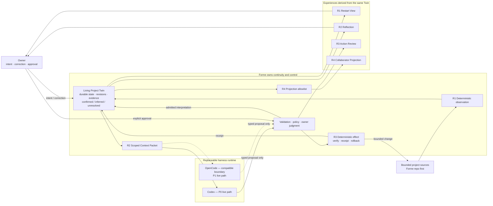

# Owner technical cockpit

- Updated: 2026-07-20
- Active gate: **R3 — Bounded Agency; Owner Acceptance / product validation**
- Active issue: [#51 — Bounded Agency: one approved reversible action](https://github.com/formehq/forme/issues/51)
- P0 implementation: **R1 and R2 owner-accepted; R3 passed 41 checks and completed its real bounded control demo through revision 25; usefulness and accuracy remain unaccepted; R4–R5 not started**
- First real workspace: **Forme repo — owner confirmed**
- Next action: owner-review the unlabeled R3-V Outputs M/Q/T before revealing arm identity or approving any effect

This is the owner's single re-entry page. Read it before implementation details. It should answer, in a few minutes: what Forme is, where the build is, what truth is durable, what an agent may see or change, and what the owner must decide next.

## Product claim

The August MVP is one Living Project Twin for one real project:

> It remembers where the project is, notices what it is becoming, acts once within explicit and reversible trust, and produces one controlled collaborator projection.

The four required effects are **Continuity, Cognition, Bounded Agency, and Controlled Presence**. They are one causal story built on one Twin, not four disconnected features.

## You are here

```text
R0 Shared understanding   ✓ COMPLETE
  ↓
R1 Continuity             ✓ DONE · OWNER ACCEPTED 2026-07-18
  ↓
R2 Cognition              ✓ DONE · OWNER ACCEPTED 2026-07-18
  ↓
R3 Bounded Agency         ← YOU ARE HERE · OWNER ACCEPTANCE / PRODUCT VALIDATION
  ↓
R4 Controlled Presence    allowlist → static collaborator projection
  ↓
R5 Demo hardening         clean run → privacy → recovery → rehearsal
```

Current truth:

- the new `main` contains the owner-accepted R1 Continuity substrate;
- the previous implementation is preserved in the archive as evidence and a parts library;
- archived code is not the default architecture and is not reused without an explicit contract;
- #47 tracks the whole MVP; #48 records the completed R0 Control Packet;
- #49 contains the completed R1 contract, technical evidence, and owner acceptance;
- #50 completed the first real Codex path, evidence-backed Reflection, owner correction, and dependent-output invalidation;
- #51 is the active gate; the owner approved all five R3 recommendations on 2026-07-18 and implementation remains limited to that contract;
- the real R3 path completed proposal, exact approval, execution, retry, restart, and rollback through Twin revisions 21–25;
- the owner has not accepted R3's usefulness or suggestion accuracy from this one case, so R3 is not Done. The current evidence and Harness comparison live in [`VALIDATION.md`](./VALIDATION.md).
- the private local `forme-r3v-knowledge-lab` contains one provenance-preserving, stably redacted CCS note at two real historical time points. The owner approved one exact 36,230-byte visibility packet and the B-arm Forme Reflection was admitted at lab Twin revision 3;
- the first call produced zero tool events and no source changes. The owner correction became active at lab Twin revision 4: the original inference is `superseded`, one dependent output is invalidated, and later packets automatically carry the corrected meaning. The approved A0/A1/B comparison has now run with zero tool events in all three arms; B admitted one unapproved proposal at lab Twin revision 6 with zero transmitted source bytes. No effect is approved or executed. The unlabeled Owner Score Packet is the current gate; arm identity remains hidden until owner judgment.

## System map



### How to read the map

- **Sources** say what happened in files; they remain authoritative for their own content.
- **The Twin** is Forme's durable, versioned understanding of the project. It is not a chat transcript, runtime session, file copy, or summary page.
- **Codex and OpenCode** are replaceable cognition runtimes. They receive scoped context and return proposals; they do not own the Twin or write canonical state directly.
- **The gate and executor** keep interpretation probabilistic but effects deterministic, authorized, inspectable, and reversible where feasible.
- **Surfaces** are views of one Twin. They must not create private parallel truths.

## Owner architecture checksum

The owner has decision-grade technical understanding of a slice when these five questions have clear answers:

1. **Input:** What enters Forme?
2. **Durability:** What becomes durable, and where does it live?
3. **Visibility:** What can Codex or OpenCode see?
4. **Authority:** What may an agent change, and who approves it?
5. **Recovery:** After interruption, failure, or a wrong interpretation, what survives and how is it corrected or reversed?

If these cannot be answered in roughly five minutes, implementation pauses and this cockpit or the active Control Packet must be repaired.

## Completed Control Packet — R1 walking skeleton

- Status: **implemented, technically verified, and owner-accepted on 2026-07-18**

### User outcome

After connecting the Forme repo, the owner can leave, restart the process, and recover a human-readable view of the project's current intent and observed change without reconstructing context from a chat session.

### Proposed first flow

```text
Forme repo
  → explicit source root and exclusions
  → deterministic bounded observation
  → durable Project Twin revision
  → Markdown Restart View
  → one source change
  → next meaningful revision
  → process stop and restart
  → reconstruct the same current view
```

### Five-question contract

| Question | R1 proposal |
|---|---|
| What enters? | One explicitly selected workspace: the Forme repo. Observation follows an explicit root and exclusions; no vault-wide discovery and no symlink escape. |
| What becomes durable? | A validated workspace contract, immutable Twin revisions, an atomic `HEAD` pointer, evidence metadata/provenance, and the minimum owner frame needed to reconstruct the view. Source bodies are not copied into the Twin. |
| What can the runtime see? | R1 uses no Codex or OpenCode reasoning. The first live Codex context begins in R2 through a scoped Context Packet. |
| What may the agent change? | R1 observation is read-only toward project sources. Deterministic Forme code may create or update only the approved, project-local state and generated view. |
| How does recovery work? | Canonical state survives process and runtime loss. A no-op observation does not create a new revision. Interrupted writes must not replace the last valid state; restart reconstructs from the last valid revision. |

### Accepted implementation boundary

- one root TypeScript / Node 24 npm package;
- JSON Schema validation through Ajv, with no other R1 runtime dependency;
- project-local, Git-ignored `.forme/` state;
- validated workspace contract, immutable full revisions, atomic `HEAD`, and idempotent pending-transition recovery;
- generated Markdown owner view that is reconstructible and non-canonical;
- owner-controlled `observe` inputs for Active Intent, Next Move, and Unresolved items, with strict CLI option validation;
- explicit Forme repo source allowlist only, with no ambient extension-based discovery;
- selective port of named archive safety algorithms and tests, never the old schema, state layout, or broader modules.

### Five-minute owner demo

1. Start from a clean Forme repo checkout and connect it with explicit boundaries.
2. Enter or confirm the project's Active Intent.
3. Run observation and open revision 1 of the Restart View.
4. Make one meaningful allowed source change and run observation again.
5. Confirm revision 2 explains the observed change; run a no-op refresh and confirm it creates no revision.
6. Stop the process, discard runtime/session context, restart, and reconstruct the same current view from durable state.
7. Confirm the project source was never modified by the observation path.

### Technical evidence

- `npm run check` type-checks the package and passes all 16 deterministic tests.
- Boundary tests reject parent traversal, skip symlinks, and keep out-of-allowlist canaries absent from state.
- Continuity and CLI tests prove initial, changed, deleted, owner-frame, strict input, no-op, and byte-for-byte Markdown reconstruction behavior.
- Recovery tests interrupt the pending, revision, `HEAD`, and view boundaries and resume each transition exactly once.
- The real Forme repo reached revision 8: revision 7 captured the CLI-control patch, revision 8 changed only the Owner Frame, an identical owner command was a no-op, and deleting the Restart View reconstructed identical bytes.

### Owner decisions

Confirmed:

- **First real workspace:** use the Forme repo.
- **Runtime boundary:** keep R1 fully deterministic and introduce the first real Codex path only in R2.
- **Persistence boundary:** use project-local, Git-ignored durable state. R1 durability covers process and runtime loss, not project-directory or machine loss.
- **First surface:** use a generated Markdown Restart View. It is a rendering of the Twin, never canonical state.
- **Toolchain:** use one TypeScript / Node 24 npm package, with Ajv for persisted JSON Schema validation and no other R1 runtime dependency.
- **State contract:** use `.forme/` with an owner workspace contract, immutable full revisions, atomic `HEAD`, reconstructible Markdown, and pending-transition recovery.
- **Source scope:** observe only the explicit Forme repo allowlist recorded in #49; do not scan the rest of the repo by extension or discovery.
- **Archive reuse:** port only the named safety algorithms and tests; do not copy the old schema, `98_Forme/` layout, or broader modules.

These choices produced the accepted R1 substrate. Any R2 expansion of state, source scope, dependencies, runtime visibility, or permissions returns to an owner stop gate.

## Completed Control Packet — R2 Cognition

- Status: **implemented, technically verified, corrected through the real owner surface, and owner-accepted on 2026-07-18**
- User outcome: one Reflection depends on evidence from at least two time points, exposes uncertainty, and can be corrected by the owner so stale dependent output is invalidated.
- Required map delta: durable Twin → scoped Context Packet → Codex proposal → evidence and quality validation → admitted Reflection → correction and invalidation.

### Proposed walking slice

```text
owner-selected Git checkpoints and paths
  → deterministic Context Packet at base Twin revision N
  → isolated, ephemeral Codex execution
  → schema-constrained Reflection proposal
  → evidence, staleness, privacy, and shape validation
  → inferred Reflection in Twin revision N+1
  → owner correction
  → corrected meaning and invalidation in Twin revision N+2
  → next Context Packet contains the correction
```

This is one cognition loop, not a general memory system or autonomous research agent.

### Recommended decisions

| Decision | Recommended answer | Global effect |
|---|---|---|
| Cross-time evidence | For the MVP, use two explicit, reachable Git commits and explicit small text paths. Resolve content with read-only Git operations and bind every document to its commit, blob hash, byte count, and line map. | R2 can inspect durable historical content without copying source bodies into R1 state. Uncommitted history and non-Git notes remain out of scope. |
| Codex visibility | Build a deterministic Context Packet first. Run Codex outside the Forme repo with a custom permission profile that can read only runtime-minimal paths and the isolated packet root. Disable project instructions, user config, tools, MCP, plugins, web search, and command network. | Selected packet content is transmitted to OpenAI through the owner's existing Codex authentication; the rest of the repo and machine are not authorized input. |
| Runtime role | Use `codex exec` as the first real adapter, with ephemeral execution, JSONL audit events, and `--output-schema`. Codex returns a proposal only. | Codex supplies mature model invocation and structured output while Forme retains state, validation, admission, and recovery. The adapter contract stays compatible with a later OpenCode implementation. |
| Semantic durability | Introduce `TwinRevisionV2` only when the first validated Reflection is admitted. Preserve every R1 revision unchanged. Store the Reflection as `inferred`, with evidence, uncertainty, provenance, and runtime receipt—not as owner-confirmed truth. | R2 adds canonical semantic state and a schema version, so owner approval is required before implementation. |
| Correction and invalidation | Correction creates a new Twin revision, records owner authority and the superseded Reflection, marks dependent outputs stale, and changes later Context Packets. Never overwrite history. | Owner authorship becomes executable and testable; stale model interpretation cannot silently remain active. |
| Quality gate | Apply deterministic structural gates, then require owner judgment. Structure requires two distinct time points, resolvable evidence, a cross-time relation, uncertainty, an alternative explanation, and an implication. | Forme can reject invalid or summary-shaped proposals, but it does not pretend to automate whether a Reflection is genuinely valuable. |

### First real evidence pair

The proposed demo uses one owner-controlled document at two immutable commits:

| Time point | Commit | Blob | Evidence |
|---|---|---|---|
| R0 control established | `81a002744156128c1e370bf6b8a3526e72bddbf9` | `1b5fb24e8e2afb511d28cb3f7cd8570c81b985d6` | `docs/DECISIONS.md`, lines 29–33: tests lead only to Technical Review; owner experience is required because technical completion had outrun shared understanding. |
| R1 owner accepted | `3cc2ac567d22b5b1c5bb1bfd7ed790d3ebd59052` | `5e06da60be0aaaa4d9655a7c9aee7157e93d1f5f` | `docs/DECISIONS.md`, lines 59–63: the real Owner Demo caught a silently ignored CLI control input after technical checks passed, and acceptance waited for the corrected rerun. |

Each historical file is under 5 KiB. The first packet therefore needs only the two versions of `docs/DECISIONS.md`, not source code or the rest of the repository.

Candidate Reflection to challenge, not hard-code:

> Owner Acceptance changed from a governance rule created after loss of shared understanding into a working diagnostic that caught a control-path defect after tests passed. This suggests R2 correction must be exercised through the real owner surface, not proven only at the schema or unit-test layer.

Required uncertainty: this inference is supported by one completed slice and may not generalize; an alternative explanation is that the CLI gap was ordinary missing test coverage and the Owner Demo only happened to expose it.

### Proposed contracts

`ContextPacketV1` is deterministic and disposable. Its content hash is persisted, but source bodies are not copied into the Twin:

- packet ID, schema version, creation time, and `baseTwinRevision`;
- current owner frame and the explicit Reflection task;
- two time points, each with commit ID, commit time, selected path, blob hash, byte count, and file body;
- active owner corrections from the base revision;
- allowed evidence IDs and explicit constraints;
- canonical packet content hash.

`GitLineEvidenceV1` makes every cited statement resolvable:

- commit ID, path, blob hash, line start, line end, and excerpt hash;
- the validator re-reads the Git object and rejects a mismatch, missing commit, invalid range, or evidence outside the packet.

`ReflectionProposalV1` is the only accepted model output shape:

- proposal ID and `baseTwinRevision`;
- one cross-time claim and relation type (`pattern`, `tension`, `trajectory`, or `unfinished`);
- at least two evidence references from distinct packet time points;
- uncertainty level and rationale;
- at least one plausible alternative explanation;
- one implication and one owner-facing correction question;
- no commands, patches, free-form tool calls, or source content outside the packet.

`TwinRevisionV2` retains all R1 fields and adds a cognition state:

- admitted Reflection records with `inferred`, `corrected`, `superseded`, or `invalidated` status;
- owner Correction records with target Reflection, correction text, authority, and timestamp;
- Invalidation records naming every dependent output and reason;
- minimal Runtime Receipts: adapter, CLI version, model, packet hash, proposal hash, base revision, validation result, and audit-event summary;
- no chain-of-thought, full runtime transcript, Codex session state, or copied historical source body.

### Codex runtime envelope

Local research used installed `codex-cli 0.144.3` and current OpenAI Codex documentation and source. The proposal relies on:

- non-interactive `codex exec`, `--ephemeral`, JSONL events, and `--output-schema`;
- an isolated `CODEX_HOME` so global `AGENTS.md`, user configuration, plugins, MCP servers, and saved sessions do not enter model context; authentication is referenced for the run but never copied into the packet;
- `project_doc_max_bytes=0`, web search disabled, optional tool features disabled, and a clean packet-only working root;
- a named permission profile granting `read` only to `:minimal` runtime paths and the packet workspace, with network disabled for model-generated commands;
- event admission that fails if command execution, file change, MCP, web-search, or other unapproved tool activity appears;
- no `--sandbox read-only` fallback: the legacy read-only policy prevents writes but permits full-disk reads and therefore violates Forme's visibility contract;
- a capability probe before any source is sent. If exact readable-root enforcement or structured output is unavailable, the run fails closed.

Bundled Codex system and safety instructions remain part of the runtime itself; Forme does not redefine or persist them. The isolation contract removes owner-global and project instructions and records the effective Codex version and environment summary so this runtime-owned influence remains visible.

Proposal research used Codex prompt-debug rather than a model call: no Forme project content was transmitted during research. The verified effective profile contained only `:minimal`, the isolated context root, and Codex runtime bootstrap paths; it did not expose the Forme repo. Owner approval now authorizes the first model call with only the manifest-reviewed packet.

The Codex service request itself necessarily uses the owner's authenticated network path. The "network disabled" boundary applies to model-generated commands and tools, not the model invocation. Relevant official references are [Non-interactive mode](https://learn.chatgpt.com/docs/non-interactive-mode), [Permissions](https://learn.chatgpt.com/docs/permissions), and [Agent approvals and security](https://learn.chatgpt.com/docs/agent-approvals-security). The permission-profile feature is beta, so the runtime version and effective environment summary must be receipted.

### Admission and correction sequence

1. Forme verifies that the requested commits are reachable, paths are explicitly allowed for cognition, Git objects match their hashes, and the packet stays under its byte ceiling.
2. The owner can inspect the packet manifest—paths, commits, byte counts, and hashes—before the first external call.
3. Codex returns a `ReflectionProposalV1`; it has no authority to write `.forme/` or project sources.
4. Forme validates schema, base revision, evidence resolution, two-time-point coverage, packet membership, output size, and runtime audit events.
5. A valid proposal creates `TwinRevisionV2` with an `inferred` Reflection and minimal receipt. Invalid output creates no Twin revision.
6. The generated Reflection view shows claim, evidence, uncertainty, alternative, implication, provenance, and a correction command.
7. Owner correction creates the next Twin revision, supersedes the original active interpretation, and invalidates derived output tied to it.
8. A later Context Packet includes the correction and rejects any proposal still based on the pre-correction revision.

### Five-minute owner demo

1. Begin at the current owner-approved base Twin revision and display the exact packet manifest for the two commits above.
2. Show that a private canary outside the packet root is unreadable and absent from prompt-debug output.
3. Run one ephemeral Codex Reflection and display its structured proposal plus runtime receipt.
4. Open the generated Reflection view and resolve each evidence reference against its historical Git blob.
5. Ask the owner whether the relationship is more valuable than a two-commit summary.
6. Enter one correction through the real owner surface.
7. Show the new revision, invalidated old output, and a rebuilt Context Packet containing the correction.
8. Restart Forme and reconstruct the same active Reflection/correction state; confirm project sources never changed.

### Acceptance and failure conditions

R2 passes only if:

- the owner judges one real Reflection more valuable than a summary;
- all cited evidence resolves to the approved commits, blobs, paths, and lines;
- prompt-debug and runtime receipts show no ambient project files, owner-global or project instructions, MCP, web, file-change, or command activity;
- the proposed Context Packet is deterministic and bounded;
- correction changes later context and invalidates stale dependent output;
- runtime/process loss does not lose the admitted or corrected state;
- invalid, stale, oversized, unsupported, or unauthorized runtime output fails closed.

R2 excludes source writes, action approval, rollback effectors, background scheduling, server deployment, notes, OpenCode live parity, automatic historical discovery, dirty-working-tree time points, and generalized semantic memory.

### Implementation evidence

- the real Forme workspace built a 9,014-byte packet from the approved commits and admitted Reflection `ref_403269dc2ce5d90e7284f3db835d0a7d` into Twin revision 16;
- runtime receipt `run_c2161146e800cdf8685acc2a41fb7372` records `codex-cli 0.144.3`, authenticated-catalog model `gpt-5.6-sol`, the packet/proposal hashes, a completed turn, and zero tool events;
- the Reflection cites both exact Git blobs and line ranges, labels uncertainty `medium`, and includes an alternative explanation and implication; it entered the Twin visibly `inferred` before owner correction;
- persisted-state sweeps found no historical document bodies, absolute workspace path, session, transcript, or untracked draft reference; the generated view reconstructed byte-for-byte;
- `npm run check` passes 30 tests covering deterministic packets, evidence resolution, schema and staleness rejection, model catalog selection, runtime audit, persistence privacy, correction, invalidation, V2 continuity, and every recovery boundary;
- the real run exposed and then closed two adapter gaps before admission: generic model names can differ from the authenticated catalog, and the API structured-output schema is narrower than Ajv. Both now fail closed and have regression tests.

### Owner acceptance evidence

- the owner narrowed the Reflection through the real `correct` command: one R1 case justifies retaining Owner Acceptance as a control path but does not establish a general law;
- Twin revision 19 preserved the original Codex Reflection as `superseded` and created owner-authored corrected Reflection `ref_705992a7ae63e403b601af34d16c5a54`;
- correction `cor_7912bf1eb8f1133b766c64bcd1e0b7cd` invalidated one dependent output rather than rewriting history;
- the rebuilt packet is based on Twin revision 19, has hash `sha256:2b8bc2c8d47939733d06a7cb94c0a8397f111068481e5b405ae1631fb9e57c56`, and contains the active owner correction;
- repeated restart reconstruction produced identical bytes, all 30 checks passed, project sources remained unchanged, and the owner explicitly approved R2 on 2026-07-18.

### Owner stop gate — approved 2026-07-18

The owner explicitly confirmed all five recommendations before implementation:

- Git-only committed evidence from the explicit commit/path pair;
- isolated packet-only Codex visibility and no model-generated tool use;
- schema-only proposal and two-layer quality gate;
- `TwinRevisionV2` with clearly labeled inferred state and minimal receipts;
- owner correction by new revision with dependent-output invalidation.

Implementation must remain inside these five decisions. Any broader source visibility, tool authority, automatic history discovery, runtime parity, or semantic durability returns to a new Owner stop gate.

## Active Control Packet — R3 Bounded Agency

- Status: **all five recommendations owner-approved; implementation complete in Draft PR #60; 41 checks and the real bounded demo passed; product usefulness remains in Owner Acceptance**
- User outcome: after correcting Forme, the owner can approve one concrete action against the corrected project state and see exactly what happened, why, and how to reverse it.
- Required map delta: corrected Twin revision → structured action proposal → exact effect plan → explicit owner approval → deterministic typed effect → terminal receipt → verification → rollback.

R3 proves one narrow control loop. It is not a general tool system, arbitrary file editor, shell agent, Git bot, or reusable authorization framework.

### Recommended first effect

Use one fixed Forme-managed block in `README.md` as the only writable project-source surface. Codex proposes a structured **Next Move Brief** from the active corrected Reflection and an owner-supplied action goal. Forme—not Codex—renders that proposal into exact Markdown, previews the complete block diff, and writes it only after the owner approves its content hash and effect-plan hash.

The implementation adds inert markers and a known placeholder:

```text
<!-- forme:r3-action:start -->
_No approved Forme action is currently applied._
<!-- forme:r3-action:end -->
```

The action kind is fixed to `render_next_move_brief.v1`. The model may propose only bounded fields such as title, why now, next move, success check, and owner challenge. It cannot choose a path, operation, command, patch, tool, or renderer. Forme adds provenance—the Twin revision, corrected Reflection ID, proposal ID, and effect hash—during deterministic rendering.

Before the first real R3 proposal, the owner must replace the now-stale R2 Owner Frame through the already accepted R1 `observe` surface. Forme must not infer or silently advance the owner's Active Intent or Next Move. The Action Context is built only after that owner-authored revision exists.

Why this target:

| Candidate | Benefit | Problem | Recommendation |
|---|---|---|---|
| Update only the Twin Owner Frame | smallest authority and reuses R1 state transitions | demonstrates the system changing itself, not acting on a project artifact | retain as the schedule fallback, not the first choice |
| Replace one fixed `README.md` managed block | visible real-project effect, exact narrow write scope, easy diff and rollback, no new path discovery | grants Forme its first project-source write and therefore needs this stop gate | **recommended** |
| Mutate a GitHub Issue or Project | externally meaningful and collaborative | adds credentials, network, API idempotency, remote rollback, and messaging authority | defer beyond R3 |

### Proposed walking slice

```text
active corrected Reflection at Twin revision N
  → owner-supplied action goal
  → disposable Action Context Packet
  → isolated Codex structured intent proposal
  → Forme validation and fixed-effect compilation
  → exact managed-block preview and effect-plan hash
  → owner approval recorded at revision N+2
  → Forme-only deterministic README block rewrite
  → verification and terminal receipt at revision N+3
  → explicit rollback against the after-hash
  → placeholder restored and rollback receipt at revision N+4
```

The revision numbers illustrate the required order. Any unrelated Twin revision between proposal, approval, execution, or the first rollback makes that step stale and forces a new proposal or owner decision.

### Five-question contract

| Question | R3 recommendation |
|---|---|
| What enters? | The current Twin revision, the one active owner-corrected Reflection, its evidence coordinates and correction ID, the owner frame, an explicit owner-supplied action goal, and the fixed `render_next_move_brief.v1` capability description. No historical source body or ambient workspace content enters. |
| What becomes durable? | Additive `TwinRevisionV3` agency state: admitted action proposals, compiled effect-plan hashes, owner approvals, terminal execution/rollback receipts, invalidations, and minimal action-runtime receipts. V1/V2 history remains unchanged; README bodies and runtime transcripts are not copied into the Twin. |
| What can Codex or OpenCode see? | For P0, the existing isolated Codex adapter receives only the disposable Action Context Packet. It sees the relative target name and managed-block contract, but not the README body, repository, `.forme/`, untracked draft, credentials, tools, web, or shell. OpenCode remains contract-compatible but has no live R3 path. |
| What may an agent change? | Codex changes nothing. After exact owner approval, deterministic Forme code may read `README.md` and replace only the bytes between the two named markers. It cannot add paths, modify text outside the block, stage, commit, push, call the network, or execute a model-generated command. |
| How does recovery work? | A write-ahead effect journal plus before/after hashes distinguishes not-started, completed-but-unreceipted, and unexpected states. Retry returns the existing receipt instead of duplicating the effect. Rollback is an explicit owner command and succeeds only while the target still matches the recorded after-hash. |

### Recommended decisions

| Decision | Recommended answer | Global effect |
|---|---|---|
| First writable surface | One fixed managed block in existing allowlisted `README.md`; no arbitrary path parameter. | R3 crosses the project-source write boundary once without creating a general file tool. |
| Runtime role | Reuse isolated ephemeral Codex for a schema-only semantic intent proposal; keep all tools disabled. Forme compiles the only permissible effect plan. | Harness runtimes remain replaceable proposers and never receive the writer. |
| Approval and staleness | Show the exact rendered block, target, before hash, after hash, and effect-plan hash. A separate owner command approves that one immutable plan once. Require an unbroken Twin revision chain through execution. | Approval cannot silently authorize changed content, a new target, or a later project state. |
| Durable agency state | Introduce `TwinRevisionV3` only when the first valid action proposal is admitted. Persist proposal, approval, receipts, hashes, authority, scope, and status—not file bodies or sessions. | Agency becomes inspectable and restart-safe without making runtime state canonical. |
| Executor, retry, and rollback | Use an exact marker parser, target preconditions, atomic replacement, a write-ahead journal, terminal receipts, and hash-guarded rollback. Never invoke Git. | Crashes and retries fail closed; human edits cannot be overwritten by execution or rollback. |

### Proposed contracts

`ActionContextPacketV1` is deterministic and disposable:

- packet ID/hash, base Twin revision, owner frame, and owner-supplied action goal;
- the active corrected Reflection, evidence coordinates, and correction ID;
- the single allowed action kind and structured field limits;
- the fixed relative target and marker ID, without the target file body;
- constraints forbidding commands, patches, paths, tools, and additional effects.

`ActionIntentProposalV1` is the only accepted runtime output:

- deterministic proposal ID and exact base Twin revision;
- one causal rationale; Forme binds the proposal to the corrected Reflection from the packet during admission rather than trusting a model-supplied linkage;
- action kind fixed to `render_next_move_brief.v1`;
- bounded title, why-now, next-move, success-check, and owner-challenge fields;
- no target path, raw Markdown, command, patch, approval claim, or rollback instruction.

`EffectPlanV1` is compiled only by Forme:

- effect ID, proposal ID, base Twin revision, corrected Reflection ID, fixed target and markers; the canonical plan hash and proposal hash are stored beside it in the admitted record;
- expected full-file and placeholder-block hashes;
- deterministic rendered-block hash and expected full-file after-hash;
- exact read/write scope of `README.md` only;
- idempotency key derived from the canonical plan.

`TwinRevisionV3` preserves the complete V2 cognition state and adds:

- action proposals with `proposed`, `approved`, `executed`, `rolled-back`, `invalidated`, or terminal failure status;
- owner approvals bound to one proposal hash, effect-plan hash, base/admitted revision, and one execution;
- execution and rollback receipts with authority, scope, before/after hashes, status, timestamps, verification, and linked receipt IDs;
- minimal action-runtime receipts using the same no-tools audit boundary as R2.

The successful execution or rollback revision also updates the existing `README.md` evidence record and `changes` field from the verified target bytes. The effect receipt and the Twin's observed source state therefore become current together; a later ordinary observation must be a no-op unless another source change occurred.

`PendingEffectV1` lives under `.forme/` only for crash recovery. It contains identifiers, phase, hashes, and the deterministic plan—not README bodies. On restart:

- target matches `beforeHash`: the write has not happened and may resume;
- target matches `afterHash`: the write happened and Forme may finalize the missing receipt;
- target matches neither: mark the attempt indeterminate and stop for the owner; never overwrite.

### Approval, execution, and rollback sequence

1. Forme builds and displays the body-free Action Context manifest before the model call.
2. Codex returns one `ActionIntentProposalV1` with zero tool events; invalid, stale, or multi-effect output creates no revision.
3. Forme admits the proposal into `TwinRevisionV3`, compiles the one fixed effect, and renders an Action Review showing the exact block diff and hashes.
4. The owner runs a separate approval command naming both proposal ID and effect-plan hash. Approval creates a new Twin revision but changes no project source.
5. Execution reacquires the current Twin, approval, target hashes, markers, and idempotency key under the existing writer lock.
6. Forme writes `PendingEffectV1`, atomically replaces only the marker body, verifies the complete file hash and block hash, then records a terminal receipt and the updated README evidence in the next Twin revision.
7. Repeating execution returns the same receipt and performs no second write.
8. Explicit rollback requires the successful receipt and exact after-hash, restores the known placeholder, verifies the before-hash, records a linked rollback receipt and restored README evidence, and creates the next revision.
9. If a human changed `README.md` after execution, rollback refuses instead of erasing the human change.

### Technical evidence — 2026-07-18

- `ActionContextPacketV1`, `ActionIntentProposalV1`, and the V3 agency extension are enforced by Ajv contracts; V3 composes the complete V2 cognition contract with `AgencyStateV1`, preserving all prior immutable revisions.
- `CodexExecRuntime` reuses the R2 packet-only, no-tools capability probe and JSONL audit. R3 adds no repository, shell, web, MCP, Git, or writer visibility to Codex.
- Forme compiles and previews the only legal `render_next_move_brief.v1` effect, and the stored plan contains hashes and identifiers—not a README source body.
- Owner approval is a separate revision bound to the exact proposal and effect-plan hashes. Any intervening Twin revision, wrong hash, invalidation, source drift, or marker mismatch fails closed.
- The Forme-only executor writes a body-free `pending-effect.json` before touching the fixed block, preserves file mode, atomically replaces the target, updates Twin evidence, and consumes the approval once.
- Recovery tests cover interruption after journal creation, source write, revision write, HEAD write, and view write. They converge to one receipt and one result revision; an unknown target becomes `indeterminate` without overwriting it.
- The suite also verifies packet privacy, schema rejection of paths, exact-marker multiplicity, owner-correction invalidation, idempotent execution retry, successful rollback, and idempotent rollback retry.
- `npm run check` passes **41/41** tests. This is technical evidence; it does not establish suggestion usefulness or accuracy.

### Real owner demo evidence — 2026-07-18

- revision 21 established the fresh owner-authored R3 frame;
- revision 22 admitted one real Codex proposal from `codex-cli 0.144.3` and `gpt-5.6-sol`, with zero tool events and no project source body in the Action Context;
- execution before approval failed closed, and revision 23 recorded the owner's exact approval of effect-plan `sha256:1da7ea5bc840ef07ac0a324ca2fa19c5c5ef263fa20a17fa2553189051281bce`;
- revision 24 recorded successful README execution as receipt `eff_7a5ff5588d87b626eb0f8435c601c4c9`; retry performed no second write or receipt, and restart reconstructed the same state;
- revision 25 recorded explicit rollback as receipt `eff_4e73ebd064cf44233685ca34a087b107`; the exact original README hash returned and rollback retry was a no-op.

### Owner product feedback — acceptance still open

The owner could not responsibly judge the Codex suggestion from this case. Forme has not yet produced enough use-feel or varied examples, and one plausible-looking suggestion is insufficient evidence of accuracy. The demo proposal was also self-referential—it proposed using the R3 demo as R3's acceptance gate—so it was stronger as a control-path test than as a product-value test.

Current conclusion:

- bounded proposal, approval, effect, receipt, recovery, and rollback are demonstrated within the R3 slice;
- suggestion usefulness, accuracy, and differentiated Twin value remain unproven;
- R3 must not move to Done merely because its mechanism worked;
- the next case should test longitudinal Twin value against what ordinary Codex or OpenCode could do with the same source material.

The full feedback, Harness/Forme ownership analysis, falsification signals, and next validation questions are maintained in [`VALIDATION.md`](./VALIDATION.md).

### Five-minute owner demo

1. Confirm the R3 Owner Frame through the existing `observe` command, then start from a clean tracked `README.md` while leaving the unrelated untracked architecture draft present as a privacy canary.
2. Display current Twin revision, corrected Reflection, fixed capability, and Action Context manifest.
3. Run isolated Codex and show the structured Next Move Brief proposal plus zero-tool runtime receipt.
4. Open Action Review and inspect the exact managed-block diff, target, before/after hashes, and effect-plan hash.
5. Try execution before approval and confirm it fails without changing `README.md` or the Twin.
6. Approve the exact plan, execute it, inspect the one-block diff, verification, terminal receipt, and new Twin revision.
7. Retry execution and confirm no duplicate write or receipt.
8. Restart Forme and reconstruct the same executed state.
9. Roll back, verify the placeholder and original full-file hash return, and confirm the Git working tree matches its baseline except for the untouched owner draft.

### Acceptance and failure conditions

R3 passes only if:

- the owner judges the proposed brief and exact effect preview useful and understandable;
- the proposal causally references the active corrected Reflection and current Twin revision;
- Codex sees no ambient source body and produces zero tool events;
- pre-approval, stale, wrong-hash, wrong-marker, duplicate, and unsupported actions fail closed;
- only the managed block changes and no Git, network, shell, or other file authority is exercised;
- every attempted approved execution reaches a recoverable terminal receipt, including injected interruption boundaries;
- retry is idempotent, restart preserves state, and rollback restores the exact before-hash;
- unexpected human edits prevent rollback from overwriting them;
- the owner experiences the full proposal → approval → effect → receipt → rollback loop and accepts it.

R3 excludes arbitrary file edits, generic effect plugins, shell commands, Git staging/commits/pushes, GitHub or server actions, background execution, delegated authorization, approval classes, multi-action plans, OpenCode live parity, and any permission escalation based on prior acceptance rate.

### Archive reuse boundary

The archived executor is evidence, not the R3 implementation. It combined arbitrary file updates with Git staging, commits, reset-on-error, and broader path input, which exceeds this contract. R3 may selectively port only reviewed path-confinement, target-cleanliness, write-lock, and receipt-correlation ideas; it must implement the fixed marker, immutable approval, no-Git executor, journal recovery, and rollback contracts against the new schemas.

### Owner stop gate — approved 2026-07-18

The owner explicitly approved all five recommendations:

1. use one `README.md` managed block as the first and only writable surface;
2. let Codex propose structured intent only, with no new visibility or tools;
3. bind a separate one-use owner approval to the exact effect-plan hash and unbroken Twin revision chain;
4. introduce additive `TwinRevisionV3` agency records and body-free terminal receipts;
5. use a Forme-only atomic marker executor with journal recovery, idempotent retry, explicit hash-guarded rollback, and no Git authority.

Implementation is authorized only inside these decisions. Any arbitrary path or patch, new runtime visibility or tool, Git or network authority, external action, delegated approval, multi-action plan, generalized effector, or weaker staleness/rollback rule returns to a new Owner stop gate.

## Owner–agent working agreement

| Responsibility | Owner | Agent |
|---|---|---|
| Product meaning, trust, privacy, scope, public behavior | decides | explains options and recommends |
| Durable state, schemas, permissions, runtime visibility | confirms before implementation | proposes a bounded contract and stops at the gate |
| Implementation inside an approved contract | need not review every function | may proceed autonomously with tests and evidence |
| User experience acceptance | experiences, challenges, accepts | supplies a runnable demo and explains the map delta |
| Architecture drift | decides whether the contract changes | must expose drift; never rewrites intent to match code silently |

The operating loop is:

```text
owner defines meaning and boundaries
  → agent proposes a Control Packet with a recommendation
  → owner confirms architecture-changing choices
  → agent builds one demonstrable outcome
  → checks and demo provide technical evidence
  → owner experiences and accepts
  → cockpit records what changed in the shared system model
```

Passing checks moves a slice to **Technical Review**. A P0 slice becomes **Done** only after the owner can experience the behavior and retain the important technical model.

## Stop-the-line boundaries

Implementation returns to the owner before it:

- creates or changes persistent state or a schema;
- broadens file, shell, network, messaging, or publish authority;
- changes what Codex or OpenCode may observe or execute;
- changes privacy, projection audience, or a trust boundary;
- adds a foundational dependency or deployment topology;
- changes P0/P1/P2 scope, dates, or public behavior;
- makes code, a runtime transcript, or a surface into a new source of truth.

## Re-entry and reporting protocol

Every core implementation update reports the same eight items:

1. user-visible outcome;
2. current roadmap gate;
3. map delta — which system box or connection changed;
4. durable-state delta;
5. visibility and authority delta;
6. validation and five-minute demo path;
7. what the owner should challenge or decide;
8. whether the shared architecture model changed.

If a change is only an internal refactor, the report says explicitly: **no owner-visible architecture change**.

## Detailed references

- [`PRODUCT.md`](./PRODUCT.md) — product vision, constitutional floor, and Demo Day acceptance story
- [`ROADMAP.md`](./ROADMAP.md) — R0–R5 schedule, dependencies, and cut rules
- [`ARCHITECTURE.md`](./ARCHITECTURE.md) — durable boundaries between Forme and agent runtimes
- [`DECISIONS.md`](./DECISIONS.md) — confirmed product, date, scope, and architecture decisions
- [`VALIDATION.md`](./VALIDATION.md) — real demo evidence, owner feedback, product confidence, and Harness comparison
- [GitHub milestone #11](https://github.com/formehq/forme/milestone/11) — execution deadline
- [GitHub epic #47](https://github.com/formehq/forme/issues/47) — complete P0 and P1 issue map
