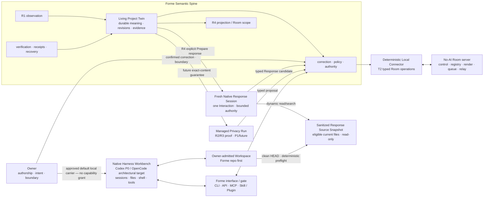

# Owner technical cockpit

## Superseding current status — #77 local campaign resumed, 2026-08-17

**Product progress remains `0`.** The Owner confirmed one larger local,
synthetic, loopback-only disposable integration campaign after the
restart-readiness repository correction. The campaign covers exact image
acquisition, diagnostics, contract-preserving repair, bounded reruns, evidence
and cleanup without per-command approval.

No-pull run `5bfaf0bfacaede47` stopped at
`disposable_postgres_image_not_cached` before creating a container, network,
volume, PostgreSQL connection or SQL effect. Exact resource absence and local
runtime cleanup are Green. This consumes one acquisition observation, not a
full lifecycle.

The active ceilings are three working days, three repository-only repair
rounds, four full disposable lifecycles and two acquisition attempts for the
same exact approved PostgreSQL digest. The next action is one continuous exact
image acquisition plus schema → initial verify → restart → post-restart
persistence → rollback → exact-cleanup lifecycle. Two same-boundary physical
failures pause runs for architecture review; ordinary in-envelope repair does
not reopen an Owner gate.

The current local branch is `codex/r4-public-core-local-postgres-wiring` at
`acda73e`. It has no upstream and is not represented by Draft PR #76 or remote
CI. GitHub #77, #67, Project #1 and PR #76 now disclose that local-only truth.
Push, merge, Production, real/private data, provider/public effects and Gate C
remain closed.

Current stop: `LOCAL_DISPOSABLE_POSTGRES_CAMPAIGN_ACTIVE /
EXACT_IMAGE_ACQUISITION_AND_LIFECYCLE_IN_PROGRESS / PRODUCT_PROGRESS_0 /
PRODUCTION_NOT_REQUESTED / GATE_C_NOT_REQUESTED`.

## Historical checkpoint — #77 final failed-clean lifecycle, 2026-08-17

#77's replacement diagnostic consumed one exact pull and evaluated all 18
assertions. Its sole failure was the reviewed catalog-ordering class. The
consolidated verify-only correction passed every repository lane, and the final
lifecycle passed schema apply and initial verify before failing cleanly at
restart readiness. Exact cleanup is Green; all run budgets are exhausted and
#67 stays `Building / At Risk`.

Current stop: `POSTGRES_VERIFY_CONSOLIDATED_CORRECTION_FINAL_LIFECYCLE_FAILED_CLEAN /
INITIAL_VERIFY_GREEN / RESTART_READINESS_FAILED / ROLLBACK_NOT_REACHED /
EXECUTION_BUDGET_EXHAUSTED / NEW_OWNER_DECISION_REQUIRED /
PRODUCTION_NOT_REQUESTED / GATE_C_NOT_REQUESTED`.

### Plain-language product status

- **Product progress in #77: 0.** The Owner still cannot complete the real
  Public Room → private knock → durable local pull → fresh candidate → exact
  response experience.
- **What moved:** PostgreSQL 16 schema apply and the complete initial verify
  are now proven in one isolated run, and exact cleanup remains proven.
- **What remains before #67 can advance:** restart readiness, persistence after
  restart and rollback rehearsal; after that, #67 still needs integration,
  activation and one real Owner-experienced Guest encounter.
- **Current blocker:** the restarted container never became ready within the
  bounded check. The execution budget is exhausted, so another local run is
  not an ordinary retry.
- **Next action:** architecture review of restart readiness and the integration
  shape is complete. Review the three current integration slices and the
  repository-only readiness correction. No Docker or PostgreSQL attempt is
  currently authorized.

### Repository-only restart-readiness correction

- One shared controller now drives production and focused readiness tests.
- Failure preserves the exact attempt count and one of seven closed body-free
  outcome classes instead of reporting restart attempts as zero.
- Restart re-inspects the exact-owned container and running state, then uses
  its freshly proven single loopback port before PostgreSQL probing; Docker may
  legitimately assign a new random host port on the second start.
- Focused tests are `22/22`; offline R4 is `598/598` with `111` historical
  physical skips; typecheck, docs and diff checks are Green.
- Review routing is frozen in
  [`R4-REVIEWABLE-INTEGRATION-PACKAGE.md`](./R4-REVIEWABLE-INTEGRATION-PACKAGE.md).
- Physical execution, push, merge, Production and Gate C remain unrequested.

Repository stop: `POSTGRES_RESTART_READINESS_CONTROLLER_REPOSITORY_GREEN /
REVIEWABLE_INTEGRATION_PACKAGE_READY / PHYSICAL_EXECUTION_NOT_REQUESTED /
PRODUCTION_NOT_REQUESTED / GATE_C_NOT_REQUESTED`.

### Current local and remote integration truth

- The current R4 implementation/evidence baseline on local branch
  `codex/r4-public-core-local-postgres-wiring` is
  `a2ce37947c2858eab5e6f5803af51a832fadc62d` / tree
  `14245e17818d41850a204364a8193b0853dcae8a`. This repository-only
  working-model reconciliation is layered locally above that baseline; neither
  line has an upstream.
- The implementation baseline is 123 commits and 163 changed paths beyond
  Draft PR #76's remote head
  `c831b4d5253049c4581d3c576aea59648d699d97`.
- Draft PR #76 remains accurate historical evidence for Durable Public Core
  Construction, but it does not contain or validate the current local line.
- The broader integration Draft PR #65 and the open Draft PR stack likewise do
  not provide remote or CI coverage for the implementation baseline or this
  governance correction.
- Before another runtime effect or merge review, create a reviewable
  integration shape that separates current product implementation from the
  historical governance/evidence chain. That local shape now exists as
  `codex/r4-reviewable-integration`, exactly three commits above Draft PR #76,
  and its focused proof, product tests, typecheck and docs audit are Green. It
  has no upstream. Push and merge remain `NOT_REQUESTED` in this correction.

### Current-truth routing

Use this file and active issues #67/#77 for current execution truth. Use
`PRODUCT.md` and `ROADMAP.md` for stable product meaning, an active integration
PR for remote bytes and CI, and reports/evidence/Cards/Addenda/Reviews only as
dated or immutable proof. `R4-EXECUTION-MANAGEMENT-RESET.md` now records the
stable policy and historical checkpoints; it is no longer a competing live
status surface.

## Execution-management reset before #77 (historical checkpoint)

R4 is now managed as one product Walking Slice (#67) plus at most one linked
Enabler. #67 is `Building / At Risk`, not complete Technical Review. The
historical physical runner and its Correction/Card/Review chain are frozen;
V4 remains immutable failed-clean evidence and receives no retry or routine
fingerprint extension.

The next decision surface is one medium-grained envelope for
[#77](https://github.com/formehq/forme/issues/77), a simplified disposable
PostgreSQL rehearsal. Its default budget is two working days and
two full lifecycles; two same-boundary failures or an Enabler needing another
Enabler forces redesign. Until that envelope is separately confirmed, do not
call Docker or PostgreSQL. Production and Gate C remain closed.

Reset stop: `R4_EXECUTION_MANAGEMENT_RESET_COMPLETE /
DISPOSABLE_POSTGRES_ENABLER_ENVELOPE_REQUIRED /
DOCKER_NOT_REQUESTED / PRODUCTION_NOT_REQUESTED / GATE_C_NOT_REQUESTED`.

Execution rules: [`R4-EXECUTION-MANAGEMENT-RESET.md`](./R4-EXECUTION-MANAGEMENT-RESET.md).

## Integration Campaign V4 status before the reset (historical)

Integration Campaign V4 consumed its one-use grant and failed cleanly before
PostgreSQL. Docker `29.3.1 / linux/arm64` and the corrected historical
container-missing fingerprint matched; the next historical network inspect
completed exit `1` with a distinct, unadmitted body-free fingerprint, so the
runner stopped. Terminal evidence is `sha256:fb44fbd…1166b`, journal `12` at
`sha256:df1e0c8c…d60f`, and the
[outcome report](./R4-PUBLIC-CORE-LOCAL-POSTGRES-INTEGRATION-CAMPAIGN-V4-OUTCOME.md)
is `sha256:820f9878…f67b`. Fresh resources are proven absent and all owned
residue is zero; PostgreSQL/SQL were not reached.

The confirmed autonomous envelope's three local lifecycle slots are exhausted.
Do not retry, create another campaign authority or call Docker. The next action
is an Owner decision on the narrow network/volume fingerprint correction and a
new bounded lifecycle budget, or an explicit decision to stop this local proof.
Production and Gate C remain `NOT_REQUESTED`.

Current stop: `LOCAL_POSTGRES_INTEGRATION_CAMPAIGN_V4_FAILED_CLEAN /
LOCAL_LIFECYCLE_BUDGET_EXHAUSTED / NEW_OWNER_DECISION_REQUIRED /
PRODUCTION_NOT_REQUESTED / GATE_C_NOT_REQUESTED`.

## Earlier cockpit snapshot (historical context)

- Updated: 2026-08-16
- Active gate: **R4 Controlled Presence remains Building. #66 local Projection
  review is Owner-accepted and #67 has repository/offline Public Core plus
  concrete Local PostgreSQL wiring. The approved Integration Campaign V2 and
  image-manifest diagnostic remain consumed failed history. The first
  image-acquisition diagnostic was also consumed once; its exact Docker
  `version` call completed `NONZERO / exit 1`, so inspect and pull remained
  zero. The Owner reports Docker Desktop was not running then and is running
  now, but that has not yet been re-observed by the diagnostic. Kiar `3db3060`
  / Liar `3e1b0cb` now freeze a separate V2 replacement authority path with the
  same one-version/two-inspect/one-pull ceiling and immutable V1 bindings.
  Replacement construction made zero Docker/socket/daemon/registry/pull,
  cleanup, PostgreSQL or SQL effects. The exact stop is
  `LOCAL_POSTGRES_IMAGE_ACQUISITION_REPLACEMENT_AUTHORITY_TECHNICAL_REVIEW_GREEN /
  IMAGE_ACQUISITION_V2_APPROVAL_REQUIRED / PRODUCTION_NOT_REQUESTED /
  GATE_C_NOT_REQUESTED`. Host Binding remains historical setup evidence, not
  the #67 product gate.**
- Active issue: [#67 — Public Room and one real bounded knock](https://github.com/formehq/forme/issues/67), under [#52 — R4 Controlled Presence](https://github.com/formehq/forme/issues/52)
- P0 implementation: **R1, R2, and R3 are Owner-accepted. R4 design and Gate A
  repository mechanisms are closed/implemented. #66 proved current Twin →
  bounded local Projection → exact local Owner approval → restart recovery.
  #67 has proved the Room-bound handoff, offline Public Core rehearsal, rich
  visitor surface and repository-only application/persistence/driver-bridge
  construction. The disposable rehearsal and cleanup rescue reached Docker
  inspect but did not reach PostgreSQL; both remain FAILED/BLOCKED. No
  production PostgreSQL
  migration, Gate C deployment,
  Room mutation, publication, Curator admission, real Guest data, public
  traffic, Fresh Provider session, or Response delivery has run. R4 is not
  Owner-accepted or Done.**
- Host status: **attempt 1 and attempt 2 are both consumed Yellow history.
  Attempt 2 was bound to implementation `J` `7ae4a24` / tree `a40045c` and
  stopped `YELLOW_NO_RETRY / HOST_BINDING_INCOMPLETE_YELLOW` before any Docker
  CLI, local Docker socket, or macOS inspector start (`0 / 0 / 0`). Cleanup is
  Green; no capsule/public receipt exists; Retry Execution and First
  Provider-Call remain `NOT_REQUESTED`. #71 may turn this prerequisite into a
  bounded Setup/Doctor before #68, but it cannot make R4 Done.**
- Branch status: **R4 is not on `main`. `main` remains `7c1f7bd`; PR #72 merged
  into the stacked R4 line. Integration Draft PR #65 is at `cbadd8a`, Draft PR
  #73 at `5e93196`, and Draft PR #75 at `09401a0`. Construction Stage A is
  `bcd4259`; Draft PR #76 remains unmerged and its remote/CI readback belongs in
  PR metadata. PR #74 is merged and changed only the deterministic
  Linux inode-reuse fixture. Local PostgreSQL Wiring Stage A is `bc0b520`; no
  fresh remote or CI status is claimed here.**
- First real workspace: **Forme repo — owner confirmed**
- Delivery: **August 25 is a Progress / Vision Sharing checkpoint, not a
  complete/repeatable-MVP deadline. #67–#70 remain intact and gate-driven;
  Technical Review plus Owner Experience Acceptance—not the date—defines Done.
  R5 starts only after the real R4 chain is accepted.**
- Next action: **freeze the repository-only replacement package and add the
  reserved V2 Image-Acquisition Diagnostic Card/Owner Review as two add-only
  direct children, then stop once for exact Owner approval. Until that
  separate approval, do not prepare a
  diagnostic grant, resolve the Docker socket, call Docker, pull an image,
  clean a resource or touch either failed diagnostic root. The
  hash-pinned
  [`Gate C Card`](./R4-PUBLIC-CORE-GATE-C-ACTIVATION-CARD.md) remains
  non-approvable; do not activate it.** Repository-only Construction has
  stopped at Technical Review. The accepted #66 review
  `sha256:45414f18…1480` is phase-specific and explicitly non-publishable. No
  deploy, Room creation, publication, Curator admission, real Guest knock,
  Retry, or Provider call is active or implied.
- Current image-acquisition replacement bindings: index
  `sha256:f37fd3adccb7b540aaa0ff180237d892b78c1e27f2c64d9686c3f0ff0577c8b3`,
  schema `sha256:7712430fed5f4feb6e8f53daf53b9aa11ba5046e2f625b2f865fed35880a6130`,
  evidence `sha256:202e96b8d30a5f4e9e4074415388ddf73c133ceb9101733d8d36db61dc353f88`,
  report `sha256:2750f690996e2c9e706af312e12832bc833406f0433651e1078522c70d58d156`.
- Current stop: `LOCAL_POSTGRES_IMAGE_ACQUISITION_REPLACEMENT_AUTHORITY_TECHNICAL_REVIEW_GREEN / IMAGE_ACQUISITION_V2_APPROVAL_REQUIRED / PRODUCTION_NOT_REQUESTED / GATE_C_NOT_REQUESTED`.

This is the owner's single re-entry page. Read it before implementation details. It should answer, in a few minutes: what Forme is, where the build is, what truth is durable, what an agent may see or change, and what the owner must decide next.

## Product claim

The current MVP is one Living Project Twin for one real project:

> It remembers where the project is, notices what it is becoming, acts once within explicit and reversible trust, and produces one controlled collaborator projection.

The four required effects are **Continuity, Cognition, Bounded Agency, and Controlled Presence**. They are one causal story built on one Twin, not four disconnected features.

## You are here

```text
R0 Shared understanding   ✓ COMPLETE
  ↓
R1 Continuity             ✓ DONE · OWNER ACCEPTED 2026-07-18
  ↓
R2 Cognition              ✓ DONE · OWNER ACCEPTED 2026-07-18
  ↓
R3 Bounded Agency         ✓ DONE · OWNER ACCEPTED 2026-07-20
  ↓
R4 Controlled Presence    ← #66 ACCEPTED · #67 OFFLINE TECH REVIEW · REAL ENCOUNTER OPEN
  ↓
R5 Hardening              after R4 Owner Acceptance → privacy → recovery → rehearsal
```

Current truth:

- `main` contains the owner-accepted R1 Continuity, R2 Cognition, and R3 Bounded Agency slices;
- the previous implementation is preserved in the archive as evidence and a parts library;
- archived code is not the default architecture and is not reused without an explicit contract;
- #47 tracks the whole MVP; #48 records the completed R0 Control Packet;
- #49 contains the completed R1 contract, technical evidence, and owner acceptance;
- #50 completed the first real Codex path, evidence-backed Reflection, owner correction, and dependent-output invalidation;
- #51 is complete; the owner approved all five original R3 recommendations on 2026-07-18, all five R3-V2 Owner Decision Brief recommendations on 2026-07-20, and accepted the full R3 MVP product gate on 2026-07-20;
- on 2026-07-25 the owner approved all five revised R4 product decisions: the
  Hybrid Hero Encounter, one curated public Forme Third Place with the Forme
  Project Room as its first resident, Manual and minimal Agent Guest paths,
  owner-publication plus curator-admission gates, layered controller/entity/
  Room/capsule/agent/guest identity, and an edge-intelligent no-server-AI
  topology. This approval authorizes preparation and review of the technical
  Control Packet, not the packet's proposed implementation;
- on 2026-07-26 the Owner approved the T1 correction: Third Place Room public
  reading plus one 24-hour/one-Interaction anonymous bearer knock; Owner-issued
  short continuation; and a real `private_grant_only` Room with a different
  Room ID, separately approved Projection, and Grant-gated reading and
  interaction. Public request/response bodies remain private; unlisted is not
  private; Curator discovery authority remains separate from Owner intake and
  Grant authority;
- on 2026-07-28 the Owner approved the recommended T2 control contract: hosted
  Forme is a GitHub-like management/control/status plane; every P0 Room
  semantic capability has a versioned API; Web and a thin CLI use the same
  contract; and Agent authority should correspond to the local Repo/Workspace
  and exact Room rather than the whole Controller account. One workspace may
  hold multiple independent per-Room bindings, but no credential spans Rooms
  or creates a hosted workspace identity. The fixed `room_operator.v1` bundle
  lasts 30 days without automatic renewal, is revocable earlier, stays in the
  deterministic connector rather than the model, and covers inspect,
  typed sync/pull, deterministic ACK/recovery, exact Owner-approved delivery,
  and deterministic stale attestation only. New Rooms/scopes/audiences,
  Grants, intake/disposition, new Owner content, curation, content revoke, and
  irreversible retire/delete remain outside it;
- on 2026-07-28 the Owner approved P for the R4 authority contract: privacy is
  the primary source/provider/audience perimeter; representation/commitment
  and irreversible/materially high-impact consequence are companion guards;
  existing authority cannot expand itself; and covered work inside an explicit,
  inspectable, revocable envelope proceeds review-by-exception. This closes P
  only. At that point T3–T5 and all R4 implementation remained unapproved; T1
  and T2 remained separately approved;
- on 2026-07-28 the Owner confirmed the Native Harness role correction:
  Codex/OpenCode may be the mature operational Workbench, Forme is the durable
  Semantic Spine, and the packet-only/no-tools path is a Managed Privacy Run
  rather than the definition of every Forme Agent. R1–R3 remain valid narrow
  proofs. On 2026-07-29 the Owner then approved NH1 option 1 and NH2 option 1:
  Native Harness Workbench is the default local carrier, Codex is the P0
  workbench, OpenCode remains a first-class architectural compatibility target
  with no live P0 path, and ordinary native Workspace work is distinct from
  typed Forme-authoritative meaning/effects. Native results may be
  offered/admitted as evidence only under a separate source/observation
  contract. The approval grants no
  runtime, provider, file, shell, tool, Guest, Room, credential,
  implementation, deployment, external-action, or spend authority;
- on 2026-08-01 the Owner selected Fresh Native Response Session (Option 2B)
  as the R4 P0 direction. Each exact Interaction gets one new/non-resumed,
  bounded Codex response session that may dynamically read/search only a
  sanitized read-only snapshot of current eligible Forme files plus typed
  body/path-free current Twin orientation. The old
  Managed Privacy response recommendation moves to P1/future; P0 has no
  trust-tier selector. At that point, the exact consent, source/provider/
  capability envelope, session budget, physical isolation and lifecycle
  remained unapproved, and the direction granted no capability or
  implementation authority;
- on 2026-08-03 the Owner approved the exact Fresh Native Response Session T3
  contract as recommended, including its consent, sanitized source/provider/
  capability envelope, session budget, physical isolation, candidate-only
  output and the then-open T4/T5 lifecycle split. This approval permits
  authority-document and later Control Packet reconciliation only. It does not
  authorize a Fresh
  Session implementation, Guest-body release, dynamic snapshot read, OpenAI
  call, schema, deployment, spend, Room mutation or production action;
- on 2026-08-03 the Owner approved the recommended T4 lifecycle contract.
  Owner publication and Curator admission remain independent; current
  never-admitted or unlisted public Projection remains direct-readable but has
  no Third Place discovery or new public knock; stale Projection permits only
  visibly warned, time-bounded reads and no new Interaction; revoke and Room
  retirement hide hosted bodies and enter T5-governed purge; public successors
  require new Curator admission and no successor inherits a Grant; and only a
  newly compiled and newly approved
  Response may answer an existing stale, superseded, or expired origin, while a
  revoked origin cannot. This approval does not expand `room_operator.v1` or
  authorize implementation, physical purge timing, Guest data, provider calls,
  schema, deployment, spend, or Room mutation;
- later on 2026-08-03 the Owner fixed two product-facing parts of the still-open
  T5 proposal. Guest continuation is presented as exact capability presets—
  24 hours / 1 Interaction, 3 days / 2, or 7 days / 3—rather than an account or
  inferred trust level; private access remains a separate exact Room +
  Projection Grant. An exact Interaction may optionally retain a confirmed
  email endpoint for one generic `response_ready` notice. Email carries no
  body, private Room name, reply capability, identity, or authority-recovery
  meaning and is cleared with its parent. Polling the retained private reply
  URL remains canonical. This fixes those T5 inputs only; retention, deletion,
  the full P0 cut, Packet, implementation, provider, schema and production
  authority remain open;
- later on 2026-08-03 the Owner approved the full recommended T5 contract and
  added a fourth continuation preset without replacing the earlier familiar
  tier: familiar collaborator remains 7 days / 3 Interactions, while trusted
  collaborator is an explicitly Owner-selected 7 days / 10 independent
  Interactions. Neither label is inferred or grants identity, successor,
  cross-Room, or automatic Private Room access. Full T5 also fixes explicit
  sync/manual recovery, notification-only email, retention ceilings,
  deletion/purge honesty, production disclosure requirements, and the P0 cut.
  This closes T5 as design authority only; implementation, real Guest data,
  schemas, providers, deployment, spend, and production behavior remain open;
- the R1–R3 continuity audit found one real additive Twin chain and one
  cross-version defect: a V3 Twin previously dropped active Owner Corrections
  from a later R2 Context Packet. The defect is repaired with a V3 regression.
  The architecture now requires every R4 public claim to retain an eligible
  local Twin basis and requires the real demo to prove
  Twin → Projection → Signal → local judgment → Response causality rather than
  accepting a hand-authored social page as Forme Presence;
- the first proposed v0.1
  [`R4-TECHNICAL-CONTROL-PACKET.md`](./R4-TECHNICAL-CONTROL-PACKET.md) was an
  unreconciled implementation appendix. On 2026-07-26 the Owner supplied the
  existing Cloudflare → Caddy → Hetzner → PostgreSQL deployment target,
  required anywhere Web login for Owner Control, and reopened the former
  invite-only Guest model. T1, T2, T3, T4, NH1, and NH2 are now closed; T5 in
  [`R4-TECHNICAL-OWNER-REVIEW.md`](./R4-TECHNICAL-OWNER-REVIEW.md) later closed
  in full. It is superseded by the newly reconciled and independently audited
  v0.2 at `sha256:e417836bd67bdef73f401919e83de3d58f68960499bd5c356951b48408adfff5`.
  The Owner approved those exact bytes on 2026-08-03; the prior packet hash is
  not approvable. Gate A repository-only work is authorized, while every
  external, hosted, or production resource and later gate remains unauthorized;
- on 2026-08-04 the Owner approved the exact Gate B Manifest at
  `sha256:ba0f9ce389c6668aef5e41fb2e6228d8838d7bea481f942b2a025620d37ad5fa`
  while explicitly keeping First Provider-Call Test Grant `NOT_REQUESTED`.
  The first attempt then stopped Red before the fixed lane sequence completed:
  a delegated preconstruction hash search included real Codex-home session
  files. It emitted paths but no file contents or credentials and started zero
  Codex threads, turns, models, accounts, or provider requests. All remaining
  lanes stopped, four unvalidated partial files were removed, cleanup is Green,
  and the report commit passed standard CI. The correction splits repo-only
  Retry Construction from a later separately hash-pinned Execution Grant;
- on 2026-08-04 the Owner approved the exact Retry Construction Packet at
  `sha256:4122e293fb476dc90e289566745459d9fe1b9603c3473c49de9d2e1429e025e7`
  while explicitly keeping Retry Execution Grant and First Provider-Call Test
  Grant `NOT_REQUESTED`. The Packet and low-load Owner Review are byte-frozen.
  The authorized one-primary-Agent serial Construction completed at `d6374ed`:
  54 changed paths remained inside the workset, 56/56 Gate B offline tests and
  native tests passed, cleanup was Green, and every real provider/Codex/Docker/
  PostgreSQL/Keychain/user-presence effect remained zero. It returned Yellow
  and a non-approvable Retry Execution Manifest rather than hiding three
  uncomposed physical lanes;
- on 2026-08-07 a read-only three-lane review corrected the estimate of those
  gaps. PostgreSQL still has 51 `storage_unavailable` surface functions, two
  no-op notification claims and 27 deferred runtime-test categories; the Codex
  pinned-real branch still uses fixture assumptions and has no diagnostic
  Seatbelt/process-group composition; and the macOS custom-Keychain + persistent
  Secure-Enclave design is unimplemented and may be unsupported. No prior
  Yellow evidence is reclassified. The Owner approved all five recommended
  Demo-critical scope corrections in
  [`R4-GATE-B-CORRECTION-SCOPE-DECISION-BRIEF.md`](./R4-GATE-B-CORRECTION-SCOPE-DECISION-BRIEF.md).
  The Owner later approved the exact Core Construction Packet
  `sha256:5c8ec32ca40ca9e6f67f96e8b2cec8f378c04fef8bc59387e98f5d79cbe0b3e6`
  and low-load Review
  `sha256:2ad228be60be0730056a4c1195b2ce1be8db11ee9e308e4bc4559edc226bb299`,
  granting Construction while keeping Retry and Provider authority closed;
- the authorized Core Construction returned and was published at review HEAD
  `0e6a1a2` / tree `b8d3d64`. It passed 381 Node and 19 Swift tests, kept all
  real Docker/PostgreSQL/Codex/sandbox/signing/Keychain/LA/provider effects at
  zero, and published Report
  `sha256:4369c5bf7f95e805b440c47a5d2908b091d74c14ab0b322a39d663978c570f40`
  with machine evidence
  `sha256:8153a74a2d3f1724ffb3a71c7dc694b21dee5fd3e89731d82c910864819c3d09`.
  Its Manifest `sha256:f743f8f17daa3aa4d12805cc12563c94a1e3e3343ab4069e4ce351058bcc0b74`
  is intentionally non-approvable Yellow: physical adapters, host bytes, one
  unified runner and executable PostgreSQL races remain unclosed;
- a successor read-only review fixed the PostgreSQL interpretations before
  more Construction: 13 conceptual race families expand to 16 executable cases
  / 32 orders and exactly 68 Core calls; pool-20 is public-encounter-only
  active-unresolved, and public-accept 3/day follows exact issuance-bucket
  lineage. The Owner then approved the exact Physical Adapter + Host Binding
  Construction Packet `sha256:7ad7fd34…69d06` and immutable Review
  `sha256:27c64b28…41ff9`, bound to proposal `a45ea06` / tree `89b2890`, while
  keeping Retry and provider authority `NOT_REQUESTED`;
- that consumed grant produced final implementation `I` `92c6c3f` / tree
  `cf2ce55`: the unified runner, corrected race machine and three physical
  adapters were built and fake-validated with zero physical effects. Exactly
  one Host Binding attempt then consumed and removed its fixed input and
  stopped Yellow on a symlinked supplied path before starting any of the 3/2/9
  Docker CLI/local-socket/macOS inspectors. Cleanup is Green, no capsule or
  public receipt was produced, no re-run occurred, and the returned
  [`Physical Retry Manifest`](./R4-GATE-B-PHYSICAL-RETRY-EXECUTION-MANIFEST.md)
  is non-approvable;
- on 2026-08-09 the Owner approved the lean Host Binding Reattempt Envelope
  v0.2 at `sha256:ee713295…6daf3`, its Review at
  `sha256:670338ba…e445`, and implementation-preparation grant bound to proposal
  `af5396b` / tree `b7aabaa`. Final implementation `J` `7ae4a24` / tree
  `a40045c` then produced Activation Card `sha256:4be3de82…15af6`. The Owner
  activated exactly attempt ordinal 2 while keeping Retry Execution and First
  Provider-Call `NOT_REQUESTED`. Attempt 2 stopped
  `YELLOW_NO_RETRY / HOST_BINDING_INCOMPLETE_YELLOW` before any inspector start,
  with Docker CLI/local socket/macOS starts `0 / 0 / 0`, no capsule or public
  receipt and Green cleanup. The attempt is consumed and grants no retry;
- the Owner-approved Forme GitHub Project Management Envelope v1 now permits
  routine issue, Project, milestone, label, PR-metadata and priority maintenance
  inside the existing R4/R5 Vision. It grants no authority to change product
  Vision, merge, deploy, publish, call a Provider, widen privacy/permissions or
  spend. GitHub now tracks #66–#70 as the R4 product sequence and #71 as a
  time-boxed Host Setup/Doctor enabler rather than a product milestone;
- on 2026-08-10 #66 completed Owner Experience Acceptance for the real local
  Projection at exact review hash `sha256:45414f18…1480`, Twin revision 29 /
  `sha256:c527b65f…dfd4`, and immutable receipt
  `receipt_57a7c38df5120a590996dad29040b72e`. Restart revalidation remained
  `APPROVED_CURRENT`, and Room/network/Provider/Host/publication effects all
  remained zero. PR #72 subsequently merged into the R4 integration branch at
  `87e5979`, not into `main`. That accepted review contains phase-specific
  #66/#67 wording, so #67 hard-denies it as a publication source and requires a
  publication-stable successor plus a new exact publication approval;
- on 2026-08-10 #67 reached offline Technical Review on Draft PR #73. Its
  initial `eabfe82` evidence remains valid and its current head is `5e93196`.
  Draft PR #75 at `09401a0` adds the public-only production-boundary foundation.
  The durable-construction snapshot at `bcd4259` remains historical Green; the
  current Local PostgreSQL Wiring Stage-A `bc0b520` adds the audited concrete
  executor, 20-method bridge and corrected static SQL contract. No target
  PostgreSQL was observed, and vault/HTTPS transport/production pool and
  migration/runtime route/traffic/Gate C remain false. A later approved v3
  rehearsal and separately approved cleanup rescue each consumed one grant,
  reached exact-name inspection, and ended FAILED/BLOCKED. They created no
  Docker resource and reached no PostgreSQL/SQL effect. Kf/Lf
  `bd3cdf7` / `7384ef8` froze the repository-only body-free observation
  membrane. Its later V1 prepare failed before grant creation with a generic
  runner code and zero Docker/socket effects. Kp/Lp `eaca190` / `7a31dba`
  froze the 19-stage body-free failure membrane. Ki/Li `76afe10` / `4c20af2`
  freeze the predecessor Integration Campaign. Kic/Kgc/Lic `1e93280` /
  `98392bf` / `614202e` now freeze the exact inspect-missing parser correction,
  Gate-B concurrent validation correction and strict machine evidence; fresh
  Campaign V2 execution and cleanup remain separately gated by one versioned
  Card/Review. PR #74 is merged as a fixture-only
  repair. The implementation proves a local Room-bound
  reapproval, immutable receipt/recovery, offline public Projection → independent
  curation → one 24-hour/one-use knock → private durable Interaction → local
  pull rehearsal, and the visitor-facing Vision/Now/Next/Tensions/Open To/
  Boundary structure. It has made zero production Room/database, deploy,
  publication, Curator, real Guest, Provider, Host, email or spend effects. #67
  remains In Progress until one separately authorized real encounter passes
  Owner Experience Acceptance;
- the current production Public Core gap is explicit: active code has not run a
  production PostgreSQL migration or Gate C deployment/provisioning, has not
  created a real Room or public capability, and has not carried real Guest data.
  Host Setup/Doctor #71 is relevant to the later #68 Fresh local Codex/provider
  boundary, not a prerequisite for choosing #67 public meaning or reviewing its
  successor Projection;
- the real R3 path completed proposal, exact approval, execution, retry, restart, and rollback through Twin revisions 21–25;
- CASE-01 did not establish R3 usefulness, but independent Career CASE-02 provided sufficient MVP product evidence: the owner found all three proposals useful, and the correction-aware Forme output contributed real decision scaffolding without historical source bodies or manual correction reconstruction. This does not establish general recommendation accuracy. The evidence lives in [`VALIDATION.md`](./VALIDATION.md).
- the private local `forme-r3v-knowledge-lab` contains one provenance-preserving, stably redacted CCS note at two real historical time points. The owner approved one exact 36,230-byte visibility packet and the B-arm Forme Reflection was admitted at lab Twin revision 3;
- the first call produced zero tool events and no source changes. The owner correction became active at lab Twin revision 4: the original inference is `superseded`, one dependent output is invalidated, and later packets automatically carry the corrected meaning. The approved A0/A1/B comparison completed with zero tool events in all arms. The owner preferred T/A0, saw M/A1 as a useful editable layer, and least preferred Q/B because it returned too much classification work. B's proposal was never approved or executed and is invalidated at lab Twin revision 7. At that point, the next R3-V gate was the owner-facing output contract rather than another effect; R3, T5 and the exact R4 Packet have since closed, Gate A is historical Green evidence, and #67 is the current product gate.
- CASE-02 local extraction was owner-approved with manifest `sha256:0db3f411ba9ffe9b24cba791d6e402cf55a196e8b5f4edbfaff0576114738920`. The two immutable Career blobs became 4,607- and 12,108-byte redacted snapshots under one stable mapping; 139 replacement operations, exact hashes, provenance, and residual re-identification risk are recorded. The original source-vault path remains unmodified.
- The existing CASE-01 Twin cannot safely admit Career because its immutable source contract allowlists CCS only. Rather than rewrite historical contract hashes or contaminate CASE-02, the lab prepared a fresh local Career workspace gate `sha256:4526ffd973be31210dd30b31a25c72fd1238e42cd71e5c0c581c5eb8a2818871`. That gate creates no model authority; after approval, a separately owner-approved exact ContextPacket hash is still required.
- The owner approved that setup gate. `/Users/zaynw/Documents/Projects/forme-r3v2-career-lab` contains a no-remote Twin with only `README.md` and the redacted Career path allowlisted. Exact ContextPacket `sha256:007835b6a5c07688467544b06312d16358e616f338cd1f60fd4761868ae71041` produced one zero-tool inferred Reflection at revision 2. The owner corrected its causal over-weighting without a model call: revision 3 preserves the original as `superseded`, admits owner-authored Reflection `ref_711fd70d727e4ecf74f19005590eda09`, records correction `cor_e48ac14130ab657777b006908a16719b`, and invalidates one dependent output. Under approved comparison gate `sha256:5d5114c24de0681267cb0c4509b456d017bcc29a2a7b39efcbc8d1045378dece`, one A0, one A1, and one B call completed with zero tool events. The owner found all three useful, leaned slightly toward A1, and least preferred A0's no-correction closure-only recommendation, then clarified that A1 and B are too close to separate confidently because the real ship/closure balance remains unresolved. B carried the combined corrected direction automatically with zero source bodies and no manual reconstruction. The R3 closeout advanced the Career Twin to revision 5 and invalidated B through `ainv_6c8069a54d2bba64d6f21c4ca5031283`; approvals, effects, source changes, and additional model calls remained zero.

## System map



### How to read the map

- **The Native Harness Workbench** is the approved default local carrier and
  mature operational body. Its exact Workspace/provider/capability envelope
  remains separately gated; NH1 grants no concrete capability.
- **The Twin / Semantic Spine** is Forme's durable, versioned meaning and
  authority. It is not a transcript, runtime session, file copy, or summary
  page.
- **A Managed Privacy Run** receives an exact packet as the complete manifest
  of Forme-selected Owner/Guest/workspace content. Runtime-owned system/safety
  instructions, schema, and operational metadata remain separately disclosed
  and audited. R2/R3 prove this narrower lane; it is not all of Codex/OpenCode.
- **A Fresh Native Response Session** is the Owner-approved R4 P0 T3 contract:
  it is a
  new per-Interaction transcript, can dynamically read/search only a sanitized
  read-only snapshot of current eligible Forme files plus typed body/path-free
  Twin orientation, and has no writer, network tool, other
  Guest body, connector credential, Room or publish authority. T3 approval
  fixes this boundary. Exact Packet approval now permits only Gate A
  repository interfaces and offline proof; a real provider-backed session
  remains behind Gate B.
- **Ordinary Workspace truth and Forme-authoritative state/effect are distinct.**
  Under approved NH2, native results remain outside Forme until separately
  offered/admitted as evidence. A runtime never admits Twin meaning or expands
  Forme authority by itself.
- **The connector and no-AI server** preserve the approved T2 credential and
  Room boundary. Native Workspace access never implies Guest inbox or Room
  credential access.

The full role model and approved NH1/NH2 decision record are in
[`NATIVE-HARNESS-ARCHITECTURE.md`](./NATIVE-HARNESS-ARCHITECTURE.md).

## Owner architecture checksum

The owner has decision-grade technical understanding of a slice when these five questions have clear answers:

1. **Input:** What enters Forme?
2. **Durability:** What becomes durable, and where does it live?
3. **Visibility:** What can Codex or OpenCode see?
4. **Authority:** What may an agent change, and who approves it?
5. **Recovery:** After interruption, failure, or a wrong interpretation, what survives and how is it corrected or reversed?

If these cannot be answered in roughly five minutes, implementation pauses and this cockpit or the active Control Packet must be repaired.

## Completed Control Packet — R1 walking skeleton

- Status: **implemented, technically verified, and owner-accepted on 2026-07-18**

### User outcome

After connecting the Forme repo, the owner can leave, restart the process, and recover a human-readable view of the project's current intent and observed change without reconstructing context from a chat session.

### Proposed first flow

```text
Forme repo
  → explicit source root and exclusions
  → deterministic bounded observation
  → durable Project Twin revision
  → Markdown Restart View
  → one source change
  → next meaningful revision
  → process stop and restart
  → reconstruct the same current view
```

### Five-question contract

| Question | R1 proposal |
|---|---|
| What enters? | One explicitly selected workspace: the Forme repo. Observation follows an explicit root and exclusions; no vault-wide discovery and no symlink escape. |
| What becomes durable? | A validated workspace contract, immutable Twin revisions, an atomic `HEAD` pointer, evidence metadata/provenance, and the minimum owner frame needed to reconstruct the view. Source bodies are not copied into the Twin. |
| What can the runtime see? | R1 uses no Codex or OpenCode reasoning. The first live Codex context begins in R2 through a scoped Context Packet. |
| What may the agent change? | R1 observation is read-only toward project sources. Deterministic Forme code may create or update only the approved, project-local state and generated view. |
| How does recovery work? | Canonical state survives process and runtime loss. A no-op observation does not create a new revision. Interrupted writes must not replace the last valid state; restart reconstructs from the last valid revision. |

### Accepted implementation boundary

- one root TypeScript / Node 24 npm package;
- JSON Schema validation through Ajv, with no other R1 runtime dependency;
- project-local, Git-ignored `.forme/` state;
- validated workspace contract, immutable full revisions, atomic `HEAD`, and idempotent pending-transition recovery;
- generated Markdown owner view that is reconstructible and non-canonical;
- owner-controlled `observe` inputs for Active Intent, Next Move, and Unresolved items, with strict CLI option validation;
- explicit Forme repo source allowlist only, with no ambient extension-based discovery;
- selective port of named archive safety algorithms and tests, never the old schema, state layout, or broader modules.

### Five-minute owner demo

1. Start from a clean Forme repo checkout and connect it with explicit boundaries.
2. Enter or confirm the project's Active Intent.
3. Run observation and open revision 1 of the Restart View.
4. Make one meaningful allowed source change and run observation again.
5. Confirm revision 2 explains the observed change; run a no-op refresh and confirm it creates no revision.
6. Stop the process, discard runtime/session context, restart, and reconstruct the same current view from durable state.
7. Confirm the project source was never modified by the observation path.

### Technical evidence

- `npm run check` type-checks the package and passes all 16 deterministic tests.
- Boundary tests reject parent traversal, skip symlinks, and keep out-of-allowlist canaries absent from state.
- Continuity and CLI tests prove initial, changed, deleted, owner-frame, strict input, no-op, and byte-for-byte Markdown reconstruction behavior.
- Recovery tests interrupt the pending, revision, `HEAD`, and view boundaries and resume each transition exactly once.
- The real Forme repo reached revision 8: revision 7 captured the CLI-control patch, revision 8 changed only the Owner Frame, an identical owner command was a no-op, and deleting the Restart View reconstructed identical bytes.

### Owner decisions

Confirmed:

- **First real workspace:** use the Forme repo.
- **Runtime boundary:** keep R1 fully deterministic and introduce the first real Codex path only in R2.
- **Persistence boundary:** use project-local, Git-ignored durable state. R1 durability covers process and runtime loss, not project-directory or machine loss.
- **First surface:** use a generated Markdown Restart View. It is a rendering of the Twin, never canonical state.
- **Toolchain:** use one TypeScript / Node 24 npm package, with Ajv for persisted JSON Schema validation and no other R1 runtime dependency.
- **State contract:** use `.forme/` with an owner workspace contract, immutable full revisions, atomic `HEAD`, reconstructible Markdown, and pending-transition recovery.
- **Source scope:** observe only the explicit Forme repo allowlist recorded in #49; do not scan the rest of the repo by extension or discovery.
- **Archive reuse:** port only the named safety algorithms and tests; do not copy the old schema, `98_Forme/` layout, or broader modules.

These choices produced the accepted R1 substrate. Any R2 expansion of state, source scope, dependencies, runtime visibility, or permissions returns to an owner stop gate.

## Completed Control Packet — R2 Cognition

- Status: **implemented, technically verified, corrected through the real owner surface, and owner-accepted on 2026-07-18**
- User outcome: one Reflection depends on evidence from at least two time points, exposes uncertainty, and can be corrected by the owner so stale dependent output is invalidated.
- Required map delta: durable Twin → scoped Context Packet → Codex proposal → evidence and quality validation → admitted Reflection → correction and invalidation.

### Proposed walking slice

```text
owner-selected Git checkpoints and paths
  → deterministic Context Packet at base Twin revision N
  → isolated, ephemeral Codex execution
  → schema-constrained Reflection proposal
  → evidence, staleness, privacy, and shape validation
  → inferred Reflection in Twin revision N+1
  → owner correction
  → corrected meaning and invalidation in Twin revision N+2
  → next Context Packet contains the correction
```

This is one cognition loop, not a general memory system or autonomous research agent.

### Recommended decisions

| Decision | Recommended answer | Global effect |
|---|---|---|
| Cross-time evidence | For the MVP, use two explicit, reachable Git commits and explicit small text paths. Resolve content with read-only Git operations and bind every document to its commit, blob hash, byte count, and line map. | R2 can inspect durable historical content without copying source bodies into R1 state. Uncommitted history and non-Git notes remain out of scope. |
| Codex visibility | Build a deterministic Context Packet first. Run Codex outside the Forme repo with a custom permission profile that can read only runtime-minimal paths and the isolated packet root. Disable project instructions, user config, tools, MCP, plugins, web search, and command network. | Selected packet content is transmitted to OpenAI through the owner's existing Codex authentication; the rest of the repo and machine are not authorized input. |
| Runtime role | Use `codex exec` as the first real adapter, with ephemeral execution, JSONL audit events, and `--output-schema`. Codex returns a proposal only. | Codex supplies mature model invocation and structured output while Forme retains state, validation, admission, and recovery. The adapter contract stays compatible with a later OpenCode implementation. |
| Semantic durability | Introduce `TwinRevisionV2` only when the first validated Reflection is admitted. Preserve every R1 revision unchanged. Store the Reflection as `inferred`, with evidence, uncertainty, provenance, and runtime receipt—not as owner-confirmed truth. | R2 adds canonical semantic state and a schema version, so owner approval is required before implementation. |
| Correction and invalidation | Correction creates a new Twin revision, records owner authority and the superseded Reflection, marks dependent outputs stale, and changes later Context Packets. Never overwrite history. | Owner authorship becomes executable and testable; stale model interpretation cannot silently remain active. |
| Quality gate | Apply deterministic structural gates, then require owner judgment. Structure requires two distinct time points, resolvable evidence, a cross-time relation, uncertainty, an alternative explanation, and an implication. | Forme can reject invalid or summary-shaped proposals, but it does not pretend to automate whether a Reflection is genuinely valuable. |

### First real evidence pair

The proposed demo uses one owner-controlled document at two immutable commits:

| Time point | Commit | Blob | Evidence |
|---|---|---|---|
| R0 control established | `81a002744156128c1e370bf6b8a3526e72bddbf9` | `1b5fb24e8e2afb511d28cb3f7cd8570c81b985d6` | `docs/DECISIONS.md`, lines 29–33: tests lead only to Technical Review; owner experience is required because technical completion had outrun shared understanding. |
| R1 owner accepted | `3cc2ac567d22b5b1c5bb1bfd7ed790d3ebd59052` | `5e06da60be0aaaa4d9655a7c9aee7157e93d1f5f` | `docs/DECISIONS.md`, lines 59–63: the real Owner Demo caught a silently ignored CLI control input after technical checks passed, and acceptance waited for the corrected rerun. |

Each historical file is under 5 KiB. The first packet therefore needs only the two versions of `docs/DECISIONS.md`, not source code or the rest of the repository.

Candidate Reflection to challenge, not hard-code:

> Owner Acceptance changed from a governance rule created after loss of shared understanding into a working diagnostic that caught a control-path defect after tests passed. This suggests R2 correction must be exercised through the real owner surface, not proven only at the schema or unit-test layer.

Required uncertainty: this inference is supported by one completed slice and may not generalize; an alternative explanation is that the CLI gap was ordinary missing test coverage and the Owner Demo only happened to expose it.

### Proposed contracts

`ContextPacketV1` is deterministic and disposable. Its content hash is persisted, but source bodies are not copied into the Twin:

- packet ID, schema version, creation time, and `baseTwinRevision`;
- current owner frame and the explicit Reflection task;
- two time points, each with commit ID, commit time, selected path, blob hash, byte count, and file body;
- active owner corrections from the base revision;
- allowed evidence IDs and explicit constraints;
- canonical packet content hash.

`GitLineEvidenceV1` makes every cited statement resolvable:

- commit ID, path, blob hash, line start, line end, and excerpt hash;
- the validator re-reads the Git object and rejects a mismatch, missing commit, invalid range, or evidence outside the packet.

`ReflectionProposalV1` is the only accepted model output shape:

- proposal ID and `baseTwinRevision`;
- one cross-time claim and relation type (`pattern`, `tension`, `trajectory`, or `unfinished`);
- at least two evidence references from distinct packet time points;
- uncertainty level and rationale;
- at least one plausible alternative explanation;
- one implication and one owner-facing correction question;
- no commands, patches, free-form tool calls, or source content outside the packet.

`TwinRevisionV2` retains all R1 fields and adds a cognition state:

- admitted Reflection records with `inferred`, `corrected`, `superseded`, or `invalidated` status;
- owner Correction records with target Reflection, correction text, authority, and timestamp;
- Invalidation records naming every dependent output and reason;
- minimal Runtime Receipts: adapter, CLI version, model, packet hash, proposal hash, base revision, validation result, and audit-event summary;
- no chain-of-thought, full runtime transcript, Codex session state, or copied historical source body.

### Codex runtime envelope

Local research used installed `codex-cli 0.144.3` and current OpenAI Codex documentation and source. The proposal relies on:

- non-interactive `codex exec`, `--ephemeral`, JSONL events, and `--output-schema`;
- an isolated `CODEX_HOME` so global `AGENTS.md`, user configuration, plugins, MCP servers, and saved sessions do not enter model context; authentication is referenced for the run but never copied into the packet;
- `project_doc_max_bytes=0`, web search disabled, optional tool features disabled, and a clean packet-only working root;
- a named permission profile granting `read` only to `:minimal` runtime paths and the packet workspace, with network disabled for model-generated commands;
- event admission that fails if command execution, file change, MCP, web-search, or other unapproved tool activity appears;
- no `--sandbox read-only` fallback: the legacy read-only policy prevents writes but permits full-disk reads and therefore violates Forme's visibility contract;
- a capability probe before any source is sent. If exact readable-root enforcement or structured output is unavailable, the run fails closed.

Bundled Codex system and safety instructions remain part of the runtime itself; Forme does not redefine or persist them. The isolation contract removes owner-global and project instructions and records the effective Codex version and environment summary so this runtime-owned influence remains visible.

Proposal research used Codex prompt-debug rather than a model call: no Forme project content was transmitted during research. The verified effective profile contained only `:minimal`, the isolated context root, and Codex runtime bootstrap paths; it did not expose the Forme repo. Owner approval now authorizes the first model call with only the manifest-reviewed packet.

The Codex service request itself necessarily uses the owner's authenticated network path. The "network disabled" boundary applies to model-generated commands and tools, not the model invocation. Relevant official references are [Non-interactive mode](https://learn.chatgpt.com/docs/non-interactive-mode), [Permissions](https://learn.chatgpt.com/docs/permissions), and [Agent approvals and security](https://learn.chatgpt.com/docs/agent-approvals-security). The permission-profile feature is beta, so the runtime version and effective environment summary must be receipted.

### Admission and correction sequence

1. Forme verifies that the requested commits are reachable, paths are explicitly allowed for cognition, Git objects match their hashes, and the packet stays under its byte ceiling.
2. The owner can inspect the packet manifest—paths, commits, byte counts, and hashes—before the first external call.
3. Codex returns a `ReflectionProposalV1`; it has no authority to write `.forme/` or project sources.
4. Forme validates schema, base revision, evidence resolution, two-time-point coverage, packet membership, output size, and runtime audit events.
5. A valid proposal creates `TwinRevisionV2` with an `inferred` Reflection and minimal receipt. Invalid output creates no Twin revision.
6. The generated Reflection view shows claim, evidence, uncertainty, alternative, implication, provenance, and a correction command.
7. Owner correction creates the next Twin revision, supersedes the original active interpretation, and invalidates derived output tied to it.
8. A later Context Packet includes the correction and rejects any proposal still based on the pre-correction revision.

### Five-minute owner demo

1. Begin at the current owner-approved base Twin revision and display the exact packet manifest for the two commits above.
2. Show that a private canary outside the packet root is unreadable and absent from prompt-debug output.
3. Run one ephemeral Codex Reflection and display its structured proposal plus runtime receipt.
4. Open the generated Reflection view and resolve each evidence reference against its historical Git blob.
5. Ask the owner whether the relationship is more valuable than a two-commit summary.
6. Enter one correction through the real owner surface.
7. Show the new revision, invalidated old output, and a rebuilt Context Packet containing the correction.
8. Restart Forme and reconstruct the same active Reflection/correction state; confirm project sources never changed.

### Acceptance and failure conditions

R2 passes only if:

- the owner judges one real Reflection more valuable than a summary;
- all cited evidence resolves to the approved commits, blobs, paths, and lines;
- prompt-debug and runtime receipts show no ambient project files, owner-global or project instructions, MCP, web, file-change, or command activity;
- the proposed Context Packet is deterministic and bounded;
- correction changes later context and invalidates stale dependent output;
- runtime/process loss does not lose the admitted or corrected state;
- invalid, stale, oversized, unsupported, or unauthorized runtime output fails closed.

R2 excludes source writes, action approval, rollback effectors, background scheduling, server deployment, notes, OpenCode live parity, automatic historical discovery, dirty-working-tree time points, and generalized semantic memory.

### Implementation evidence

- the real Forme workspace built a 9,014-byte packet from the approved commits and admitted Reflection `ref_403269dc2ce5d90e7284f3db835d0a7d` into Twin revision 16;
- runtime receipt `run_c2161146e800cdf8685acc2a41fb7372` records `codex-cli 0.144.3`, authenticated-catalog model `gpt-5.6-sol`, the packet/proposal hashes, a completed turn, and zero tool events;
- the Reflection cites both exact Git blobs and line ranges, labels uncertainty `medium`, and includes an alternative explanation and implication; it entered the Twin visibly `inferred` before owner correction;
- persisted-state sweeps found no historical document bodies, absolute workspace path, session, transcript, or untracked draft reference; the generated view reconstructed byte-for-byte;
- `npm run check` passes 30 tests covering deterministic packets, evidence resolution, schema and staleness rejection, model catalog selection, runtime audit, persistence privacy, correction, invalidation, V2 continuity, and every recovery boundary;
- the real run exposed and then closed two adapter gaps before admission: generic model names can differ from the authenticated catalog, and the API structured-output schema is narrower than Ajv. Both now fail closed and have regression tests.

### Owner acceptance evidence

- the owner narrowed the Reflection through the real `correct` command: one R1 case justifies retaining Owner Acceptance as a control path but does not establish a general law;
- Twin revision 19 preserved the original Codex Reflection as `superseded` and created owner-authored corrected Reflection `ref_705992a7ae63e403b601af34d16c5a54`;
- correction `cor_7912bf1eb8f1133b766c64bcd1e0b7cd` invalidated one dependent output rather than rewriting history;
- the rebuilt packet is based on Twin revision 19, has hash `sha256:2b8bc2c8d47939733d06a7cb94c0a8397f111068481e5b405ae1631fb9e57c56`, and contains the active owner correction;
- repeated restart reconstruction produced identical bytes, all 30 checks passed, project sources remained unchanged, and the owner explicitly approved R2 on 2026-07-18.

### Owner stop gate — approved 2026-07-18

The owner explicitly confirmed all five recommendations before implementation:

- Git-only committed evidence from the explicit commit/path pair;
- isolated packet-only Codex visibility and no model-generated tool use;
- schema-only proposal and two-layer quality gate;
- `TwinRevisionV2` with clearly labeled inferred state and minimal receipts;
- owner correction by new revision with dependent-output invalidation.

Implementation must remain inside these five decisions. Any broader source visibility, tool authority, automatic history discovery, runtime parity, or semantic durability returns to a new Owner stop gate.

## Completed Control Packet — R3 Bounded Agency

- Status: **all five original recommendations and all five V2 owner-surface recommendations are approved; 44 checks, the real bounded demo, and independent Career product validation passed; owner-accepted on 2026-07-20**
- User outcome: after correcting Forme, the owner can approve one concrete action against the corrected project state and see exactly what happened, why, and how to reverse it.
- Required map delta: corrected Twin revision → structured action proposal → exact effect plan → explicit owner approval → deterministic typed effect → terminal receipt → verification → rollback.

R3 proves one narrow control loop. It is not a general tool system, arbitrary file editor, shell agent, Git bot, or reusable authorization framework.

### Recommended first effect

Use one fixed Forme-managed block in `README.md` as the only writable project-source surface. Codex proposes a structured **Next Move Brief** from the active corrected Reflection and an owner-supplied action goal. Forme—not Codex—renders that proposal into exact Markdown, previews the complete block diff, and writes it only after the owner approves its content hash and effect-plan hash.

The implementation adds inert markers and a known placeholder:

```text
<!-- forme:r3-action:start -->
_No approved Forme action is currently applied._
<!-- forme:r3-action:end -->
```

The action kind remains fixed to `render_next_move_brief.v1`. The current model output is an `ActionIntentProposalV2`: a plain-language recommendation, one to three editable judgments, confidence, why now, success check, and owner challenge—or one low-confidence blocking question with no effect. It cannot choose a path, operation, command, patch, tool, or renderer. Forme adds provenance—the Twin revision, corrected Reflection ID, proposal ID, and effect hash—during deterministic rendering.

Before the first real R3 proposal, the owner must replace the now-stale R2 Owner Frame through the already accepted R1 `observe` surface. Forme must not infer or silently advance the owner's Active Intent or Next Move. The Action Context is built only after that owner-authored revision exists.

Why this target:

| Candidate | Benefit | Problem | Recommendation |
|---|---|---|---|
| Update only the Twin Owner Frame | smallest authority and reuses R1 state transitions | demonstrates the system changing itself, not acting on a project artifact | retain as the schedule fallback, not the first choice |
| Replace one fixed `README.md` managed block | visible real-project effect, exact narrow write scope, easy diff and rollback, no new path discovery | grants Forme its first project-source write and therefore needs this stop gate | **recommended** |
| Mutate a GitHub Issue or Project | externally meaningful and collaborative | adds credentials, network, API idempotency, remote rollback, and messaging authority | defer beyond R3 |

### Proposed walking slice

```text
active corrected Reflection at Twin revision N
  → owner-supplied action goal
  → disposable Action Context Packet
  → isolated Codex structured intent proposal
  → Forme validation and fixed-effect compilation
  → exact managed-block preview and effect-plan hash
  → owner approval recorded at revision N+2
  → Forme-only deterministic README block rewrite
  → verification and terminal receipt at revision N+3
  → explicit rollback against the after-hash
  → placeholder restored and rollback receipt at revision N+4
```

The revision numbers illustrate the required order. Any unrelated Twin revision between proposal, approval, execution, or the first rollback makes that step stale and forces a new proposal or owner decision.

### Five-question contract

| Question | R3 recommendation |
|---|---|
| What enters? | The current Twin revision, the one active owner-corrected Reflection, its evidence coordinates and correction ID, the owner frame, an explicit owner-supplied action goal, and the fixed `render_next_move_brief.v1` capability description. No historical source body or ambient workspace content enters. |
| What becomes durable? | Additive `TwinRevisionV3` agency state: admitted action proposals, compiled effect-plan hashes, owner approvals, terminal execution/rollback receipts, invalidations, and minimal action-runtime receipts. V1/V2 history remains unchanged; README bodies and runtime transcripts are not copied into the Twin. |
| What can Codex or OpenCode see? | For P0, the existing isolated Codex adapter receives only the disposable Action Context Packet. It sees the relative target name and managed-block contract, but not the README body, repository, `.forme/`, untracked draft, credentials, tools, web, or shell. OpenCode remains contract-compatible but has no live R3 path. |
| What may an agent change? | Codex changes nothing. After exact owner approval, deterministic Forme code may read `README.md` and replace only the bytes between the two named markers. It cannot add paths, modify text outside the block, stage, commit, push, call the network, or execute a model-generated command. |
| How does recovery work? | A write-ahead effect journal plus before/after hashes distinguishes not-started, completed-but-unreceipted, and unexpected states. Retry returns the existing receipt instead of duplicating the effect. Rollback is an explicit owner command and succeeds only while the target still matches the recorded after-hash. |

### Recommended decisions

| Decision | Recommended answer | Global effect |
|---|---|---|
| First writable surface | One fixed managed block in existing allowlisted `README.md`; no arbitrary path parameter. | R3 crosses the project-source write boundary once without creating a general file tool. |
| Runtime role | Reuse isolated ephemeral Codex for a schema-only semantic intent proposal; keep all tools disabled. Forme compiles the only permissible effect plan. | This accepted R3 Managed Privacy Run remains a replaceable proposer and never receives its writer; it does not define every Native Harness session. |
| Approval and staleness | Show the exact rendered block, target, before hash, after hash, and effect-plan hash. A separate owner command approves that one immutable plan once. Require an unbroken Twin revision chain through execution. | Approval cannot silently authorize changed content, a new target, or a later project state. |
| Durable agency state | Introduce `TwinRevisionV3` only when the first valid action proposal is admitted. Persist proposal, approval, receipts, hashes, authority, scope, and status—not file bodies or sessions. | Agency becomes inspectable and restart-safe without making runtime state canonical. |
| Executor, retry, and rollback | Use an exact marker parser, target preconditions, atomic replacement, a write-ahead journal, terminal receipts, and hash-guarded rollback. Never invoke Git. | Crashes and retries fail closed; human edits cannot be overwritten by execution or rollback. |

### Proposed contracts

`ActionContextPacketV1` is deterministic and disposable:

- packet ID/hash, base Twin revision, owner frame, and owner-supplied action goal;
- the active corrected Reflection, evidence coordinates, and correction ID;
- the single allowed action kind and structured field limits;
- the fixed relative target and marker ID, without the target file body;
- constraints forbidding commands, patches, paths, tools, and additional effects.

`ActionIntentProposalV1` remains accepted only for validating and reconstructing existing revisions:

- deterministic proposal ID and exact base Twin revision;
- one causal rationale; Forme binds the proposal to the corrected Reflection from the packet during admission rather than trusting a model-supplied linkage;
- action kind fixed to `render_next_move_brief.v1`;
- bounded title, why-now, next-move, success-check, and owner-challenge fields;
- no target path, raw Markdown, command, patch, approval claim, or rollback instruction.

`ActionIntentProposalV2` is the current runtime output:

- the same deterministic proposal identity, exact base revision, and fixed action kind;
- `recommend` by default with one plain-language answer and one to three editable judgment items;
- explicit low, medium, or high confidence and its rationale;
- `ask_owner` only at low confidence with one blocking question and no recommendation;
- bounded why-now, success-check, and owner-challenge fields;
- no target path, raw Markdown, command, patch, approval claim, or rollback instruction.

`EffectPlanV1` is compiled only by Forme:

- effect ID, proposal ID, base Twin revision, corrected Reflection ID, fixed target and markers; the canonical plan hash and proposal hash are stored beside it in the admitted record;
- expected full-file and placeholder-block hashes;
- deterministic rendered-block hash and expected full-file after-hash;
- exact read/write scope of `README.md` only;
- idempotency key derived from the canonical plan.

`TwinRevisionV3` preserves the complete V2 cognition state and adds:

- action proposals with `proposed`, `approved`, `executed`, `rolled-back`, `invalidated`, or terminal failure status;
- owner approvals bound to one proposal hash, effect-plan hash, base/admitted revision, and one execution;
- execution and rollback receipts with authority, scope, before/after hashes, status, timestamps, verification, and linked receipt IDs;
- minimal action-runtime receipts using the same no-tools audit boundary as R2.

The successful execution or rollback revision also updates the existing `README.md` evidence record and `changes` field from the verified target bytes. The effect receipt and the Twin's observed source state therefore become current together; a later ordinary observation must be a no-op unless another source change occurred.

`PendingEffectV1` lives under `.forme/` only for crash recovery. It contains identifiers, phase, hashes, and the deterministic plan—not README bodies. On restart:

- target matches `beforeHash`: the write has not happened and may resume;
- target matches `afterHash`: the write happened and Forme may finalize the missing receipt;
- target matches neither: mark the attempt indeterminate and stop for the owner; never overwrite.

### Approval, execution, and rollback sequence

1. Forme builds and displays the body-free Action Context manifest before the model call.
2. Codex returns one `ActionIntentProposalV2` with zero tool events; invalid, stale, or multi-effect output creates no revision.
3. Forme admits the proposal into `TwinRevisionV3`. `recommend` compiles the one fixed effect and renders an Action Review showing the exact block diff and hashes; `ask_owner` stores one blocking question with `null` effect fields and stops before approval.
4. The owner runs a separate approval command naming both proposal ID and effect-plan hash. Approval creates a new Twin revision but changes no project source.
5. Execution reacquires the current Twin, approval, target hashes, markers, and idempotency key under the existing writer lock.
6. Forme writes `PendingEffectV1`, atomically replaces only the marker body, verifies the complete file hash and block hash, then records a terminal receipt and the updated README evidence in the next Twin revision.
7. Repeating execution returns the same receipt and performs no second write.
8. Explicit rollback requires the successful receipt and exact after-hash, restores the known placeholder, verifies the before-hash, records a linked rollback receipt and restored README evidence, and creates the next revision.
9. If a human changed `README.md` after execution, rollback refuses instead of erasing the human change.

### Technical evidence — 2026-07-18

- `ActionContextPacketV1`, `ActionIntentProposalV1`, and the V3 agency extension are enforced by Ajv contracts; V3 composes the complete V2 cognition contract with `AgencyStateV1`, preserving all prior immutable revisions.
- `CodexExecRuntime` reuses the R2 packet-only, no-tools capability probe and JSONL audit. R3 adds no repository, shell, web, MCP, Git, or writer visibility to Codex.
- Forme compiles and previews the only legal `render_next_move_brief.v1` effect, and the stored plan contains hashes and identifiers—not a README source body.
- Owner approval is a separate revision bound to the exact proposal and effect-plan hashes. Any intervening Twin revision, wrong hash, invalidation, source drift, or marker mismatch fails closed.
- The Forme-only executor writes a body-free `pending-effect.json` before touching the fixed block, preserves file mode, atomically replaces the target, updates Twin evidence, and consumes the approval once.
- Recovery tests cover interruption after journal creation, source write, revision write, HEAD write, and view write. They converge to one receipt and one result revision; an unknown target becomes `indeterminate` without overwriting it.
- The suite also verifies packet privacy, schema rejection of paths, exact-marker multiplicity, owner-correction invalidation, idempotent execution retry, successful rollback, and idempotent rollback retry.
- `npm run check` passes **41/41** tests. This is technical evidence; it does not establish suggestion usefulness or accuracy.

### Real owner demo evidence — 2026-07-18

- revision 21 established the fresh owner-authored R3 frame;
- revision 22 admitted one real Codex proposal from `codex-cli 0.144.3` and `gpt-5.6-sol`, with zero tool events and no project source body in the Action Context;
- execution before approval failed closed, and revision 23 recorded the owner's exact approval of effect-plan `sha256:1da7ea5bc840ef07ac0a324ca2fa19c5c5ef263fa20a17fa2553189051281bce`;
- revision 24 recorded successful README execution as receipt `eff_7a5ff5588d87b626eb0f8435c601c4c9`; retry performed no second write or receipt, and restart reconstructed the same state;
- revision 25 recorded explicit rollback as receipt `eff_4e73ebd064cf44233685ca34a087b107`; the exact original README hash returned and rollback retry was a no-op.

### Historical owner product feedback — acceptance was still open at this point

The owner could not responsibly judge the Codex suggestion from this case. Forme has not yet produced enough use-feel or varied examples, and one plausible-looking suggestion is insufficient evidence of accuracy. The demo proposal was also self-referential—it proposed using the R3 demo as R3's acceptance gate—so it was stronger as a control-path test than as a product-value test.

R3 acceptance conclusion:

- bounded proposal, approval, effect, receipt, recovery, and rollback are demonstrated within the R3 slice;
- independent CASE-02 supplied enough usefulness and differentiated continuity evidence for the MVP gate;
- general suggestion accuracy remains unproven and is not implied by R3 acceptance;
- future longitudinal cases remain product learning, not an R3 blocker.

The full feedback, Harness/Forme ownership analysis, falsification signals, and next validation questions are maintained in [`VALIDATION.md`](./VALIDATION.md).

### Approved and implemented R3-V2 Control Packet — Owner Decision Brief

- Status: **all five recommendations owner-approved on 2026-07-20; additive contract implemented with 44 passing checks; independent CASE-02 supplied accepted MVP product evidence**
- User outcome: Forme gives the owner one understandable recommended answer first, lets the owner expand it into a small set of editable judgments, and asks the owner to supply missing judgment only when the system cannot responsibly recommend.
- Map delta: corrected Twin → bounded agent deliberation → recommendation-first Owner Decision Brief → progressive evidence/review → existing exact approval boundary.

The intended relationship is:

```text
agent absorbs broad evidence and complexity
  → T: one plain-language recommendation by default
  → M: at most three editable judgment units on demand
  → Q: one named blocking question only when confidence is genuinely too low
  → evidence and consequences expand progressively
  → existing owner approval still gates every effect
```

The first comparison supports the interaction direction but not the substantive accuracy of T. A0 may have been bolder because it lacked the correction, because it retained both full source bodies, or because of ordinary model variance. The next contract must therefore increase decision compression without hiding uncertainty or weakening evidence.

#### Recommended decisions

| Decision | Recommended answer | Global effect |
|---|---|---|
| Default relationship | Use recommendation-first mode by default. The agent must state what it recommends; it may not substitute a neutral classification exercise merely because asking the owner is safer. | Forme absorbs more analysis work and returns a decision-shaped object rather than a new owner task list. |
| Editable decomposition | Every recommendation exposes one to three independent judgment items, each with a recommended choice, rationale, and bounded alternatives. | T becomes the compact top layer and M becomes its correction surface; the owner can narrow one clause without rewriting the full answer. |
| Low-confidence fallback | Permit `ask_owner` only when the proposal names one blocking uncertainty and labels confidence `low`. Forme admits the question but compiles no effect plan. | Q remains available as an honest epistemic stop instead of becoming the default low-risk behavior. |
| Progressive legibility | Render three layers: 30-second recommendation; expandable judgment items; evidence, uncertainty, provenance, and downstream consequences. | Legibility no longer means showing maximum detail at once. Review depth can grow with uncertainty and consequence. |
| Authority boundary | Change no Context visibility, tools, writer, approval, executor, receipt, or rollback authority. A recommendation is never authorization, and model confidence never grants permission. | This is an owner-surface and proposal-contract change, not an autonomy escalation. |

#### Proposed additive contract

Introduce `ActionIntentProposalV2` while continuing to validate and reconstruct existing V1 revisions. The runtime must produce:

- `mode`: `recommend` or `ask_owner`;
- one-sentence `plainLanguageSummary`;
- `recommendation` when in recommend mode, otherwise one `blockingQuestion`;
- `confidence`: `low`, `medium`, or `high`, plus a rationale;
- one to three `decisionItems`, each containing the judgment, recommended choice, reason, and bounded alternatives;
- `whyNow`, `successCheck`, and one `ownerChallenge`;
- the existing proposal identity, base revision, and fixed action kind.

Local validation enforces the mode rules. `ask_owner` requires low confidence and cannot compile an `EffectPlanV1`. `recommend` may compile only the existing fixed README effect, after which the current exact-hash approval sequence remains unchanged. The generated Owner Decision Brief is a reconstructible surface, never a new source of truth.

Implementation is limited to types, schemas, the action runtime prompt, local validators, rendering, backward-compatibility fixtures, and tests. It does not add a model call, source visibility, arbitrary action, or a new effect capability.

Implementation evidence:

- the runtime output schema is now `ActionIntentProposalV2`; persisted V1 proposals continue to validate and reconstruct without migration;
- `recommend` compiles only the pre-existing fixed README effect and continues through the same exact-hash approval, execution, receipt, and rollback chain;
- `ask_owner` is admitted only with low confidence and one blocking question; its stored effect plan and effect-plan hash are `null`, and approval fails closed;
- the Restart View renders the 30-second answer first, then expandable editable judgments, then evidence, uncertainty, provenance, and exact downstream consequences;
- 44 tests and TypeScript checking pass. No implementation-time model call, new source read, private-note access, new writer, or authority expansion occurred.

#### Next independent case

Do not rerun CASE-01 as the primary evidence; the owner now knows the arms and content. Recommend a small `Career & Opportunity` case because it is personally judgeable and not self-referential. Before reading or transmitting any new note, prepare a new owner visibility manifest with exact paths, commits, bytes, redactions, and exclusions. `Forme` documents are the privacy-safe fallback but risk repeating the self-referential validation problem; more CCS material is too contaminated by this case.

The next case scores two axes separately:

1. **substantive judgment:** accuracy, usefulness, evidence fidelity;
2. **owner cost:** time to understand, need for re-explanation, number of owner-created judgments, and whether “feels off” can be expressed without a full rewrite.

Required owner stop gate: approve or edit the five recommended decisions above before implementation. Selecting `Career & Opportunity` and approving any source visibility remain a later, separate gate.

### Five-minute owner demo

1. Confirm the R3 Owner Frame through the existing `observe` command, then start from a clean tracked `README.md` while leaving the unrelated untracked architecture draft present as a privacy canary.
2. Display current Twin revision, corrected Reflection, fixed capability, and Action Context manifest.
3. Run isolated Codex and show the structured Next Move Brief proposal plus zero-tool runtime receipt.
4. Open Action Review and inspect the exact managed-block diff, target, before/after hashes, and effect-plan hash.
5. Try execution before approval and confirm it fails without changing `README.md` or the Twin.
6. Approve the exact plan, execute it, inspect the one-block diff, verification, terminal receipt, and new Twin revision.
7. Retry execution and confirm no duplicate write or receipt.
8. Restart Forme and reconstruct the same executed state.
9. Roll back, verify the placeholder and original full-file hash return, and confirm the Git working tree matches its baseline except for the untouched owner draft.

### Acceptance and failure conditions

R3 passes only if:

- the owner judges the proposed brief and exact effect preview useful and understandable;
- the proposal causally references the active corrected Reflection and current Twin revision;
- Codex sees no ambient source body and produces zero tool events;
- pre-approval, stale, wrong-hash, wrong-marker, duplicate, and unsupported actions fail closed;
- only the managed block changes and no Git, network, shell, or other file authority is exercised;
- every attempted approved execution reaches a recoverable terminal receipt, including injected interruption boundaries;
- retry is idempotent, restart preserves state, and rollback restores the exact before-hash;
- unexpected human edits prevent rollback from overwriting them;
- the owner experiences the full proposal → approval → effect → receipt → rollback loop and accepts it.

R3 excludes arbitrary file edits, generic effect plugins, shell commands, Git staging/commits/pushes, GitHub or server actions, background execution, delegated authorization, approval classes, multi-action plans, OpenCode live parity, and any permission escalation based on prior acceptance rate.

### Archive reuse boundary

The archived executor is evidence, not the R3 implementation. It combined arbitrary file updates with Git staging, commits, reset-on-error, and broader path input, which exceeds this contract. R3 may selectively port only reviewed path-confinement, target-cleanliness, write-lock, and receipt-correlation ideas; it must implement the fixed marker, immutable approval, no-Git executor, journal recovery, and rollback contracts against the new schemas.

### Owner stop gate — approved 2026-07-18

The owner explicitly approved all five recommendations:

1. use one `README.md` managed block as the first and only writable surface;
2. let Codex propose structured intent only, with no new visibility or tools;
3. bind a separate one-use owner approval to the exact effect-plan hash and unbroken Twin revision chain;
4. introduce additive `TwinRevisionV3` agency records and body-free terminal receipts;
5. use a Forme-only atomic marker executor with journal recovery, idempotent retry, explicit hash-guarded rollback, and no Git authority.

Implementation is authorized only inside these decisions. Any arbitrary path or patch, new runtime visibility or tool, Git or network authority, external action, delegated approval, multi-action plan, generalized effector, or weaker staleness/rollback rule returns to a new Owner stop gate.

## Approved R4 Technical Control Packet — lineage and current boundary

- Status: **product target owner-approved on 2026-07-25; T1 public/private Room
  correction owner-approved on 2026-07-26; P human-boundary interpretation
  and T2 Room control contract owner-approved on 2026-07-28; NH1/NH2
  owner-approved as recommended on 2026-07-29; Fresh Native Response Session
  direction selected on 2026-08-01 and its exact T3 contract Owner-approved on
  2026-08-03; the recommended T4 public/admission/lifecycle contract was also
  Owner-approved on 2026-08-03; the full recommended T5 contract was then
  Owner-approved with four continuation presets—24h/1, 3d/2, familiar 7d/3,
  and explicitly Owner-selected trusted 7d/10; Technical Control Packet v0.2
  is reconciled and independently audited at exact SHA-256
  `e417836bd67bdef73f401919e83de3d58f68960499bd5c356951b48408adfff5`,
  was Owner-approved on 2026-08-03; Gate A is implemented and remains Green
  historical evidence. Later bounded Gate B/Core/Host construction and attempts
  are also historical evidence. R4 remains outside Owner Acceptance/Done; the
  current gate is a fresh versioned Local PostgreSQL Integration Campaign V2
  Execution Card/Review; repository-only inspect-missing correction
  Construction is Technical Review Green, and campaign-effect and production
  activation authority remain absent**
- Honest sharing fallback floor: a collaborator can understand what the project is,
  where it is going, and what remains with the owner through a current static
  projection that exposes no private source by default.
- Approved outcome: one publicly viewable, curator-admitted Forme Third Place
  contains the public Forme Project Room. A visitor may browse and use one
  bounded public knock; continued interaction requires an Owner short pass. A
  different `private_grant_only` Room over the same Twin has its own Room ID
  and Projection and requires a Grant for read/write. An Agent Guest may fetch
  the public capsule, reason at its own edge, and optionally submit a
  guest-approved capsule. A deeper request returns asynchronously to the local
  Forme Agent and owner for reviewed response. The Guest may optionally receive
  one body-free `response_ready` email notice, but the private reply URL remains
  the only reply/status authority and polling fallback.
- Approved map delta to specify: confirmed Twin revision → locally prepared
  candidate → owner publication gate → immutable Projection Capsule →
  owner-controlled Room → either separate curator admission into Third Place
  or exact Private Room Grant → public knock or grant-gated guest-side
  exploration/reasoning → typed Interaction Request → server Signal Queue →
  local Signal Box and owner-reviewed Response Capsule → optional Grant Offer
  → server relay.
- Active issue: [#52](https://github.com/formehq/forme/issues/52)
- Approved product briefs:
  [`R4-SOCIAL-PRESENCE.md`](./R4-SOCIAL-PRESENCE.md) and
  [`R4-HERO-ENCOUNTER-DECISION-BRIEF.md`](./R4-HERO-ENCOUNTER-DECISION-BRIEF.md)
- Approved Native Harness record:
  [`NATIVE-HARNESS-ARCHITECTURE.md`](./NATIVE-HARNESS-ARCHITECTURE.md)
- Active Owner review:
  [`R4-TECHNICAL-OWNER-REVIEW.md`](./R4-TECHNICAL-OWNER-REVIEW.md)
- Reconciled, independently audited v0.2 approval object:
  [`R4-TECHNICAL-CONTROL-PACKET.md`](./R4-TECHNICAL-CONTROL-PACKET.md)
- Related cross-cutting docs: approved P human-boundary model and still-proposed
  delegation/application guidance in
  [`AGENCY-TRUST.md`](./AGENCY-TRUST.md), plus proposed
  [`STEWARDSHIP.md`](./STEWARDSHIP.md)
- Agency-first R4 recalibration:
  [`R4-AGENCY-FIRST-RECALIBRATION.md`](./R4-AGENCY-FIRST-RECALIBRATION.md)

The owner approved these five product decisions:

1. use one Hybrid Hero Encounter in one curated Forme Third Place, with the
   Forme Project Room as the first and only required resident;
2. keep Manual Guest as the universal path and Agent Guest as an optional
   edge-intelligent path; accept a guest-approved capsule without building P0
   notes ingestion or a Guest Twin;
3. publish only immutable owner-admitted capsule versions, then require a
   separate curator admission before a Room enters the Third Place;
4. use invite-only passwordless controller accounts, public reading, one
   anonymous bearer public encounter, Owner-issued continuation/Private Room
   Grants, and bounded, revocable Agent credentials while keeping account,
   entity, Room, capsule, agent, guest, and curator identities distinct; the
   exact authentication provider remains a technical decision;
5. run no AI on the server; use it only for the minimum identity/control,
   registry, curation listing, deterministic rendering, queueing, relay,
   expiry, revocation, retention, attribution, abuse, and privacy controls
   required for one real encounter.

These decisions establish the product target, T2 authority contract, exact T3
response-session contract, and exact recommended T4 public lifecycle contract
only.
T1 records the approved Guest continuity and Room exposure correction. T2
approves GitHub-like hosted management/control/status, API-first Room
capability parity, a thin P0 public/Guest and Room Operator CLI, independent
exact per-Room bindings, and one fixed 30-day non-renewing
`room_operator.v1` bundle for routine transport and deterministic lifecycle
enforcement. Boundary mutations remain stepped-up Web actions; the connector
holds the credential and the model never receives it. Approved NH1/NH2 select
the Native Workbench default carrier and the two-class ordinary
Workspace/Forme-authority boundary. The Owner-approved exact T3 contract uses
one Fresh Native Response Session per Interaction, dynamically bounded to a
sanitized read-only current Forme source snapshot plus typed body/path-free
Twin orientation and separated from connector authority. The exact consent,
OpenAI disclosure, 60-minute/3-provider-dispatch + 128k-input/8k-output token
budget and applicable US$1 incremental-spend cap, physical isolation,
candidate-only output, deletion split and T3-owned lifecycle terms are the
approved T3 result. The former Managed Privacy response lane is P1/future, not
a P0 selector. The approved T4 contract covers public/admission/unlist/stale/
revoke/retirement and successor behavior. The approved T5 contract now governs
explicit sync/manual recovery, optional notification-only email, retention,
purge, production disclosure, and the P0 boundary. It preserves familiar
collaborator at 7 days / 3 Interactions and adds a fourth explicitly
Owner-selected trusted collaborator preset at 7 days / 10 independent
Interactions, alongside one visit (24 hours / 1) and short exchange (3 days /
2). These are exact capability and contact choices, not Guest identity,
inferred trust, reply recovery, successor inheritance, or Private Room
  authority. Agents have reconciled the implementation packet to the supplied
  deployment target and all closed decisions, and independent authority,
  lifecycle/race, and physical/Codex audits are green on the exact hash above.
  The Owner's exact Packet approval now grants only Gate A repository code,
  documentation, synthetic fixtures, local/ephemeral tests, content-safe
  read-only probes, and Gate B Manifest preparation. Exact runtime/schema/
migration validation, provider calls, real Guest data, email, production
deployment, secrets, public traffic, and spend remain separate later gates.

The privacy-first/minimum-friction P human-boundary model, T1/T2 Room
contracts, NH1/NH2 architecture choices, exact Fresh Native Response Session
T3 contract, recommended T4 lifecycle contract, and full T5 contract are
Owner-approved for R4. Their Gate A implementation mechanism is bounded by the
independently audited and Owner-approved exact Technical Control Packet above.
Stewardship remains an architecture proposal.
Confidence or shadow agreement cannot grant permission; external R4
interactions remain untrusted signals until separately admitted.

## Owner–agent working agreement

| Responsibility | Owner | Agent |
|---|---|---|
| Product meaning, trust, privacy, scope, public behavior | decides | explains options and recommends |
| Durable state, schemas, permissions, runtime visibility | confirms before implementation | proposes a bounded contract and stops at the gate |
| Implementation inside an approved contract | need not review every function | may proceed autonomously with tests and evidence |
| User experience acceptance | experiences, challenges, accepts | supplies a runnable demo and explains the map delta |
| Architecture drift | decides whether the contract changes | must expose drift; never rewrites intent to match code silently |

The operating loop is:

```text
owner defines meaning and boundaries
  → agent proposes a Control Packet with a recommendation
  → owner confirms architecture-changing choices
  → agent builds one demonstrable outcome
  → checks and demo provide technical evidence
  → owner experiences and accepts
  → cockpit records what changed in the shared system model
```

Passing checks moves a slice to **Technical Review**. A P0 slice becomes **Done** only after the owner can experience the behavior and retain the important technical model.

These stop gates govern **how we build Forme while its contracts are still
changing**. They do not imply that the finished product should interrupt the
Owner for every runtime operation. Once an exact envelope is approved and
implemented, the Agent should execute inside it review-by-exception; only a
boundary change returns to human judgment.

## Stop-the-line boundaries

Implementation returns to the owner before it:

- creates or changes persistent state or a schema;
- broadens file, shell, network, messaging, or publish authority;
- changes what Codex or OpenCode may observe or execute;
- changes privacy, projection audience, or a trust boundary;
- adds a foundational dependency or deployment topology;
- changes P0/P1/P2 scope, dates, or public behavior;
- makes code, a runtime transcript, or a surface into a new source of truth.

## Re-entry and reporting protocol

Every core implementation update reports the same eight items:

1. user-visible outcome;
2. current roadmap gate;
3. map delta — which system box or connection changed;
4. durable-state delta;
5. visibility and authority delta;
6. validation and five-minute demo path;
7. what the owner should challenge or decide;
8. whether the shared architecture model changed.

If a change is only an internal refactor, the report says explicitly: **no owner-visible architecture change**.

## Detailed references

- [`PRODUCT.md`](./PRODUCT.md) — product vision, constitutional floor, and MVP acceptance story
- [`ROADMAP.md`](./ROADMAP.md) — R0–R5 sequence, dependencies, and scope-protection rules
- [`ARCHITECTURE.md`](./ARCHITECTURE.md) — durable boundaries between Forme and agent runtimes
- [`NATIVE-HARNESS-ARCHITECTURE.md`](./NATIVE-HARNESS-ARCHITECTURE.md) —
  Owner-approved Native Harness role and NH1/NH2 decision record
- [`DECISIONS.md`](./DECISIONS.md) — confirmed product, date, scope, and architecture decisions
- [`VALIDATION.md`](./VALIDATION.md) — real demo evidence, owner feedback, product confidence, and Harness comparison
- [`AGENCY-TRUST.md`](./AGENCY-TRUST.md) — Owner-approved privacy-first P
  boundary plus still-proposed cognitive/delegation application guidance
- [`R4-AGENCY-FIRST-RECALIBRATION.md`](./R4-AGENCY-FIRST-RECALIBRATION.md) —
  the approved T2/T3/T4/T5/NH1/NH2 framing and later implementation gates
- [`STEWARDSHIP.md`](./STEWARDSHIP.md) — proposed repo-agnostic low-entropy and long-running maintenance loop
- [`R4-SOCIAL-PRESENCE.md`](./R4-SOCIAL-PRESENCE.md) — owner-approved hosted
  Forme Room foundation
- [`R4-HERO-ENCOUNTER-DECISION-BRIEF.md`](./R4-HERO-ENCOUNTER-DECISION-BRIEF.md)
  — owner-approved Hybrid encounter, Third Place, identity, and P0/P1 boundary
- [`R4-GATE-B-PHYSICAL-ADAPTER-CONSTRUCTION-REPORT.md`](./R4-GATE-B-PHYSICAL-ADAPTER-CONSTRUCTION-REPORT.md)
  — final `I`, fake-validation, historical attempt-1 Yellow and Green cleanup evidence
- [`R4-GATE-B-PHYSICAL-RETRY-EXECUTION-MANIFEST.md`](./R4-GATE-B-PHYSICAL-RETRY-EXECUTION-MANIFEST.md)
  — historical non-approvable Retry boundary after attempt 1; later attempts also opened no Retry
- [`R4-GATE-B-PHYSICAL-RETRY-EXECUTION-OWNER-REVIEW.md`](./R4-GATE-B-PHYSICAL-RETRY-EXECUTION-OWNER-REVIEW.md)
  — low-load return surface with Retry and provider authority closed
- [`R4-GATE-B-HOST-BINDING-REATTEMPT-PACKET.md`](./R4-GATE-B-HOST-BINDING-REATTEMPT-PACKET.md)
  — immutable v0.2 attempt-2 preparation/activation envelope
- [`R4-GATE-B-HOST-BINDING-REATTEMPT-OWNER-REVIEW.md`](./R4-GATE-B-HOST-BINDING-REATTEMPT-OWNER-REVIEW.md)
  — immutable review; the later approval and Yellow result are recorded in `DECISIONS.md`
- [GitHub milestone #11](https://github.com/formehq/forme/milestone/11) — MVP progress tracking
- [GitHub epic #47](https://github.com/formehq/forme/issues/47) — complete P0 and P1 issue map
