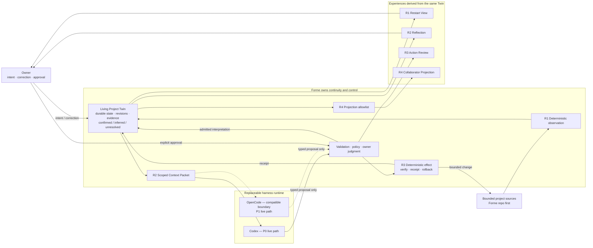

# Owner technical cockpit

- Updated: 2026-07-18
- Active gate: **R1 — Technical Review; owner experience acceptance pending**
- Active issue: [#49 — Continuity: one project to a durable restart view](https://github.com/formehq/forme/issues/49)
- P0 implementation: **R1 walking skeleton implemented; R2–R5 not started**
- First real workspace: **Forme repo — owner confirmed**
- Next action: owner runs the restart demo and accepts or challenges the R1 experience

This is the owner's single re-entry page. Read it before implementation details. It should answer, in a few minutes: what Forme is, where the build is, what truth is durable, what an agent may see or change, and what the owner must decide next.

## Product claim

The August MVP is one Living Project Twin for one real project:

> It remembers where the project is, notices what it is becoming, acts once within explicit and reversible trust, and produces one controlled collaborator projection.

The four required effects are **Continuity, Cognition, Bounded Agency, and Controlled Presence**. They are one causal story built on one Twin, not four disconnected features.

## You are here

```text
R0 Shared understanding   ✓ COMPLETE
  ↓
R1 Continuity             ← YOU ARE HERE · TECHNICAL REVIEW · OWNER DEMO NEXT
  ↓
R2 Cognition              Codex Reflection → correction → invalidation
  ↓
R3 Bounded Agency         approved effect → receipt → rollback
  ↓
R4 Controlled Presence    allowlist → static collaborator projection
  ↓
R5 Demo hardening         clean run → privacy → recovery → rehearsal
```

Current truth:

- the new `main` intentionally has no product implementation;
- the previous implementation is preserved in the archive as evidence and a parts library;
- archived code is not the default architecture and is not reused without an explicit contract;
- #47 tracks the whole MVP; #48 records the completed R0 Control Packet;
- #49 contains the owner-approved R1 contract and implementation evidence;
- the deterministic walking skeleton exists without Codex, OpenCode, source-write, network, or server authority;
- R1 is not Done until the owner experiences the real restart flow and accepts the boundary.

## System map



### How to read the map

- **Sources** say what happened in files; they remain authoritative for their own content.
- **The Twin** is Forme's durable, versioned understanding of the project. It is not a chat transcript, runtime session, file copy, or summary page.
- **Codex and OpenCode** are replaceable cognition runtimes. They receive scoped context and return proposals; they do not own the Twin or write canonical state directly.
- **The gate and executor** keep interpretation probabilistic but effects deterministic, authorized, inspectable, and reversible where feasible.
- **Surfaces** are views of one Twin. They must not create private parallel truths.

## Owner architecture checksum

The owner has decision-grade technical understanding of a slice when these five questions have clear answers:

1. **Input:** What enters Forme?
2. **Durability:** What becomes durable, and where does it live?
3. **Visibility:** What can Codex or OpenCode see?
4. **Authority:** What may an agent change, and who approves it?
5. **Recovery:** After interruption, failure, or a wrong interpretation, what survives and how is it corrected or reversed?

If these cannot be answered in roughly five minutes, implementation pauses and this cockpit or the active Control Packet must be repaired.

## Active Control Packet — R1 walking skeleton

- Status: **implemented and technically verified on 2026-07-18; owner acceptance pending**

### User outcome

After connecting the Forme repo, the owner can leave, restart the process, and recover a human-readable view of the project's current intent and observed change without reconstructing context from a chat session.

### Proposed first flow

```text
Forme repo
  → explicit source root and exclusions
  → deterministic bounded observation
  → durable Project Twin revision
  → Markdown Restart View
  → one source change
  → next meaningful revision
  → process stop and restart
  → reconstruct the same current view
```

### Five-question contract

| Question | R1 proposal |
|---|---|
| What enters? | One explicitly selected workspace: the Forme repo. Observation follows an explicit root and exclusions; no vault-wide discovery and no symlink escape. |
| What becomes durable? | A validated workspace contract, immutable Twin revisions, an atomic `HEAD` pointer, evidence metadata/provenance, and the minimum owner frame needed to reconstruct the view. Source bodies are not copied into the Twin. |
| What can the runtime see? | R1 uses no Codex or OpenCode reasoning. The first live Codex context begins in R2 through a scoped Context Packet. |
| What may the agent change? | R1 observation is read-only toward project sources. Deterministic Forme code may create or update only the approved, project-local state and generated view. |
| How does recovery work? | Canonical state survives process and runtime loss. A no-op observation does not create a new revision. Interrupted writes must not replace the last valid state; restart reconstructs from the last valid revision. |

### Accepted implementation boundary

- one root TypeScript / Node 24 npm package;
- JSON Schema validation through Ajv, with no other R1 runtime dependency;
- project-local, Git-ignored `.forme/` state;
- validated workspace contract, immutable full revisions, atomic `HEAD`, and idempotent pending-transition recovery;
- generated Markdown owner view that is reconstructible and non-canonical;
- explicit Forme repo source allowlist only, with no ambient extension-based discovery;
- selective port of named archive safety algorithms and tests, never the old schema, state layout, or broader modules.

### Five-minute owner demo

1. Start from a clean Forme repo checkout and connect it with explicit boundaries.
2. Enter or confirm the project's Active Intent.
3. Run observation and open revision 1 of the Restart View.
4. Make one meaningful allowed source change and run observation again.
5. Confirm revision 2 explains the observed change; run a no-op refresh and confirm it creates no revision.
6. Stop the process, discard runtime/session context, restart, and reconstruct the same current view from durable state.
7. Confirm the project source was never modified by the observation path.

### Technical evidence

- `npm run check` type-checks the package and runs deterministic tests.
- Boundary tests reject parent traversal, skip symlinks, and keep out-of-allowlist canaries absent from state.
- Continuity tests prove initial, changed, deleted, owner-frame, no-op, and byte-for-byte Markdown reconstruction behavior.
- Recovery tests interrupt the pending, revision, `HEAD`, and view boundaries and resume each transition exactly once.
- The real Forme repo has completed revision 1 → revision 2 → no-op → deleted-view reconstruction using the approved allowlist.

### Owner decisions

Confirmed:

- **First real workspace:** use the Forme repo.
- **Runtime boundary:** keep R1 fully deterministic and introduce the first real Codex path only in R2.
- **Persistence boundary:** use project-local, Git-ignored durable state. R1 durability covers process and runtime loss, not project-directory or machine loss.
- **First surface:** use a generated Markdown Restart View. It is a rendering of the Twin, never canonical state.
- **Toolchain:** use one TypeScript / Node 24 npm package, with Ajv for persisted JSON Schema validation and no other R1 runtime dependency.
- **State contract:** use `.forme/` with an owner workspace contract, immutable full revisions, atomic `HEAD`, reconstructible Markdown, and pending-transition recovery.
- **Source scope:** observe only the explicit Forme repo allowlist recorded in #49; do not scan the rest of the repo by extension or discovery.
- **Archive reuse:** port only the named safety algorithms and tests; do not copy the old schema, `98_Forme/` layout, or broader modules.

These choices make R1 ready to build. Exact command spelling, internal function names, and non-foundational implementation details remain within the agent's approved implementation authority. Any expansion of state, source scope, dependencies, runtime visibility, or permissions returns to an owner stop gate.

## Owner–agent working agreement

| Responsibility | Owner | Agent |
|---|---|---|
| Product meaning, trust, privacy, scope, public behavior | decides | explains options and recommends |
| Durable state, schemas, permissions, runtime visibility | confirms before implementation | proposes a bounded contract and stops at the gate |
| Implementation inside an approved contract | need not review every function | may proceed autonomously with tests and evidence |
| User experience acceptance | experiences, challenges, accepts | supplies a runnable demo and explains the map delta |
| Architecture drift | decides whether the contract changes | must expose drift; never rewrites intent to match code silently |

The operating loop is:

```text
owner defines meaning and boundaries
  → agent proposes a Control Packet with a recommendation
  → owner confirms architecture-changing choices
  → agent builds one demonstrable outcome
  → checks and demo provide technical evidence
  → owner experiences and accepts
  → cockpit records what changed in the shared system model
```

Passing checks moves a slice to **Technical Review**. A P0 slice becomes **Done** only after the owner can experience the behavior and retain the important technical model.

## Stop-the-line boundaries

Implementation returns to the owner before it:

- creates or changes persistent state or a schema;
- broadens file, shell, network, messaging, or publish authority;
- changes what Codex or OpenCode may observe or execute;
- changes privacy, projection audience, or a trust boundary;
- adds a foundational dependency or deployment topology;
- changes P0/P1/P2 scope, dates, or public behavior;
- makes code, a runtime transcript, or a surface into a new source of truth.

## Re-entry and reporting protocol

Every core implementation update reports the same eight items:

1. user-visible outcome;
2. current roadmap gate;
3. map delta — which system box or connection changed;
4. durable-state delta;
5. visibility and authority delta;
6. validation and five-minute demo path;
7. what the owner should challenge or decide;
8. whether the shared architecture model changed.

If a change is only an internal refactor, the report says explicitly: **no owner-visible architecture change**.

## Detailed references

- [`PRODUCT.md`](./PRODUCT.md) — product vision, constitutional floor, and Demo Day acceptance story
- [`ROADMAP.md`](./ROADMAP.md) — R0–R5 schedule, dependencies, and cut rules
- [`ARCHITECTURE.md`](./ARCHITECTURE.md) — durable boundaries between Forme and agent runtimes
- [`DECISIONS.md`](./DECISIONS.md) — confirmed product, date, scope, and architecture decisions
- [GitHub milestone #11](https://github.com/formehq/forme/milestone/11) — execution deadline
- [GitHub epic #47](https://github.com/formehq/forme/issues/47) — complete P0 and P1 issue map
