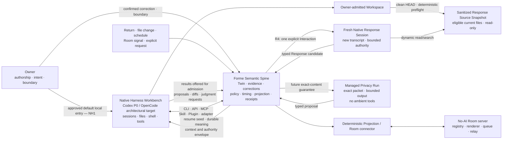

# Native Harness architecture contract v0.4

## 60 秒 Owner 摘要

这两个问题已经按推荐关闭：

1. **NH1：你平时坐在哪个工作台里？** 默认继续直接使用成熟 Harness：
   Codex 是 P0 workbench，OpenCode 是 first-class architectural
   compatibility target、live path 属于 P1；
   Forme 作为它的长期语义与控制层，MVP 不另造一套本地聊天/Agent UI。
2. **NH2：哪些动作算带着 Forme 的印章？** Owner 直接要求的普通
   workspace 工作交给 Harness 原生完成；一旦要改变 Twin 正式意义、代表
   Owner、使用 Forme delegation，或声称 Forme 的 verification/receipt/
   rollback 保证，就必须经过 Forme contract。

NH1/NH2 确认了产品与架构关系；2026-08-03 批准的 T3 又固定了第一条
Response 未来必须怎样进入一个全新、不继承当前聊天、只读 sanitized
current Forme source snapshot 的 Native session，以及它的 consent、session
budget、physical isolation 和 session lifecycle。同日批准的 T4 又固定了
public / unlist / stale / revoke 对 Projection、Interaction、Response 与
session authority 的影响。它们仍不是批准某个 Codex session 现在读取
文件、运行 shell、使用 tools、看到 Guest 内容、操作 Room、调用 provider
或开始实现。完整 T5 也已批准：standard Agent workflow 显式 sync、可选
notification-only email、四档 Owner-selected continuation、30-day
Interaction / 7-day Response / 7-day isolated candidate ceilings，以及
session-root cleanup、删除与 offline reconciliation 规则都已固定。随后
Control Packet v0.2 已完成重写、独立审计、exact hash 与 Owner 批准；它最初
授权的 Gate A repository-only 工作以及后续有边界的 Gate B/Host 尝试现在都
属于历史证据。#67 Durable Public Core Construction Packet/Review 与 Addendum A
已由 Owner 精确批准；repository-only application 与 durable persistence
Construction 已在 Stage-A `bcd4259` 达到 Technical Review Green。Vault、
transport、traffic、Gate C、部署与真实访客作用仍需后续精确 Gate。

## Why this clarification exists

The Highest Vision began with a mature Agent Harness as the operational body:
sessions, files, shell, tools, Skills, MCP, plugins, subagents, permissions,
diffs, and runtime events. Forme was meant to give that body continuity,
durable meaning, correction, agency boundaries, receipts, and projection.

The one-month MVP formalization then narrowed each cognition pass to a scoped
Context Packet and deterministic Forme effects. R2 and R3 implemented an even
narrower packet-only, zero-tool Codex path to prove provider visibility,
correction, semantic admission, exact authorization, recovery, and rollback.
Those proofs are valid, but the narrow run was never meant to become the whole
theory of a Forme Agent.

The Owner confirmed this correction on 2026-07-28:

> Native Harness Workbench, Forme Semantic Spine, and Managed Privacy Run are
> distinct architectural roles. Packet-only/no-tools is one controlled run
> profile, not the permanent shape of Forme or of Codex/OpenCode.

`Native Harness Mode` is a new name for a shape strongly present in the
historical vision. The archive did not finish or approve it as the default
product carrier; NH1/NH2 closed that gap prospectively on 2026-07-29 rather
than pretending it had always been settled.

## One-sentence model

> **Harness-native, Twin-governed:** Codex or OpenCode supplies the mature
> operational workbench; Forme supplies the durable semantic spine and human
> boundary. R4 P0 uses one Fresh Native Response Session inside a disclosed,
> read-only source/capability envelope; an exact packet-only run remains a
> future option when stronger content minimization is required.

### Active Demo-critical Core exception

The Owner approved the exact 2026-08-07 Correction Scope Decision Brief at
`sha256:c20e987cfb7ff7cc2b73c1d13584a8d7955bd5c3407369bed3a98ce37700f86f`.
It preserves the Full Native Harness architecture while narrowing the active
MVP physical claim:

- the real Codex Retry first runs a separate zero-call diagnostic profile. A
  clean result proves only safe staging, initialize-only wire containment and
  cleanup; it remains Yellow/manual-only and does not prove the Fresh Session
  provider/tool boundary;
- the later synthetic First Provider Test, if separately approved, uses a new
  transient candidate path. Forme intentionally persists zero candidate-body
  bytes; process exit, cancel, expiry, crash or restart discards it. Persistent
  candidate recovery, later/offline review, edit/replacement, Data Protection
  Keychain/access group and production signing remain outside the current
  R4/R5 scope as future Full-target work; and
- the controlling Desktop Agent is a disclosed procedural boundary. The child
  must be kernel constrained, but no claim is made that the current Agent
  process itself is kernel-sandboxed.

This exception supersedes the persistent-candidate part of the T3/T5 MVP proof
only; it does not rewrite the approved Full contract or loosen the exact Owner
publication gate, no-retry/no-fallback rule, provider budget or Room connector
boundary. Scope approval authorized the exact Correction Packet preparation
only, not Construction, Retry Execution or a First Provider Call.

### Current #68 physical no-provider preflight

The current Technical Review slice now proves the first candidate lane up to,
but not through, provider dispatch. A staged, exact-hash `codex-cli 0.145.0`
native app-server starts one new thread and one turn inside a staged macOS
Seatbelt profile. The child has no workspace, sibling-root, connector, shell,
plugin, MCP, browser, subagent or external-network path; its only network
destination is one exact localhost capture broker. The synthetic sanitized
snapshot and typed orientation travel over the controller pipe, not through a
readable workspace root.

The observed pinned client currently declares one unavoidable `update_plan`
tool and does not emit an upstream `max_output_tokens` ceiling. The broker
therefore validates that exact client shape and rebuilds a new provider-visible
request rather than forwarding or mutating it. The sealed future envelope is
OpenAI Responses / `gpt-5.6-sol` / medium reasoning / zero tools / at most
32,000 input tokens / 1,024 output tokens / one dispatch / 600 seconds /
US$0.20 maximum. The complete provider-visible JSON is only 2,600 UTF-8 bytes
in this synthetic preflight; the byte ceiling conservatively bounds tokenized
input. At the current documented price of US$5/M input and US$30/M output, the
declared ceiling has a US$0.19072 theoretical worst case. Pricing must be
reverified at the real-call gate against the official
[model documentation](https://developers.openai.com/api/docs/models/gpt-5.6-sol).

The next local-only seam relays one synthetic Responses SSE through the same
loopback broker. The provider-side gate accepts only one completed response,
one structured `responseText`, no tool output, usage inside the declared token
and spend ceilings, and the exact pinned model. The Codex app-server then
completes the original Turn and emits exactly one candidate message. Two
physical executions returned the same body-free result and cleaned the captured
request, synthetic Provider body, child process group and temporary root.

A dormant one-shot HTTPS transport is fixed to
`api.openai.com/v1/responses`, follows no redirect, performs no automatic
retry, requires the sealed request hash and accepts only a successful
`text/event-stream`. It has not been invoked or given a credential. The
preflight and synthetic round trip therefore remain zero-Provider Technical
Review evidence; neither authorizes the first real call. The Owner must still
approve the exact source/provider/capability envelope and judge the transient
candidate.

## Confirmed role separation

### Owner

The Owner keeps final authorship and establishes or widens source, provider,
audience, representation, consequence, and authority boundaries.

### Native Harness Workbench

Codex or OpenCode owns commodity Agent mechanics: model/provider invocation,
interactive sessions, planning, compaction, streaming, cancellation, native
files and shell, tools, MCP, Skills, plugins, subagents, permissions, diffs,
and runtime events.

The existence of a native capability does not grant it to every session or
Forme pass. Exact availability remains governed by a separately admitted
runtime profile and Owner source/provider/capability envelope.

### Forme Semantic Spine

Forme owns the state and contracts that must survive any runtime, model, or
session:

- Twin identity, intent, current state, and revision history;
- evidence, provenance, confirmed/inferred/unresolved status;
- Owner corrections and dependent-output invalidation;
- context and proposal admission;
- agency envelopes and human-boundary checks;
- product-level receipts, recovery, and rollback lineage;
- projection basis, audience, version, freshness, and revocation;
- trigger, stewardship, and timing state when those mechanisms are admitted.

Runtime transcripts and native session state remain disposable computation.

### Managed Privacy Run

A Managed Privacy Run is a special Forme-controlled invocation whose complete
**Forme-selected Owner/Guest/workspace content** is named by an exact packet and
whose runtime profile excludes ambient workspace access and tools. The runtime
or provider request may still add required system instructions, output schema,
and operational metadata; the product must not claim that every provider
request byte equals the packet. R2/R3 prove narrow versions of this lane. It
is no longer the R4 P0 response
recommendation; it remains a P1/future option for sensitive sources or a
strong exact-Forme-selected-content guarantee. R4 P0 has no trust-tier picker.

### Deterministic connector and no-AI server

The local connector holds exact Room credentials and performs only admitted
typed operations. Hosted Forme owns shared management, status, registry,
rendering, queue, relay, and receipts; it does not own the private Twin or run
an answering model.

Native Workspace access must not become physical Guest-inbox access by storage
accident. Once imported at the Owner-local edge, body-bearing Guest input and
private drafts live outside the ordinary Native Workspace read surface or
behind an equivalent enforceable deny boundary. This does not deny the hosted
server's T1/T2/T5 ownership of the original Guest submission. Ordinary
Workbench sessions receive only opaque IDs and body-free status. One explicit
Owner `Prepare response` action may release one exact request only to its new
Fresh Native Response Session under the T3 envelope; that session cannot
browse the Guest store or other Interactions. Exact storage/enforcement layout
remains a Control Packet decision after T3 approval.

## Two invocation directions

The architecture must support both directions even if the MVP implements only
the smallest useful part of each:

1. **Interactive Native entry:** the Owner opens Codex/OpenCode in an admitted
   Workspace; the Harness calls Forme through CLI/API/MCP/Skill/Plugin surfaces
   for restart context, Twin state, correction, authorization, receipts,
   projection, and Room operations.
2. **Triggered Forme entry:** a return boundary, explicit command, admitted
   event, schedule, threshold, or Room signal causes Forme to start or wake a
   suitable Harness run with an exact context and capability envelope.

This is the long-term architecture menu, not a P0 parity list. The current MVP proves
only one minimum Codex-facing interactive path needed by the walking slice; it
does not require every adapter surface, the triggered direction, or a live
OpenCode path.

Both directions return to the same Twin and human boundary. They must not
create parallel canonical truth.

## Two context contracts

### Native Workspace Session

This is the Owner-approved default daily-work architecture under NH1:

- the Owner admits an exact Workspace/source zone, provider, and capability
  envelope;
- Forme supplies a restart/orientation seed, current durable meaning,
  corrections, unresolved state, and boundary metadata;
- the Harness may dynamically inspect material covered by that envelope;
- Forme records the visibility class honestly and does not claim an exact
  content manifest for the Harness's dynamic Workspace reads;
- runtime observations and diffs remain outside Forme until a separately
  approved source/observation contract offers and admits them as evidence;
  they are never automatically admitted Twin meaning.

Here the Context Compiler primarily supplies orientation, relevance, durable
meaning, and policy. It is not necessarily the complete runtime read surface.

### Fresh Native Response Session — Owner-approved R4 P0 contract

This is a constrained, disposable profile of Native Workspace Session rather
than a third general workbench:

- one exact Interaction starts one brand-new, non-resumed transcript after an
  explicit Owner `Prepare response` action;
- Forme injects the exact request, origin Room/Projection, versioned response
  instruction, and a size-bounded, body/path-free typed current Twin
  orientation/correction summary;
- the Harness may dynamically read/search only a deterministic sanitized
  read-only snapshot of current eligible Forme files; P0 exposes no Git
  history. It receives no other Interaction, Guest store,
  sibling workspace, secret environment, writer, Web/network tool, MCP,
  plugin, subagent, connector credential, Room tool, or publish authority;
- a neutral cwd plus deny-by-default OS/container sandbox exposes only that
  snapshot to model-generated read/search commands. `AGENTS.md`, `.codex`,
  `.git`, secrets, symlinks/submodules and runtime auth are outside the mount;
  if exact-root read isolation cannot be proven, the AI path fails closed;
- Forme records a source/provider/capability **Session Envelope**, not an exact
  provider-visible byte manifest or complete file-read claim;
- output is an untrusted typed Response candidate, still bound to current
  basis and exact Owner publication approval before the T2 connector may
  transport it;
- the session is never reused across Guests or Interactions and terminates on
  its bounded budget, approval, abandonment, or terminal lifecycle event.

The Owner selected this direction on 2026-08-01 and approved the complete
recommended T3 contract on 2026-08-03. Its consent, clean-HEAD sanitized source
snapshot, OpenAI provider transport exception, budget, isolation, output gate,
and session termination rules are now authoritative constraints on a future
implementation. The subsequently Owner-approved T5 contract supplies the
durable retention, purge, cleanup, notification, and offline-reconciliation
constraints to the reconciled Packet. No operational capability or
implementation authority was granted by T3/T5 alone. The later exact Packet
approval grants only Gate A repository interfaces and offline validation; a
real provider-backed Fresh Session remains behind Gate B.

### Managed Privacy Run

This is the strong-minimization contract already proven in narrow R2/R3 form:

- Forme compiles one exact material manifest and packet;
- the packet is the complete manifest of Forme-selected
  Owner/Guest/workspace content; required system instructions, schema, and
  runtime/provider metadata remain separately disclosed;
- the run receives no ambient Workspace or Room mutation tools;
- output is schema-constrained and has no canonical or external authority;
- Forme validates it before any admission or effect.

Any model used to choose material before the manifest has already received
content and must be disclosed as an earlier provider-visible step; it cannot be
described as deterministic pre-processing.

## How Highest Vision mechanisms use a Native Harness

| Forme mechanism | Native Harness relationship | Durable Forme responsibility |
|---|---|---|
| **Continuity** | start or resume with current context, then inspect the admitted Workspace as needed | retain intent, open loops, change, decisions, and restart state across sessions and runtimes |
| **Cognition** | run Reflection, Judgment, or Incubation as Roles, Skills, subagents, or bounded passes | admit evidence-backed inference, uncertainty, correction, supersession, and invalidation |
| **Agency** | use native interaction and tool surfaces within an exact capability profile | decide human-boundary crossings and preserve authority, effect, verification, and receipt lineage |
| **Stewardship** | use mature file, shell, search, and tool mechanics for admitted maintenance | retain drift, lifecycle, policy, budgets, no-op results, and product-level receipts |
| **Timing** | execute when explicitly invoked or awakened by an admitted trigger | retain triggers, budgets, intervention history, and whether the moment justifies attention |
| **Projection** | help select, explain, or draft an external view | own allowed basis, audience, attribution, version, freshness, publish, and revoke authority |
| **Presence** | receive a local Room signal and reason at the private edge | keep server AI-free and control exact Response/Projection egress through the connector |

Specialized cognitive agents remain roles or passes around one Twin, not
independent selves with separate truth or effect authority.

## Authority vocabulary

The phrase `canonical write` has hidden two different objects and must be made
explicit:

1. **Workspace source-of-truth artifact:** code, documents, plans, or other
   files that the project itself treats as authoritative.
2. **Forme-authoritative state/effect:** Twin meaning, Owner correction,
   agency envelope, projection scope, human-attributed publication or
   commitment, and any effect for which Forme claims exact authorization,
   recovery, rollback, or receipt guarantees.

NH2 establishes a two-class boundary: ordinary Owner-directed native Workspace
work may proceed only inside a separately admitted Harness envelope. Its
results may later be offered and admitted as evidence under a separately
approved source/observation contract; neither the activity nor its output
automatically becomes Forme meaning or a Forme-authoritative effect. For the
MVP, implemented Forme-authoritative writes continue to use deterministic,
authorized, inspectable effectors. Later physical execution may reuse
Harness-native tools inside a separately approved Forme envelope, while the
canonical semantic transition remains Forme-owned. Nothing in NH2 grants a
generic writer or a concrete runtime envelope.

## Preservation of R1–R4

- **R1** remains the first deterministic Continuity substrate.
- **R2** remains the evidence, inference, correction, and invalidation proof.
- **R3** remains the first Forme-authoritative deterministic effect and
  receipt/rollback proof.
- The packet-only Codex adapter remains useful as the first Managed Privacy
  Run; it should not grow into a home-built general Harness. It remains an
  R2/R3 proof and P1/future sensitive lane, not the R4 P0 response path.
- **R4 T2** remains the exact Room Operator/connector envelope.
- **R4 T3** now formalizes the selected Fresh Native Response Session direction
  without reopening NH1/NH2. Its exact contract is Owner-approved as a future
  implementation constraint, not as operational or implementation authority.

This clarification changes the global map, not the acceptance evidence of
completed slices.

## NH1 — What is the default local Forme experience? — approved

### Question

Does the Owner primarily work inside a mature Codex/OpenCode experience with
Forme installed as its durable semantic/control layer, or primarily inside a
Forme-owned local Agent surface that invokes those runtimes as workers?

### Options

1. **Native Harness Workbench first — recommended.** Codex is the first P0
   workbench and OpenCode remains a first-class architectural compatibility
   target whose live path is P1. Forme appears through
   CLI/API/MCP/Skill/Plugin/adapter surfaces and derived Twin views. Forme may
   also start bounded or triggered runs. Do not build a competing local chat
   shell for the MVP. These surfaces and both invocation directions are an
   architecture menu; P0 proves only the minimum Codex-facing path.
2. **Forme surface first.** Build a Forme-owned local conversation/workbench
   that hosts Codex/OpenCode behind it. This gives UI control but risks
   rebuilding mature Harness behavior and increasing schedule scope.
3. **Keep the carrier undefined.** Continue using isolated commands and
   generated reports. This avoids a new commitment but leaves the central
   product relationship ambiguous.

### Recommended effect

The first option makes the mature Harness the operational body while keeping
Forme's distinct value in continuity, meaning, authority, and presence. It also
matches the approved R4 pattern: Web is a GitHub-like control plane while
Agents use shared CLI/API contracts.

The Owner approved option 1 on 2026-07-29. This chooses the primary local
carrier. It does not itself grant files, shell, tools, provider visibility, or
implementation authority. CLI/API/MCP/Skill/Plugin/adapter are long-term
integration surface families, not a P0 parity requirement: the current MVP needs only
one minimum Codex-facing proof, while a live OpenCode path remains P1.

## NH2 — What is ordinary Workspace work versus a Forme-authoritative effect? — approved

### Question

When the Native Harness edits a file, runs a command, or uses a tool inside an
Owner-admitted Workspace, when is that ordinary Harness work and when does
Forme claim semantic authority, authorization, recovery, and receipt
guarantees?

### Options

1. **Two-class P0 boundary — recommended.**
   - Ordinary Owner/Harness Workspace work remains governed by the Harness's
     native permissions. Its result may be offered and admitted as evidence
     only under a separately approved source/observation contract; the
     activity does not automatically become Twin meaning or a
     Forme-authoritative action.
   - Changing Twin meaning/correction, agency envelopes, Projection/Response
     scope, human-attributed publication/commitment, or claiming Forme
     receipt/rollback guarantees still requires a typed Forme
     proposal/gate/effect path.
   - For the MVP, admitted Forme-authoritative effects keep the current narrow
     deterministic effectors. Later, their **physical execution** may reuse
     Harness-native tools inside a standing Forme envelope with independent
     verification and receipts; the canonical semantic transition still
     belongs to Forme.
2. **All Forme Workspace writes use typed effectors.** This preserves the
   strongest current deterministic boundary but makes the Native Workbench less
   native and risks recreating generic file/tool machinery.
3. **Native-first, adopt after the fact.** Let the Harness perform ordinary and
   delegated work, then let Forme observe or label the result later. This is
   simple, but it lets execution bypass base revision, semantic authority,
   representation, verification, and failure guarantees before Forme sees it.

### Recommended effect

Use option 1 for the current MVP. It preserves the existing R3 guarantee for
actions that Forme claims as its own while allowing the Owner to use a mature
Harness normally. The later Harness-native physical-execution path inside
option 1 still requires its own implementation/evaluation gate after native
runtime diffs, hooks, recovery, and receipts are evaluated.

The Owner approved option 1 on 2026-07-29. This defines semantic
classification. It does not grant any specific session, path, command,
provider, or external action.
Forme-authoritative also does not mean per-click approval: a separately
approved standing envelope may operate review-by-exception.

## Relationship to approved T3

NH1/NH2 are closed. On 2026-08-01 the Owner selected Fresh Native Response
Session (Option 2B) as the R4 P0 direction. On 2026-08-03 the Owner approved
the complete recommended T3 contract, answering:

> Under which disclosed source/provider/capability Session Envelope may one
> exact Guest request reach a fresh Codex session that dynamically inspects a
> sanitized read-only snapshot of current eligible Forme files, and what
> consent, budget, isolation, approval, and
> lifecycle rules apply?

It must not reuse the Owner's current/saved conversation, expose the whole
Guest inbox, connector credentials, other roots, writers, or Room authority.
It must also not claim an exact provider-visible byte manifest: dynamic reads
are the reason to choose this profile. The former Managed Privacy Response
recommendation remains historical/P1, and P0 does not build a trust-tier
selector.

## Relationship to approved T4

T4 fixes how hosted public lifecycle state constrains the Fresh Native
Response Session without giving the session Room authority:

- Curator unlist ends Third Place discovery and new public knocks, but does
  not cancel an already accepted Interaction or an otherwise-valid Owner
  Grant/GrantOffer;
- stale, superseded, or expired origin requests may still receive one newly
  compiled and Owner-approved Response that clearly discloses the origin
  state;
- a revoked origin may not receive a new Response;
- Projection revoke or Room retirement terminates computational authority and
  invalidates any unpublished candidate; linked published Response bodies are
  hidden by the hosted lifecycle contract;
- T4 says when content becomes unavailable. The separately approved T5
  contract now fixes durable retention ceilings, physical-purge obligations,
  session/candidate cleanup, notification, and asynchronous reconciliation.

These are authoritative constraints for a future implementation. They do not
grant the Harness direct lifecycle inspection, mutation, connector, or publish
capability; those paths still require the separately approved T2 gateway and
the remaining gates.

## Relationship to approved T5

T5 closes the lifecycle questions that T3 and T4 deliberately left open:

- an Agent's standard Room workflow may explicitly invoke typed `room sync`;
  Owner-run sync remains the recovery/diagnostic path, and read-only commands
  never hide a pull or durable write;
- P0 adds no daemon, WebSocket, live chat, or remote local tunnel;
- one exact Interaction may hold a confirmed notification-only email endpoint,
  but email carries no body or reply secret and grants no identity, recovery,
  or Room authority;
- the continuation presets are 24h/1, 3d/2, familiar collaborator 7d/3, and
  Owner-selected trusted collaborator 7d/10. `trusted` is not system-inferred
  and grants no Private Room access by label;
- hosted Interaction/inline Guest Capsule bodies have a 30-day maximum and
  Response bodies a seven-day maximum; an isolated unpublished candidate has
  a seven-day maximum, while body-bearing Fresh Session runtime roots are
  cleaned after normal completion or before a later session after crash;
- known terminal state, deletion, expiry, or invalidation ends visibility and
  cleanup eligibility earlier; offline local copies reconcile on the next
  explicit typed sync;
- actual backup, infrastructure-log, and outbound-email-provider retention
  must be disclosed and approved in the Production Grant before production
  interaction or email is enabled.

T5 therefore governs the Fresh Session's artifact lifecycle without making a
runtime transcript durable Forme meaning and without granting the Workbench,
Fresh Session, or connector any additional capability.

## What this document does not authorize

This clarification authorizes no:

- new Workspace or source visibility;
- provider call or model spend;
- file, shell, tool, MCP, plugin, or subagent capability;
- generic or Forme-authoritative write;
- credential, Room mutation, private Guest content sync, Response, or
  Projection publication;
- schema, migration, implementation, deployment, or public behavior.

Those remain governed by the owner-approved T3/T4/T5 contracts, the
reconciled Technical Control Packet, Schema &
Migration Manifest, and Production Deployment & Provisioning Grant.
