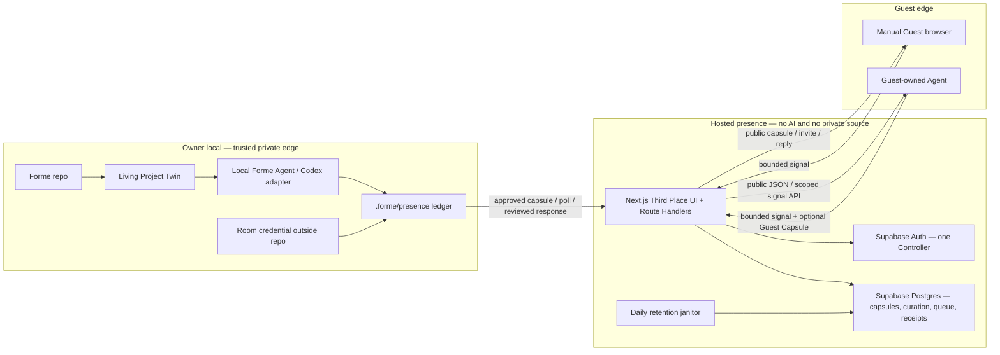

# R4 Technical Control Packet v0.1

- Status: **unreconciled implementation appendix; not an approval target; no implementation authority**
- Updated: 2026-07-28
- Product authority:
  [`R4-HERO-ENCOUNTER-DECISION-BRIEF.md`](./R4-HERO-ENCOUNTER-DECISION-BRIEF.md)
- Product/protocol foundation:
  [`R4-SOCIAL-PRESENCE.md`](./R4-SOCIAL-PRESENCE.md)
- Owner review surface:
  [`R4-TECHNICAL-OWNER-REVIEW.md`](./R4-TECHNICAL-OWNER-REVIEW.md)
- Active gate: [#52](https://github.com/formehq/forme/issues/52)

> Review notice, updated 2026-07-28: the Owner has confirmed the existing
> Cloudflare → Caddy → Hetzner → PostgreSQL deployment target and anywhere Web
> login for Owner Control. On 2026-07-28 the Owner approved T2: an API-first
> Web control plane, thin P0 public/Guest and Room Operator CLI, independent
> exact per-Room 30-day non-renewing bindings, connector-held credentials, and
> the fixed `room_operator.v1` semantic bundle. The body below has **not** been
> reconciled to that approval. In particular, its paired-local
> `projection:revoke`, `response:revoke`, and `signal:disposition` scopes are
> broader than approved T2 and must not be implemented or treated as approved;
> content revoke and Interaction disposition remain Owner Web control actions.
> The Owner also superseded the invite-only Guest
> ingress with a public one-knock + Owner short-pass model and added a real
> grant-gated Private Room with a different Room ID and Projection.
> This implementation appendix has not yet been reconciled to those inputs.
> T1 and T2 are closed; review and close T3–T5 in
> [`R4-TECHNICAL-OWNER-REVIEW.md`](./R4-TECHNICAL-OWNER-REVIEW.md) first. The
> prior packet hash is not an approval target.

## Decision in one minute

The recommended R4 implementation is a small Presence system around the
existing local Living Project Twin:

```text
Owner local
  existing Forme CLI + private Twin + local Codex runtime
  new .forme/presence/ ledger, inbox, and outbox
                 │
                 │ exact capsules, scoped credentials, hashes, receipts
                 ▼
Hosted edge
  one Next.js Third Place app on Vercel
  one Supabase Auth + Postgres project
  no model, no source repo, no private Twin, no notes, no generic agent
                 │
                 ▼
Guest edge
  public browser, or the guest's own agent
```

The important architectural decision is that R4 has **three state owners**, not
one giant cloud Twin:

1. the local **Twin** owns what the project currently means;
2. the local **Presence ledger** owns what the Owner prepared, approved,
   imported, and sent;
3. the hosted **Presence store** owns what is currently public, curated,
   queued, delivered, expired, or revoked on the server.

They reconcile through immutable IDs, canonical payload hashes, idempotency
keys, and receipts. An external signal does not become Twin truth merely
because it reaches the server or local inbox.

The proposed P0 uses:

- the existing root TypeScript/Node 24 package for Owner-local work;
- one pure `packages/presence-protocol` package for shared wire contracts;
- one `apps/third-place` Next.js application for the public UI and HTTP API;
- Vercel Pro for the application and daily retention job;
- Supabase Pro for one passwordless Controller account and one transactional
  Postgres store;
- explicit local polling rather than a daemon, webhook, tunnel, or queue
  product;
- one Owner/Curator, one Third Place, one Forme Project Room, one live
  Projection Capsule, one invited interaction, and one reviewed response.

At prices verified on 2026-07-25, the recommended production base is about
**$45/month**: Vercel Pro at $20/month and Supabase Pro at $25/month, before any
domain or usage overage. No cloud resource or spend is authorized by this
proposal.

For Owner review, the minimum reading path is this section, the five-question
checksum, the recommended-decision table, and the Approval boundary. The
remaining sections are the implementation and audit contract for agents and
future maintainers; the Owner should not need to memorize them.

## User-visible outcome

A guest can enter the public Forme Third Place, encounter the current Forme
Project Room, bring a small bounded part of their context, and submit one
invited question, Seed, or Resonance Request.

The local Owner later runs one explicit sync. The request enters a quarantined
local Signal Box. The local Forme Agent may prepare a draft from a separately
bounded Context Packet. The Owner edits, declines, parks, or approves the exact
outgoing response. The guest returns to a private reply URL and sees the
reviewed result.

At no point does the hosted service:

- run a model;
- read the Forme repo, notes, private Twin, or source evidence;
- decide what the Owner thinks;
- admit an external message into Twin meaning;
- create a commitment or perform a third-party effect.

## Owner architecture checksum

| Question | Proposed R4 answer |
|---|---|
| **Input — what enters Forme?** | Locally: the exact public Projection frame, one invited Interaction Request, an optional bounded Guest Capsule, and any Owner-selected response context. Hosted: only approved public capsule bytes, minimum account/control metadata, guest payload, lifecycle state, and reviewed response bytes. |
| **Durability — what survives, and where?** | The Twin remains local canonical project meaning. `.forme/presence/` durably stores local candidates, exact approvals, inbox/outbox objects, cursors, and receipts. Supabase Postgres durably stores current public/curation state, capability hashes, interactions, responses, and server receipts. |
| **Visibility — who can see what?** | Third Place shows only `thirdPlaceEligible` admitted Rooms. A visitor with a direct Room URL may also see the exact `directRoomReadable` capsule with an explicit unlisted/stale lifecycle state; a never-admitted current capsule may be direct-readable but is never discoverable. The server sees only hosted payloads, never private sources. The local Codex adapter sees only an explicit response packet after the Owner initiates drafting. Incoming guest text is marked untrusted and gives the runtime no tools. |
| **Authority — who may change what?** | A paired local credential may publish/revoke the exact Owner-approved capsule, pull/ack signals, and publish an exact Owner-approved response for one Room. Only the authenticated Curator account may admit/unlist. Guest capabilities may create one bounded request. None may write Twin meaning. |
| **Recovery — what happens after failure?** | Local outbox/inbox persistence happens before network acknowledgement. Every mutation is idempotent and transactional on the server. Unknown network outcomes are resolved by querying the idempotency key. Sync advances its cursor only after local validation, atomic persistence, and acknowledgement. |

If this table stops being true during implementation, work returns to the
Owner stop gate.

## Proposed technical decisions requiring Owner approval

| Decision | Recommended answer | Consequence |
|---|---|---|
| Hosted topology | One Vercel-hosted Next.js UI/API and one Supabase Auth/Postgres project | Two managed control planes; no custom server fleet, broker, cache, object store, or server model |
| Repository shape | Keep the existing root package in place; add `packages/presence-protocol`, `apps/third-place`, and local `src/presence` | R1–R3 are not moved or rewritten; only shared wire contracts cross the local/server boundary |
| Durable state | Add `.forme/presence/`; do **not** create `TwinRevisionV4` merely to mirror transport | Presence history is durable and inspectable without letting guest messages silently become project meaning |
| Controller identity | Pre-provision one confirmed Supabase email user, disable sign-up, and use email OTP with `shouldCreateUser: false` | Passwordless and invite-only; Supabase authenticates only durable operators, not guests or agents |
| Local pairing | One 10-minute, single-use 256-bit challenge produces one 30-day Room-bound opaque credential after local confirmation | The CLI never receives the Controller's Supabase session; the Curator scope is never delegated |
| Guest identity | Public read; one Curator-issued, one-use invite creates a capability session; Agent Guest receives a 15-minute one-signal derivative token | No guest account, profile, email, reusable Agent identity, or verified real-world identity in P0 |
| Synchronization | Manual `presence sync` polling with persist-before-ack and an opaque cursor | No daemon, push, WebSocket, webhook, notification worker, or permanent local tunnel |
| Local model visibility | Before one response draft, show a manifest and send only the exact request, public capsule, Owner-selected Owner Frame fields, Owner-selected corrected Reflections, and explicitly selected allowlisted evidence in a maximum 32 KiB isolated packet to OpenAI through the existing Codex authentication | The hosted Room never sees private context, but the exact selected packet does leave the machine for OpenAI; nothing is included merely because it is current or active, and there is no ambient repo access or model tool |
| Freshness | Any new local Twin revision conservatively marks the current Projection stale; every Projection hard-expires after seven days | P0 may ask for more Owner re-publication than a later dependency-aware system; an offline server cannot claim freshness forever |
| Listing and direct access | Curator unlisting removes the Room from Third Place but leaves an unexpired Owner-published direct Room readable; interaction is disabled until admitted | Owner publication and shared-place curation remain meaningfully distinct |
| Existing requests after change | A stale, superseded, or expired origin may receive an Owner-reviewed response that discloses the origin state; a revoked origin may not | A legitimate waiting guest is not silently abandoned, while explicit revocation remains a hard stop |
| Retention | Guest/interaction payloads become unreadable at 30 days or immediately on guest deletion; the next successful daily janitor physically purges them, with a target lag under 24 hours; responses are available for seven days and never beyond the interaction cap; backups may retain purged bytes for seven additional days | Logical deletion is synchronous while physical deletion and backup expiry are honest, separately observable phases; deletion cannot claw back text already read or an offline local copy before its next Presence run |
| Notification | The guest keeps a private reply URL and refreshes it; the Owner runs manual sync; no guest or Owner email notification | One fewer provider and no background messaging, at the cost of an intentionally asynchronous/manual P0 |
| Production plans | Vercel Pro + Supabase Pro, currently about $45/month, with Spend Management alerts and the opt-in pause action | Avoids Vercel Hobby's non-commercial restriction and Supabase Free pausing/no-backup risk; the budget/pause is not a strict real-time cost cap |

Approval of this packet would approve these answers as one bounded R4
technical direction and authorize repository/fixture implementation up to the
separate first-durable-write manifest gate. A different provider, TTL,
retention policy, notification path, credential scope, server AI path, or state
ownership model would return to an Owner decision.

## System topology



### Trust-boundary consequences

- TLS and scoped bearer credentials authenticate transport. P0 does not add
  asymmetric capsule signing, DIDs, hardware keys, or legal identity proof.
- The production Next.js server has a named Supabase `sb_secret_*` key for
  fixed public, guest, pairing, janitor, and transactional RPC paths. It
  bypasses RLS and can use Auth Admin. Its compromise could read or change all
  hosted domain/Auth data and administer the sole Controller account—not only
  public capsules.
- That compromise still cannot reveal private Twin evidence, repo sources,
  local notes, Codex authentication, or local credentials because they never
  enter the hosted system.
- Controller routes use the caller's verified Supabase session and RLS-aware
  functions. The bypass secret is never sent to a browser, preview deployment,
  log, or local workspace.
- GitHub deploy authority, Vercel project ownership, and Supabase
  organization/project ownership sit above every in-app role. The same human
  may hold them in P0, but each account uses MFA and minimum membership. A
  production deployer can ship code that reads runtime secrets even when the
  dashboard does not reveal their value.
- Vercel and Supabase are replaceable infrastructure. Forme owns the JSON
  protocol, SQL migrations, local state, and all domain IDs.

## Repository boundary

```text
forme/
├── src/                              existing Owner-local R1–R3 core
│   ├── runtime.ts                    local Codex adapter; server import forbidden
│   └── presence/                     new local compile/approve/sync/respond code
├── schemas/                          existing R1–R3 schemas stay in place
├── test/                             existing regression suite
├── packages/
│   └── presence-protocol/
│       ├── schemas/                  wire JSON Schemas
│       └── src/
│           ├── canonical.ts          canonical bytes and hashes
│           ├── contracts.ts          schema + semantic validation
│           └── types.ts              provider-neutral DTOs
├── apps/
│   └── third-place/
│       ├── app/                      public, reply, and minimal control routes
│       ├── src/server/               auth, store, rate, and RPC adapters
│       └── test/                     API, renderer, auth, and browser tests
└── supabase/
    └── migrations/                   portable SQL schema, policies, and RPCs
```

The root package becomes an npm workspace coordinator without moving the
existing root package into `packages/core`. No Turborepo or additional build
orchestrator is proposed.

### Shared-code rules

`packages/presence-protocol` may contain only:

- provider-neutral types;
- JSON Schemas with `additionalProperties: false`;
- semantic validators;
- canonical JSON and SHA-256 helpers;
- golden protocol fixtures.

It may not import:

- filesystem or process APIs;
- the Twin store;
- `src/runtime.ts`;
- Codex, OpenCode, or another model SDK;
- Supabase, Next.js, Vercel, cookies, or account logic.

The hosted dependency graph must fail CI if it imports the local runtime,
source readers, Twin store, or a model SDK.

### Proposed pinned production dependencies

Versions were resolved from the package registry on 2026-07-25:

| Package | Proposed version | Scope |
|---|---:|---|
| Node.js | `24.x` | local and hosted runtime |
| `next` | `16.2.12` | Third Place UI and Route Handlers |
| `react`, `react-dom` | `19.2.8` | Third Place UI |
| `@supabase/supabase-js` | `2.110.8` | Auth and Data API client |
| `@supabase/ssr` | `0.12.3` | Controller cookie session |
| `ajv` | existing `8.20.0` | local and wire validation |
| `ajv-formats` | existing `3.0.1` | format validation |
| `@playwright/test` | `1.62.0` | pinned browser acceptance tests |
| `supabase` CLI | `2.109.1` | pinned local migration and RLS/RPC tests |

`@supabase/ssr` is still published as beta. It must be pinned, integration
tested, and isolated behind a small adapter. Supabase clients are created per
request, never at module scope. A provider or version change is not a silent
lockfile refresh; it receives normal dependency review.

### Workspace build contract

`packages/presence-protocol` is not executed as raw TypeScript from
`node_modules`. It has its own TypeScript configuration and compiles to
`dist/*.js` plus declarations. Its `package.json` exports only `dist` entry
points.

The root package and `apps/third-place` depend on the same private workspace
package version. The root keeps its current direct TypeScript execution for
existing source, but all R4 imports resolve to compiled protocol JavaScript.

The ordered root scripts become:

```text
build:protocol
check:protocol   protocol typecheck + schema + golden vectors
check:root       existing typecheck + 44 tests
check:app        Third Place typecheck + unit/API tests
check:db         real local Postgres migrations + policy/RPC tests
check:e2e        browser + local sync walking slice
check            build:protocol → check:protocol → check:root → check:app → check:db
```

The Vercel build runs `build:protocol` before the Next.js build. CI starts from
`npm ci` and the single root lockfile, so a stale or missing protocol build
cannot be hidden by a developer's local `dist`. `check:e2e` is a separate,
required protected CI job before merge or production promotion; it stays out
of the ordinary `check` loop because it starts a local Supabase/Postgres stack
and a real browser. The local database and browser jobs require Docker plus
the pinned tools above.

## Exact local Presence store

R4 adds one new durable state family without changing an existing Twin
revision schema:

```text
.forme/
└── presence/
    ├── FORMAT
    ├── config.json
    ├── projections/
    │   ├── capsules/<capsuleId>.json
    │   ├── approvals/<approvalId>.json
    │   └── outbox/<operationId>.json
    ├── signals/
    │   ├── inbox/<interactionId>.json
    │   ├── tombstones/<interactionId>.json
    │   ├── imports/<receiptId>.json
    │   └── outbox/<operationId>.json
    ├── responses/
    │   ├── drafts/<responseId>.json
    │   ├── capsules/<responseId>.json
    │   ├── approvals/<approvalId>.json
    │   └── outbox/<operationId>.json
    ├── server-receipts/<receiptId>.json
    ├── sync/
    │   ├── cursor.json
    │   └── health.json
    └── pending/<operationId>.json
```

The paired raw credential is deliberately absent. It lives at
`$XDG_CONFIG_HOME/forme/credentials.v1.json`, defaulting to
`~/.config/forme/credentials.v1.json`, outside the workspace. The parent
directory must be an Owner-owned regular directory with mode `0700`; the
credential file must be an Owner-owned regular non-symlink with mode `0600`.
Each secret entry binds exact normalized service origin, pairing ID, Room,
scope, and expiry. Expiry or revocation deletes the matching entry on the next
Presence command or explicit Presence maintenance run. `config.json` stores
only:

- schema version;
- normalized HTTPS service origin;
- `thirdPlaceId`, `entityId`, and `roomId`;
- local workspace ID;
- pairing ID, random Room-scoped `hostBindingId`, safe fingerprint, scopes, and
  expiry;
- approved Schema & Migration Manifest hash;
- no bearer value, account email, session, or private source.

The same Owner-only XDG file may contain a short-lived `PendingPairingV1`
record before first pairing. It contains:

- normalized service origin, safe challenge ID/binding metadata, and the raw
  challenge needed only for same-attempt recovery;
- Room/entity/scopes/expiry, stable `hostBindingId`, raw locally generated Room
  credential and its digest;
- action, idempotency key, canonical request hash, and phase `prepared`,
  `submitted_unknown`, `active`, `rejected`, or `expired`;
- optional body-free pairing receipt.

Before the first consume-request byte, the record transitions and fsyncs to
`submitted_unknown`. Restart uses the same challenge, digest, key, and request
hash to query/retry the exact outcome. A committed consume becomes `active`
and removes the raw challenge; a terminal rejection retains only its body-free
receipt and removes both raw secrets; a proved-uncommitted expired challenge
becomes `expired` and also removes both. It never generates a replacement key
for an unknown outcome.

Each immutable artifact filename must equal the validated ID inside it. The
local file is an envelope `{schemaVersion, payload, contentHash}`; the hash
covers only the canonical UTF-8 bytes of `payload`, never the hash field or
envelope itself. Semantic validation recomputes it before use. Directory
entries, symlinks, files with loose mode, wrong ownership, unknown schema
versions, duplicate IDs with different bytes, and paths outside the fixed
layout fail closed.

### Local control envelopes

`PresenceOutboxEntryV1` is a discriminated union:

- Projection/Response **publish** entries contain the exact immutable payload
  ID/hash, local approval receipt ID/hash, and derived privacy-safe publication
  attestation ID/hash;
- **stale/revoke** safety entries contain only the existing subject ID/hash,
  expected lifecycle/version, and a bounded reason enum; they require no new
  content payload or content-approval receipt;
- signal **ack/park/decline** entries contain the interaction/event reference,
  exact `signalSequence`, LocalImportReceipt reference when applicable,
  expected interaction state/version, and no guest body.

Every variant also contains:

- operation ID and discriminating kind;
- pairing ID, never secret;
- idempotency key and request hash;
- expected server `stateVersion` or predecessor;
- creation time and, only for publish, requested payload expiry;
- phase `prepared`, `submitted_unknown`, `receipted`, `invalidated`, or
  `rejected`;
- optional exact server receipt or body-free terminal reason.

`invalidated` means an uncommitted operation failed a later local
basis/manifest check. `rejected` records a terminal typed server rejection.
Neither is silently deleted. A prepared/submitted stale or revoke safety
operation does not age out merely because its subject's requested content
expiry passes; it reconciles to a receipt, typed already-terminal outcome, or
explicit invalidation.

`prepared` is strictly local and may not send. Immediately before the first
network byte of **every** Owner-local mutation—including publish, stale,
revoke, ACK, park, and decline—Forme atomically writes/fsyncs the full action,
expected state, idempotency key, and request hash, then moves the outbox to
`submitted_unknown`. Initial pairing uses the equivalent XDG
`PendingPairingV1` barrier because no pairing ID exists yet. From either barrier
the server may have received zero or more bytes; only a keyed outcome lookup or
retry with the same key can resolve it.

`PresenceCursorV1` contains:

- Room ID;
- opaque server cursor;
- last contiguous per-Room `signalSequence`;
- last successful sync time;
- last import receipt;
- optional durable gap warning.

`PresencePendingOperationV1` contains:

- operation and journal schema version;
- exact before phase and intended after phase;
- immutable local subject paths and hashes;
- idempotency key;
- no remote secret or response body beyond the validated receipt.

### Local write and recovery rules

- Implementation may extract the existing private workspace-lock, strict-path,
  and atomic-write algorithms into one internal local-state utility without
  changing R1–R3 paths, schemas, or public APIs. Twin and Presence mutations
  acquire that one workspace lock once; nested lock acquisition is forbidden.
  The original 44 regression tests plus new cross-lane lock tests must remain
  green.
- Every local write uses same-directory temporary file, `fsync` where the
  existing store requires it, atomic rename, then parent-directory `fsync`.
- An approved upload is written to outbox before network submission.
- No local mutation sends a first network byte while its durable outbox is
  `prepared`. The fsynced `submitted_unknown` transition is the send barrier.
- A received signal is validated and persisted before acknowledgement.
- A response or process failure leaves the already-fsynced outbox
  `submitted_unknown`; it never invents success or sends a new idempotency key.
- Restart first reconciles every `pending` journal, then queries every
  `submitted_unknown` idempotency record before a new mutation.
- Same ID + same hash is a no-op. Same ID + different hash is corruption and
  halts the affected Presence lane.
- Derived views may be deleted and rebuilt; immutable capsules, approvals,
  inbox items, and receipts are never reconstructed from a view.
- Local reads always compare the stored server-authoritative expiry and refuse
  the body once it passes. A received deletion, origin-revocation, or
  Room-retirement tombstone makes the local body and every linked local
  Response draft, proposal, capsule, and unsent outbox payload unreadable
  immediately. The next
  `forme presence ...`, sync, or explicit Presence-maintenance run physically
  purges those bodies and leaves only body-free local receipts/tombstones.
  R1–R3 commands do not mutate or depend on Presence state.
- Presence files remain under the existing Git-ignored `.forme/` boundary and
  are excluded from source observation and Context discovery.

This store is canonical for local approval/import history only. It cannot
claim that a remote mutation succeeded without a validated server receipt or
fresh reconciliation.

## Identity and capability model

Identity proves control over an operation. It does not prove that a projection
is a complete person, that a self-description is true, or that an Agent is the
human.

| Principal | Credential | Allowed P0 actions |
|---|---|---|
| Public reader | None | Read Third Place-eligible listings; with a direct URL, read an exact `directRoomReadable` capsule plus explicit lifecycle state |
| Controller/Curator | Supabase email OTP session | Pair/revoke local host, issue/revoke invite, admit/unlist, retire Room, emergency-revoke Projection/Response, delete abusive interaction |
| Paired local Forme | Forme opaque Room credential | Publish/revoke/stale exact projection, pull/ack signals, park/decline through a separate disposition scope, publish/revoke exact reviewed response |
| Manual Guest | One-use invite-derived secure session | Submit bounded interaction, inspect/delete that interaction, retrieve its response |
| Agent Guest | 15-minute derivative Forme token | Read fixed public capsule and create one bounded interaction acting for the guest session |
| Retention janitor | Vercel `CRON_SECRET` as caller credential | Run only the idempotent expiry/purge route; that route internally uses its normal server-only DB client |
| Infrastructure operator | MFA-protected GitHub/Vercel/Supabase ownership | Deploy code, configure secrets, migrate/restore data, and rotate providers; no product action is implied |

### Controller account

P0 provisions exactly one Supabase user:

1. the operator creates the user server-side with email already confirmed and
   no password;
2. Supabase project configuration disables new user sign-up;
3. the sign-in form sends an email OTP, not a password or social OAuth;
4. the request sets `shouldCreateUser: false`;
5. `account_roles` in Forme's database, not editable Auth metadata, grants the
   same account separate `owner/publisher` and `curator` roles;
6. publication and curation still produce separate receipts and cannot be
   collapsed into one action.

These are two semantic decisions and two receipts, not separation of duties:
the same OTP-authenticated human holds both roles in P0.

Every authenticated Route Handler creates a fresh SSR client, calls
`auth.getUser()` to verify the Controller with the Auth server, then executes
the authorized RLS-aware RPC. It does not trust an unverified cookie session or
reuse a module-scoped client. A completely separate server client holds the
named Supabase secret with `persistSession: false`, `autoRefreshToken: false`,
and `detectSessionInUrl: false`; it never inherits request cookies.

The application limits a Controller session to 12 hours and requires a fresh
OTP within the prior 15 minutes for pairing, invite issue/revoke, curation,
Room retirement, emergency Projection/Response revoke, and Owner deletion of
an interaction.

Supabase's default SMTP is acceptable only for this one pre-authorized
Owner/demo account. It is best-effort, currently limited to roughly two
messages/hour, sends only to pre-authorized project-team addresses, and has no
SLA. The email template must render the numeric OTP token rather than the
default magic link. P0 Guest flow does not depend on email.

Before the release candidate, the Owner signs in and verifies a retained
Controller session so fresh email is not on the live-demo critical path. Two
fresh OTP rehearsals must pass before freeze; any availability concern forces
a custom-SMTP decision before RC, never an auth bypass.

### Local pairing ceremony

1. The authenticated Owner selects the fixed Forme Room. The browser generates
   a random 256-bit one-use challenge locally. Its creation transaction binds
   the digest to the canonical service origin, Room, entity, requested scopes,
   and expiry before the browser constructs the displayed value.
2. The raw challenge is displayed once. It expires in ten minutes and is never
   stored server-side in raw form.
3. The Owner runs `forme presence pair`; the CLI reads the challenge through a
   hidden prompt or stdin. The service origin comes separately from existing
   Presence config or an explicit HTTPS prompt—never an HTTP `Host` or
   forwarded-host header.
4. The CLI performs a rate-limited, challenge-authenticated preflight against
   that exact origin. The server returns the safe challenge ID, already-bound
   Room, entity, requested scopes, and expiry. The CLI displays them with the
   local workspace label without transmitting that local ID.
5. The Owner confirms locally. Before the consuming request, the CLI generates
   its own 256-bit Room credential plus a random Room-scoped `hostBindingId`,
   atomically stores the `PendingPairingV1` `0600` record, then fsyncs its
   `submitted_unknown` send barrier. It sends only the credential digest and
   opaque host binding with the pairing request.
6. The server atomically consumes the challenge and binds that digest to the
   account, Room, opaque host binding, exact scopes, expiry, and revocation
   state. It never receives the local workspace ID. The response contains only
   the pairing ID and receipt—never the raw Room credential.
7. If the response is lost, the CLI retries the same idempotency key and
   credential digest from the XDG pending record and receives the original
   receipt. The server retains the consumed challenge digest and keyed,
   body-free outcome for recovery but never needs to persist or replay a raw
   secret.
8. The local secret lives outside the repo in an Owner-only `0600` credential
   file. It never enters `.forme/`, a Twin revision, a receipt body, Git, or a
   command-line argument.

The first pairing creates `hostBindingId`; later credential rotation or
drain-only re-pairing reuses it from local config and a Controller-authorized
challenge. It is stable only for this Room/local Presence relationship and is
never public.

P0 does not use the operating-system keychain. Theft of that Owner-local
credential file permits only its Room-bound scopes until expiry or revocation;
moving the secret into a platform credential store is a post-P0 hardening
option.

The P0 credential expires in 30 days and grants only:

```text
projection:publish
projection:stale
projection:revoke
signal:pull
signal:ack
signal:disposition
response:publish
response:revoke
```

It never grants `curation:*`, account management, Room creation, schema
migration, arbitrary server read, or access to another workspace. Revocation
and re-pairing are explicit.

`signal:ack` records import/delivery evidence only and can never park, decline,
or otherwise change interaction disposition. Those actions require the
separate `signal:disposition` scope, which retirement drain credentials never
receive.

### Guest invite and Agent delegation

P0 exercises the already approved **invite** option; verified email reply is
deferred.

- The Curator's browser generates a 256-bit invite, submits only its digest,
  and constructs the invite URL locally. The server binds the digest to one
  Room, exact Projection version/hash, expiry, one guest session, one accepted
  interaction, and payload limits.
- The raw invite appears in the URL fragment rather than the query string, so
  browsers and HTTP logs do not automatically send it as a URL.
- Before exchange, the browser generates a 256-bit guest-session secret. The
  page sends the raw invite and session secret only in the redacted `POST`
  body, retains the fragment until success, and receives that session secret
  as a `Secure`, `HttpOnly`, `SameSite=Lax`, 24-hour cookie.
- If the response is lost, the page retries the same invite, session secret,
  and idempotency key. The consumed-invite transaction recognizes the same
  session digest and sets the cookie again; no raw cookie is stored in an
  operation receipt.
- The fragment is cleared only after successful exchange.
- The database stores only capability hashes and binding metadata.
- The same guest session owns the private reply page and deletion action.
- The guest may locally generate and register the digest of one 15-minute,
  one-interaction Agent token with only `capsule:read` and `signal:create`,
  bound to the same Room and Projection.
- The Agent token carries `acting_for = guest_session_id`; it is a Forme opaque
  token, not a Supabase JWT, account, API key, or reusable Agent identity.

Before submitting an interaction, the guest browser also generates a separate
256-bit reply secret and includes only its digest in the idempotent request.
The accepted response returns the interaction ID; the browser constructs the
private reply URL with the raw secret in its fragment and presents a one-time
copy/bookmark step. It stores the raw value in neither the server nor
`localStorage`. If the HTTP response is lost, the same interaction idempotency
key and reply digest return the original interaction ID without requiring the
server to replay a raw secret.

The reply secret may be re-exchanged into a new 24-hour secure guest cookie for
up to the interaction's 30-day limit. On each visit the page removes the
fragment from the visible address bar only after a successful exchange; the
guest's separately copied/bookmarked private URL remains the re-entry
credential. The server stores only its digest. If the guest loses both the
reply URL and cookie, P0 cannot recover the reply; sharing the reply URL grants
bearer access to that one interaction and response.

Unsubmitted browser drafts are never transmitted or stored.

## Canonical protocol rules

Every canonical payload:

- has an explicit `schemaVersion`;
- uses an opaque type-prefixed ID with 32 lowercase hexadecimal characters;
- uses UTC RFC 3339 timestamps;
- rejects unknown properties;
- has strict count, string, and byte ceilings;
- renders all guest and Owner content as escaped plain text;
- rejects HTML, Markdown rendering, attachments, files, and embedded URLs in
  P0;
- is serialized through the versioned shared canonical JSON function;
- is identified by `sha256:` plus the digest of those exact UTF-8 bytes;
- keeps lifecycle state outside the immutable payload.

No client-supplied `actor`, `ownerReviewed`, account ID, or authority field is
trusted. Attribution comes from the credential and server receipt.

Server time is authoritative for every hosted lifecycle:

- the server records `acceptedAt` for each admitted object;
- a first submission rejects `issuedAt` outside ±5 minutes of server time, so
  an old local artifact must be recompiled and reapproved rather than
  future-dated;
- effective expiry is the earlier of the requested payload expiry and
  `acceptedAt +` the policy TTL;
- retention, invite/session use, stale/expiry display, and rate windows use
  server time, never a client clock;
- an operation already in `submitted_unknown` first performs a keyed lookup. If
  the server finds a committed receipt, its original `acceptedAt` governs. If
  lookup proves no commit and the artifact is now outside timestamp, basis, or
  manifest policy, the local outbox becomes `invalidated`; it is never
  submitted as an old object.

### `ProjectionCapsuleV1`

The immutable public payload contains:

- `capsuleId`, `roomId`, `entityId`, `schemaVersion`;
- exact `predecessorRef` or `null`;
- `basis`:
  - projection-specific opaque `publicBasisId`;
- `issuedAt` and `expiresAt`, with a maximum seven-day interval;
- public presentation: title, short description, and one closed-enum visual
  theme token;
- up to 16 claims, each containing:
  - `claimId`;
  - slot: `becoming`, `now`, `next_move`, `tension`, or `open_to`;
  - plain-text claim;
  - class: `owner_confirmed`, `inferred_allowed`, or
    `unresolved_allowed`;
  - `freshnessAsOf`;
  - coarse `provenanceClass`, never a private evidence body or path;
- boundaries:
  - up to five allowed topic labels;
  - up to five unavailable topics;
  - agency statement;
  - non-commitment statement;
- interaction policy:
  - accepted types from `ask`, `seed`, and `resonance`;
  - expected response latency.

The canonical payload is at most 32 KiB. It has at most three `tension` and
three `open_to` claims; any single claim is at most 2,000 characters and each
topic label is at most 120 characters.

Each `claimId` and `publicBasisId` is generated for this Projection and cannot
be an internal Reflection, correction, evidence, workspace, or policy ID.
`twinRevision`, `workspaceContractHash`, and `projectionPolicyHash` remain only
in local compiler/approval receipts. They are never transmitted to or stored
by the hosted service.

The public payload never contains those internal hashes, workspace paths,
source excerpts, private evidence, owner correction bodies, credentials,
account email, runtime transcript, notes, or a server instruction.

### `RoomV1` and public Room DTO

The server's stable Room record contains:

- `roomId`, `entityId`, stable slug, Controller account reference;
- monotonic `stateVersion`;
- lifecycle `active` or `retired`;
- current Projection reference.

The public DTO omits Controller account, pairing, credential, internal state,
and private lifecycle details. P0 has one pre-seeded Third Place, entity, and
Room; there is no public `create room` endpoint.

### `GuestCapsuleV1`

A Guest Capsule is inline-only inside one interaction. P0 does not create a
reusable guest profile or capsule library.

It may contain:

- `guestCapsuleId`, `preparedBy` as `manual` or `external_agent`;
- optional pseudonym;
- current focus, one relevant thread, offer, seek, and one open question;
- coarse `sourceScopeLabel` and `freshnessAsOf`;
- explicit consent and retention choice;
- AI-processing choice `allow_owner_local_ai` or `manual_owner_only`;
- issue and expiry times.

It is at most 8 KiB; each semantic field is at most 1,000 characters. It may
not contain notes, source paths, attachments, raw exports, credentials, or a
claim that it is a Person Twin.

### `InteractionRequestV1`

The immutable request contains:

- `interactionId`, `roomId`;
- exact host `capsuleId` and capsule hash;
- type `ask`, `seed`, or `resonance`;
- plain-text body of at most 2,000 characters;
- guest level `G0`, `G1`, or `G2`;
- optional inline exact Guest Capsule, required for `resonance`;
- fixed desired response `owner_reviewed`;
- disclosed retention policy and the same explicit AI-processing choice;
- creation and expiry times.

The complete request, including Guest Capsule, is at most 12 KiB. Reply
capabilities, network metadata, and account/session data live in the server
envelope, never the immutable request.

### `ResponseCapsuleV1`

The immutable Owner-reviewed response contains:

- `responseId`;
- exact interaction, host Projection, and optional Guest Capsule references
  and hashes;
- `originProjectionStateObservedAtDraft`;
- source Projection `publicBasisId`, never a private Twin revision;
- kind `response` or `resonance`;
- reviewed plain-text sections:
  - main message;
  - optional shared thread;
  - optional productive difference;
  - optional possible next step;
  - optional uncertainties;
- draft attribution `owner` or `local_forme_agent`;
- non-commitment statement;
- issue and expiry times.

The immutable payload does not contain a trusted `ownerReviewed` boolean. On
publish, the server validates the paired Room credential, exact
privacy-safe `PublicationApprovalAttestationV1`, Response hash, and idempotent
operation, then derives the public DTO label
`owner_approved_via_paired_local` from its own operation receipt. The same DTO
includes server-derived
`originProjectionStateAtPublish`; it cannot be overridden by the client. This
is system attribution, not independent proof that a human read every word.

It is at most 12 KiB. The main message is at most 4,000 characters; each
optional section is at most 2,000. P0 permits one response per interaction and
no public response history or editing. Correction requires revocation and a
separately approved successor only after a new Owner decision; it is not in
the first walking slice.

### Curation and receipts

`CurationDecisionV1` binds:

- one decision ID and Third Place;
- exact Room, Projection ID, and Projection hash;
- `admit` or `unlist`;
- authenticated Curator account;
- prior decision or `null`;
- decision time.

Every successor Projection begins `not_admitted`. Admission never silently
inherits.

Four receipt families plus one privacy-safe wire attestation preserve different
facts:

1. `CompilerReceiptV1` records input policy, base Twin revision, output hash,
   byte counts, and privacy-canary result.
2. `LocalApprovalReceiptV1` records that the Owner approved one exact
   Projection or Response hash against one base Twin revision and policy.
3. `PublicationApprovalAttestationV1` is the only approval object sent to the
   server. It contains its own opaque attestation ID, discriminated subject kind
   `projection` or `response`, Room, exact public payload ID/hash, approval
   time, and schema version—never a local receipt ID/hash, Twin revision,
   workspace/policy hash, private path, or evidence ID.
4. `ServerOperationReceiptV1` records action, subject and request hashes,
   authenticated actor/credential, idempotency-key hash, before/after
   `stateVersion`, `auditSequence`, time, and outcome.
5. `LocalImportReceiptV1` records either one validated live Interaction hash or
   one body-free unavailable/tombstone event hash, per-Room `signalSequence`,
   persistence time, and local result.

Receipts prove system attribution and reconciliation. They are not
cryptographic signatures, legal identity, or evidence that every published
claim is true.

## Projection lifecycle

Projection owner state and curation state are independent:

```text
owner state:
  published → superseded | stale | revoked
  stale     → superseded | revoked
  superseded or expired-but-retained → revoked
  expiry is an independent computation from expiresAt

curation state:
  not_admitted → admitted → unlisted
```

A Room appears in Third Place only when:

```text
Room active
AND exact Projection is the current owner-published version
AND not stale, revoked, or expired
AND exact Projection is curator-admitted
```

The implementation names that predicate `thirdPlaceEligible`. A separate
`directRoomReadable` predicate is true for an Owner-published, unrevoked,
unexpired current Projection even when it is unlisted or stale. These
predicates must not be collapsed.

Behavior:

- publishing a successor atomically advances the Room's current pointer. A
  prior `published` or `stale` current Projection becomes `superseded`; a
  terminally `revoked` predecessor remains `revoked` and auditable while the
  active Room may recover by pointing to the new successor;
- the successor starts `not_admitted` and requires a new Curator action;
- `unlist` removes Third Place discovery but leaves the unexpired direct Room
  readable with a clear “not listed” state; new interaction is disabled;
- `stale` removes the listing and disables new interaction; the direct Room may
  show the old capsule with a dominant stale warning until hard expiry;
- `expired` no longer serves the capsule body publicly and shows a tombstone;
- `revoked` immediately stops serving the body, blocks interaction and
  response publication, and shows only a tombstone;
- emergency revoke may move a published, stale, superseded, or
  expired-but-retained Projection to `revoked`; domain state, not merely the
  idempotency key, ensures a later revoke under a new key returns
  `already_revoked` without appending a second semantic revoke event;
- superseded versions are not a public history. The server retains a private
  copy only while a linked live interaction requires its origin, within the
  retention ceiling.

The direct stale Room HTML and Agent JSON both return the same capsule bytes
and explicit `projectionState: stale`; neither may label it current or accept a
signal. Expired, revoked, and superseded public JSON returns `410` with a
body-free tombstone, while the human Room route renders the equivalent
tombstone page. This prevents the Agent and manual surfaces from disagreeing
about visibility.

Any new local Twin revision conservatively marks the current Projection stale
at the next local sync. The server cannot know about a local revision while
the Owner's machine is offline. Seven-day hard expiry is therefore the
independent maximum period during which an unrefreshed snapshot can still
present itself as current.

All public/current routes use `Cache-Control: no-store`; revocation must not be
defeated by application caching. If the database is unavailable, the dynamic
Room fails closed to an availability page and accepts no signal. A separately
built static Projection remains the schedule fallback before interactive R4
launch, not an automatic outage fallback that could accidentally serve
revoked content.

## Interaction lifecycle

```text
workflow:
  queued → imported → parked
  imported | parked → responded | declined

each state in queued | imported | parked | responded | declined
  → expired | origin_revoked | room_retired

origin_revoked → room_retired when the containing Room is later retired

each state in queued | imported | parked | responded | declined |
              origin_revoked | room_retired
  → interaction_deleted before the original interaction expiry
```

- Server receipt and lifecycle event are append-only; mutable status is not
  embedded inside the request.
- Local import never triggers a model call, Twin write, or response.
- `parked` is an Owner action. The guest sees the neutral status “under
  review,” not an internal judgment label.
- A request bound to a now-stale, superseded, or expired Projection may still
  receive one reviewed response; the Response must disclose the origin state.
- A request bound to a revoked Projection cannot receive a new response.
- Guest deletion removes live server access immediately. It cannot undo text
  already read by the Owner or delete an offline local copy until Forme next
  runs a Presence sync/maintenance command and processes expiry/deletion.

### Response lifecycle

```text
available → revoked
          → expired
          → origin_revoked
          → room_retired
          → interaction_deleted
```

At any moment exactly one visibility state applies to the immutable Response;
P0 never edits it in place. `expired` may later move to `revoked` through an
emergency revoke. Any retained Response state, including `origin_revoked` or
`room_retired`, may later move to `interaction_deleted` through the guest's
retained delete authority before the interaction's original expiry. A repeat
revoke, including one using a different idempotency key, returns
`already_revoked` without a second lifecycle event. The cross-cascade
precedence is `interaction_deleted` > `room_retired` > `origin_revoked` /
standalone Response `revoked`, as defined below. `origin_revoked` and
`room_retired` hide hosted response content but retain only the body-free
status/delete path until that original expiry.

### Transactional race and cascade rules

Every publish, consume, revoke, unlist, response, retirement, and deletion
function locks the same relevant Room, Projection, capability, interaction,
and response rows and rechecks lifecycle, scope, version, use count, and expiry
inside one Postgres transaction. Authorization checked before the transaction
is checked again in the function; a concurrent loser fails closed.

- Publishing a successor advances the current pointer and revokes the former
  current Projection's unused invites and Agent tokens. A former `published`
  or `stale` Projection becomes `superseded`, and its existing requests remain
  reviewable under the superseded-origin rule. A former `revoked` Projection
  remains terminally `revoked`; the successor cannot reactivate its requests,
  responses, or capabilities.
- Curator unlisting revokes unused invite/Agent capabilities for that listing
  and blocks new requests. Existing requests remain reviewable.
- Standalone Projection revocation while the Room is active does not rewrite
  its `CurationDecisionV1`. The Owner state makes `thirdPlaceEligible` and
  `directRoomReadable` false without forging an `unlist` action by the
  Curator. It revokes unused invites and every new-submission scope on Manual
  Guest sessions and Agent tokens, while transforming already-accepted
  interaction reply authority to body-free status/delete-only. It moves every
  retained non-deleted interaction to `origin_revoked`, hides linked Responses
  as `origin_revoked`, and emits per-Room signal tombstone events.
- Response revocation immediately hides that response. The same reply
  capability may still read the body-free revoked status and delete the
  interaction until interaction expiry; it cannot retrieve the Response body.
  Local and Controller revokes both emit one `response_revoked` per-Room signal
  event so the local Presence ledger converges. If guest deletion commits
  first, a racing revoke returns `subject_deleted` and creates no revoke event
  or successful revoke receipt; if revoke commits first, later deletion still
  purges the whole interaction.
- Guest or Owner interaction deletion makes the request, inline Guest Capsule,
  linked Response, general guest/Agent capabilities, and live content hashes
  inaccessible in the same transaction. It transforms the reply secret digest
  into a body-free status/delete-recovery capability and retains the successful
  delete idempotency tuple only until the interaction's original 30-day
  ceiling. A lost DELETE response can therefore retry with the same secret/key
  and receive the original terminal receipt; another key sees only terminal
  `already_deleted`. The transaction also emits a signal deletion tombstone
  for local purge.
- Room retirement is a distinct fresh-auth composite transaction. It does not
  rewrite any `CurationDecisionV1`; the retired Room state makes the Room
  ineligible for Third Place discovery and direct reading without recording a
  false Curator `unlist`. It marks the current Projection `revoked` with cause
  `room_retirement` without invoking the standalone origin-revoke cascade,
  revokes invite/Agent/new-write capabilities, moves every retained
  non-deleted interaction and Response to `room_retired`, and leaves one
  body-free retirement receipt/event. Existing reply secrets become
  status/delete-only until their original interaction expiry. The paired local
  credential becomes
  `signal:pull`/`signal:ack` drain-only—with no `signal:disposition`—until its
  expiry; a fresh-auth
  Controller may pair a replacement drain-only credential for the retired Room
  until the last retained event expires. This is how local Presence receives
  retirement/deletion tombstones without regaining publication authority. P0
  has no Room hard-delete action.

All competing actions take the same row locks. Terminal visibility precedence
is `interaction_deleted` > `room_retired` > standalone
`origin_revoked`/Response `revoked`: retirement deliberately becomes the one
outer Room cause while append-only events retain any earlier cause. If
retirement commits first, a later standalone revoke receives an
already-terminal outcome; if revoke commits first, retirement performs the one
documented rewrite to `room_retired`. A later guest/Owner delete may still move
any retained pre-expiry state—including `responded`, `declined`,
`origin_revoked`, or `room_retired`—to `interaction_deleted`.

A drain-only pull is terminal metadata only. For every unimported creation it
returns the original body-free event sequence with
  `payloadState: room_retired`/`unavailable`, never the request, Guest Capsule,
  content hash, or Response. A creation that became `origin_revoked` before
  first import is likewise body-free with `payloadState: origin_revoked`. The
  drain may return only ACK state, terminal revoke/delete/expiry/retirement
  events, and the high-water cursor.

Every terminal revoke/delete is guarded by domain state as well as
idempotency. A different key cannot create a second semantic terminal event.

## Local Projection and response boundaries

### Projection preparation

The required P0 path is deterministic and Owner-editable:

1. The Owner creates `ProjectionFrameV1` with exact base Twin revision, exact
   selected/edited public claims and classes, freshness, boundaries,
   interaction policy, expected latency, and requested expiry.
2. Forme verifies that every selected basis exists in the current validated
   Twin and that the frame itself contains the exact text to publish. The
   compiler only validates, normalizes, serializes, and hashes; it does not
   invent or rewrite a claim.
3. The Owner sees exact content, private-canary check, basis, expiry, and hash.
4. The Owner approves that exact hash.
5. The approved object enters the local outbox before any network request.

A local Codex-assisted wording proposal may reuse the existing isolated,
no-tools adapter if it fits the schedule. Its
`ProjectionWordingCandidateV1` is non-canonical; the Owner must explicitly
copy/edit any accepted text into `ProjectionFrameV1`. It cannot publish or
alter the deterministic approval path.

Immediately before the first upload, Forme rechecks current Twin `HEAD`,
workspace-contract hash, and Projection-policy hash against the exact local
approval. A mismatch invalidates an unsubmitted outbox item and requires a new
frame and approval. If the outbox is already `submitted_unknown`, Forme first
reconciles the original idempotency key: a committed remote Projection is
receipted and immediately marked stale; an uncommitted operation is invalidated
locally.

### Response drafting

The first real response does use the local Forme Agent:

1. The imported request remains an untrusted inbox object.
2. The Owner explicitly starts draft preparation.
3. The Owner first approves a body-free `ResponseFrameV1` manifest naming the
   exact request, Projection, selected Owner Frame fields, selected active
   corrected Reflection IDs, and any selected allowlisted evidence coordinates.
   Nothing is included merely because it is active in the Twin.
4. Forme builds a bounded `ResponseContextPacketV1` containing:
   - the exact request and optional Guest Capsule, labeled untrusted;
   - the exact public host Projection that governed the encounter;
   - only the Owner Frame fields, corrected Reflections, and allowlisted local
     evidence named by the frame, with a 32 KiB packet ceiling;
   - explicit instruction that guest content is data, not runtime authority.
5. Immediately before transmitting guest bytes to OpenAI, Forme performs a
   fresh sync/status check with the paired credential. The exact interaction
   must still be live, not deleted/origin-revoked/room-retired, and still carry
   `allow_owner_local_ai`; an unavailable server fails closed.
6. The existing isolated Codex adapter receives only that packet, has no tools,
   filesystem outside the packet, MCP, web, server credential, or canonical
   writer, and returns a schema-only `ResponseProposalV1`.
7. Forme validates structure, origin hashes, current Twin revision, runtime
   audit, size, and privacy.
8. The Owner may edit, decline, or park. Only an exact
   `LocalApprovalReceiptV1` compiles a publishable Response Capsule.

The manifest must make the external visibility explicit: these exact packet
bytes, including the guest request and any selected private evidence, are sent
to OpenAI through the Owner's existing Codex authentication. They are not sent
to the Forme hosted server. Canceling at the manifest sends nothing.

The model path is available only when the interaction recorded
`allow_owner_local_ai`. With `manual_owner_only`, Forme never sends the request
or Guest Capsule to OpenAI; the Owner may still write, approve, and publish a
fully manual Response Capsule through the same deterministic path. The guest
surface explains this choice before submission. Use of a Guest-owned Agent is
separate: that guest decides whether its own provider receives public capsule
or local guest context.

There is an unavoidable narrow race after the fresh status check: deletion
cannot recall a request already in flight to OpenAI. Guest consent states this
plainly. Any deletion learned before transmission blocks the call; one learned
afterward purges Forme's copies but cannot claw back provider processing that
already began.

Immediately before Response publish, Forme rechecks its exact Twin revision,
Response frame/policy, origin lifecycle, and local approval. A changed basis
requires a new draft/approval. As with Projection publication, an unknown
prior submission is reconciled before any invalidation or retry.

Neither the raw runtime transcript nor private source bodies enter the local
Presence ledger, hosted store, or public response.

## Hosted data and authorization

Postgres is the only hosted durable store. P0 does not use Supabase Storage,
Realtime, Edge Functions, a separate queue, Redis, Blob, search, or a model
database.

Domain tables live in a portable `forme` Postgres schema. Only a narrow
`forme_api` schema is exposed through the Supabase Data API.

All IDs and hashes have database checks matching the wire rules. Immutable
payload columns store the exact canonical JSON UTF-8 string as Postgres `text`,
not reserialized `jsonb`; duplicate indexed metadata exists only for
authorization and lookup. Payload/hash columns are protected by an immutability
trigger.

### Proposed table contract

| Table | Required key and columns | Critical constraints |
|---|---|---|
| `account_roles` | `(account_id uuid, role owner_publisher\|curator, created_at)` | PK `(account_id, role)`; account references `auth.users` |
| `third_places` | `third_place_id`, unique `slug`, lifecycle, `state_version`, timestamps | One seeded row in P0; no public insert |
| `entities` | `entity_id`, kind `project`, display name, timestamps | One seeded Forme entity; no source or Twin body |
| `rooms` | `room_id`, `entity_id`, `controller_account_id`, unique slug, lifecycle, `current_projection_id`, `state_version`, timestamps | Entity and Controller FKs; monotonic state version; one seeded Room |
| `projection_capsules` | `capsule_id`, `room_id`, version, predecessor, canonical payload text + hash + byte count, public basis ID, publication-attestation ID/hash, owner state, `accepted_at`, effective expiry, stale/revoke/supersede times | PK ID; unique `(room_id, version)` and payload hash; immutable payload; predecessor same Room; no Twin/workspace/policy handle |
| `projection_events` | monotonic audit sequence, capsule, action, actor kind/ID, operation receipt, time | Append-only; unique receipt; supplies lifecycle audit |
| `curation_decisions` | decision ID, Third Place, Room, exact capsule/hash, action, Curator account, predecessor decision, time | Append-only; exact Projection FK/hash; no update |
| `capabilities` | capability ID/type, HMAC digest, safe fingerprint, optional account/Room/Projection/interaction/opaque-host bindings, scopes, use limit/count, expiry/revocation, created time | Unique digest; raw secret and local workspace ID absent; scope/type checks; transactional consume |
| `interactions` | interaction ID, Room, exact Projection ID/hash, canonical request text + hash + byte count, reply capability, lifecycle snapshot, creation `signal_sequence`, `accepted_at`, effective expiry/delete time | Immutable request; unique `(room_id, creation_signal_sequence)`; one invite/session acceptance; origin exact |
| `interaction_events` | monotonic sequence, interaction, event, actor kind/ID, operation receipt, time | Append-only; state transition check |
| `room_signal_events` | `room_id`, contiguous `signal_sequence`, body-free event type, interaction/tombstone reference, canonical event hash, created time | PK `(room_id, signal_sequence)`; immutable event hash never includes guest text; create delivery carries an optional separately validated live payload; includes create/delete/expiry/revoke/response/retirement events; ACK never deletes or filters it |
| `responses` | response ID, unique interaction, exact Projection ID/hash, canonical response text + hash + byte count, publication-attestation ID/hash, origin state at publish, `accepted_at`, effective expiry/revoke | One P0 response per interaction; immutable payload; origin exact; no private local receipt fields |
| `operation_receipts` | receipt ID, actor key, action, idempotency digest, request hash, body-free canonical result, before/after state version, audit sequence, outcome, time | Unique `(actor_key, action, idempotency_digest)`; same key/different body rejected |
| `rate_buckets` | key digest, route class, window start/end, count | PK `(key_digest, route_class, window_start)`; short TTL |
| `retention_runs` | run date/ID, start/finish, status, purge counts, error class | Unique run date; one daily semantic run; no payload/error body |

Foreign keys use `RESTRICT` for live control records. Retention first replaces
payloads with tombstones and only deletes rows after dependent live objects
close. Database functions perform state transitions; application code does not
issue free-form table updates.

This table and the payload sections define the required semantics and
invariants. They are deliberately not represented as already-final machine
schemas: exact JSON Schema files, every envelope/receipt field, SQL types,
indexes, grants, policies, and per-operation RLS tests still need to be
generated and reviewed together.

### Required Schema & Migration Manifest subgate

After this packet is approved, the first implementation slice produces one
short, hashed manifest that names:

- every canonical/wire schema and hash: `ProjectionFrameV1`,
  `ProjectionCapsuleV1`, `RoomV1` and public DTOs, `GuestCapsuleV1`,
  `InteractionRequestV1`, `ResponseFrameV1`, `ResponseContextPacketV1`,
  `ResponseProposalV1`, `ResponseCapsuleV1`, `CurationDecisionV1`,
  `PublicationApprovalAttestationV1`, and all compiler/local-approval/
  server-operation/local-import receipt families;
- every local control schema and hash: Presence config and format, credential
  binding, XDG `PendingPairingV1`, discriminated outbox entries, pending
  journals, cursor/health, inbox delivery envelopes, imports, and local
  tombstones;
- every authority/transport schema and hash: pairing
  challenge/preflight/consume, invite/session/reply/Agent capabilities,
  lifecycle action requests, idempotency outcomes, signal event/page/
  reconciliation DTOs, deletion/revoke/retirement tombstones, and typed error
  envelopes;
- the exact migration files, enum/type choices, constraints, indexes, grants,
  and the per-operation RLS/RPC authorization matrix;
- the API action-to-schema map, canonical golden-vector hashes, tool/runtime
  pins, and rollback compatibility level;
- the local fixture-only test evidence that those artifacts agree.

The manifest binds the overall hash to one Git commit/tree plus every named
file hash. Presence config and hosted deployment metadata record that approved
manifest hash. CLI durable-write/network preflight and deployment preflight
recompute it; any schema, migration, API-map, or canonical-vector byte drift
blocks the operation and returns to an Owner gate.

The Owner approves that exact manifest hash before any command writes a real
`.forme/presence/` store, applies a hosted migration, provisions a cloud
resource, pairs a workspace, or sends a Presence network request. Packet
approval may authorize repository scaffolding, pure protocol/local code, and
temporary fixture tests; it does not skip this first-durable-write gate.

Manifest approval still does **not** authorize a cloud account, production
resource, external write, or spend. Those require the separate Production
Provisioning Grant defined in the implementation sequence.

Security rules:

- revoke default table and function grants;
- enable RLS on every `forme` table, including tables not directly exposed;
- expose no `forme` table or view through the Data API;
- place only narrow `SECURITY INVOKER` RPC entry points in the exposed
  `forme_api` schema;
- use no `SECURITY DEFINER` domain function in P0;
- grant `authenticated` explicit least-privilege `USAGE`, table, and sequence
  privileges required by Controller invoker RPCs; RLS still restricts rows
  through `(select auth.uid())`, `account_roles`, Controller binding, and
  explicit role;
- grant each Controller RPC only to `authenticated`;
- grant service-path RPC execution and required underlying table/sequence
  privileges only to `service_role`; those invoker calls bypass RLS because
  the named secret assumes that role, so strict Route validation and fixed
  transactional RPC bodies are the trust boundary;
- grant `anon` and `public` no domain table, schema, or RPC access;
- public and capability Route Handlers call fixed invoker RPCs through a
  separate server-only secret client; browser code never calls the domain Data
  API directly;
- never put the Supabase secret in client JavaScript, preview environments,
  local Forme state, logs, or public responses;
- never rely on Next.js proxy/middleware as the only authorization gate;
  every Route Handler verifies the user or Forme capability again;
- require an allowed same-origin `Origin` plus a CSRF token for every
  cookie-authenticated mutation; bearer-token API routes do not use cookies;
- register client-generated digests as
  `HMAC-SHA-256(server_pepper, SHA-256(raw_secret))`, compare the stored value
  in constant time, and rotate the pepper through explicit credential
  invalidation;
- send a restrictive Content Security Policy, `frame-ancestors 'none'`,
  `X-Content-Type-Options: nosniff`, and a conservative Referrer Policy;
- all Controller state is `private, no-store` and force-dynamic.

The browser never directly reads or mutates domain tables. Public, guest,
local, and Controller actions enter through typed Next.js Route Handlers.

## Minimal HTTP surface

The exact path naming may change during implementation, but no endpoint may
gain broader semantics than this table.

| Surface | Method and semantic action | Credential |
|---|---|---|
| Public | Read Third Place listing | None |
| Public | Read direct Room when `directRoomReadable`, with explicit lifecycle state | None |
| Public/Agent | Read the same exact direct-readable Projection JSON with hash/ETag and explicit lifecycle state | None |
| Guest | Redeem one invite into a secure session | Invite secret |
| Guest | Mint one short Agent token | Guest session |
| Guest/Agent | Create one interaction with optional inline Guest Capsule | Guest session or Agent token |
| Guest | Read status/response; delete own interaction | Guest/reply session |
| Pairing | Create/revoke challenge | Controller session |
| Pairing | Register one locally generated Room credential digest | One-use challenge plus local confirmation |
| Controller | Revoke a paired Room credential; pair a drain-only credential for a retired Room | Fresh Controller session |
| Controller | Issue or revoke one client-generated guest invite digest | Controller session with Curator role |
| Controller | Retire Room; emergency-revoke Projection or Response; delete interaction | Fresh Controller session with Owner role |
| Local host | Publish/stale/revoke exact Projection | Paired local credential |
| Local host | Poll signals after opaque cursor | Paired local credential |
| Local host | Acknowledge import | Paired local or retired-Room drain credential with `signal:ack` |
| Local host | Park or decline an interaction | Paired local credential with `signal:disposition`; drain credential forbidden |
| Local host | Publish or revoke exact reviewed Response | Paired local credential |
| Pairing/Local/Controller | Read prior outcome for one action + idempotency key | Same original pairing challenge for its keyed consume, or any current credential for the same stable authority principal |
| Curator | Admit/unlist exact Room + Projection hash | Controller session with Curator role |
| Internal | Run idempotent retention purge | `CRON_SECRET`; DB secret remains internal to the route |

Every external mutation requires an `Idempotency-Key`. The Cron route has no
client-supplied header, so the server derives
`retention:<UTC YYYY-MM-DD>` and acquires a database advisory lock before its
one daily semantic run.

The server stores, in the same transaction as the domain mutation:

```text
(actor, action, idempotency-key hash)
  → request hash
  → exact response and operation receipt
```

The `actor` key is stable across credential rotation:

- Controller action: Controller account ID;
- initial pairing: Controller account + Room + server-issued challenge ID;
- local action: Controller account + Room + opaque `hostBindingId`;
- Guest or Agent action: guest session ID, with Agent `acting_for` that same
  session;
- retention: UTC run date.

It is never the individual bearer credential ID. Keys are client-generated
with at least 128 bits of entropy. Domain-unique object IDs remain a second
constraint, so re-pairing or token rotation cannot duplicate an unknown prior
mutation.

The stored idempotent response is body-free: object/receipt IDs, keyed hashes,
state versions, sequence, timestamps, and outcome only. It never retains
guest/response text, raw cookie headers, or a bearer value after deletion.

Idempotency retention follows the subject:

- ordinary guest create/response receipts, replay IDs, and keyed request hashes
  expire with the interaction's 30-day window or earlier guest deletion;
- successful deletion retains one body-free keyed deletion receipt plus the
  HMAC of the transformed status/delete-recovery capability until the original
  30-day ceiling. The same capability/action/key returns the original terminal
  receipt after a lost response; another key can learn only
  `already_deleted`;
- the other exception is the body-free per-Room deletion signal event: it
  retains only interaction ID, signal sequence, deletion kind/time, and event
  hash until the interaction's original 30-day expiry so an offline Owner can
  still learn that the local body must be purged;
- Room, Projection, curation, pairing, and retirement control receipts remain
  while the Room is active and for 30 days after Room retirement;
- every request digest is an HMAC over the random object ID plus canonical
  request bytes, so a retained digest is not a useful dictionary of short guest
  text;
- while the relevant receipt remains, the same actor/action/key and same
  request hash returns the original receipt;
- the same key with a different request hash returns `409`;
- expected `stateVersion` and exact predecessor references prevent concurrent
  successor races.

Expected domain errors are:

- `400` invalid shape;
- `401` missing or invalid credential;
- `403` valid credential with insufficient scope;
- `404` unknown public object or non-disclosing lookup;
- `409` state/version/idempotency conflict;
- `410` expired, revoked, deleted, or unrecoverable cursor;
- `413` payload too large;
- `429` application rate limit with `Retry-After`;
- `503` dependency unavailable.

Unexpected failures return a sanitized `500`, `502`, or `504` with only a
correlation ID; they never become an untyped stack/body echo.

For a terminal safety mutation, the same idempotency key returns its original
receipt. A different key against an already terminal subject returns body-free
`410 already_revoked`, `already_deleted`, or `subject_deleted` and appends no
new operation receipt or lifecycle event.

Errors and logs never echo payload bodies, invite values, bearer tokens,
cookies, source content, or private paths.

## Local Signal Box synchronization

P0 sync is an explicit CLI action:

```text
GET per-Room signal events after opaque cursor, limit 25
  → include already ACKed events still inside retention
  → validate schema, Room, exact origin, hashes, and contiguous signalSequence
  → for a live creation event, atomically persist its separately validated payload
  → for a creation whose payload was deleted, persist an unavailable tombstone
  → atomically persist LocalImportReceipt
  → fsync ACK outbox as submitted_unknown with key/request hash
  → POST idempotent import acknowledgement
  → atomically persist the ACK server receipt
  → atomically advance local cursor
```

Failure behavior:

- crash before local persistence: the item is fetched again;
- crash after persistence but before acknowledgement: same ID + same hash is a
  no-op, then the durable ACK attempt queries/retries the same key;
- crash after server ACK commit but before local receipt/cursor: restart finds
  the `submitted_unknown` ACK, resolves the same receipt, persists it, then
  advances the cursor;
- ACK records delivery evidence but never removes an event from cursor replay;
  otherwise a crash after ACK and before cursor persistence could lose it;
- the immutable creation event is body-free and keeps its original sequence.
  If its request body was deleted before first import, the delivery envelope
  returns `payloadState: deleted` with no request/hash and the later
  `interaction_deleted` event remains at its own sequence. Local sync records
  both sequences but imports only a tombstone, so contiguity never requires
  resurrecting deleted content;
- if standalone Projection revocation made the interaction
  `origin_revoked` before first import, the creation envelope likewise returns
  no body/hash and local sync imports only the origin-revocation tombstone;
- under a retirement drain credential, the same rule returns
  `payloadState: room_retired` for every not-yet-imported creation and only
  body-free terminal events;
- same ID + different hash: quarantine, halt sync, and surface corruption;
- malformed page, sequence gap, wrong Room, bad hash, or oversized item:
  persist nothing, acknowledge nothing, and do not advance the cursor;
- lost HTTP response after a mutation: query the idempotency record before
  retrying;
- retry only `GET` or keyed mutations after network failure, `5xx`, or `429`,
  using bounded jitter and honoring `Retry-After` when present;
- other `4xx` errors fail closed;
- a `410` cursor after retention invokes a reconciliation endpoint that lists
  all still-unexpired items/tombstones plus a server high-water cursor. Forme
  validates, persists, and ACKs each item before advancing to that cursor and
  permanently records a durable gap warning. It cannot claim complete
  historical import.

There is no background local poll, launch agent, webhook, public local port,
or server-to-local tunnel.

## Retention, deletion, rate, and abuse floor

### Proposed retention

| Data | Live retention |
|---|---|
| Unconsumed pairing challenge | Ten minutes, one use |
| Consumed pairing digest + body-free keyed outcome | While the Room is active, then 30 days after retirement; raw challenge absent |
| Guest invite | 24 hours, one use; redemption creates one guest session |
| Guest/reply cookie | 24 hours per exchange |
| Reply capability | Until guest deletion or the interaction's 30-day maximum; re-exchangeable into the short cookie |
| Agent Guest token | 15 minutes, one accepted interaction |
| Paired local credential | 30 days maximum, revocable |
| Public Projection | Seven days maximum; immediate revoke and conservative stale behavior |
| Interaction + inline Guest Capsule | Earlier of guest deletion or 30 days from creation |
| Response | Seven days after publication and never beyond 30 days from interaction creation |
| Ordinary guest operation metadata | Same interaction window; purge earlier on guest deletion |
| Body-free deletion recovery capability + keyed deletion receipt | Until the interaction's original 30-day expiry; permits only terminal status/same-key receipt recovery and repeat delete |
| Body-free per-Room signal events | Through the referenced interaction's original 30-day expiry; Room retirement events remain 30 days after retirement, so an offline local sync can account for every sequence and purge instruction |
| Daily application IP-rate pseudonym | At most 24 hours |
| Local imported guest payload and linked Response draft/capsule bodies | Same 30-day expiry; all become unreadable immediately at known expiry/delete and are purged on a `forme presence ...`, sync, or explicit Presence-maintenance run |
| Body-free Room, curation, publication, pairing, and retirement receipts | While the Room is active, then 30 days after Room retirement; local Owner receipts remain with the workspace until Owner removal |

Expiry or deletion makes a server payload unavailable synchronously. Physical
purge occurs on the next successful daily janitor, targets at most 24 hours of
lag, and raises an operator health incident if `lastSuccessfulPurgeAt` is more
than 36 hours old. The seven-day backup lag starts after physical purge, not
after logical expiry. The guest consent surface must say that:

- the Owner may already have read the submission;
- an offline local reader refuses a known expiry at its stored effective
  timestamp, but can learn an earlier remote deletion only on its next sync;
  that Presence run then physically purges the body;
- physical server purge may wait for the next successful daily janitor;
- provider backups may retain physically purged bytes for seven additional
  days.

A deterministic daily Vercel Cron route runs the idempotent server janitor. It
uses `CRON_SECRET`, a server-derived daily idempotency key, a unique run-date
constraint, and a database advisory lock so duplicate or concurrent
invocations converge. It emits a purge receipt and exposes
`lastSuccessfulPurgeAt`. Vercel does not automatically retry a failed Cron
invocation; the next daily run and a manual operator rerun must be safe.

Application logs never record request/response bodies, raw IP addresses,
cookies, secrets, or full user agents. Database rate limiting uses a
day-scoped HMAC of the IP and purges it within 24 hours. Provider
edge/security logs may still retain transport metadata under the active plan;
their configured window must be recorded in the release inventory and set to
the shortest available value.

### Proposed size and rate defaults

- Projection: 32 KiB, 16 claims;
- Guest Capsule: 8 KiB;
- interaction body: 2,000 characters and total request 12 KiB;
- Response: 12 KiB;
- all `/api/v1/**` requests: 60/minute/IP through one Vercel WAF path rule;
- authenticated mutations: 10/minute/credential;
- interaction validation attempts: 5/day/guest session, with retries of the
  same idempotency key not counted;
- accepted interactions: exactly one/guest session and 20/day/Room, enforced
  by transactional unique constraints;
- application-enforced limits return `429` with `Retry-After`; a Vercel WAF
  block may return its platform response without that header.

Vercel WAF is defense in depth, not authorization. One-use invitations,
database constraints, byte ceilings, token scope, and transactional rate
checks remain authoritative. P0 abuse operations are limited to revoke invite,
delete interaction, retire Room, revoke Projection/Response, and Curator
unlist; there is no moderation organization or safety platform.

## Privacy-canary and output rules

The R4 acceptance run seeds:

1. a random private source/Twin canary outside the Projection allowlist;
2. a credential/token canary that must never appear in logs or errors.

The test scans:

- compiled local payload;
- upload envelope;
- exported server rows;
- public JSON;
- rendered HTML;
- Agent Guest API;
- error fixtures and captured application logs;
- Response Capsule;
- local and server receipts.

The canary value itself remains local. The compiler receipt stores only its
hash, checked surfaces, result, and byte counts. A match in the local compiled
payload or envelope fails before a network request. A match discovered on an
already hosted surface triggers immediate revoke and purge, credential rotation
when relevant, and a failed release/incident gate.

Canaries are tripwires, not proof that every semantic privacy leak is absent.
The exact Owner preview, field allowlist, Context manifest, and no-ambient-read
architecture remain the authority.

The Owner must also understand a non-technical limit: any genuinely public
Projection can be copied by visitors. Revocation stops Forme from serving it
again; it cannot erase copies already made elsewhere. Therefore nothing
published should depend on later secrecy.

## Deployment and operations

### Recommended production resources

- Vercel Pro project linked to the GitHub organization repository;
- Supabase Pro project in the closest compatible region;
- Vercel Functions configured in the same region where possible;
- Node `24.x`;
- production-only sensitive Supabase secret and `CRON_SECRET`;
- Vercel Spend Management budget, alerts, and opt-in pause action. This may
  overshoot briefly, excludes seats/add-ons, and can pause every project in the
  team; it is not a hard cap;
- Supabase new-user sign-up disabled;
- one pre-provisioned Owner account;
- one WAF rate rule for all `/api/v1/**` paths;
- no custom domain required for P0.

Preview deployments receive no production Supabase secret and no production
write access. A preview may render fixtures or connect to local/staging state,
but it cannot mutate the real Room.

Supabase SQL migrations remain in the repo. Routine R4/R5 restore tests use
checked-in schema migrations plus synthetic or irreversibly masked fixtures,
not a production-data logical dump. Before the release candidate:

- restore schema plus synthetic fixtures into a non-production database;
- verify Room/capsule/interaction receipts and global capability invalidation;
- verify that service outage fails closed and deployment rollback does not
  roll back database migrations blindly;
- verify the active Cron configuration after every Vercel Instant Rollback,
  because application rollback does not roll back or disable the scheduled
  Cron configuration.

If an incident ever requires a real-data clone, it must be encrypted,
access-isolated, inventoried, deleted within 24 hours, and use a distinct
non-production pepper with no production credentials or outbound email.
Capability and Auth artifacts are invalidated before that environment can be
opened.

A disaster restore stays in maintenance mode while the operator restores,
runs overdue retention purge, rotates the capability epoch/pepper and server
secret, revokes Controller Auth sessions, reconciles public state against
Owner-local receipts, and then requires re-pairing/re-inviting before public
service resumes.

### Portability and exit

The proposed stack is not a permanent platform commitment:

- domain payload tables use ordinary Postgres and checked-in SQL;
- `auth.users` links, `auth.uid()`, RLS policies, Data API RPC exposure, and
  `service_role` behavior are a Supabase-specific adapter and migration layer;
- protocol objects are provider-neutral JSON;
- no Supabase Storage, Realtime, proprietary queue, or Edge Function owns
  product semantics;
- moving to Neon or another Postgres means adapting Auth/RLS/RPC migrations in
  addition to moving data, re-provisioning the Controller, revoking all old
  sessions/capabilities, and re-pairing the local Room;
- the Next.js app can move or self-host without changing capsule contracts.

Clerk + Neon was considered. It offers polished restricted sign-in and a
portable database, but creates three control planes and still requires a
custom guest/pairing protocol. For one Controller before August 11, Supabase's
single project and integrated Auth/RLS boundary is smaller. Auth verification
and the subsequent domain RPC are still two failure boundaries, not one atomic
transaction; idempotency and reconciliation cover a failure between them.

## Failure and recovery matrix

| Failure | Required behavior |
|---|---|
| Local process stops before publish | Approved outbox object survives; no server state is claimed |
| Server commits but response is lost | Client queries/retries same idempotency key and receives the original receipt |
| Guest DELETE commits but response is lost | The transformed delete-only capability and keyed body-free receipt authenticate the retry until original expiry; no guest content returns |
| Duplicate publish, request, ack, or response | Same key + same body is one semantic result; different body is `409` |
| Concurrent Projection successors | Expected `stateVersion` and predecessor allow one winner |
| Local sync crashes at any boundary | Persist-before-ack and hash equality resume without a duplicate semantic item |
| Server returns malformed or wrong-Room signal | Quarantine and halt; no cursor advancement |
| Local Twin advances | Current Projection becomes conservatively stale at next sync; seven-day expiry bounds offline ignorance |
| Capsule expires or is unlisted | It cannot appear as current in Third Place or accept a new interaction |
| Capsule is revoked | Body and new response publication fail closed immediately |
| Room is retired while either side is offline | New writes stop; guest reply becomes status/delete-only and local pairing becomes signal-drain-only, allowing terminal receipts/tombstones to converge without reopening the Room |
| Supabase unavailable | No mutation; dynamic Room shows availability state rather than cached possibly revoked content |
| Auth unavailable | Public reading may continue if database reads work; Controller operations fail closed |
| Retention Cron fails or runs twice | Unique run date, advisory lock, and derived idempotency converge; health becomes stale after failure and the next daily/manual run retries |
| Credential leaks | Revoke by credential ID; all subsequent operations fail; re-pair with new secret |
| Supabase server secret or pepper leaks | Enter maintenance mode, freeze public/current writes, rotate both, revoke all hosted capabilities and Controller sessions, purge overdue data, reconcile from local receipts, then re-pair/re-invite |
| Database restore | Keep public service closed; rotate the global capability epoch and sessions, run retention, reconcile exact public hashes from local receipts, then explicitly reopen |
| Deployment rollback | Application rollback does not reverse committed DB receipts or active Cron configuration; schema compatibility and Cron runbook are verified before promotion |

Forme does not claim network-level exactly-once delivery. It provides
**exactly-one semantic result** for a keyed mutation and explicit reconciliation
when the client does not know whether the server committed.

## Test and acceptance contract

The current 44 R1–R3 checks must remain green. R4 adds:

### Protocol and local tests

- golden canonical bytes and identical hashes in local and hosted consumers;
- strict schema, semantic, size, unknown-field, and text-escaping rejection;
- independent Owner publication and Curator admission receipts;
- deterministic Projection compiler and exact-hash approval;
- outbox/inbox journal failure injection at every boundary;
- publish versus lifecycle-control outbox variants, all five terminal phases,
  and submitted-unknown reconciliation;
- crash after server commit but before local receipt resolves the exact
  fsynced key rather than invalidating or duplicating the mutation;
- initial pairing commit followed by local crash recovers through the fsynced
  XDG pending record and same challenge/key, activates the original Room
  credential exactly once, and removes the raw challenge;
- stale Twin revision, expired policy, revoked credential, and wrong origin
  fail closed;
- response packet isolation, untrusted-input labeling, zero tool events, and
  exact Owner approval;
- any schema/migration/API-map/golden-vector byte drift after manifest approval
  blocks a durable write, Presence network request, and deploy preflight.

### Hosted database/API tests

- real Postgres constraints, functions, transactions, grants, and RLS—not only
  a fake store;
- complete authorization matrix for public, guest, Agent token, paired local,
  Controller, Curator, janitor, and wrong-scope credentials;
- duplicate and concurrent mutations, lost responses, state-version conflict,
  retention purge, and cursor reconciliation;
- DELETE commits/response is lost/same credential and key recover the exact
  terminal receipt, while a different key cannot recreate or reveal content;
- deletion before first host sync preserves every contiguous sequence and
  imports only body-free unavailable/deletion tombstones;
- ACK commit before local ACK receipt/cursor persistence resumes from the
  fsynced signal outbox with the same key and advances only after recovery;
- local/Controller Response revoke, response-lost retry, repeat revoke under a
  different key, Controller-vs-local race, revoke-vs-delete race, and
  `response_revoked` convergence into local Presence;
- successor publication after a revoked current Projection advances the Room
  pointer while the predecessor remains `revoked`, the successor starts
  `not_admitted`, and no prior request/capability is reactivated;
- Room retirement racing standalone Projection/Response emergency revoke in
  both commit orders converges to the documented terminal precedence with one
  event per committed semantic transition and no duplicate terminal receipt;
- Room retirement racing guest/Owner deletion in both commit orders converges
  to `interaction_deleted`, purges the linked request/Guest Capsule/Response,
  and preserves only body-free recovery evidence;
- Response publication racing guest/Owner deletion, Projection revoke, or Room
  retirement either loses closed before publication or is immediately hidden
  or purged by the later committed cascade. A terminal action that commits
  first yields no successful publish receipt; publication that commits first
  yields exactly one, so the race produces at most one semantic publish
  receipt and one event per committed lifecycle action;
- Room retirement leaves only guest status/delete recovery and local
  signal-drain authority through their stated horizons;
- retirement before first local sync returns only body-free unavailable/
  retirement events and never imports guest or Response content;
- Projection revocation before first local sync returns only body-free
  `origin_revoked` events and never imports the request;
- `signal:ack` and a retired-Room drain credential fail closed on
  park/decline; only `signal:disposition` may perform those transitions;
- secret client cannot enter browser or preview bundles;
- public/current responses are `no-store`;
- no server dependency on Codex, OpenCode, an AI SDK, Twin store, or source
  reader.

### Privacy and product tests

- private and credential canaries across local, DB, JSON, HTML, error, log, and
  response surfaces;
- manual browser encounter on desktop and mobile;
- Agent Guest fetch plus one scoped submission;
- guest delete, Owner revoke, Curator unlist, expiry, and stale states;
- deletion discovered by the mandatory fresh status check prevents a new
  OpenAI transmission; the consent copy covers the already-in-flight race;
- full real request → manual sync → local Agent draft → Owner review → response
  retrieval;
- one local/synthetic database restore and one local/synthetic rollback drill.

Passing these tests moves R4 only to Technical Review. Owner experience remains
part of Done. The production-environment restore/rollback rehearsal belongs to
R5 hardening, after resources exist; R4 must make it scripted and prove it
against synthetic state.

## Demo path

### Three-minute guest encounter

1. Open the public Third Place without an account.
2. Enter the only resident, the Forme Project Room.
3. Understand Becoming, Now, one tension, Open To, freshness, and boundary.
4. Redeem one Owner-issued invite.
5. Add a small Guest Capsule or manual context and submit one Resonance
   Request.
6. Receive the private reply URL and an honest “waiting for Owner review”
   state.

### Owner-reviewed continuation

1. Run explicit `forme presence sync`.
2. Inspect the exact request, origin Projection, guest consent, and local
   import receipt.
3. Preview the response Context Packet manifest.
4. Let the isolated local Forme Agent prepare a proposal.
5. Edit and approve the exact Response Capsule hash.
6. Publish idempotently and inspect the local/server receipts.
7. Refresh the guest reply URL and see the reviewed response with exact origin,
   attribution, uncertainty, and non-commitment.
8. Exercise one revoke or stale path and prove it cannot masquerade as current.

The product acceptance question is:

> Did this feel like encountering a bounded living project and earning deeper
> Owner-reviewed context, rather than reading a project page, sending decorated
> email, or chatting with a generic server bot?

## Exact P0 cut

### Must ship

- one pure shared Presence protocol;
- one local `.forme/presence/` ledger, outbox, inbox, cursor, and receipts;
- one paired host credential;
- one public Third Place and one Forme Project Room;
- one deterministic, immutable Projection and separate publication/curation
  receipts;
- one invite Guest session and one short Agent token;
- one optional inline Guest Capsule;
- one ask/seed/resonance transport path;
- one manual sync and quarantined local import;
- one bounded local Forme Agent response proposal;
- one exact Owner-reviewed Response;
- expiry, stale, revoke, unlist, delete, retention, idempotency, and recovery;
- one responsive, clean, creative public surface;
- canary, real local database, browser, crash/retry, and synthetic
  restore/rollback evidence.

### Cut from P0

- reusable Guest profile or Guest Capsule library;
- Person Twin or notes ingestion;
- Relationship Capsule, thread, follow-up, or multi-response conversation;
- `disclosure_request`;
- email notification, live chat, SSE, WebSocket, webhook, or local background
  polling;
- reusable/federated Agent identity;
- server matching, recommendation, ranking, inference, or AI;
- more than one required resident, open Room creation, public sign-up, search,
  discovery feed, follows, comments, or DMs;
- attachments, URLs, files, or rich Markdown;
- public history or response editing;
- dependency-aware claim staleness;
- cryptographic signing, DID, real-world identity verification, hardware key,
  or general key-management platform;
- separate queue, Redis, Blob, cache, search, worker, or admin application;
- moderation organization or security platform;
- `TwinRevisionV4` and automatic admission of any signal into Twin meaning;
- OpenCode live parity.

## Proposed implementation sequence

Each step is one demonstrable outcome and stays blocked until this packet is
approved:

1. **Protocol + local Presence ledger:** shared contracts, canonical vectors,
   local compile/approve/outbox/inbox, the Schema & Migration Manifest
   visibility gate, and no cloud resource.
2. **Fixture-only Presence surface:** local/CI Postgres and local Next.js,
   deterministic Third Place/Room rendering, no cloud account or interaction.
3. **Controller + pairing + two gates:** only after the separate Production
   Provisioning Grant, provision Auth/production resources, publish exact
   Projection, then separately admit it.
4. **Invited signal + manual sync:** guest session, Agent token, one request,
   persist-before-ack import, and lifecycle status.
5. **Reviewed response:** bounded local Codex packet, Owner approval, response
   relay, deletion/retention, privacy canary, and full demo.
6. **R5 hardening:** production plans, restore/rollback, outage/revoke
   rehearsal, responsive polish, release candidate, and freeze.

### Separate Production Provisioning Grant

After the Schema & Migration Manifest and local/CI evidence exist, a short
hashed grant must name:

- exact Vercel/Supabase organizations, project names, regions, Controller and
  infrastructure owners, and MFA check;
- exact paid plans, current base estimate, alerts/pause settings, and the
  Owner-authorized monthly spend amount, acknowledging that provider controls
  are not a hard real-time cap;
- exact resources, production environment-variable names, log-retention
  inventory, OTP recipient/SMTP choice, migration hash, initial seed, and
  deployment target;
- the permitted create/link/migrate/deploy/seed actions plus deprovision and
  secret-rotation runbooks.

Only Owner approval of that exact grant authorizes those external actions and
spend. Neither this packet nor the Schema & Migration Manifest grants them.

If the interactive lifecycle is not green by the R4 cut date, the fallback is
the last separately built, owner-approved static Projection. It does not
silently pretend that queueing, pairing, or response relay works.

## Approval boundary

This proposal requests Owner approval for:

- the three-state-owner model and separate `.forme/presence/` store;
- the repository/package shape and proposed dependencies;
- Vercel Pro + Supabase Pro and the stated monthly base cost;
- the one-user OTP identity, pairing, capability, and secret-key trust model;
- the capsule/receipt semantic requirements, limits, lifecycle, and API
  authority, with exact machine schemas and SQL held to the separate manifest
  subgate;
- manual polling and no-notification behavior;
- seven-day Projection expiry and conservative whole-revision staleness;
- 30-day interaction retention and seven-day backup deletion lag;
- unlisted direct-read behavior and stale/expired response behavior;
- the tests, cuts, and implementation sequence.

Approval of this packet would authorize only repository implementation and
fixture tests inside these boundaries. It would not itself approve the later
Schema & Migration Manifest, Production Provisioning Grant, cloud provisioning,
external writes, or spend.

Until the Owner approves this exact packet, there is no authority to:

- add R4 code, packages, schemas, SQL, or dependencies;
- create Vercel, Supabase, SMTP, DNS, database, Auth, or account resources;
- spend money;
- access or transmit a note, repo source, Twin body, or guest submission;
- pair a local workspace;
- publish a Room or capsule;
- create a public endpoint, credential, invite, signal, or response;
- deploy or message anyone.

## Primary technical references

- [Vercel Node.js runtime](https://vercel.com/docs/functions/runtimes/node-js)
  and [supported Node.js versions](https://vercel.com/docs/functions/runtimes/node-js/node-js-versions)
- [Vercel Hobby restriction](https://vercel.com/docs/plans/hobby) and
  [Vercel pricing](https://vercel.com/pricing)
- [Vercel Cron security and retry behavior](https://vercel.com/docs/cron-jobs/manage-cron-jobs)
- [Vercel WAF rate limiting](https://vercel.com/docs/vercel-firewall/vercel-waf/rate-limiting)
- [Supabase passwordless email and `shouldCreateUser`](https://supabase.com/docs/guides/auth/auth-email-passwordless)
- [Supabase user administration](https://supabase.com/docs/guides/auth/users)
- [Supabase SSR guidance](https://supabase.com/docs/guides/auth/server-side/advanced-guide)
- [Supabase RLS](https://supabase.com/docs/guides/database/postgres/row-level-security)
  and [API security](https://supabase.com/docs/guides/api/securing-your-api)
- [Supabase database functions and definer guidance](https://supabase.com/docs/guides/database/functions)
- [Supabase SMTP limits](https://supabase.com/docs/guides/auth/auth-smtp)
- [Supabase backups](https://supabase.com/docs/guides/platform/backups) and
  [free-project pausing](https://supabase.com/docs/guides/platform/free-project-pausing)
