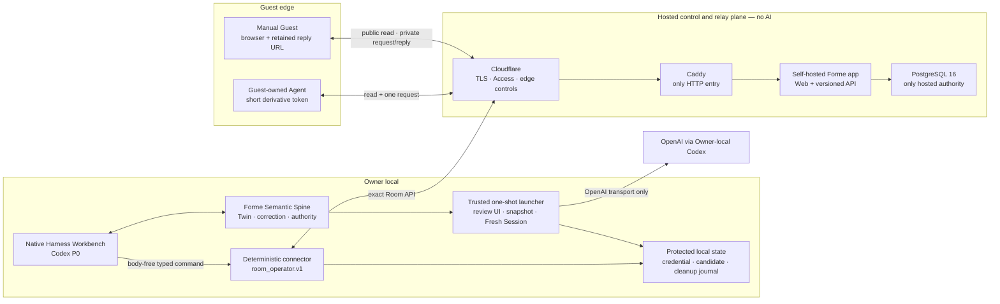

# R4 Technical Control Packet v0.2

- Status: **reconciled proposal awaiting exact Owner approval; no R4
  implementation authority**
- Updated: 2026-08-03
- Active issue: [#52](https://github.com/formehq/forme/issues/52)
- Draft review: [#64](https://github.com/formehq/forme/pull/64)
- Product authority:
  [`R4-HERO-ENCOUNTER-DECISION-BRIEF.md`](./R4-HERO-ENCOUNTER-DECISION-BRIEF.md)
- Human review surface:
  [`R4-TECHNICAL-OWNER-REVIEW.md`](./R4-TECHNICAL-OWNER-REVIEW.md)
- Supersedes: v0.1 in Git history; v0.1 is not an implementation source

This document compiles the Owner-approved P, T1–T5, NH1, and NH2 decisions
into one proposed R4 implementation boundary. It deliberately removes the old
Vercel/Supabase, invite-only ingress, 32 KiB response packet, no-email, broad
connector, and body-bearing `.forme/presence` designs.

Approving this exact Packet would authorize only repository implementation,
fixtures, local test resources, and non-production verification inside the
boundaries below. It would **not** authorize real Guest data, a model/provider
call, schema migration, hosted write, email, deployment, public traffic,
production secret, or spend. Those remain behind the later gates named in
[Implementation gates](#implementation-gates).

## Three-minute Owner brief

### What we are building

```text
Guest sees one shallow Projection
  → asks one private question
  → Owner explicitly starts one fresh Codex response session
  → Codex may inspect a sanitized read-only snapshot of the Forme repo
  → Codex returns a private candidate, not a published answer
  → Owner approves the exact outgoing answer
  → a deterministic connector delivers it
  → Guest reads it through the retained private reply capability
```

The public server remains a **Room control and relay plane**, not a hosted
Twin and not an AI chat service. The deep context stays local. If the shallow
Projection is insufficient, the Guest sends a Signal; the Owner decides
whether the local Twin and one bounded Fresh Session should answer it.

### The four continuation choices

| Owner label | Exact capability | What it does not mean |
|---|---:|---|
| One visit | 24 hours / 1 accepted Interaction | no account or identity |
| Short exchange | 3 days / 2 accepted Interactions | no thread |
| Familiar collaborator | 7 days / 3 accepted Interactions | no inferred trust |
| Trusted collaborator | 7 days / 10 accepted Interactions | no Private Room access |

All four are Owner-selected bearer capabilities bound to one exact Room and
Projection. Manual and Agent use shares one quota. At most one Interaction is
unresolved. A successor Projection inherits nothing.

### Eight implementation choices this Packet makes explicit

These are the only material technical choices added while compiling the
already-approved product decisions:

1. **No durable local Guest-body inbox.** Ordinary `room sync` stores only
   body-free metadata. The trusted local launcher pulls one exact request into
   memory only after the Owner starts `Prepare response`.
2. **Codex is physically bounded, not merely prompted.** A trusted launcher
   supplies an outer OS sandbox and local provider-transport gate; a separate
   deny-by-default Codex permission profile is defense in depth for spawned
   commands, not the security attestation. A startup adversarial probe must
   prove that private roots, sibling paths, writes, sockets, browser/MCP/tool
   surfaces, command network, and the dispatch budget are denied; otherwise
   the AI lane fails closed to `manual_owner_only`.
3. **The local review surface uses one-shot signed native windows.** One
   ceremony shows the Guest request and starts the Fresh cycle; a later separate
   ceremony shows the encrypted candidate for exact approval. Neither prints a
   body into an ordinary Workbench transcript or exposes a loopback HTTP
   surface. They are not a daemon, chat service, browser tool, tunnel, or
   remotely reachable endpoint.
4. **An unlisted Projection version is not re-admitted in P0.** Re-entry to the
   Third Place requires a new Owner-approved successor and a new Curator
   admission. This keeps curation history monotonic.
5. **Continuation capabilities do not stack.** One re-entry chain may have at
   most one live continuation Grant for an exact Room and Projection. A wider
   preset is a new explicit Grant that atomically revokes the prior one; unused
   quota never transfers.
6. **The Owner may explicitly close without replying.** This is a hosted Web
   boundary action, not a connector or Agent decision. It releases the
   one-unresolved lock and returns only a generic `closed_without_response`
   status to the Guest.
7. **Email is best-effort notification.** Verification lasts 15 minutes and is
   one-use; Forme commits at most one semantic ready notice, while provider
   timeout may still produce a duplicate. Polling remains canonical.
8. **Body-free recovery evidence has an exact horizon.** Interaction
   tombstones and ordinary operation receipts remain 37 days; per-Room
   sequence/high-water and release evidence remains body-free for the Room's
   life. None is a Guest identity or content record.

If the Owner disagrees with one of these eight choices, the Packet should be
corrected before approval. Everything else below is the engineering expansion
of already-approved behavior.

### Current Yellow conditions

- **Codex adapter proof:** the stock `codex exec --json` surface does not by
  itself expose a pre-dispatch budget gate or remove generic exec. Gate B must
  prove an official Codex app-server/noninteractive adapter can use
  `SnapshotQueryBrokerV1` and `ResponseTransportGateV1`. Failure keeps the AI
  lane off and returns to the Owner; it does not authorize a private Codex fork
  or weaker prompt-only boundary.
- **macOS local protection proof:** signed/hardened launcher identity,
  Keychain/Secure Enclave access control, native user-presence review, outer
  sandbox, cleanup, and canaries must work as one system. Any failed component
  keeps Guest bytes out of Codex and leaves manual-only available.
- **Production facts:** origin protection, backup/log horizons, OpenAI account
  regime, and email provider facts remain deliberately unknown until Gate C;
  real Guest interaction/email stays disabled before approval.

## Owner checksum

| Question | R4 answer |
|---|---|
| What enters Forme? | An approved Projection, one private Guest request/capsule, body-free Room events, one sanitized repo snapshot, one body-free Twin orientation, and one typed response candidate. |
| What is durable? | Twin truth locally; body-free local Presence metadata and receipts; hosted Projection/Interaction/Response lifecycle; encrypted hosted private bodies until their ceilings. Fresh-session transcript and raw local Guest body are not durable. |
| What can Codex see? | Ordinary Workbench sees the admitted repo but not Guest bodies, Room credentials, or candidates. A Fresh Session sees one request, optional inline Guest Capsule, one orientation, and one sanitized snapshot only. |
| What can an Agent change? | Ordinary Workbench may call the fixed `room_operator.v1` connector. Fresh Session can only return a candidate. Owner/Curator Web performs boundary actions; exact Owner approval is required before outgoing content. |
| How does recovery work? | Immutable hashes, idempotency keys, ordered per-Room events, persist-before-ACK, tombstones, a cleanup journal, submitted-unknown reconciliation, and body-free receipts. |

## Authority ledger

| Gate | Compiled invariant |
|---|---|
| P | Privacy is the primary source/provider/audience boundary. Human representation/commitment and irreversible/material consequence are companion guards. Authority never expands itself. Inside an exact inspectable revocable envelope, use review-by-exception. |
| T1 | Public and Private are different immutable Room kinds. Public gets one short anonymous knock; continued or Private access uses exact Owner Grants. Four presets are fixed. Agent derivative authority is short and narrower. |
| T2 | Hosted Forme is a GitHub-like Web/API control plane with no AI. API semantics are canonical; Web and CLI are clients. Each local binding is one exact Room, 30 days, non-renewing, revocable, and fixed to `room_operator.v1`. |
| NH1 | Codex is the P0 Native Harness Workbench. OpenCode remains a first-class architectural target with no live P0 path. Forme does not rebuild a general chat/workbench runtime. |
| NH2 | Ordinary Workspace work is not automatically Twin meaning or a Forme-authoritative effect. Admission, correction, publication, commitments, and claimed receipts remain typed Forme operations. |
| T3 | One Interaction gets one new, non-resumed, bounded Fresh Native Response Session after explicit Owner start. It uses the sanitized snapshot and body-free orientation, returns only a candidate, and cannot publish. |
| T4 | Owner publication and Curator admission are independent. Unlist is not revoke. Stale is warning-only/no-new-write. Revoke/retire hides bodies. Successors inherit no Grant. Existing non-revoked origins may be answered only with disclosed state. |
| T5 | Explicit sync and polling are canonical. Optional email is notice-only. Retention ceilings, purge targets, non-durable session artifacts, four presets, and the P0 cut are fixed. |

## System topology and state ownership



There are three durable state owners:

1. **Local Twin** owns what the project currently means.
2. **Local Presence** owns body-free Room convergence, exact Owner approvals,
   candidate reconciliation, and local cleanup evidence.
3. **Hosted Presence** owns public visibility, private Guest bodies, capability
   state, Interaction/Response lifecycle, curation, and delivery state.

An incoming Interaction is not Twin truth. A candidate is not an Owner answer.
A file edit is not automatically a Forme effect. Every crossing has an exact
typed operation and receipt.

## Actors and authority

| Actor | May read | May mutate | Must never receive |
|---|---|---|---|
| Public reader | current eligible public Projection, including stale direct-URL warning read until hard expiry; body-free status | none | private request/Response, Twin, Grant secret |
| Manual Guest | exact capability-scoped Projection, own Interaction/Response/status | create own Interaction; delete own Interaction; manage own notification; accept exact offer | Twin, other Guest data, Owner identity secrets |
| Guest Agent | exact Projection plus one request submission | create one accepted Interaction | reply body, delete, offer acceptance, delegation, recovery, cross-Room state |
| Controller | hosted Room/Projection/Interaction/Response/status/control data | explicit Owner boundary actions | private Twin, local repo, local candidate store, connector secret |
| Curator | public candidate Projection and curation history | admit/unlist only | private Room/body, Owner Grant, response preparation |
| Native Workbench | Owner-admitted Workspace and body-free Forme status | ordinary Workspace work; fixed connector calls | Guest body, candidate body, binding secret, reply token |
| Fresh Session | one exact request/capsule, orientation, sanitized snapshot | typed candidate only | live repo, history, writes, connector, other Guest/Room, publish authority |
| Connector | exact Room wire payload needed by fixed verb | fixed `room_operator.v1` verbs | Controller/Curator authority, arbitrary HTTP/tool surface |
| Hosted app | hosted Presence and encrypted body columns | validated API transactions | local Twin/source repo; model/provider runtime |
| Janitor | terminal/expired rows and encrypted payload locations | lifecycle/purge transitions only | plaintext bodies in logs or reports |

## Room and Projection contract

### Room

`roomKind` is immutable:

- `third_place_public`
- `private_grant_only`

A public Room has `interactionMode`:

- `public_single`: eligible public Projection can issue and consume a public
  encounter;
- `invite_only`: public read may continue, but unused public encounters are
  invalid and only exact Grants may submit;
- `closed`: every new submission is paused. Existing Grants retain only their
  remaining expiry/quota and become usable again only if reopened before
  expiry.

A Private Room supports `invite_only` and `closed` only. A Room moves from
`active` to terminal `retired`; it never changes kind. Retirement immediately
hides Room, Projection, and Response bodies, rejects writes, and leaves only
body-free status/delete plus tombstone drain.

### Projection owner lifecycle

An immutable Projection body is at most 32 KiB UTF-8 plain text, with a title
of at most 120 Unicode scalar values and a Third Place summary of at most 512
UTF-8 bytes. It is a deliberately shallow snapshot compiled from an eligible
Twin revision. Publication requires an exact local Owner approval record; the
server never constructs or expands Projection prose.

`ProjectionCapsuleV1` carries Owner-approved `becoming`, `now`, `nextMove`,
`tensions`, and `openTo` claims; each claim has one evidence class of
`owner_confirmed`, `inferred_allowed`, or `unresolved_allowed`. It also carries
privacy-safe provenance/freshness class, supported interactions, allowed and
explicitly unavailable topic labels, expected response latency, visual theme
token, and an agency/non-commitment statement. It never carries private
evidence bodies, local paths, internal policy/evidence IDs, or a credential.

Every hosted Projection binds a Projection-scoped opaque
`disclosureBasisId`, payload hash, privacy-safe publication-attestation ID,
`publishedAt`, `freshUntil`, and hard `expiresAt`. It never receives an
internal Twin revision, Workspace/source path, evidence ID/body, or local
policy hash. Local Presence separately maps the disclosure basis to the exact
Twin revision, eligible-basis hash, and projection-policy hash.
`expiresAt` is no later than seven days after `publishedAt`. Any later validated
Twin revision conservatively makes the current Projection stale at the next
explicit sync; no dependency-aware claim freshness is attempted in P0.
`room_operator.v1` may attest stale only by comparing the private local mapping
with current validated Twin state, then sending a body-free deterministic
attestation. It cannot author a successor or infer a new public claim.

### Twin-to-Projection basis

Local `ProjectionBasisV1` keeps one record per public claim. Each record binds:

- exact current Twin revision number and revision hash;
- workspace-contract hash plus projection-policy generation and hash;
- exact claim text, public slot, attribution class, disclosure class, and
  transformation/Owner-edit classification;
- exact local source kind, internal source reference, source-content hash, and
  current semantic/effect status; and
- exact publication payload hash, Owner decision ID/hash, and local/hosted
  receipt lineage.

`owner_confirmed`, `inferred_allowed`, and `unresolved_allowed` are disclosure
decisions, not proof that an inference is true. An Owner edit that introduces a
new claim is recorded as a separately hashed Owner-authored basis entry before
approval. Private evidence bodies and all internal basis fields remain local;
only the Projection-scoped opaque `disclosureBasisId` leaves the edge.

P0 applies this exact eligibility floor:

| Local Twin basis | Projection eligibility |
|---|---|
| Current Owner Frame field or unresolved item | exact current Owner-authored claim allowed |
| Active Owner-corrected Reflection | allowed as `owner_confirmed` only when explicitly selected |
| Active inferred Reflection | allowed only when explicitly selected, visibly labeled `inferred_allowed`, and carrying uncertainty |
| Superseded or invalidated Reflection | prohibited |
| Proposed or merely approved R3 action | prohibited as a completed/current accomplishment |
| Successfully executed and still-current R3 effect | may support an exact current fact |
| Rolled-back R3 effect | may support only an exact historical “tested and rolled back” claim, never a current accomplishment |
| Invalidated or indeterminate R3 effect | prohibited as a positive current claim |
| New Projection-only Owner wording | allowed only as separately hashed Owner-authored text in the exact publication input manifest; it may not masquerade as Twin-derived cognition |

Preparation starts from the current reconstructed Twin, not a hand-authored
social page. Immediately before connector delivery, Forme revalidates Twin
HEAD, every active correction/invalidation, the complete per-claim basis,
policy hash, payload hash, target Room, and approval. Any intervening change
invalidates the publication approval. Publishing bytes identical to the exact
current Projection is a receipted no-op; it does not create a successor,
freshness lease, or Curator admission.

Ordinary Workbench text and an R3 proposal/effect do not automatically become
Projection evidence or public meaning. They must first enter the validated
Twin/evidence path and then pass the exact eligibility table, Projection basis,
and Owner approval gates. The R4 acceptance demo must show one causal chain:

```text
eligible local evidence/correction
  → current Twin revision
  → per-claim Projection basis
  → exact Owner publication approval
  → hosted Projection + optional Curator admission
  → one private Guest Interaction
  → local orientation/Fresh or manual judgment
  → exact Owner Response approval + hosted receipt
```

```text
published_fresh ──stale──> stale
       │                     │
       ├──successor──────────┴──> superseded
       └──revoke────────────────> revoked

fresh/stale ──server clock──> expired
```

- A successor atomically supersedes the old current Projection.
- A successor starts `not_admitted`, requires fresh Curator admission for
  Third Place discovery, and inherits no encounter, Grant, or GrantOffer.
- Stale remains direct-readable with a dominant warning for no more than seven
  days and accepts no new Interaction.
- Superseded, expired, revoked, or retired content returns a body-free
  tombstone, except that a still-valid accepted Interaction follows the T4
  response rule below.
- Revoke immediately hides the Projection and all linked published Responses.

### Independent curation lifecycle

```text
not_admitted → admitted → unlisted
```

The P0 graph is monotonic: an exact unlisted version cannot be re-admitted.
The Owner publishes a successor and the Curator admits that successor.

Third Place discovery requires all of:

- public Room active;
- exact current Projection;
- fresh, unrevoked, unexpired;
- `admitted`.

A new anonymous public knock additionally requires Room mode `public_single`.
Changing the mode to `invite_only` or `closed` stops new knocks but does not by
itself remove an otherwise-eligible admitted Projection from Third Place.

A current, fresh, unrevoked, unexpired public Projection remains direct-URL
readable when never admitted or unlisted. Unlist ends discovery, ends new
public knocks, and invalidates unused public encounter capabilities. It does
not revoke an otherwise-valid Owner Grant, GrantOffer, or accepted
Interaction. A stale current public Projection remains direct-readable only
with the dominant stale warning until hard expiry. Private Rooms are never
discoverable and never return a body without a valid exact Grant; a valid
Grant may read a stale Private Projection only with the same warning and may
not submit.

All public and private Projection/body responses use `Cache-Control: no-store`.
HTML and Agent JSON must derive from the same server decision.

## Guest capability contract

All bearer secrets contain at least 256 random bits. URLs use a public opaque
ID plus a secret in the URL fragment; the fragment is exchanged by POST and is
never sent in a query, path, Referer, analytics event, or log. API Agents use
`Authorization: Bearer`. The database stores only a keyed digest, never the
raw secret.

Capability creation is lost-response safe. The initiating client generates and
retains every bearer secret before its mutation: public-encounter and
reply/delete secrets on the Guest client; a direct-invite secret on the Owner
client; the resulting Grant secret on the accepting Guest client; and an
Agent-derivative secret on the Manual holder's client. The server receives a
secret only in the protected request body, stores a keyed digest, and returns
the opaque object ID/receipt. A same-key retry reuses the same secret, so a
committed create with a lost HTTP response never strands an unrecoverable
capability. For an Agent derivative, the parent Manual holder retains the
reply/delete authority; the Agent receives only its derivative secret.

Room pairing uses a different recovery pattern: the connector persists an
ephemeral key pair before exchange, and the server's exact idempotent response
contains the Room credential sealed to that public key. A same-key retry
returns the identical sealed envelope until pairing expiry. No server-generated
bearer credential exists only in a lost response. The Manifest must include
lost-response vectors for encounter/create, offer acceptance, direct-invite
issuance and redemption, derivative minting, and pairing.

### Public encounter

`public_encounter.v1` is server-issued for one exact public Room and Projection:

- maximum 24 hours;
- one accepted Interaction;
- one unresolved Interaction;
- valid only while the Projection remains current/fresh/admitted/unrevoked/
  unexpired and the Room remains active `public_single`;
- invalidated unused by unlist, mode exit, stale, successor, expiry, revoke, or
  retirement;
- accepted-only accounting; an idempotent retry consumes no second unit.

The public Room pool permits at most 20 accepted anonymous public Interactions
in a rolling 24-hour window. Owner-issued Grants do not consume that pool.

### Owner continuation and Private Grant

`grant.v1` binds one exact Room, Projection, re-entry chain, preset, expiry,
remaining quota, and Agent-derivation flag.

| `presetId` | TTL | Accepted quota |
|---|---:|---:|
| `one_visit` | 24 hours | 1 |
| `short_exchange` | 3 days | 2 |
| `familiar_collaborator` | 7 days | 3 |
| `trusted_collaborator` | 7 days | 10 |

- Server UTC time is authoritative.
- Direct Grant expiry begins at atomic issuance.
- A GrantOffer or direct one-time invite fixes `offeredGrantExpiresAt` when the
  Owner issues it. Acceptance/redemption creates a Grant with that exact
  expiry; waiting consumes the window and never resets or extends the preset.
- Effective expiry is the earliest of preset expiry, exact Projection expiry,
  Owner revoke, successor, Projection revoke, or Room retirement.
- Stale blocks new submissions without extending expiry.
- `closed` pauses submissions without extending expiry.
- Grant revoke/expiry stops later submission and, for a Private Room, later
  Projection reads. It does not delete or hide an already accepted
  Interaction/Response governed by its own reply capability and lifecycle,
  and it never refunds accepted quota.
- Manual and Agent-derived submissions share the accepted quota.
- A public first knock and a later Grant have independent quota; therefore an
  Owner may intentionally permit one public knock plus ten later trusted
  Interactions.
- The labels are display language only. They do not establish a person,
  account, relationship, verified identity, Private access, or cross-Room
  authority.
- Private reading and interaction always require a separate Grant for the
  exact Private Room and Projection.

One re-entry chain may have at most one live continuation Grant for a Room and
Projection. P0 has no in-place widening. Issuing a replacement requires
explicit Owner confirmation, atomically revokes the earlier Grant, starts a
new expiry/quota, and transfers no unused quota.

### Grant offer

`grant_offer.v1` is a private proposal visible through one exact reply
capability. It moves:

```text
issued → accepted | owner_revoked | expired | invalidated
```

Acceptance is one transaction. It rechecks:

- the source reply capability;
- offer expiry;
- source Interaction not deleted or origin-revoked;
- source Room not retired;
- target Projection current/fresh/unrevoked/unexpired;
- target Room active and not `closed`.

Each Interaction has at most one live GrantOffer. Acceptance uses the fixed
`offeredGrantExpiresAt` and never extends either the acceptance deadline or
offered Grant expiry. Unlist alone does not invalidate an offer. Target
successor, expiry, revoke, or retirement does.

For a collaborator reached through an existing external channel, the Owner may
instead issue `direct_grant_invite.v1`: a one-use fragment URL bound to the
same exact Room, Projection, preset, and fixed `offeredGrantExpiresAt`.
Redemption performs the same target/mode/lifecycle checks, accepts a
Guest-generated Grant secret, and consumes the invite atomically. It is not an
account, reusable invite, or cross-Room identity.

### Agent derivative

The Manual holder of either `public_encounter.v1` or an Agent-enabled
`grant.v1` may mint one `agent_derivative.v1`:

- maximum 15 minutes;
- one use;
- exact Room and Projection;
- read exact Projection and create one Interaction only;
- shares the exact parent capability's quota and one-unresolved lock. A public
  parent consumes its single encounter use and the public rolling Room pool;
  a Grant parent consumes that Grant's accepted quota.

It cannot read a reply, delete, accept an offer, mint another token, recover a
capability, identify a person, or cross a Room. It never outlives the parent.

## Interaction and Response contract

### Interaction

One Interaction contains immutable request bytes, optional inline Guest
Capsule, a Guest-selected `interactionType` of `ask`, `seed`, or `resonance`,
exact origin IDs/hashes, consent, accepted timestamp, and reply/delete
capability digests. The server never infers resonance or changes the selected
type. Lifecycle is separate from payload.

Before submission, the Guest sees plain disclosure that the Owner may actively
hand the request to a local Codex Fresh Session and that eligible Forme
workspace bytes then leave the Owner device for OpenAI processing. The text
states that any snapshot content the Agent judges relevant may be sent, names
the admitted source classes (current sanitized Forme snapshot plus
body/path-free Twin orientation), links the applicable OpenAI data/retention
policy, names the session ceilings and the Owner's ability to read/copy, and
shows the hosted/backup terms and manual-only alternative. It must not describe
the path as on-device or server AI and must not promise an exact byte list, a
complete file-read list, or that OpenAI sees only the broker-returned bytes.
It also explains the dispatch race honestly: delete/revoke/retire committed
before a dispatch permit prevents that provider call, while a permit committed
first makes that exact dispatch in-flight and it cannot be recalled even if a
destructive action commits immediately afterward.
Consent is one exact enum:
`allow_owner_local_ai` or `manual_owner_only`; it is immutable for that
Interaction and cannot be widened after acceptance.

`ConsentEnvelopeV1` binds provider `OpenAI`, Owner account/data-control regime,
source class `sanitized_current_forme_snapshot`, orientation class, optional
Guest Capsule scope, maximum session/dispatch/token/applicable-spend budget,
provider-policy URL and provider/backup retention-disclosure versions/hashes,
consent-copy version/hash, consent time, and reply capability ID/digest, never
the raw secret. The actual `SessionEnvelopeV1` must be an exact subset of those
terms. Any provider, account regime, source class, budget, Guest Capsule scope,
or retention-term change requires new Guest consent for a new Interaction or
uses `manual_owner_only`; the Owner cannot widen an accepted envelope.

Limits:

- request: 12 KiB UTF-8 plain text;
- inline `GuestCapsuleV1`: optional, 4 KiB canonical JSON;
- no HTML, Markdown execution, file, image, rich attachment, or remote URL
  fetch;
- Interaction plus capsule retained at most 30 days from hosted `acceptedAt`;
- one Response maximum;
- one unresolved Interaction per active encounter/Grant chain;
- no conversation thread or implicit history.

`guestCapsuleLevel` is explicit:

- `g0_manual`: no reusable capsule; request only;
- `g1_lightweight`: optional pseudonym, current focus, offer, seek, and one
  open question;
- `g2_agent_projection`: the G1 fields plus Guest-declared source class, scope
  label, freshness time, schema version, and consent. It may be produced by any
  Guest-owned Agent and does not imply Forme continuity or a Guest Twin.

The capsule contains no raw note attachment, local path, secret, account
credential, reusable identity assertion, or instruction authority. All fields
are Guest claims shown with provenance; the server does not verify personhood
or infer resonance. P0 response depth is fixed to `owner_reviewed`.

Hosted states are:

```text
accepted → seen_locally → preparing → response_ready
    │            │            │
    ├────────────┴────────────┴→ closed_without_response
    └──────────────────────────→ interaction_expired

any retained state → interaction_deleted | origin_revoked | room_retired
```

Only `accepted`, `seen_locally`, and `preparing` count unresolved. The
Controller may use the stepped-up Web surface to `close_without_response`
from any of them. The connector cannot close, park, decline, or infer intent.
The Guest receives a generic status only.

If the origin becomes stale, superseded, or expired after acceptance, the
Owner may still prepare and publish one newly compiled and newly approved
Response with that exact origin state disclosed. A revoked origin cannot
receive a new Response.

### Response

A Response is immutable Owner-approved content bound to exactly one
Interaction, candidate hash, origin state, privacy-safe source-disclosure
class, approval attestation, and server publication receipt. The exact Twin
basis and source-policy hashes remain in protected Local Presence; hosted and
Guest views receive only an opaque local-basis attestation ID and the approved
source/provider disclosure, never an internal Twin revision or source path.

- body: maximum 16 KiB UTF-8 plain text;
- retention: at most seven days from publication and never beyond the parent
  Interaction;
- publication is one idempotent transaction and one semantic Response;
- server attribution is derived from verified approval, never from a
  client-supplied display name;
- exact publication requires current status and approval/basis hashes.

Lifecycle:

```text
available → response_expired | response_revoked
available → origin_revoked | interaction_deleted | room_retired
```

Terminal precedence is Interaction delete, Room retirement, origin revoke,
standalone Response revoke, then expiry. Publish racing a terminal action has
only two valid results: terminal commits first and publish fails body-free, or
publish commits once and the later terminal cascade hides it.

`close_without_response` racing publication also has one winner. Close-first
atomically removes hosted response authority, cancels a notice that has not
begun provider handoff, does not refund the already consumed accepted quota,
and makes publish fail body-free. An offline local candidate is denied and
cleaned only after the connector learns the close through an explicit
status/sync/reconcile or preparation check; until then it remains encrypted,
cannot pass the mandatory publish-status recheck, and is still bounded by its
normal seven-day/Interaction ceiling.
Publish-first moves the Interaction to `response_ready`; close is then rejected
and the Owner must use the separately receipted Response revoke or Interaction
delete if removal is intended.

### Exact local approval record

The local Owner review surface creates `ArtifactApprovalV1` only after showing
the complete current bytes, target Room/Projection/Interaction, relevant
origin warning, and content hash. The Owner may edit first; any edit changes
the hash and requires a new confirmation. The record contains the artifact
hash, target IDs, basis/policy hashes, approval time, expiry, and a random
operation ID, then is authenticated through the exact Room binding during
delivery. The connector derives a privacy-safe publication attestation and
does not transmit the private basis/policy fields. Hosted attribution is
derived from that verified binding and attestation.

The connector accepts only a candidate held by the protected store whose hash
matches the approval record. It cannot turn arbitrary Workspace/stdin text
into approved content, and the Workbench cannot mint an approval record by
calling a generic CLI flag. The same mechanism applies to Projection and
Response publication.

## Optional response-ready email

`notification_endpoint.v1` belongs to one exact Interaction. It is mutable
hosted notification metadata, not part of the immutable request and not an
account, identity, login, capability, recovery channel, trust signal,
deduplication key, or cross-Room relationship record.

Endpoint and delivery are two separate state dimensions:

```text
endpoint: absent → verification_pending → confirmed → cleared

notice:   absent → ready_pending → submitting
                     │                 ├→ provider_accepted
                     └→ canceled       ├→ delivery_unknown
                                       └→ failed

delivery_unknown ──provider proves not accepted──> submitting
delivery_unknown ──provider proves accepted──────> provider_accepted
canceled(no handoff) ──new confirmed endpoint + available Response──> ready_pending
```

Exact mechanics:

`destructive_terminal` means exactly `closed_without_response`,
`interaction_deleted`, `interaction_expired`, `origin_revoked`,
`room_retired`, `response_revoked`, or `response_expired`. The successful
`response_ready` state is not destructive and never clears its own notice.

- Only the exact private reply capability may add, replace, or remove the
  endpoint.
- Every address change requires confirmation.
- Verification code TTL is 15 minutes, one use, maximum five attempts, and at
  most three sends per Interaction per hour.
- The address is encrypted at rest and is not indexed as a person. Owner Web
  and durable receipts see only confirmed/pending/cleared plus a redacted
  domain-neutral marker, never the raw address.
- The single-purpose code can confirm the endpoint only. It cannot read a
  Room/body, recover a reply URL, create an Interaction, or mint authority.
- Code and plaintext message are never logged; the code is deleted after use
  or expiry.
- There is at most one semantic ready-notice row per Interaction. If a
  confirmed endpoint already exists, the exact Response publication transaction
  creates `ready_pending` and its encrypted delivery-target snapshot. If the
  Response is already available when endpoint confirmation commits, that
  confirmation transaction creates the same row only if the Response is still
  available and no handoff has ever begun. The unique Interaction key prevents
  both paths from creating two notices.
- Before provider handoff, endpoint removal cancels `ready_pending` and deletes
  its target. Starting replacement does the same for the old target; successful
  confirmation may repopulate the same never-handed-off semantic row for the
  new address. These races lock the endpoint, Response, and outbox row together.
  Once handoff has begun, replacement/removal creates no second ready notice.
- The notice says only that a Forme response is ready and instructs the Guest
  to use the previously saved private reply link. It contains no request or
  response summary, Room name, reply URL, token, secret, or private body.
- Polling the saved reply capability remains canonical and works when email
  fails.
- The outbox—not the endpoint row—owns one encrypted delivery-target snapshot
  while delivery is pending or safely reconcilable. A dispatch transaction
  moves `ready_pending` to `submitting` and durably creates a stable attempt ID,
  provider idempotency key, attempt number, and lease before any provider byte
  is sent. Verification sends use the same attempt/lease recovery class but do
  not count as the one ready notice.
- A lease expiry or worker crash after that commit, whether before or after the
  network call, never resets directly to `ready_pending` and never blindly
  sends. A reclaiming worker first asks the approved provider for the stable
  attempt/idempotency result: accepted becomes `provider_accepted`; definitive
  non-acceptance may re-enter `submitting` with the same semantic item and key;
  any ambiguous result becomes `delivery_unknown`. Provider timeout follows
  the same path.
- A `destructive_terminal` may cancel only `ready_pending`. After handoff has
  begun it clears the endpoint and encrypted delivery target, disables retry,
  and moves an unresolved `submitting` attempt to body-free
  `delivery_unknown/no_retry`; otherwise it preserves only body-free
  `provider_accepted`, `delivery_unknown`, or `failed` evidence. It never claims
  recall or cancellation. Ordinary endpoint replacement/removal after handoff
  likewise cannot recall the attempt; it atomically marks that semantic notice
  `no_future_retry` and clears the endpoint. The old encrypted target may remain
  only for the bounded window needed to classify the already-started attempt.
  A replacement address is not accepted for this already-handed-off
  Interaction and receives no verification or second notice; the Guest relies
  on the saved reply capability and polling.
- A provider-accepted or possibly accepted message cannot be recalled.
- Forme guarantees one semantic outbox item, not network exactly-once. On a
  `delivery_unknown` outcome, one reconciled retry is allowed only when the
  provider contract proves the first attempt was not accepted. Otherwise Forme
  stops, purges the raw target, and polling carries the result.
- `provider_accepted`, definitive `failed`, or final
  `delivery_unknown/no_retry` clears both raw endpoint and delivery target;
  only the body-free delivery state/attempt identifiers remain for their
  approved receipt horizon.
- A later authenticated provider result may monotonically refine body-free
  `delivery_unknown/no_retry` to `provider_accepted` or `failed`. It never
  restores a raw target, endpoint, or retry path; definitive non-acceptance
  after removal/replacement becomes `failed/no_retry`, not `submitting`.

The exact provider, region, recipient/delivery-metadata retention, secret
handling, spend ceiling, stable idempotency/status API, lease, and reconciliation
deadline are Production Grant values. The reconciliation deadline is at most
24 hours from first handoff and never beyond the Response or Interaction. A
provider that cannot distinguish accepted from definitively not accepted keeps
ambiguous attempts terminally `delivery_unknown`; it does not enable a retry.
Production email remains disabled until these facts are approved and crash
probes pass.

## Canonical protocol

`packages/r4-protocol` is a pure TypeScript package with no filesystem,
database, network, runtime, or model import. It owns:

- JSON Schemas and TypeScript types;
- strict validators;
- canonical JSON encoding and SHA-256 hashing;
- state derivation helpers;
- redaction and body-free receipt types;
- golden vectors shared by hosted and local code.

Every externally persisted object includes `schemaVersion`. IDs are opaque,
type-prefixed, and non-semantic. Timestamps are UTC RFC 3339 with millisecond
precision. JSON rejects unknown fields, duplicate keys, non-finite numbers,
non-NFC text, invalid Unicode, and over-limit arrays/strings. Hashing uses
canonical UTF-8 JSON bytes. Payload and lifecycle metadata are separate.

An API mutation carries:

- exact actor/capability class;
- action name;
- at least 128-bit idempotency key;
- canonical request hash;
- expected object version or predecessor hash where relevant.

The same actor/action/key and request hash returns the exact original body-free
receipt. The same key with different bytes returns `409`. A new key cannot
repeat a terminal semantic effect.

The later Schema & Migration Manifest fixes exact field names, schema hashes,
SQL enums/tables/indexes/functions/roles, and local store formats. It may not
change any semantic invariant in this Packet.

## Versioned API and clients

The canonical prefix is `/api/v1`. Web, CLI, and connector call the same
semantic operations; no UI-only hidden mutation exists.

### Public and Guest lane

| Operation family | Credential | Result |
|---|---|---|
| Third Place list | none | current/fresh/admitted public Projection summaries |
| Projection read | none or exact Grant | public body or Grant-scoped Private body |
| Public encounter issue | anti-abuse cookie | one exact encounter capability |
| Interaction create | encounter/Grant/Agent derivative | accepted Interaction opaque ID + receipt; Manual client assembles the reply URL from its pre-retained secret |
| Interaction status/Response | exact reply capability | own body/status/Response only |
| Interaction delete | exact reply/delete capability | immediate hosted unreadability + purge obligation |
| Notification manage/verify | exact reply capability or verification code | exact endpoint only |
| GrantOffer accept | exact reply capability | one new exact Grant |
| Direct invite redeem | one-use direct invite + Guest-generated Grant secret | one fixed-expiry exact Grant |
| Agent derivative mint | exact allowed Manual capability | one 15-minute one-use token |

### Controller and Curator lane

Controller/Curator API access is invite-only. P0 uses Cloudflare Access signed
assertions mapped to pre-registered stable provider subject IDs. The app
validates signature, issuer, route-specific audience, subject, expiry,
not-before, and issued-at on every request.

- `control` origin: maximum 12-hour Access session for inspect/status and
  reversible ordinary control.
- `approve` origin: distinct audience; assertion issued no more than 15 minutes
  earlier for Room create/pair, Projection publication boundary, Grant/offer,
  mode, close-without-response, curation, revoke, retire, or delete. Final
  Response content approval remains only in the protected local UI.
- emergency Projection revoke: authenticated `control` origin plus explicit
  typed confirmation; it does not wait for normal step-up but is fully
  receipted.
- browser mutations require exact Origin, SameSite cookies, CSRF nonce,
  idempotency key, and current object version.

Exact domains, Access applications/audiences, IdP, MFA, Controller/Curator
subjects, and session configuration are Production Grant values.

The hosted Web may display the exact Guest request and published Response to
the authenticated Owner, but P0 does not author or AI-draft an outgoing body
there. Outgoing Projection/Response bytes still originate in the protected
local review path and carry the exact local approval record. Web remains the
anywhere management/control/status surface; it cannot invoke the local Agent
or silently convert hosted private content into a candidate.

### `room_operator.v1`

A local Workspace may hold multiple independent Room bindings. Each binding is
exactly one Room, begins at pairing, lasts at most 30 days, never auto-renews,
and is revocable. A Room credential cannot discover or act on siblings.

The fixed bundle permits only:

- inspect exact Room/Projection/status/health/body-free receipts;
- explicit typed `room sync` for accepted Interaction metadata and terminal
  events;
- just-in-time pull of one exact request by the trusted Prepare launcher;
- atomic reserve/recover/abandon of the one Owner-started Fresh draft-cycle
  slot for an exact Interaction, bound to its start-authorization and Session
  Envelope hashes; abandonment requires a trusted zero-dispatch attestation;
- atomic issue/recover of one 30-second, one-use, exact-payload-bound provider
  dispatch permit for each authorized dispatch ordinal under that cycle;
- deterministic ACK and recovery;
- delivery of one still-current exact Owner-approved Projection or Response;
- deterministic stale attestation;
- a local-purge receipt only after the connector verifies local bytes are
  absent.

It cannot pair itself, create/discover a Room, widen scope, issue a Grant,
accept an offer, change intake/disposition/mode beyond the fixed T3 cycle
reservation, author Owner content, curate, revoke content, retire/delete, call
arbitrary APIs, expose the raw credential, or hand a token to the model. Cycle
reservation is deterministic budget/lifecycle enforcement, not permission to
start Codex, call a provider, author content, close a request, or publish.
Likewise, a dispatch permit is only the fixed race boundary for one already
Owner-started cycle; the model never receives it and cannot request one.

Pairing is an Owner Web boundary action. It produces a short-lived one-use
pairing code. The installed connector exchanges it outside model-visible
stdout and stores the resulting secret in the platform protection adapter.

### P0 CLI

The thin CLI exposes:

```text
forme room pair
forme room status
forme room sync
forme room prepare-response <interaction-id>
forme room reconcile

forme guest inspect
forme guest ask
forme guest status
forme guest delete
forme guest agent-token
```

Read-only commands never pull a body, write state, advance a cursor, refresh a
Grant, or perform a hidden sync. Secret input comes from an interactive secure
channel or stdin descriptor, never a command argument or printed output.
Controller/Curator CLI is P1; the P0 Owner boundary surface is Web.

## Local architecture and physical boundary

### Four local zones

| Zone | Contents | Workbench access |
|---|---|---|
| Workspace | repo, Twin, body-free `.forme/room` metadata | normal approved Workspace access |
| Connector protection | Room binding credential and pairing state | denied; typed connector only |
| Candidate protection | encrypted typed unpublished candidate + cleanup journal | denied; one-shot review UI only |
| Session runtime | sanitized snapshot/non-secret config on disk; exact request/capsule/orientation and event/output streams only in protected process memory/anonymous pipes | snapshot duplicates admitted Workspace bytes; Guest-derived plaintext is absent from the readable filesystem and protected from attach/injection |

`.forme/room` may contain only Room/Projection/Interaction IDs and hashes,
state versions, cursors, ordered-event receipts, cleanup/purge receipts,
policy/schema versions, and body-free errors. It may not contain request,
Guest Capsule, Response/candidate text, email, capability, credential,
verification code, transcript, tool log, source path, or provider token.

### P0 macOS protection adapter

The P0 adapter uses:

- a trusted installed `forme-local` launcher outside the writable Workspace;
- macOS Keychain/Secure Enclave-backed protection for Room credential and
  non-exportable candidate-encryption key material, restricted to the
  hash-checked signed connector/launcher designated requirement and access
  group; candidate decrypt requires explicit local user presence, and a
  missing/changed signature or unattended prompt fails closed;
- an encrypted candidate file outside the Workspace;
- one-shot runtime directories with mode `0700` containing only the sanitized
  snapshot, output schema, and non-secret config—never request, Guest Capsule,
  Twin orientation, event/output stream, candidate, or provider credential;
- anonymous bounded pipes and locked launcher memory for request/capsule/
  orientation input and structured event/stderr output; the validated final
  candidate is encrypted before it becomes a file. If the selected official
  Codex build writes prompt/session/history/body-bearing telemetry to disk, the
  AI lane fails closed;
- a launcher-owned outer macOS Seatbelt/container-equivalent policy that
  encloses the entire Fresh Codex process and admits only its runtime roots and
  controlled OpenAI transport;
- a `forme-fresh-response` deny-by-default Codex permission profile
  that reads only minimal runtime dependencies and the exact sanitized
  snapshot, with command network and every other filesystem root denied;
- separate one-shot signed native request/start and candidate-approval windows
  with no listening socket, Web history, extension surface, external asset,
  pasteboard export, or persistence. Local user-presence authorization is
  required before body display/decrypt and exact approval. Each UI ceremony
  exits after 15 minutes or its terminal action; the Fresh worker may continue
  independently only inside the original 60-minute authority ceiling, and any
  later candidate remains encrypted until a new user-presence approval window.

Same-user `0600`, `0700`, `.gitignore`, an alternate folder, or a prompt saying
“do not read” is not accepted as isolation. Runtime-directory permissions are
hygiene for non-secret files, not the reverse-isolation claim. Before any
request byte is pulled, an
adversarial capability probe must prove that the exact installed Codex build
cannot read the protected roots or live repo, write the session root, reach a
local socket from a model-generated command, use command network, invoke
connector verbs, access a browser/MCP/connector surface, or escape through a
symlink. Codex core receives only one launcher-owned transport endpoint; the
inner command sandbox cannot reach it. The probe attests the outer
sandbox and actual tool inventory; a profile name or environment variable is
never accepted as proof. A failed, unavailable, or ambiguous probe records the
local derived flag `manual_owner_only_available`; it does not add or mutate a
hosted Interaction lifecycle state, and no request is sent to Codex.

The ordinary Native Workbench may retain its useful Owner-approved Workspace
agency, including an intentionally broad repo permission profile. Privacy does
not depend on trusting that profile: no Guest plaintext or raw Room secret is
placed in its readable filesystem, and the installed connector exports only
typed body-free verbs. The native review window is not registered as an Agent,
browser, MCP, app, or automation tool; the user-presence gate and signed client
boundary are probed directly. A same-user process may trigger an authorization
prompt but cannot silently approve it, export the key, receive plaintext, or
attach to/inject into the hardened launcher/Fresh process. Core dumps are
disabled; child crash diagnostics are disabled or scrubbed before Guest bytes
are admitted. If those controls cannot be proven for the selected build, the AI
lane remains manual-only.

The window requests the platform's capture/sharing exclusion where supported
and the Fresh Session has no screen/computer tool. Forme cannot protect a body
from a separate process to which the Owner simultaneously grants screen
recording, accessibility control, debugger/root authority, or physical
observation; that is a new external source boundary and the review UI warns and
fails closed when the selected Fresh runtime exposes such a capability. No
background Workbench/Agent is part of the ceremony. Forme does not claim to
defeat kernel/root compromise, Owner-authorized debugger/accessibility/screen
capture, physical observation, or operating-system diagnostics outside the
tested suppression boundary; that residual is disclosed before start.

The installed launcher and connector must be immutable/hash-checked, signed
with the approved designated requirement, and run with hardened runtime,
library validation, and debugger/dynamic-injection denial. Their exact code
identity and Keychain access group are Manifest values and capability probes.
They start from a sanitized environment and cannot be replaced or dynamically
loaded from a Workspace path. Workspace source code is never executed as the
trusted boundary. The adversarial suite explicitly attempts `/usr/bin/security`
and Keychain API export, process attach, debugger/dynamic-library injection,
binary replacement, protection-socket access, UI capture, and stale approval
reuse from both ordinary Workbench and Fresh profiles; confidentiality claims
fail closed on any success.

### No durable raw local inbox

`room sync` stores body-free event metadata only. The exact request/capsule is
pulled over the connector after the Owner opens the native review window and
chooses `Prepare response`. The launcher keeps it in locked process memory and
injects it into the Fresh Session as typed untrusted data. It is never written
to the Workspace, candidate store, shell history, stdout, JSONL audit receipt,
or Forme-owned disk log. Core-dump/crash-log suppression and the residual OS
diagnostic boundary above are tested and disclosed rather than claimed
perfect. Offline AI preparation is therefore unavailable in P0.

### Candidate store

Only a schema-valid unpublished Response candidate may persist locally. It is
encrypted, bound to Interaction/origin/Twin/snapshot/policy hashes, and expires
at the earliest of:

- seven days after candidate admission;
- parent Interaction expiry/delete;
- `closed_without_response`, origin revoke, or Room retirement;
- any origin transition to stale, superseded, or expired after compilation;
- Twin/source basis invalidation;
- successful hosted publication/reconciliation;
- explicit Owner discard.

Each candidate uses a random data-encryption key. The signed launcher wraps
that key with the non-exportable local protection key under a user-presence
policy, zeroizes plaintext key material after the operation, and stores only
ciphertext plus the wrapped key. Cleanup destroys both. The Room binding is a
separate Keychain item available only to the signed connector's fixed typed
verbs; it is never reused as a candidate key and has no export operation.

Known terminal state makes the candidate unreadable before physical cleanup.
Cleanup is journaled and idempotent; Forme does not claim impossible atomic
deletion across Keychain, filesystem, and database. The transaction is:

1. durably record a body-free deny/tombstone;
2. make every read/publish path reject;
3. delete encrypted bytes and transient key reference;
4. fsync the parent directory;
5. record a body-free cleanup receipt.

If cleanup crashes, a later read-only startup detects the journal and fails
closed without writing. The next explicit `forme room reconcile` or
response-preparation recovery acquires the protected mutating lock and finishes
cleanup before sync, body access, preparation, or publication. A
`publication_submitted_unknown` candidate remains encrypted only until
idempotent server reconciliation resolves publication or the normal ceiling
wins.

An origin/basis change invalidates the old candidate even when T4 still permits
a newly disclosed reply. The automatic AI cycle is considered spent when the
first provider dispatch commits. After that point, an invalidated candidate may
be replaced only by Owner-authored `manual_owner_only` content; Forme does not
silently start a second Fresh AI cycle. A preflight failure before any provider
dispatch may be corrected and retried because no cycle or provider budget was
consumed.

## Fresh Native Response Session

### Start condition

`Prepare response` and `Start Fresh Session` are two distinct Owner actions:

1. `Prepare response` opens the protected one-shot UI and pulls the exact body
   into launcher memory. Its trusted `preparedAt` starts the absolute 60-minute
   response-authority ceiling; later review/start/recovery never resets it.
2. The UI shows the complete request/capsule, consent, origin state,
   orientation preview, source-policy/snapshot summary, OpenAI/account regime,
   model, retention disclosure, and all budgets.
3. Only after that review may the Owner select `Start Fresh Session`, creating
   an exact start-authorization hash.
4. Before any provider byte, the protected connector atomically reserves the
   Interaction's single Fresh draft-cycle slot under the hosted Interaction
   lock, bound to that start-authorization, exact `SessionEnvelopeV1`, and one
   idempotency key. No second start hash can reserve or dispatch for the same
   Interaction.

The body-free reservation moves `unreserved → reserved → dispatch_committed`
or `released_zero_dispatch`. A same-key retry returns the same reservation. A
crash before first dispatch may resume only the same reservation/envelope; it
may release and permit a newly reviewed start only after the trusted transport
journal proves zero provider dispatch. Unknown dispatch state burns the cycle
and fails to manual-only. Once the transport gate durably commits the first
dispatch, the cycle is spent even if no candidate returns. Reservation never
grants provider or publication authority by itself.

Preflight immediately before start atomically verifies:

- Interaction still response-eligible;
- consent is `allow_owner_local_ai` rather than `manual_owner_only`;
- Room/Projection/origin lifecycle;
- no earlier Response, committed automatic draft cycle, or conflicting live
  cycle reservation;
- binding current and not revoked;
- clean Forme repo `HEAD` and source policy;
- physical-isolation capability probe;
- cleanup/reconciliation journals empty;
- exact Codex runtime policy available.

After the exact outbound provider payload exists and passes local budget
preflight, every dispatch acquires a server-issued `dispatch_permit.v1`. In one
Interaction-row transaction the server rechecks consent, Room/Projection/
origin lifecycle, response eligibility, cycle reservation/envelope/start hash,
exact provider/model, payload hash, dispatch ordinal, prior permits, and the
30-second expiry, then returns one use tied to one idempotency key. Same-key/
same-payload recovery returns the same permit; any mismatch fails.

This transaction is the privacy race boundary. If delete, revoke, expiry,
retirement, or another destructive terminal commits first, no permit is
issued and no provider byte leaves. If the permit commits first, that exact
payload is disclosed and treated as already in-flight even if the destructive
action commits before the local network write; it cannot authorize a later
ordinal, payload, session, or retry. Expiry before transport blocks the send.
The trusted gate consumes at most one upstream attempt through its dispatch
journal. Final publication still performs the separate fresh server-status and
basis check. If the server is unavailable, both paths fail closed rather than
assuming old authority.

When consent is `manual_owner_only`, the same protected UI lets the Owner read
the exact request and author the outgoing body directly. It performs no Codex
launch or provider call, but still requires schema validation, exact approval,
current-status recheck, and deterministic connector delivery.

### Input envelope

The only inputs are:

1. exact Interaction request and optional inline Guest Capsule, labeled
   `untrusted_guest_data`;
2. exact origin Room/Projection IDs and hashes;
3. `ResponseOrientationV1`, previewed by the Owner, body/path-free, at most
   8 KiB;
4. a versioned response instruction and output schema;
5. a deterministic `ResponseSourceSnapshotV1` from clean Forme repo `HEAD`.

`ResponseOrientationV1` has an exact field allowlist: entity name; Owner Frame
intent, current state, and next move; public claim summary; and active
correction summaries or unresolved items only when each local record is
explicitly marked `response_ai_eligible`. It ends with local revision and
content hashes for binding, but contains no raw evidence/source body, absolute
or relative source path, Guest data, credential, private Room content, or
unmarked semantic state. The Owner sees the exact rendered preview before
`Start Fresh Session`, and the start authorization binds its schema/version/
content hash.

Versioned and hashed `ResponseSourcePolicyV1` binds the exact path/extension/
size rules below and an exact secret-pattern-policy version/hash. The snapshot
permits only whole regular text files under:

- root `README.md`, root `package*.json` files, and `tsconfig.json`;
- `docs/`, `src/`, `schemas/`, `test/`, `apps/`, `packages/`.

Allowed extensions are `.md`, `.txt`, `.json`, `.jsonl`, `.ts`, `.tsx`,
`.js`, `.mjs`, `.cjs`, `.css`, `.scss`, `.html`, `.sql`, `.yaml`, `.yml`,
and `.toml`.
Limits are 512 KiB per file and 8 MiB total.

The builder enumerates Git tree entries from the resolved clean `HEAD`, sorts
canonical repo-relative paths bytewise, verifies each entry against the
allowlist/exclusions and current filesystem identity, then copies bytes from
the Git object rather than following a working-tree path. It always excludes
`node_modules`, `.next`, `dist`, `build`, `coverage`, caches, vendored
dependencies, generated code directories, lock artifacts outside the named
root lockfile, and files carrying the repository's generated marker. The
protected transient snapshot manifest binds every canonical relative path to
its content hash and records aggregate counts/bytes, policy hash, and tree
hash. Its own manifest ID/hash—but no path—enters the durable Session Receipt;
the path-bearing manifest is removed with the runtime.

Reject the whole snapshot on dirty/untracked eligible files, binary content,
generated artifacts, secret-pattern/canary match, unclassifiable content,
symlink, submodule, Git alternate/worktree escape, or an allowlisted path
resolving outside the repo. Always exclude Git history, `.git`, `AGENTS.md`,
`.codex`, `.env*`, `.forme`, secrets, home/vault/siblings, other Rooms, other
Interactions/Guest bodies, and connector/candidate stores. The later Manifest
may narrow this policy or choose its deterministic implementation. Any new
path or extension, larger size ceiling, or widening/weakening of the secret
policy returns to an Owner stop gate and cannot be treated as an implementation
detail.

### Runtime envelope

P0 targets an exact tested official Codex local build; the initial
certification target is `codex-cli 0.145.0`, using a supported noninteractive
or app-server adapter. A version/adapter change requires a new capability probe
and runtime evidence but does not change this semantic Packet.

The trusted launcher starts one new non-resumed session with the semantic
equivalent of:

- `--ephemeral`;
- `--ignore-user-config`;
- `--ignore-rules`;
- `--strict-config` and `--skip-git-repo-check` for the neutral non-Git root;
- `approval_policy=never`, so a denied capability fails rather than surfacing
  an escalation path;
- strict launcher-supplied `-c` overrides containing the full deny-by-default
  permission policy; no named `-p` profile or ignored user config is trusted;
- a neutral sanitized cwd containing only the snapshot and output schema;
- an isolated auth/runtime home denied to model-generated commands;
- `shell_environment_policy.inherit="none"`, shell profiles disabled, and an
  explicit minimal environment containing only launcher-owned `PATH`,
  locale, isolated `HOME`, and isolated `TMPDIR`; provider auth and Forme
  secrets are never child environment variables;
- no MCP server, plugin, Skill, hook, memory, AGENTS instruction, web search,
  browser, image, subagent, or additional writable root;
- command network denied; OpenAI model transport available only to the Codex
  core through the launcher-owned `ResponseTransportGateV1`;
- no generic shell/exec tool. The only model-callable data/filesystem
  capability is `SnapshotQueryBrokerV1`, with two strict operations: bounded
  UTF-8 line read of one manifest path and bounded literal/regular-expression
  search over manifest paths. An unavoidable official-runtime coordination
  tool such as `update_plan` may remain only if the exact probe proves it has no
  file, environment, command, network, credential, connector, or publication
  capability; its transient events are discarded and it cannot contribute
  candidate fields;
- structured event capture inside the protected transient runtime.

When the adapter is `codex exec`, `--ephemeral`, `--ignore-user-config`, and
`--ignore-rules` are mandatory. `--ignore-user-config` excludes the Owner's
normal config. The trusted launcher
injects the complete fresh permission policy through its isolated, read-only
runtime and explicit `-c` overrides, disables hooks/multi-agent/web search and
all optional tool surfaces, and verifies the effective policy in preflight.
The inner Codex profile governs sandboxed local commands only; it
does not claim to constrain Codex core, browser, MCP, connector, or app tools.
Those surfaces are absent by construction and the outer sandbox/transport
gate is the enforcing boundary.

`SnapshotQueryBrokerV1` canonicalizes every requested path against the
snapshot manifest, returns text only, and has no filesystem write, command,
interpreter, environment, socket, or network primitive. Snapshot files are
non-executable and no JS/TS/shell/Python or package lifecycle code can run.
One line-read returns at most 200 contiguous lines and 32 KiB. One search uses
a pattern of at most 256 UTF-8 bytes with RE2-compatible, proven linear-time
semantics—no backreference, lookaround, recursion, or runtime-native
catastrophic regex—and scans at most the 8 MiB manifest. It returns at most 100
matches and 64 KiB, aborts after 500 ms wall time, and counts all returned bytes
against the transport input budget. A timeout or uncertain engine fails the
query body-free rather than falling back. If
the chosen official Codex surface cannot disable generic shell/exec while
exposing this bounded read/search interface, the Fresh AI lane is unavailable;
the implementation may not approximate the boundary with a prompt or command
allowlist that can execute repository code.

The outer supervisor owns one process group and enforces the 60-minute wall
clock plus 30 CPU minutes, 2 GiB resident-memory ceiling, 32-process ceiling,
128 file descriptors, and 32 MiB combined structured-event/stderr ceiling.
Limit or signal failure terminates the whole group and enters cleanup. The
capability suite includes environment-secret, parent-Git/config discovery,
fork-bomb, huge-output, process-orphan, and signal/timeout probes.

The session may dynamically read/search the snapshot and return one typed
candidate. It may not write, execute a Forme connector, access generic network,
read environment secrets, inspect another root/Room/Guest, mutate Twin/Room,
or publish.

Codex/OpenAI runtime-owned system and safety instructions still exist; Forme
does not claim otherwise. The runtime policy records their disclosed version
or policy identifier. “No ambient instruction” means no Owner history,
Workspace `AGENTS.md`, personal config, plugin/Skill/hook/MCP content, or
another Room/Guest instruction is admitted.

### Budget and stop behavior

- 60 wall-clock minutes from `Prepare response`;
- one automatic draft cycle;
- at most three provider dispatches;
- at most 128k aggregate input tokens;
- at most 8k output tokens;
- at most US$1 incremental billed spend when the transport exposes incremental
  spend; a subscription/credit transport may record `not_applicable` only when
  the exact approved account regime proves the session is not incrementally
  metered—unknown billing state fails closed;
- no retry, model/provider switch, or fallback;
- unknown dispatch/usage/spend state aborts and produces no candidate.

`ResponseTransportGateV1` holds provider authentication outside the Fresh
process, admits only the exact OpenAI endpoint/model fixed by policy, and
parses the final complete outbound provider request after Codex constructs it.
Any runtime `model/rerouted` event or request/response provider/model mismatch
terminates the cycle with no candidate; if the approved account regime cannot
prevent or detect a reroute before its pricing could violate the reservation,
the AI lane stays off.
Before every dispatch it uses the exact pinned model tokenizer—or a documented
strictly conservative byte upper bound when that is larger—to count all wire
input, tools, schema, and runtime instructions plus the Manifest's conservative
provider-overhead allowance. It rejects before upstream if aggregate input or
dispatch budget would be exceeded. It sets provider `max_output_tokens` to the
smallest of requested output, remaining 8k aggregate output, and the output
affordable under remaining applicable spend.

Using the exact versioned non-discounted price table, the gate durably reserves
worst-case cost for counted input plus that maximum output before dispatch.
Unknown tokenizer behavior, price, provider overhead, max-output enforcement,
or remaining usage fails closed. Trusted provider usage may release only the
unused portion after a known result; an unknown result keeps the full
reservation and aborts the cycle. Thus no later reconciliation is required to
prevent a cap overrun.

For every dispatch the gate fsyncs the protected local intent, payload hash,
ordinal, and budget reservation before asking for its hosted permit. The first
permit transaction also atomically marks the hosted cycle reservation
`dispatch_committed`. The gate never writes provider bytes until it has
recovered the exact valid permit response; an unknown permit outcome is
reconciled with the same key and never releases the slot. Concurrent or
mismatched reservation/envelope/hash attempts are rejected before transport.
Codex CLI JSONL final usage is secondary evidence, not the enforcement source,
because it does not expose every upstream dispatch.
If a supported Codex endpoint/app-server adapter cannot be routed through this
gate with hard ceilings, the AI lane is disabled; a private fork is not
silently authorized by this Packet. Exact model ID, account regime, adapter,
transport policy hash, price source, and applicable provider retention
disclosure are fixed in the Schema & Runtime Manifest before the first model
call.

### Output and cleanup

The launcher binds the start authorization to one newly created exact Codex
thread ID and turn ID. The adapter ignores deltas and cannot accept an
`item/completed` event by itself. It may produce a candidate only after all of
these are true:

1. the matching thread/turn stream has no gap, model/provider reroute or
   mismatch, failed tool, or
   unresolved transport/usage journal;
2. one matching `turn/completed` arrives with `turn.status=completed`, never
   `failed` or `interrupted`;
3. that completed turn contains exactly one authoritative completed
   `agentMessage` with phase `final_answer` (or the Manifest-proven exact
   `codex exec --json` equivalent), and no second final item; and
4. its complete text validates against `ResponseCandidateV1` and the expected
   output-schema hash.

Wrong thread/turn, missing completion, duplicate final, plain stdout, partial
item, process non-zero exit, schema failure, or a later failed/interrupted turn
produces no candidate and no retry. Every other JSONL/app-server event is
discarded inside the protected runtime after the body-free access/usage receipt
is reconciled. The candidate remains untrusted and unpublished.

On success, abandon, timeout, budget stop, destructive terminal state, or failure, the
launcher persists at most the encrypted typed candidate and body-free Session
Receipt. It zeroizes the in-memory request, capsule, orientation, event/stderr
buffers, and candidate plaintext, then removes the snapshot copy, isolated
non-secret config, and runtime root. It never creates a durable JSONL stream,
transcript, reasoning, command/tool-output, or Forme crash-body file. On
abnormal termination, later read-only commands only detect and deny. The next
explicitly mutating `forme room reconcile` or
`prepare-response` invocation starts `forme-local` under the protected lock and
performs recovery before any other mutating/body-bearing operation.

The broker records best-effort access events inside the protected transient
runtime. The durable Session Receipt binds the exact `SessionEnvelopeV1` ID and
hash and may contain only IDs/hashes, timestamps, resolved model/account class,
budget totals, policy/schema/runtime versions, terminal status,
source-summary/query/result counts and bytes, a keyed aggregate access-evidence
digest, and allowlisted body/path-free error codes. It explicitly labels this
as best-effort evidence, not a complete file-read manifest or exact account of
bytes seen by OpenAI/Codex runtime instructions. It expires with the parent
Interaction and never contains raw body, source path, transcript, exception,
tool arguments/output, or candidate text. Transient path-bearing access events
are removed with the runtime.

### Protected local concurrency

Every body-free ledger/cursor, ACK/publication outbox, cleanup journal,
candidate index, binding state, and dispatch-reservation mutation is protected
by one per-Room single-writer lock held outside the Workspace. Each short
mutation phase acquires the Room lock, revalidates current Interaction and
journal versions, atomically persists/fsyncs, and releases it. A Fresh Session
also holds a distinct per-Interaction protected lease/reservation across its
body-bearing lifetime; this prevents preparation or cleanup for that same
Interaction from overlapping while allowing short Room-sync phases to observe
a new terminal event and make the next session status check abort.

The lock record contains only Room binding ID, operation class, process/boot
identity, start time, and random nonce. Ambiguous ownership fails closed. An
explicit `forme room reconcile` may recover a stale lock only after the
installed launcher proves the recorded process/boot is no longer live and then
replays the relevant journal idempotently. Read-only commands neither acquire a
write lock nor recover one; they return body-free `busy` or
`recovery_required`. Different Rooms never share a credential or lock.

## Synchronization and recovery

There is no local daemon, webhook, WebSocket, SSE stream, public tunnel, or
background agent. The standard Agent workflow explicitly calls `forme room
sync`; the Owner can run the same command as recovery.

Hosted Presence exposes a per-Room contiguous ordered event stream. Local sync:

1. acquires the exact Room's protected local writer lock and rechecks journals;
2. requests events after the last committed cursor;
3. validates schema, Room, sequence, IDs, and hashes;
4. persists body-free metadata or a body-free unavailable tombstone;
5. fsyncs an ACK outbox entry;
6. returns the idempotent ACK;
7. stores the server receipt;
8. advances the cursor and releases the lock.

An ACK never deletes the replayable hosted event. Crash outcomes are:

- before persist: refetch;
- after persist/before ACK: same ID/hash no-op and same idempotency key;
- ACK committed/response lost: reconcile the same key, then advance;
- same ID/different hash, gap, wrong Room, or malformed event: quarantine and
  do not ACK/advance.

If the server returns cursor `410`, the connector reconciles all still-live
objects, tombstones, and a high-water mark, then records a permanent body-free
gap warning. It never claims complete historical import.

Replayable per-Room event rows remain 37 days from commit. The hourly janitor
may compact older rows only after preserving the Room high-water mark and the
still-live/terminal body-free reconciliation view. A cursor older than the
earliest replayable sequence always returns `410`; compaction never silently
advances a client. Exact batch/lock/index mechanics remain in the Schema &
Migration Manifest.

Every local command first gates on local recovery state:

1. inspect cleanup journals and already-known expiry/tombstone state without
   mutating durable state;
2. if cleanup is pending, a read-only command fails closed with a body-free
   instruction to run the explicit `forme room reconcile` recovery workflow;
3. an explicitly mutating recovery or response-preparation workflow completes
   and receipts cleanup journals before proceeding;
4. reconcile a locally recorded `publication_submitted_unknown` operation only
   when that explicit workflow authorizes the network action.

Only the explicit `forme room sync` workflow then requests and persists new
events, sends ACKs, or advances a cursor. `status`, `inspect`, and other
read-only commands never complete cleanup, reconcile over the network, fetch a
new event, write a receipt, or move a cursor; known expiry may deny a local
read in memory without persisting a transition. `Prepare response` requires a
prior explicit sync, completes any required local cleanup as a disclosed
mutating workflow, and then performs only the separately disclosed
exact-status/body fetch after Owner action.

Normal binding expiry ends every `room_operator.v1` network operation. There
is no hidden post-expiry drain credential. If the Room remains active, further
sync/reconciliation requires a new explicit Owner pairing. Room retirement may
leave an already-valid binding able to fetch/ACK body-free terminal events only
until that binding's original 30-day expiry; it never extends the credential.
Explicit security revocation ends all use immediately. Because P0 persists no
raw local Guest inbox and candidates expire within seven days, missed later
tombstones cannot preserve readable private bytes; a new Owner pairing is
required if body-free historical convergence is still desired.

## Hosted application and persistence

The approved deployment shape is:

```text
Git commit
  → test
  → OCI image
  → immutable registry digest
  → manually approved server deploy
  → Cloudflare
  → Caddy
  → self-hosted Next.js Node app
  → PostgreSQL 16
```

- Node.js 24 and TypeScript.
- One self-hostable Next.js Node application; no Vercel runtime dependency.
- Caddy is the only direct HTTP entry.
- The app joins the existing application network and an R4 database network;
  PostgreSQL exposes no public host port and browsers never reach it directly.
- PostgreSQL is the sole hosted authority; no Redis in R4 P0.
- The same immutable image exposes `app`, one-shot `migrate`, and one-shot
  `janitor` commands plus a one-shot `notify-once` outbox consumer, with
  separate PostgreSQL roles. The production scheduler may run `notify-once`
  frequently, but it is not an AI or Owner-device daemon.
- Migration never runs during app startup.
- Merge to `main` never means deploy.
- Application rollback selects a compatible earlier image; it never blindly
  reverses a database migration.

Logical hosted table families are:

- controller/curator subjects and roles;
- Third Place and curation events;
- entities, Rooms, Room lifecycle/mode events;
- Projections and owner lifecycle events;
- Room bindings and pairing challenges;
- public encounter capabilities;
- Grants, GrantOffers, Agent derivatives, and capability events;
- Interactions, consent, Fresh draft-cycle reservations, lifecycle events, and
  private reply/delete digests;
- Responses and publication/lifecycle events;
- notification endpoints, verification challenges, and outbox;
- per-Room event stream, operation receipts, rate buckets;
- retention jobs, purge watermark, and operator incidents.

Private body/address columns use application-layer authenticated encryption;
search, analytics, and identity joins over plaintext are absent. Keys and exact
algorithms are fixed in the Schema & Migration Manifest and Production Grant.

Every semantic mutation is a PostgreSQL transaction that locks and rechecks
the relevant Room, Projection, capability/Grant, Interaction, Response,
notification, and idempotency rows in one documented order. Quota and the
one-unresolved rule are database-enforced, including trusted 10 and shared
Manual/Agent use.

External email delivery is a transactional-outbox handoff. Forme claims one
semantic database result; it does not claim exactly-once provider delivery.
The one-shot worker must claim by lease, persist its stable attempt/provider
idempotency record before network, and reconcile every expired `submitting`
lease before any resend. A provider without the required reconciliation
semantics cannot be enabled in Gate C.

Production must also prove that the public app cannot bypass the intended edge
chain. Gate C selects and verifies one account/zone/hostname-bound origin
protection mechanism: a Cloudflare Tunnel; Cloudflare-only source allowlisting
plus zone-level or per-hostname AOP with an Owner-controlled custom client
certificate; or an equivalent mutually authenticated route. Cloudflare's
shared global AOP certificate alone is insufficient because it proves only the
Cloudflare network, not this account/zone/hostname. Caddy strips the exact
Gate-C-enumerated client-supplied proxy-derived `CF-*`, Access assertion,
forwarding, and identity headers before accepting only the verified proxy's
replacements; the app trusts no direct-origin identity header. It preserves the
end-to-end Guest API `Authorization: Bearer` capability solely for application
validation, never interprets it as proxy/Controller identity, and suppresses it
from every access/error log. Direct-origin, another-Cloudflare-customer,
wrong-SNI/Host, and forged-client-bucket tests must fail before traffic is
enabled.

## Retention, deletion, and logging

### Hosted ceilings

| Data | Maximum live retention |
|---|---:|
| Interaction + inline Guest Capsule | 30 days from hosted acceptance |
| Published Response | 7 days from publication, capped by parent Interaction |
| Verification challenge | 15 minutes or first successful/terminal attempt |
| Notification endpoint | parent Interaction lifetime, cleared earlier on `destructive_terminal` or Guest removal |
| Encrypted ready-notice delivery target | while `ready_pending`; after first handoff, only through the approved reconciliation deadline of at most 24 hours; always capped by Response/Interaction and cleared earlier on destructive terminal, terminal delivery, or no-safe-retry outcome |
| Body-free Interaction tombstone/recovery receipt | through original 30-day Interaction ceiling plus 7 days |
| Other body-free operation receipt | 37 days |
| Per-Room sequence/high-water and release evidence | durable while Room exists; body-free |

The receipt horizons are implementation/audit records, not Guest identity or
content retention. They contain no body, address, raw IP/full user agent,
raw capability, secret, or source path. A non-reversible keyed verifier for the
exact reply/delete capability may remain in the protected authorization table
through the tombstone horizon solely to authenticate body-free status/delete
and idempotent recovery; it is never returned, logged, correlated, or reused.

### Earlier terminal causes

The ceilings never guarantee minimum availability. Guest/Owner delete,
Interaction expiry, origin revoke, Room retirement, Response expiry/revoke, or
other approved terminal state immediately makes affected hosted bodies
unreadable and creates a purge obligation. Projection stale, supersession, or
Projection expiry alone does not delete an accepted Interaction; the T4
origin-disclosed Response rule remains.

### Physical purge

- Hosted terminal bytes are physically purged by the next successful
  scheduled janitor, target under 24 hours.
- Janitor runs at least hourly in production, uses a database advisory lock,
  batches deterministically, and is idempotent under duplicate/concurrent
  invocation.
- `lastSuccessfulPurgeAt` older than 36 hours is an operator incident and makes
  production write/email health fail closed.
- Manual rerun uses the same command and receipts.
- Local known terminal data is denied first and then removed through the
  cleanup journal before any further access.
- When the Owner device is offline, Forme cannot promise wall-clock local
  purge. At startup it checks expiry before read; a remote early deletion is
  learned and purged at the next explicit sync.

### Honest deletion limits

Deletion cannot make an Owner forget something already read or remove their
independent copy. It cannot recall public copies, provider-accepted/in-flight
OpenAI bytes—including one exact payload whose dispatch permit committed first
in the disclosed race—an already accepted email, or bytes still inside a
disclosed backup horizon. The actual PostgreSQL backup horizon must be declared
in the Production Grant before any real Guest submission; it is never guessed
here.

### Logs

Cloudflare, Caddy, app, PostgreSQL, email, and OpenAI retention/regime must be
inventoried in the Production Grant. Forme app/outbox logs may not contain
bodies, addresses, raw IP/full user agent, cookies, bearer/reply URLs,
verification codes, credentials, secrets, source paths, prompts, or
candidates. They use correlation IDs and body-free error codes. An outbound
provider necessarily receives the confirmed recipient; its exact recipient
and delivery-metadata retention is the disclosed Production Grant exception,
not an application log field. Cloudflare/Caddy/PostgreSQL must
suppress query strings, sensitive headers, and body content; any unavoidable
edge IP/user-agent metadata, field set, access audience, and retention must be
minimized, disclosed, and explicitly approved rather than silently claimed
absent.

## Abuse and Web security floor

- Public accepted pool: 20 per Room per rolling 24 hours.
- Public encounter issuance: at most 10 per coarse edge client bucket per Room
  per hour and 50 per day.
- Public accepted submissions: at most 3 per coarse edge client bucket per
  Room per 24 hours, still subject to Room pool.
- Verification: maximum 3 sends/hour/Interaction and 5 code attempts.
- Request, Projection, Response, and capsule size limits are enforced before
  database work.
- Capability comparison is constant-time after keyed digest lookup.
- Browser bodies render as escaped plain text with a strict CSP and no remote
  content, tracking pixel, third-party analytics, or user HTML.
- All sensitive responses are `no-store`; capability-bearing pages set strict
  Referrer Policy and Permissions Policy.
- Controller mutation uses CSRF, exact Origin, expected version, idempotency,
  and route-specific Access assertion.
- Guest text is untrusted data at every boundary. It cannot select tools,
  instructions, source roots, provider, model, policy, or publication.

Rate buckets are abuse controls, not identity. P0 does not build fingerprinting
or cross-Room tracking.

## Failure contract

| Failure | Required behavior |
|---|---|
| Server unavailable before prepare/publish | fail closed; no old authority assumption |
| Codex capability probe fails | manual-only; no request byte enters Codex |
| Dirty/untracked/unsafe snapshot | reject whole snapshot; no partial run |
| Codex timeout/budget/schema failure | no retry/fallback; cleanup; manual-only remains |
| Concurrent or recovered Fresh start | one exact hosted cycle reservation; same key resumes, conflicting start fails before provider transport |
| Candidate origin/basis changes | candidate unusable and cleaned; if the first provider dispatch already committed, only manual Owner authorship remains |
| Publish response lost | keep encrypted candidate; same-key reconcile; never duplicate |
| Sync gap/corruption | quarantine; cursor does not move; body-free warning |
| Local cleanup crash | read-only startup detects and denies without writing; explicit `room reconcile` or preparation recovery finishes under lock before later mutation/body access |
| Email provider timeout | `delivery_unknown`; retry only after proof of non-acceptance, otherwise stop and rely on polling |
| Janitor partial failure | keep terminal rows unreadable; retry idempotently; incident after 36h watermark |
| Close/delete/revoke/retire races publish | one transactional winner; no body after terminal cascade; close never refunds quota |
| Binding expires offline | all binding network use fails; explicit Owner re-pair is required |

HTTP errors are limited to `400`, `401`, `403`, `404`, `409`, `410`, `413`,
`429`, and sanitized `503`. `404` is preferred where revealing existence would
cross a Room/capability boundary. A `5xx` exposes only a correlation ID.

## Verification contract

Packet implementation is not technically complete until all of the following
pass.

### Existing spine regression

- Current R1–R3 suite remains 45/45.
- R4 code cannot weaken R1 correction propagation, exact approval, restart,
  retry, receipt, or rollback guarantees.
- One real freshly observed Forme Twin supplies at least one exact R1 Owner
  Frame fact, one eligible active R2 corrected meaning, and one truthful R3
  receipt/effect fact to the local Projection basis.
- Superseded/invalidated meaning, merely proposed/approved effects, rolled-back
  effects presented as current, and invalidated/indeterminate effects are
  rejected. A rolled-back effect may appear only as exact labeled history.
- A changed Twin revision invalidates an approved candidate before publication;
  a no-op observation creates no revision and no false staleness.
- Importing or processing a Guest Interaction creates no Twin revision and does
  not admit Guest content as Twin truth.
- A normal Codex Workbench session invokes one minimum Forme CLI/Skill surface
  and receives durable Twin orientation or body-free typed Room status without
  a Forme-built chat shell.

### Domain and race tests

- Full per-claim basis field/lineage validation, exact eligibility table,
  correction/invalidation and effect-status checks, prepublish recheck,
  identical-payload no-op, and proof that hosted Projection/Response contains
  no internal Twin/workspace/evidence/policy/source identifier.
- Exhaustive visibility/submit matrix across Room kind/mode, Projection owner
  and curation state, time, Grant/encounter, and retirement.
- Browser HTML and Agent JSON agree on state, bytes, warning, and `no-store`.
- All four presets: exact expiry/quota, accepted-only count, retry free,
  one-unresolved, Manual/Agent sharing, `quota + 1` rejection.
- Agent derivative from public encounter consumes that one use/public pool;
  derivative from Grant consumes its shared quota. In both lanes the Manual
  holder retains reply/delete and the Agent cannot recover or delegate.
- Trusted fixture: ten sequential accepted Interactions work; the eleventh
  fails; it never opens a Private Room.
- Replacement Grant atomically revokes prior and does not transfer quota.
- GrantOffer accept/revoke/expiry/target-successor races in both commit orders.
- At most one live GrantOffer per Interaction; direct invite is one-use;
  redemption delay never extends the fixed offered Grant expiry.
- Publish against delete/revoke/retire/expiry in both commit orders, with one
  Response and terminal precedence.
- `close_without_response` against publish in both commit orders, including
  quota, candidate, endpoint, and notification outcomes.
- Unlist preserves valid Grant/GrantOffer but invalidates unused public
  encounter; same version cannot re-admit.
- Stale/superseded/expired origin disclosure and revoked-origin rejection.

### Local boundary and Fresh Session tests

- Capability probe denies Guest store, candidate store, credential, auth home,
  live repo, sibling/home/vault, socket, write, generic network, cross-Room,
  connector, and publish.
- The only model-callable data/filesystem tool is bounded
  `SnapshotQueryBrokerV1`; any unavoidable inert coordination tool is inventoried
  and proven effectless. Generic shell, interpreter, repository-code execution,
  browser/MCP/app, inherited env, parent Git/config discovery, and connector
  transport are unavailable.
- Source policy binds its exact version/hash and secret-pattern-policy
  version/hash, and rejects dirty/untracked, symlink, submodule, alternate,
  worktree escape, binary, generated, unclassifiable, secret/canary match, and
  size overflow. Widening paths/types/size or weakening secret policy fails the
  current authority hash.
- Session Envelope is a strict Consent Envelope subset; provider/account/
  source/budget/retention widening rejects or uses manual-only. Orientation
  admits only exact `response_ai_eligible` fields and the approved preview
  hash.
- Session is new/non-resumed/ephemeral with no ambient config/instruction/MCP/
  plugin/hook/Skill/subagent.
- Concurrent double-start, same-key retry, different-envelope conflict,
  pre-dispatch crash/release, first-dispatch unknown, and post-dispatch crash
  prove one hosted cycle reservation and at most one automatic draft cycle.
- Each dispatch permit is exact payload/session/provider/model/ordinal bound,
  30-second and one-use. Permit-versus-delete/revoke/expiry/retire races pass in
  both commit orders: destructive-first sends zero bytes; permit-first is
  receipted as disclosed in-flight and cannot create a later send or publish.
- Candidate extraction accepts only the start-authorized thread/turn after
  `turn/completed.status=completed` with exactly one final-answer item and a
  reconciled transport journal; wrong turn, duplicate/missing final,
  interrupted/failed turn, any `model/rerouted` or response-model/provider
  mismatch, non-zero exit, and item-before-turn completion all produce no
  candidate.
- Manual-only sends zero provider bytes.
- Dispatch/token/output/time/applicable-spend ceilings stop; no fallback.
- Normal, cancel, timeout, budget, schema-fail, process-kill, fork/huge-output,
  and machine-crash simulations leave no request/transcript/tool/runtime bytes
  after the required explicit reconcile/preparation recovery; a read-only
  startup performs zero cleanup write.
- Ordinary Workbench cannot read a candidate. Terminal/basis invalidation makes
  it unavailable before cleanup.
- Durable receipt binds the Session Envelope ID/hash and body/path-free
  best-effort access aggregates/digest, contains no body or path, and never
  claims a complete byte/file-read manifest.

### Sync, retention, and email tests

- Fault injection before/after every persist, ACK, cursor, publication, and
  cleanup step.
- Concurrent sync/sync, sync/reconcile, prepare/cleanup, and publish/cleanup
  serialize under the exact per-Room writer lock; same-Interaction preparation
  also respects its protected lease. Verified stale-lock recovery replays once,
  while a live or ambiguous owner fails closed.
- Client-secret and sealed-envelope lost-response recovery for Interaction,
  encounter, Grant/offer, derivative, and pairing; same-key/different-hash
  rejection.
- Gap, malformed, wrong-Room, corruption, cursor-410 reconciliation, and
  37-day compaction. Expired/revoked binding has zero network authority and
  requires explicit re-pair where allowed.
- Read-only `status`/`inspect` performs zero event fetch, ACK, receipt write,
  cursor movement, or hidden reconciliation; only explicit sync mutates local
  convergence state.
- Hourly janitor duplicate/concurrent/partial failure/manual recovery; target
  under 24 hours and incident over 36 hours.
- Offline known expiry blocks startup read; remote early delete purges at next
  sync.
- Verification code one-use/expiry/no-authority/no-log, endpoint replacement,
  confirmation both before and after Response publication, atomic one-row
  enqueue, replace/remove while `ready_pending`, and replace/remove after
  handoff without a second notice.
- Every `destructive_terminal` before pending dispatch and racing/after
  `submitting`, provider-timeout/proven-non-acceptance behavior, generic-content
  scan, post-notice revoke, endpoint/target purge, and preservation of honest
  body-free delivery evidence.
- Email worker fault injection after lease/attempt commit but before provider
  network, and after provider network but before outcome commit; lease reclaim
  always reconciles the stable idempotency key and never blindly resends.
- Post-handoff endpoint remove/replace racing a definitive non-acceptance sets
  `no_future_retry` and sends nothing further to the old or new address; a late
  authenticated accepted/failed result refines only body-free state.

### Persistence and privacy tests

- Real PostgreSQL constraints, functions, roles, encryption adapter, and
  authorization matrix—not only in-memory fakes.
- Server bundle has no model SDK/provider call/source-reader import path.
- Private-source/Twin, Guest-body, credential, reply/verification secret,
  cross-Room, candidate, and transcript canaries across local files, wire,
  database, JSON, HTML, errors, and all named logs.
- Any canary hit is a release failure and, in production, an incident requiring
  immediate hide/purge and credential rotation where relevant.

Canaries are tripwires, not proof of semantic privacy.

The final Owner demo must establish the complete R1–R4 causal chain printed in
[Twin-to-Projection basis](#twin-to-projection-basis) using the real Forme Twin,
including the R1/R2/R3 bases, no-op behavior, no Guest-created Twin revision,
the ordinary Workbench CLI/Skill call, one physically bounded Fresh Session,
and its Session Envelope/access-evidence receipt. A hand-authored page plus
mailbox is not R4 acceptance.

## P0 user walkthroughs

### Manual public Guest

1. Opens the curated Third Place without an account.
2. Reads the shallow Forme Project Projection.
3. Uses one public encounter to send a private question and optional small
   Guest Capsule.
4. Saves a private reply URL and optionally confirms an email.
5. Later polls or receives a generic ready notice, then reads one Response.

### Owner with Codex

1. `forme room sync` reports one body-free pending Interaction.
2. Owner opens the one-shot `Prepare response` window; ordinary Workbench never
   sees the body.
3. Owner reviews the question, consent, orientation, source policy, provider,
   and budget.
4. Owner separately selects `Start Fresh Session`; the request/start window
   exits and one Fresh Session searches the sanitized Forme snapshot and stores
   only an encrypted candidate.
5. Owner later opens the separate one-shot candidate window, edits if needed,
   and approves the exact outgoing text.
6. Connector delivers idempotently and then cleans the candidate.

### Agent Guest

1. Manual capability holder mints a 15-minute one-use derivative.
2. Guest-owned Agent reads the exact Projection JSON and submits once.
3. The Agent cannot fetch the reply; the Manual holder retains that capability.

### Familiar/trusted collaborator

1. Owner offers one of four explicit presets.
2. Guest accepts; a new exact Grant begins.
3. Repeated independent questions share quota and keep only one unresolved.
4. Every AI-assisted response uses a new Fresh Session; a manual-only response
   uses none. Neither path loads a prior request body as conversation history.

### Private Room

1. Direct URL without an exact Grant returns no Projection body.
2. Owner separately issues a Private Room Grant.
3. Guest reads and interacts only inside that exact Room/Projection.
4. Public familiarity/trusted label provides no access.

## P0 cut

Included:

- one curated Third Place;
- the Forme Project Room as the first and only public resident in P0;
- public Manual and minimal Agent Guest paths;
- one real `private_grant_only` Room path;
- four continuation presets;
- one Fresh Codex Response path and manual-only fallback;
- optional notification-only email contract;
- anywhere hosted Owner control plus local exact response approval;
- explicit sync, recovery, revoke, delete, retire, and retention mechanics.

Excluded:

- notes ingestion or Person Twin;
- open signup or reusable Guest account;
- any additional Third Place resident before the required P0 is green;
- public search/feed/recommendation;
- server AI or hosted chat;
- rich attachments or remote content fetch;
- reusable cross-Room Agent identity;
- live thread, daemon, push socket, tunnel, or background local Agent;
- OpenCode live parity;
- Managed Privacy Run selector;
- Controller/Curator CLI;
- social graph, trust inference, analytics, fingerprinting, or ranking.

## Repository implementation shape

After exact Packet approval, repository-only work may add:

```text
packages/r4-protocol/     pure contracts, canonicalization, fixtures
packages/r4-local/        body-free ledger, connector, launcher interfaces
apps/room/                self-hosted Next.js Web/API app
schemas/r4/               proposed JSON Schemas; no production migration
test/r4/                  unit, property, race, recovery, privacy tests
```

The trusted installed launcher, macOS protection adapter, real Postgres
migration, real auth/email/provider adapters, OCI publication, and server
resources remain gated as described below. Tests use fake connector/provider,
ephemeral local PostgreSQL, and synthetic Guest data only.

## Implementation gates

### Gate A — this Technical Control Packet

Exact Owner approval authorizes:

- repository code and documentation;
- synthetic fixtures;
- local unit/property/integration tests;
- an ephemeral local PostgreSQL test instance;
- read-only capability probes that do not expose real Guest/source content;
- preparation of the next exact manifest.

It does not authorize model calls, real Guest data, external email, hosted
mutation, schema migration, deployment, production traffic, secret issuance,
or spend.

### Gate B — Schema, Runtime, and Migration Manifest

Must bind exact:

- package/file inventory and dependency lock;
- every JSON Schema hash and golden vector;
- exact SQL tables, enums, indexes, functions, lock order, roles, grants, and
  migration/preflight/rollback compatibility;
- endpoint-to-action/schema map;
- local body-free store, candidate encryption, cleanup journal, and Keychain
  adapter formats;
- Codex model ID, version, account/transport regime, permission profile,
  invocation, capability-probe evidence, OpenAI data-retention disclosure, and
  budget enforcement;
- exact test evidence and remaining proof gaps.

Approval authorizes the exact local/ephemeral schema and runtime validation
named there. A model call and spend remain forbidden unless that exact Manifest
also contains a separately labeled **First Provider-Call Test Grant** and the
Owner approval names it. That grant must bind the exact number of sessions,
model/account/transport, request and capsule hashes, source-policy/snapshot and
Twin-orientation hashes, dispatch/token/output/time ceilings, the per-session
US$1 ceiling, and an exact aggregate ceiling no greater than the authorized
session count multiplied by US$1. It may use only an
Owner-authored synthetic/non-Guest request plus the explicitly previewed,
sanitized real Forme repo/Twin sources named by the grant. It authorizes no
third-party Guest data, email, public traffic, production database/resource,
or hosted mutation.

Gate B may therefore prove the real Forme Twin → basis → Projection and bounded
local response mechanics without pretending a fixture is the project. The
first end-to-end encounter using a real Guest request, a real hosted Room, or
production infrastructure belongs to Gate C and requires its exact separate
approval. If the Manifest does not include the labeled test grant, Gate B is
schema/runtime construction and offline validation only, with zero provider
calls and zero spend.

### Gate C — Production Deployment and Provisioning Grant

Must bind exact:

- commit, Packet/Manifest hashes, OCI registry/image digest;
- domain/origins, Cloudflare Access apps/audiences/subjects/MFA, Caddy route;
- exact account/zone/hostname-bound origin-only mechanism, Cloudflare/Caddy
  trust chain, Tunnel or custom zone/per-hostname AOP configuration (never
  shared global AOP alone), source allowlist, proxy-header stripping, and
  direct-origin/other-customer/forged-header negative evidence;
- Compose service/network names, PostgreSQL roles/secrets and migration command;
- deploy, health, janitor, restore, and compatible image rollback commands;
- `notify-once` schedule, role, provider reconciliation, and failure command;
- real backup horizon and restore evidence;
- Cloudflare/Caddy/app/PostgreSQL log fields and retention;
- exact OpenAI account/provider regime and consent copy;
- email provider, region, recipient/delivery-log retention, idempotency,
  credentials, and spend ceiling;
- production rate/WAF values, traffic enablement, secret rotation, and incident
  contacts;
- exact real-demo actors/data classes, activation window, Room/Projection IDs,
  model/session count and aggregate spend ceiling, and the command that disables
  real Guest intake again.

No production Interaction or email is enabled until all applicable values are
known and approved. The existing server baseline itself remains out of scope.

## Approval object

The approval request must present:

- exact Packet file SHA-256;
- Git commit and tree containing it;
- audit/test results;
- the eight explicit implementation choices near the top;
- the authorization and non-authorization boundary.

The hash is external rather than embedded, so hashing the file has no
self-reference. Any byte change requires a new hash and approval. The exact
approval phrase is:

```text
批准 R4 Technical Control Packet v0.2 sha256:<exact-file-hash>
```

Until that phrase is recorded against the audited bytes, stop before R4 code,
schema, provider, Guest-data, hosted, email, deployment, public, or spend work.
