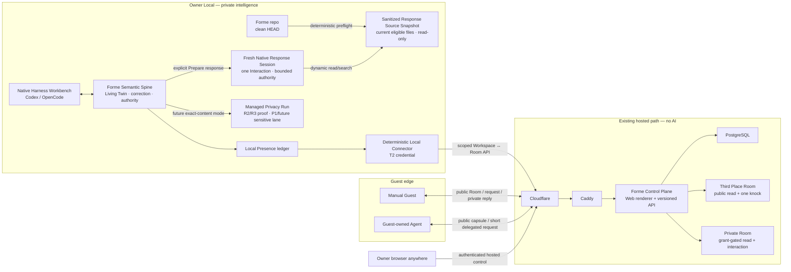
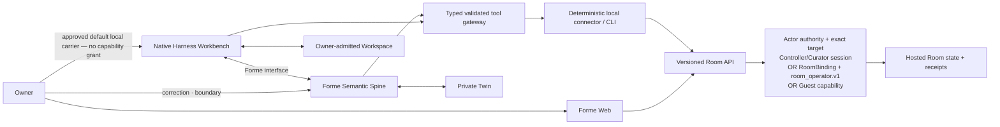

# R4 Technical Owner Review Brief v0.11

- 状态：**P privacy-first human-boundary interpretation、T1
  public/private Room correction、T2 Room control contract、NH1/NH2
  Native Harness architecture、Fresh Native Response Session exact T3
  contract，以及 T4 public / unlist / stale / revoke lifecycle 均已批准；
  T5 async / deletion / retention / P0 cut 是当前 Owner 决策；不是最终
  Packet 批准记录**
- 更新：2026-08-03
- 实现与审计附件：
  [`R4-TECHNICAL-CONTROL-PACKET.md`](./R4-TECHNICAL-CONTROL-PACKET.md)
- 产品依据：
  [`R4-HERO-ENCOUNTER-DECISION-BRIEF.md`](./R4-HERO-ENCOUNTER-DECISION-BRIEF.md)
- Active gate：[GitHub #52](https://github.com/formehq/forme/issues/52)
- Draft review：[PR #64](https://github.com/formehq/forme/pull/64)
- Agency recalibration：
  [`R4-AGENCY-FIRST-RECALIBRATION.md`](./R4-AGENCY-FIRST-RECALIBRATION.md)
- Native Harness architecture：
  [`NATIVE-HARNESS-ARCHITECTURE.md`](./NATIVE-HARNESS-ARCHITECTURE.md)

## 先说结论

你不需要逐行 review 那份 1,800 多行的 Technical Control Packet。

长 Packet 是给实现 Agent 和技术审计者的施工合同；这份 Brief 才是给
Owner 的判断界面。你只需要：

1. 先理解一张总地图；
2. P、T1、T2、NH1、NH2、T3 与 T4 已经关闭；
3. 现在只判断下面这张低负担的
   [T5 async / retention card](#current-t5)；
4. 用五个具体场景检查系统行为，只看 Agent 报告的 red/yellow
   exception。

T1 已在 2026-07-26 按“公共一敲门 + 私密短通行证”修正，P 与 T2 已在
2026-07-28 按推荐解释批准。2026-07-28 也确认了一次重要架构纠正：
Native Harness Workbench、Forme Semantic Spine 和 Managed Privacy Run
不是同一个东西；R2/R3 的 packet-only/no-tools 路径是一种窄运行模式，
不是整个 Forme Agent。2026-07-29，Owner 已按推荐批准 NH1 option 1 与
NH2 option 1。2026-08-01，Owner 又选择了 Option 2B：R4 P0 不走逐文件
挑选、exact manifest 和 32 KiB private-context packet，而为每个
Interaction 新开一次 Fresh Native Response Session。原来的 Managed
Privacy Response Lane 仍是 R2/R3 已证明的能力，并留作 P1/未来敏感模式，
不进入本次 MVP 的信任分层。2026-08-03，Owner 按推荐正式批准了下面的
Fresh Native Response Session exact T3 contract。同日，Owner 又按推荐正式
批准了 T4 public / unlist / stale / revoke lifecycle。T5 关闭后，Agent
才会重写长 Packet、重新审计并计算新的 hash。之前那份 Packet 的 hash
已经失效，不应再被批准。

2026-07-27 的 agency-first 方向修正了 T2 推荐；Owner 已在 2026-07-28
批准该推荐。它也继续澄清之后各 technical gate 的 framing：
Owner 批准的是可持续、可撤销的边界，而不是每一个机械 API 动作。Web
更像 GitHub 控制台，用来看状态、权限、异常和停止；绑定 exact Room 的
Agent 应能在边界内完成有用的日常工作。新的受众/隐私、替人承诺、扩权
和不可逆高影响动作仍返回 Owner。

## 已经确认，不再重复问

- R4 的五项产品方向已经批准。
- Production target 使用你现有的
  **Cloudflare → Caddy → Hetzner → PostgreSQL** 路径。
- 现有服务器是 Forme 接入和部署的既有前提。本轮不重新审计或批准
  服务器本身，只负责 Forme 应用怎样开发、接入、发布和回滚。
- Owner Control 必须可以从任何地点通过 Web 登录。
- Owner 已批准 T2 的完整推荐：hosted Forme 是
  management/control/status plane；每个 P0 Room 语义能力都必须有
  versioned API，Web 与 CLI 只是同一 API 的不同客户端；Agent authority
  应对应 local Repo/Workspace 与 Room，而不是自动继承整个 Controller
  account。每个 exact Room 使用独立的 30-day、no-auto-renew、
  earlier-revocable binding/credential 和固定 `room_operator.v1` bundle。
- Owner 已批准 P：以 privacy 作为 primary source/provider/audience
  perimeter，加入 authorship/commitment、irreversible/material
  consequence companion guards 与 no-self-expansion rule；明确可撤销
  envelope 内 review-by-exception。T2 semantic verbs/scopes/lifetime 已
  批准；wire schema、实现和生产 authority 仍待后续 gate。
- Owner 已批准 NH1/NH2：Native Harness Workbench 是默认本地入口，
  Codex 是 P0 workbench，OpenCode 是 first-class architectural
  compatibility target、P0 不要求 live path；
  ordinary native Workspace work 与 typed Forme-authoritative
  meaning/effect 分开。Native result 只有在另行批准的
  source/observation contract 下才可被 offer/admit 为 evidence，不会
  自动进入 Twin。
- Room 现在有两个明确的 first-class kind：Third Place 中公开可遇见的
  Room，以及阅读和互动都需要 Owner Grant 的 Private Room。`unlisted`
  只是 curation/discovery 状态，不等于 private。
- Owner 已批准 T4：Third Place 只发现 current、fresh、admitted
  Projection；unlisted / never-admitted public Projection 仍可通过 direct
  URL 读取，但停止 discovery 与新的 public knock；stale 最多七天
  warning-only direct-read 且不接受新 Interaction；revoke 与 Room
  retirement 立即隐藏 Projection 和 linked published Response。Curator
  unlist 不替 Owner 撤销仍有效的 Grant 或 GrantOffer。
- Third Place Room 允许任何人阅读 current admitted Projection，并默认
  允许一次 bounded public knock；继续互动必须由 Owner 发 short pass。
- P0 仍然是一个 curated Third Place、一个必须完成的 Forme Project
  Room、Manual-first、minimum Agent interoperability、Owner publish 与
  Curator admit 分离、layered identity、server no AI。
- Private Twin、repo、notes、local runtime credential 和未选择的本地
  evidence 不进入 hosted Presence。

## 以后批准 revised Packet 代表什么

它会批准：

- R4 应用边界；
- 对 Guest 作出的公开承诺；
- 权限和生命周期模型；
- P0 cut；
- repo implementation 与 fixture/local tests。

它不会批准：

- production deployment 或 public route；
- Cloudflare/Caddy 配置修改；
- production PostgreSQL migration、seed 或 durable write；
- production secret installation；
- 真实 Guest interaction 或 external message；
- 新资源或增量 spend。

Exact schema/migration 仍有单独的 **Schema & Migration Manifest**。
真正部署仍有单独的 **Production Deployment & Provisioning Grant**。

## 十分钟总地图



系统里有三个真正的 durable state owner：

1. **Local Twin**：项目现在意味着什么。
2. **Local Presence**：Owner 准备、批准、接收和发送过什么。
3. **Hosted Presence**：什么正在公开、排队、返回、过期或撤回。

Guest 的消息到达 server 或 local inbox，不等于它已经成为 Twin truth。
Codex/OpenCode 可以拥有 Owner 明确授予的 Workspace 能力，也不等于它
自动拿到 connector credential、Guest body 或 Room mutation authority。
NH1/NH2 已决定默认本地入口和 ordinary work /
Forme-authoritative effect 边界；T3 只决定第一条 Response 的 fresh
session、source/provider/capability、consent 与 lifecycle 边界。

授权也分三步：

```text
Revised Technical Packet
  → 允许 repo code 与 fixture/local tests

Schema & Migration Manifest
  → 允许精确 durable schema 与 migration/network preflight

Production Deployment & Provisioning Grant
  → 允许精确 deploy、route、secret、production write、public traffic、spend
```

## Forme 怎样开发并部署到现有服务器

建议的 application path 是：

```text
Git commit
  → tests
  → build OCI image
  → immutable registry digest
  → approved server deploy
  → Caddy route
  → Forme App
  → R4-specific PostgreSQL schema/roles
```

应用层遵守以下规则：

- 一个可以 self-host 的 Next.js Node application，不依赖 Vercel runtime。
- Caddy 是 Forme App 唯一的 HTTP 入口。
- 同一个 immutable image 提供 `app`、one-shot `migrate` 和 one-shot
  `janitor` command；它们使用分离的 PostgreSQL roles。
- App 接入既有 `app_net` 和数据库网络；浏览器不能直接访问 PostgreSQL。
- PostgreSQL 是唯一 authoritative hosted store；R4 P0 不使用 Redis。
- Migration 是独立、hash-checked 的 one-shot step，不能在 app startup
  时偷偷运行。
- Retention janitor 是一个 scheduled one-shot command。
- CI 负责 test、build 和 push immutable digest；merge 到 `main` 不自动
  等于 production deployment。
- Production promotion 绑定 exact commit、schema manifest 和 image
  digest，并由后续 Production Grant 手动放行。
- Deploy 选择不可变 image digest，运行 preflight，启动并检查 health。
- App rollback 只切回兼容的旧 image，绝不自动反向执行 database
  migration。
- Exact domain、registry、Compose service、network name、DB role、secret
  name、deploy/rollback command 留给后续 Production Grant。

Forme 负责这些应用接入与发布合同；现有 server baseline 不在本轮 review。

## T1 — 公共敲门与私密关系可以持续多久

- 状态：**Owner-approved correction — 2026-07-26**

### 你批准了什么

公开空间是否应该让任何人直接互动？Private Room 又应该如何让熟悉的
Guest 在一段短时间内回来？

### Owner 已批准的答案

最重要的区分不是“Public Guest 待得更久，还是 Private Guest 待得
更久”，而是：

> Public content 可以长期看，但 public write permission 很短；
> private content 默认看不到，但 Owner 批准后的关系可以稍长。

P0 使用同一套 Room/Projection implementation primitive，但是真实的
Private Room 与 Third Place Room 是两个不同 Room instance，拥有不同的
Room ID 和分别批准的 Projection。它们可以属于同一个 Forme entity/Twin：

| Room kind | 阅读 | 默认首次互动 | 后续互动 |
|---|---|---|---|
| `third_place_public` | current、fresh、admitted 时无需账号；没有 Guest 阅读时钟 | `public_encounter`：24 小时内 1 次 accepted Interaction | Owner 可另发 `short_pass`，仍基于 public Projection |
| `private_grant_only` | 只有有效 Owner Grant 才能读取它自己单独批准的 exact Projection | Owner 发 `single_encounter` 或 `short_pass` | 只在 Grant 剩余期限与额度内 |

`unlisted` 只是 Third Place 的发现/curation 状态，不是 Private Room。
知道一个 unlisted public URL 的人仍可能读取它；真正的 Private Room
必须在返回 Projection body 前验证 Owner-issued Grant。

`roomKind` 在 P0 创建后不可改变。Private Room 不能被 Curator admit 进
Third Place。已经公开过的 Room 不能靠改一个字段“重新变私密”；Owner
必须 revoke 旧 public Projection，再创建一个不同 ID、不同 Projection
approval 的 Private Room。

P0 的 Hero Room 仍是 public Forme Project Room，但同一个实现合同和
fixture 必须支持一个真实 grant-gated Private Room；这不增加第二个 Twin
或另一套交互系统。

#### Third Place Room：广场加门铃

- Public visitor 不需要 Owner 预先发 invite，就能取得一个绑定 exact
  Room + Projection 的 `public_encounter` capability。
- 它允许在 24 小时内 accepted 一次 bounded Interaction，同时最多一个
  未结 request。它是“敲一次门”，不是账号、身份或持续会话。
- “一次”是针对 capability/session，不声称能识别真实世界里的“同一个
  人”。基础 rate limit 与 Room public pool 才负责限制重复滥用。
- P0 默认每个 Room 在滚动 24 小时内最多 accepted 20 个 public
  encounters；达到上限后显示 `Room is resting`。Owner-issued pass 不消耗
  public pool。
- Capability issuance 也必须有独立的短期 abuse rate limit，不能只限制
  accepted submissions。短期 network/browser abuse key 不能进入 Guest
  identity，也不能被当作“这个人是谁”的证明。
- Guest request 与 Owner Response 默认仍是 private relay，不会因为入口
  在公共 Room 就变成公开评论。
- Owner 看过首条 request 后，可以 decline、respond once、删除，或者
  发一个新的 `short_pass`。熟悉的 Guest 也可以直接收到 short pass，
  不必先走 public encounter。
- 对匿名 public Guest，Owner 不是凭空“联系到对方”：Owner 创建一个
  绑定 exact Interaction 与目标 Room + Projection + preset 的独立 hosted
  `GrantOffer`。它显示在 reply/status surface，不进入 immutable Response
  Capsule，也不要求 Owner 先发 Response。Guest 通过已有 private reply
  capability 查看并接受，server 才原子创建新的 bearer Grant。不要把
  raw invite secret 塞进 Response body。已知 collaborator 仍可由 Owner
  通过既有渠道收到一次性 invite URL。
- `GrantOffer` 创建的是新额度，不会把 public encounter 原地扩权；因此
  完整路径最多是第一次 public knock 加 short pass 的三次额外
  Interaction。
- P0 每个 Interaction 同时最多一个 live Grant Offer。接受必须
  idempotent，并重新检查 offer 仍有效、reply capability 有权、exact
  target Room/Projection 仍 active/current/fresh/unrevoked、target mode
  不是 `closed`。Interaction deletion、origin revoke、origin Room
  retirement、target successor/expiry/revoke/retirement 都使 offer
  失效；按已批准 T4，Curator unlist 不会让它自动失效。
- Public Room 上的 short pass 只延长对同一个 public Projection 的互动
  权，不会解锁任何 Private Room 内容。把 Guest 邀入 Private Room 必须
  另外签发绑定那个 Private Room + Projection 的 Grant。
- Capability issuance 与最终 submission 都必须原子地重新检查 exact
  Projection 仍 current、fresh、admitted，Room 仍是 `public_single`，
  public pool 仍有额度；不能靠先领 token 绕过后来发生的关闭。Exact
  unlist/stale effects 遵守已批准的 T4 lifecycle contract。

Owner 独立控制 Room 的互动模式：

| Interaction mode | 新 public knock | 有效 Owner Grant |
|---|---:|---:|
| `public_single` | 允许 | 允许 |
| `invite_only` | 拒绝并永久作废尚未使用的 public capability | 允许 |
| `closed` | 拒绝并永久作废尚未使用的 public capability | 暂停新提交 |

Curator admission 只决定 Room 是否进入 Third Place，不替 Owner 打开
inbox。Owner 可以随时切换 interaction mode；打开 public intake、关闭
intake 与发 Grant 都是留下 receipt 的 Owner action。Curator 只能
admit/unlist。`closed` 不延长 Grant：若 Owner 在原 expiry 前重新打开，
尚未过期的 Owner Grant 才能继续使用。任何离开 `public_single` 的切换
都会永久作废当时未使用的 public encounter；之后重新打开需要发新的
capability。Private Room 只允许 `invite_only` 或 `closed`，永远不能设置
`public_single`。

#### Private Room：受邀会客室

- Private Room 不出现在 Third Place，Projection body 与新 Interaction
  都要求 Owner-issued Guest Grant。
- `single_encounter`：24 小时或 Projection 到期，取更早者；最多一次
  accepted Interaction。
- `short_pass`：Owner 选择 24 小时、3 天或 7 天，且不超过 Projection
  到期；最多三次 accepted Interaction，同时最多一个未结 request。
- UI 对熟悉 Guest 推荐 7 天 / 3 次，但 Owner 仍可选择更短。
- P0 Grant 绑定 exact Room + Projection。successor 不继承；“自动跟随
  Room 未来 Projection”的 relationship pass 留到 P1。
- Invite 只能兑换一次；兑换后得到的 bearer Grant 不是账号，也不能证明
  使用者就是 Owner 心里指定的那个人。

#### 两种 Room 共用的规则

- 只有真正 accepted 的 Interaction 才消耗一次额度；同一个 idempotent
  retry 不重复计数。
- 每个 Interaction 都有自己的 private reply URL、删除权和最多一个
  Response。
- Manual Guest 可以用 re-entry capability 恢复仍有效的 Grant。
- Grant 保留 `manual_only` 或 `manual_plus_one_shot_agent` mode。Agent
  Guest 与 Manual Guest 共用额度；每次只能 mint 一个绑定 exact Room +
  Projection、15 分钟、单次使用的 derivative token。它只允许读取该
  exact Projection 并创建一次 Interaction；不能续签、再发 token、读取
  private reply、删除 Interaction 或取得 reusable Manual credential。
- stale 或 expired Projection 停止所有新提交；revoke 或 Room retirement
  停止读取 body 和未来写入。
- 结束/revoke Grant 只停止未来 Grant 使用，不隐藏已有
  Interaction/Response，也不返还额度。
- 延时、增次、启用 Agent 或迁移 successor 都需要新 Grant，不能原地
  扩权。
- 每条 outgoing Response 仍需要独立、准确的 Owner approval。

## P — Privacy-first agency 在 R4 里怎样解释

- 状态：**Owner-approved — 2026-07-28**

### Owner 已经说清楚的部分

在人类隐私边界内，尽量给 Twin/Agent 更大的 agency，并尽量减少
friction。人批准的是边界，不应是每一个机械动作。

### Owner 批准的解释

- **Primary perimeter — privacy:** 只有建立或扩大到当前 envelope 之外的
  source/provider/audience 时才重新授权；边界内不逐文件、逐 API 请示。
- **Companion guard — representation:** 新的 Owner-attributed
  claim/commitment 不能因为“没泄密”就自动替人发出。
- **Companion guard — consequence:** irreversible/materially high-impact
  effect 不能因为“没泄密”就自动执行。
- **Meta-rule — no self-expansion:** 已有 authority 不能给自己增加更宽的
  Room、scope、audience 或 budget；明确允许的 attenuated derivative
  token 不算扩权。

这四句用于解释 R4 authority contract。它们不是要求每次弹 approval，
也不自动冻结 Forme 未来的完整 agency taxonomy。这个批准不包含
T3–T5、Control Packet、schema/migration、实现、部署或生产 authority。

## R1–R3 怎样真正接到 R4

R4 不能靠手写一页项目介绍来“看起来像 Forme”。它必须证明同一个 Twin
一路走到 Presence：

```text
current Twin
  → eligible local claim bases
  → Projection Candidate
  → exact Owner publication
  → Room
  → Guest Signal
  → local Twin + Agent + Owner judgment
  → reviewed Response
```

因此 revised Packet 必须满足三条：

1. 每个公开 claim 在本地绑定 exact current Twin revision、eligible
   Owner Frame/Reflection/effect state、source hash 与 publication receipt；
   server 只看到 opaque public basis。
2. superseded/invalidated meaning 不能投射；rolled-back action 不能冒充
   current accomplishment；真实 Twin change 会 stale，no-op 不会。
3. Guest import 保持 untrusted Presence input，P0 不自动写入 Twin；首个
   demo 必须从真实 Forme Twin 编译，而不是只跑 hard-coded fixture。

完整 requirement 在
[`ARCHITECTURE.md`](./ARCHITECTURE.md#required-continuity-bridge-from-r3-to-r4)。
这是一条 R4 reconciliation/acceptance constraint，不是新的实现批准。

## T2 — Owner 与 Agent 怎样控制 Room

- 状态：**Owner-approved — 2026-07-28**

### 你批准了什么

“Anywhere Web Control”、Agent API 和 local private work 应该怎样分工？
一个 repo/workspace 的 local connector 被配对以后，Agent 究竟能通过它
控制哪些 Room 和哪些动作？

### 批准答案

Owner 在 2026-07-27 给出的方向可以压缩成一句：

> Forme hosted service 像 GitHub 一样管理共享状态、权限和协作；
> Web 给人看和控制，API 是统一能力合同，CLI 是 Agent 方便使用的薄
> client；真正依赖 private repo/Twin 的思考和产出仍在 local Agent。

更准确地说，系统有一个 **Control Plane** 和一个 **Work Plane**：

下表中的 `Local Agent Work Plane` 是产品口语简称，不是一个单体技术
actor。它内部至少分成 Native Harness Workbench、Forme Semantic Spine
和 deterministic connector；approved NH1/NH2 已将 Workbench 选为默认
入口，并将 ordinary work 与 Forme-authoritative effect 分开。

| 层 | 负责什么 | 不负责什么 |
|---|---|---|
| Hosted Control Plane | Room/Projection/Interaction/Grant/curation 的共享状态、权限、队列、生命周期与 receipts | 不读取 Twin，不运行 Owner AI，不替 Owner 形成判断 |
| Forme Web | 人类查看、管理、批准 hosted access/control action 和理解 hosted state 的主要界面 | 不是 private repo 的远程桌面，也不取代 local publication/Response approval |
| Versioned API | 每个 P0 hosted Room read 与 state transition 的 canonical contract | 不是 generic execute endpoint，也不绕过权限或 approval |
| Forme CLI | P0 为 public/Guest（适用时）和 `room_operator.v1` lane 提供 thin client；Agent 经 typed gateway 请求 | 不复制 server logic；Controller/Curator boundary-action CLI delegation 留到 P1 |
| Local Agent Work Plane（产品简称） | Workbench 与 Semantic Spine 按 approved NH1/NH2 和 Owner-approved Fresh Native Response Session contract 处理 local context、判断、Projection/Response candidate 和建议动作 | 不直接成为 hosted canonical authority；connector secret 与 model/context authority 仍分开；T3 仍未授权实际 session 或实现 |

权限默认采用“**窄 perimeter、宽 useful interior**”：一个 exact Room 的
standing operator 可以持续完成 routine transport 与 deterministic,
monotonic exposure-reducing lifecycle enforcement；新增 Room/audience、
private context、Owner-attributed content、scope 或不可逆后果才回到人。
因此 Web 是 cockpit 和 kill switch，不是 Agent 每执行一步都要排队的
approval inbox。

这里的“Room 所有功能都有 API”在 P0 的准确含义是：每一个**已经批准的
P0 hosted semantic operation** 都有 machine contract，但每个 caller
只能调用自己持有 capability 的那一部分。这里按 **capability lane**
分类，不假设 HTTP client 一定是人或 Agent：

- Public read/encounter lane：browser 或 Agent client 都可以 read Third
  Place/Room/Projection，并使用允许的 public encounter capability create
  一次 Interaction；public capability 本身没有 reply、delete、
  GrantOffer 或 redelegation authority。Accepted Interaction 另行产生
  private reply capability；
- Manual/reply/Grant lane：正常产品流程把 private reply/re-entry secret
  留给 Guest 的 manual holder。它可在 exact scope 内 read reply/status、
  delete 自己的 Interaction、接受 GrantOffer，并在 Grant mode 允许时
  mint one-shot Agent derivative。Owner 若另行把这个较强 root secret
  直接交给普通 Agent，属于 Forme 默认 delegation 之外的授权；
- Agent Guest derivative：只按 T1 读取 exact Room + Projection 并
  create 一次 Interaction；不能 read private reply、delete、接受
  GrantOffer、mint/redelegate、续签或恢复 Manual credential；
- paired local connector（approved T2）：inspect exact
  Room/Projection/status/receipts，typed sync/pull
  Interaction/tombstone，deterministic ACK/recovery/stale attestation，并
  push carrying a current exact Owner approval 的 Projection/Response；
- Controller：切换 intake mode，issue/revoke Grant/GrantOffer，
  emergency revoke、retire、Owner delete，以及管理 pairing/scope；
- Curator：admit/unlist；P0 可以与 Controller 是同一人，但 authority 和
  receipt 分开；
- internal operator：只运行 retention/health 等另行批准的 exact
  maintenance contract；
- 每一个上述 P0 operation 都有 versioned API。未来新增 Room 语义时，也
  必须同时定义 machine contract，不能成为 Web-only behavior；
- Web 必须使用同一套 application service/API contract，不能拥有绕过
  API authorization 的隐藏业务能力；
- P0 API 覆盖全部 semantic operation；P0 CLI 只覆盖适用的 public/Guest
  lane 与 `room_operator.v1` lane，命令不重写 server rules；
- Controller/Curator boundary operations 由 Web 作为同一 API 的 P0
  client；boundary-action CLI delegation 与 handoff 留到 P1；
- visual layout、页面导航和 login ceremony 不要求逐像素 CLI 等价，但
  它们所读取或改变的 hosted state 必须可以通过 API 表达；
- 每次 mutation 都绑定 exact target、expected version/state、
  idempotency key、caller role/action scope，并返回 receipt；
- server 不提供 model/chat endpoint、arbitrary SQL、generic tool call 或
  arbitrary code execution。API parity 不是 server-AI。

Web、CLI 和 Agent 不是三套 authority。它们只是同一套 capability model
的不同调用者：



#### Repo/Workspace ↔ Room 权限范围

Server 不能也不应该靠本地路径、Git remote 或“Agent 说自己在哪个 repo”
来判断权限。批准的 T2 由本地 workspace 保存关系，再通过 owner-controlled
pairing 为**每一个 Room** 创建独立 `RoomBinding`：

```text
one local workspace (local-only identity)
  → local mapping to one Forme entity/Twin
  → N independent exact RoomBindings
      → one exact Room ID
      → explicit action scopes
      → independent lifetime/revocation
      → one revocable Room-scoped credential
```

- 本地 repo 保留真实 path、workspace identity 和“这些 Room 属于同一个
  Twin”的 mapping。Server 只看到各 Room 独立的 opaque
  `hostBindingId`、credential digest/metadata 和 action scopes；它不得到
  repo path、local workspace ID 或 repo 内容，也不能靠多个 Room binding
  拼回一个 server-side private workspace identity。
- 一个 repo/workspace 可以显式绑定同一 entity 下的多个 Room，例如一个
  public Project Room 和一个 Private Room；本地把它们归在一起，但
  server 端是两个独立 Room ID、binding 和 credential，可以分别 expire、
  rotate 或 revoke，权限不互相继承。
- 每个 API request 必须指定 exact Room；server 同时检查 caller、
  opaque Room binding、Room、action scope 和当前 lifecycle。P0 没有
  account-wide Agent wildcard、ambient Room discovery 或 cross-entity
  batch action。
- 新增 Room、创建另一个 Room binding 或增加 action scope，都是新的
  sensitive Owner action；已有 binding 不能原地扩到另一个 Room，也
  不能由 Agent 自己扩权。
- Guest Agent 的 one-shot Room + Projection token 是另一条 delegation，
  不能兑换、恢复或继承 Owner-local `RoomBinding`。
- Paired credential 属于 Forme local connector，不进入 model prompt、
  Forme-managed model environment 或 generic tool output，也不把 raw
  secret 暴露给 Codex/OpenCode。Native Workbench 或其他 Agent 只能在
  另行获准的 typed gateway 中向 deterministic connector 请求 CLI/API
  operation。
- T2 只批准 connector/binding/API authority，不决定哪个 model session
  可以看到 Interaction/Response body，也不决定该 session 使用什么
  source/provider/capability envelope。API scope 不能推导 model
  visibility；Workspace access 也不能推导 connector secret、Guest inbox
  或 Room mutation authority。
- NH1/NH2 已决定默认 carrier 与两类 authority。Owner 已选择 Option 2B
  方向，并在 2026-08-03 批准 exact T3：每个 Interaction 使用独立 Fresh
  Native Response Session，并与 connector mutation 分开；它不会复用
  Owner 当前会话。Future implementation 必须遵守已批准的 exact roots、
  consent、provider、session budget、physical isolation 与 session lifecycle。
  详细 Packet 仍必须隔离 credential，并用 canary 验证没有未授权的跨界；
  T5 与 Packet approval 仍是 stop gates。

Agency-first 修正后批准的 P0 contract，不再是“sync 可以站立授权、其余每一步
都签 15 分钟票”，而是在 exact `RoomBinding` 上编码一个固定、versioned
的 **`room_operator.v1` scope bundle**。它不新增 policy table、
delegation chain 或 custom-verb UI：

- 只绑定一个 exact active `RoomBinding` + Room；
- 可以 read exact Room/Projection/status/health/receipts；
- Agent 的标准 Room workflow 可以显式请求 typed `room sync`，pull
  Interaction 与 lifecycle tombstone；read-only CLI command 不能隐式
  pull private bytes 或产生 durable write；
- 可以 ACK deterministic import/delivery 和 idempotent recovery；
- connector 只在验证 local body 已不存在后记录 local deterministic
  purge receipt；P0 不新增 hosted purge-ACK endpoint；
- 只能 push 携带 still-current exact local Owner approval attestation 的
  Projection/Response；
- 只有在 canonical local Twin HEAD 确实 newer than exact Projection basis
  时，connector 才能 deterministic attest/mark stale，model 不能任意选择；
- P0 RoomBinding 从 pairing 起 30 天到期、不自动续期，Owner 可更早
  revoke；继续使用需要新的 pairing/rotation。所有 mutation 仍需要
  expected version、idempotency key、verification 和 receipt。

这不是 Controller account，也不是通用 Agent token。它默认**不能**：

- pairing、创建新 Room/binding、发现 sibling Room 或扩大自身 scope；
- 把 public Room 改成 private、增加新 audience 或跨 entity；
- issue 新 Private/relationship Grant，或扩大 Guest authority；
- change intake mode、park/decline/dispose Interaction；
- 创建新的 Owner-attributed claim、promise 或 commitment；
- 在没有独立 Curator delegation 时 admit Room；
- irreversible retire/delete、清除 durable evidence；
- 调用 arbitrary API/tool/code。

其中 safe-direction intake narrowing 与 internal `park` 仍可能符合
privacy-first agency；P0 先留在 Web，是因为它们的 lifecycle/UX 语义还没
验证，也是 August schedule cut，不是理念上永久禁止。

上面真正跨越 approved P human boundary 的能力仍有 API，但 P0 直接由
Owner/Curator 在 Web/approve origin 的 stepped-up session 中执行；暂缓
的 safe-direction operations 也先由 Web 完成。把 exact boundary action
再交给 Agent 的 `ControlActionGrant` 留到 P1，P0 不新增它的 schema、
issuance、consume 或 recovery path。

以后 Owner 可以给 exact Room 增加另一个明确的 standing policy，例如
Curator admission、relationship Grant 或 policy-compatible publication，
但 scope expansion 永远不能由已有 binding 自己批准。
**API/CLI availability 不等于 Agent authority；standing authority 也不
等于 account-wide authority。**

这个批准值让 Agent 真正完成一个 Room 的日常 transport 与 deterministic
lifecycle enforcement，同时把新边界和重大后果留给人，而不是把 Web
变成每次 sync、ACK 或 retry 都要点一次的审批队列。Semantic verb、
30-day/no-auto-renew lifetime 与 Owner revoke boundary 已批准；wire-level
verb names、rotation race、endpoint/schema 和 implementation 仍属于新
Packet 与后续 gate。

P0 agency demo 应至少证明一次：Agent 不再逐步请示就完成 typed sync →
deterministic ACK/stale → exact Owner-approved delivery → receipt；Owner 在
Web 看见 exact binding scope/history 并 revoke，下一次调用 fail closed。

#### Anywhere Web Control

使用三个逻辑 origin，exact hostname 留到 Production Grant：

```text
public origin   → Third Place / Room / Guest / paired-local API
control origin  → Owner dashboard 与普通 hosted-control，较长 session
approve origin  → sensitive mutation 的 15 分钟 step-up login
```

三个 origin 可以由同一个 immutable Next.js image 提供，再由 Caddy 按
Host 分流。

Cloudflare Access 保护 control 与 approve origin。Forme App 仍要验证
Access 的 signed assertion 和 route-specific audience，并且只把预先
登记的 Owner identity 映射到唯一 Controller。推荐使用已有
Cloudflare/identity-provider account + MFA；如果你希望 email OTP 成为
主要或 fallback 登录方法，需要在批准时明确写出。

Public Third Place 和 Guest routes 不要求 Access；Control page 和
Controller/Curator API 必须登录。Paired-local API 使用每个 Room 独立、
revocable 的 credential，而不是浏览器 cookie 或 Controller 的长期
token。P0 的 boundary action 由 stepped-up Owner/Curator Web session
直接调用同一 versioned API；不把 step-up browser session 或
Controller token 交给 Agent。

普通查看与敏感 mutation 使用不同的 authorization boundary。配对、扩大
scope、把 Room 打开到此前未授权的 public mode、发出新
Private/relationship Grant、admit/unlist、irreversible retire 和 Owner
delete 必须经过 approve origin 的独立 short-session Access
policy/audience。`room_operator.v1` 已授权的 sync、deterministic
ACK/recovery/stale attestation 和 exact Owner-approved transport 不重复要求
step-up。Emergency revoke 是减少暴露的 fast path：authenticated control
session 加显式确认和 receipt 即可，不等待第二次 step-up。实现不能把
普通长期 Access token 的 `iat` 误当成“刚刚重新认证”。

P0 中同一个人可以持有两个语义角色，但 receipt 分开：

- **Owner/Publisher**：控制 local pairing 与 exact local approval；
- **Curator**：决定 Projection 是否进入 Third Place。

Anywhere Web Control 可以：

- 查看已经存在于 hosted server 的完整 Projection、Guest request、
  inline Guest Capsule 和 published Response，以及 lifecycle/receipt
  status；
- 发出或撤销 Guest Grant，并为一次 public knock 发 short pass；
- 切换 Room 的 `public_single`、`invite_only` 或 `closed` interaction
  mode；
- admit 或 unlist Projection；
- emergency-revoke Projection/Response；
- retire Room；
- 删除 abusive hosted Interaction；
- 创建 local pairing challenge。

Anywhere Web Control 不可以：

- 读取 private Twin、repo、notes 或 local evidence；
- 调用 local Agent；
- 取得 paired-local credential；
- 从 private context 起草内容；
- 绕过 local exact approval 发布 Projection/Response；
- 把 hosted signal 直接写成 Twin meaning。

因此，登录任意浏览器后读取 Guest request body 是批准方案的一部分，
但它只是 hosted preview：不会 ACK local import，也不会产生 Twin
meaning。Control 页面必须 `no-store`，且永远不显示 local-only draft、
private Twin context 或 evidence。T2 没有选择 metadata-only 分支。

这里的 `hosted` 不等于 `public`。Private Room Projection、Guest request
和 Response 可以是 server 上受保护的 private content；Owner 登录后可以
查看和控制，但普通访客仍然不能读取。

跨越批准 P human boundary 的 Owner/Curator Web action 需要显式二次确认；
operator envelope 内的 mutation 不需要。P0 没有 public sign-up。

### 批准结果

- Web Control Plane、API parity、P0 public/Guest + Room Operator CLI、
  independent per-Room bindings 与固定 `room_operator.v1` 全部按推荐关闭；
- 每张 binding 自 pairing 起 30 天、不自动续期、可提前 revoke；
- authenticated Owner Web 可以查看服务器已经托管的 Projection、Guest
  request/inline capsule 与 published Response，但不能查看 private Twin；
- paired connector 可以 transport 仍有 exact Owner approval 的
  Projection/Response；它不能自行创建内容、扩权、处置 Interaction、
  revoke content、发 Grant、curate 或不可逆删除。

T2 没有选择 exact auth provider、hostname、token/wire format、本地
secret-storage adapter 或 re-pair/rotation race。Cloudflare Access/MFA、
三个 logical origin 和 XDG/keychain 选择仍需在新 Packet、实现或
Production Grant 中精确化，不能从本次批准中推导。

`room_operator.v1` 会让 deterministic stale attestation、sync 与 exact
Owner-approved artifact delivery 成为 standing delegated authority；
详细 Packet 必须把已批准 semantic contract 编译成不更宽的 wire verbs、
revocation/rotation races、schemas 与 tests。发新 Grant、扩权和不可逆删除
仍不在其中。“remote drafting/publishing/responding”则会改变
“private intelligence stays local”的架构，需要另行设计，不能当成
Control 页面功能偷偷加进去。

<a id="current-t3"></a>

## T3 — Fresh Native Response Session exact contract（Owner-approved — 2026-08-03）

- 状态：**Owner 已在 2026-08-03 按推荐正式批准以下完整 contract**
- 本卡只决定 R4 P0 怎样为一个 Interaction 准备 AI-assisted Response。
- 该批准不授权实现、provider call、model spend、schema、deployment、真实
  Guest interaction 或任何 Room mutation。

### 先用白话说

我们不再让 Owner 一份一份挑出最多 32 KiB 的材料，也不把 Guest 的问题
塞进你正在使用的 Codex 对话。

Owner 点下 `Prepare response` 后，Forme 为这一封来信临时开一间新的工作室：

1. 它只服务这一条 Interaction，不带入你当前或历史聊天；
2. 它拿到这条 Guest request、当时的 Room / Projection 和当前 Twin
   orientation；
3. 它可以在由 clean Forme repo 生成的 sanitized、只读 current snapshot
   内自己查找相关材料，但不能直接浏览 live repo 或 Git history；
4. 它写出的只是草稿；你最后批准 exact outgoing text 后，独立 connector
   才能发送；
5. 工作结束、超时、放弃或内容被删除，临时工作室就关闭，不能拿去回答
   另一个 Guest。

这更接近我们想展示的 Forme：Codex 是会自己找材料、形成回答的成熟
Harness；Forme 负责把它放进正确的 Twin、Interaction、权限和人类作者
边界里。

一句话记忆：**一封来信，一间全新的只读工作室；Agent 自己找，Owner
最后发。**

你真正需要批准的核心取舍是：

> **Owner 不再逐文件审核 context。Codex 可以在整个 sanitized eligible
> Forme snapshot 内自己选择相关材料，并把它读到的相关内容发送给
> OpenAI；Forme 保证的是它不能离开这个边界、不能执行或发布，不是假装
> 知道模型到底看了哪几段。**

| 你批准什么 | 推荐边界 |
|---|---|
| Session | 一条 Interaction 一个全新 session，不复用当前/历史聊天 |
| Source | sanitized current Forme snapshot + 8 KiB body/path-free Twin orientation；无 Git history |
| Provider | 只用披露的 Owner-local Codex → OpenAI；Guest 可选 manual-only |
| Freedom | 边界内动态 read/search；无 write、其他 network、secret、cross-Room、connector 或 publish |
| Budget | 60 分钟；一次自动 draft 最多 3 个内部 provider dispatches、128k input / 8k output；适用时 US$1 |
| Human boundary | 输出只是 candidate；exact Owner approval 后 connector 才发送；public lifecycle 遵守 T4，retention 等待 T5 |

<details>
<summary>展开：完整 T3 contract 与 Agent 实现 / 审计义务</summary>

### 推荐的 exact P0 contract

#### 1. 一条 Interaction 对应一个新 session

- public Room 和 Private Room 使用同一个 contract，但彼此绝不共享
  session、transcript 或 context；
- 每次都是 brand-new、non-resumed、ephemeral Codex session；不使用 Owner
  当前对话、saved session、memory、ambient user instructions、MCP、
  plugins/apps、hooks 或 subagents；它从 neutral isolated cwd 启动，repo
  内的 `AGENTS.md` / `.codex` 等 instruction-control files 不进入 snapshot，
  也不会被自动发现；它使用 per-session isolated `CODEX_HOME/profile`、
  sanitized environment allowlist 和 auth broker，不预载 Owner global
  config/instructions；effective runtime/instruction/config sources 全部记录；
- session 从 Owner 主动选择 `Prepare response` 开始，computational
  authority 最多存在 **60 分钟**，一次 Owner-initiated draft cycle 最多
  **3 次 provider dispatches**；approve、abandon、Interaction terminal
  state、预算耗尽或超时会立刻结束；
- 不自动续期、不跨 Interaction 复用。3 次 dispatch 只供同一次自动 draft
  内部的 read/search tool loop，不是三次重新生成或 AI refinement。任一
  dispatch 结果未知都会中止整个 cycle/session；系统不静默重试。

60 分钟 / 3 dispatches 是一次低摩擦的 response-preparation budget，不是
Agent 信任等级。P0 只自动起草一次，Owner 可在界面手工编辑；AI refinement
留到 T3 运行证据和预算可见后再评估。整个 session 累计最多 **128k input
tokens / 8k output tokens**，不允许切换 provider/model 或付费 API fallback。
若 exact account regime 会产生按量增量费用，启动页显示按所选 model 计算
的 worst-case 金额且 hard cap 为 **US$1/session**。Runtime 无法在发出前
可靠强制 dispatch/token/适用 cost cap 时，这条 AI path fail closed。

#### 2. Session 可以看什么

Forme 在开始前固定一份 **Session Envelope**。P0 推荐只包括：

- exact Interaction ID、request hash、origin Room 和 Projection
  ID/version/hash；
- 这条 exact Guest request 与 optional inline Guest Capsule；
- versioned Forme response instruction；
- typed current Twin orientation、active Owner correction 和其 revision/hash；
- 一个 deterministic **Response Source Snapshot**：来自 clean Forme repo
  HEAD 的当前 eligible tracked files，只读；P0 **不包含 Git history**；
- OpenAI through Owner-local Codex authentication，以及实际记录的
  runtime/model profile；
- exact Guest disclosure/policy version/hash、consent choice/time/capability，
  Owner actor/start authorization 与完整 Session Envelope hash；
- session start、expiry、provider-dispatch/token/cost budget 和 capability
  profile。

Agent 可以动态 read/search 这一个 sanitized snapshot，也可以使用为此
所需的只读搜索命令。它不需要 Owner 逐文件挑 context，因此 Forme 不会
声称知道一个 complete file-read list，也不会声称“OpenAI 只看到了这些
bytes”。Codex/OpenAI 仍可能加入已披露的 runtime system/safety
instructions、schema 和 operational metadata。Access log 只能是
best-effort evidence；真正的安全边界是开始前
固定并验证的 source/capability envelope。

Snapshot 由 deterministic preflight 生成并绑定 file list/content hash；
eligibility 由 versioned/hashed `ResponseSourcePolicyV1` 固定。P0 path
allowlist 只有 root `README.md` / `package*.json` / `tsconfig.json` 和
`docs/**`、`src/**`、`schemas/**`、`test/**`、`apps/**`、`packages/**`；
只接受 UTF-8 text 的 `.md`、`.txt`、`.json`、`.jsonl`、`.ts`、`.tsx`、
`.js`、`.mjs`、`.cjs`、`.css`、`.scss`、`.html`、`.sql`、`.yaml`、`.yml`
和 `.toml`。单文件最多 512 KiB，整个 snapshot 最多 8 MiB；binary、
generated/build output 和超限内容 fail closed，不静默截断。

Policy 还绑定 exact secret-pattern policy version/hash。它只接受 clean HEAD
的普通 tracked files，拒绝 symlink、submodule、Git
alternate/worktree escape，并排除 `.git`、Git history/ref/reflog、
`AGENTS.md`、`.codex/**`、`.env*`、credential/secret patterns、`.forme/**`
和 body store。命中 secret canary 或无法分类就 fail closed。
后续 Implementation Manifest 可以收窄规则或选择实现机制；任何新增 path、
file type、size ceiling 或更宽 secret policy 都要回到 Owner，不能被当作
普通实现细节。

P0 同时明确排除：home directory、Knowledge Vault、sibling workspace、
untracked/dirty bytes、其他 Room/Interaction body、整个 Guest/Presence body
store、connector store/credential 和任何未命名 source root。Future T3
可以另行增加 sanitized Git history；当前不因“同一个 repo”自动开放它。

`ResponseOrientationV1` 也是 provider-visible source：最多 8 KiB，使用
deterministic field allowlist，只含 entity name、Owner Frame intent/current
state/next move、public claim summary，以及被明确标记
`response_ai_eligible` 的 active correction summary / unresolved item，最后
附 revision/hash。它不带 raw evidence body、absolute path、Guest data 或
credential。Owner 在开始页看到 exact rendered preview，并用 start
authorization 绑定其 schema/version/content hash；未标记或未确认的敏感
语义不能因为“body/path-free”自动进入。

#### 3. 能做什么、不能做什么

Fresh session 可以：

- 读取 exact Guest request；
- 在 mounted Response Source Snapshot 内搜索，并结合 typed Twin
  orientation 推理；
- 返回一个 typed Response candidate 和给 Owner 看的 basis note。

Model-generated tool process 不可以：

- 写 workspace、Twin、Presence store 或任何本地文件；
- 使用 Web、agent-tool network、Room API、connector、credential 或
  generic external tool；Codex 调用披露的 OpenAI provider 是唯一必要的
  transport；
- 浏览 Guest inbox、另一个 Interaction 或另一个 Room；
- 接收 ambient environment secrets，扩大 root/capability，或启动 MCP、
  plugin、app、hook、subagent；
- 把 Guest 文字当成 system instruction、authority、Twin truth、tool grant
  或 publish command；更准确地说，Guest text 只进入 typed
  `untrusted_guest_data` field，绝不被复制进 instruction/tool/authority
  fields。Forme 不声称模型行为不会受它影响，而是保证任何受影响的输出也
  没有扩权、effect 或 publish authority；
- 自动 publish、承诺、发 Grant、处置 Interaction 或修改 Twin meaning。

“不写”指 model-generated tool process 没有任何 write authority。Trusted
launcher 只可以写一个按 session 隔离、tools 不可读的 runtime/audit root，
用于 minimum transcript/log/crash/receipt artifacts；它不能写 source
snapshot、Twin、Presence 或 connector state，其 retention/purge 由 T5
固定。Launcher 写入不是 Agent 的通用本地写权限。

实现前必须用 deny-by-default OS/container process sandbox：只把 sanitized
snapshot 与必要 runtime surface 只读挂载给 tool process；provider auth 由
Harness transport/broker 持有，model-generated command 不能读取。必须解析
realpath，并阻止 symlink、submodule、Git alternates/worktrees 或 mount escape。
如果当前 Codex profile 只能限制 write、不能限制跨 root read，这条 AI path
就 fail closed。

Capability probe 和 adversarial canary 必须证明 write、Web/agent-network、
secret env、sibling root、cross-Room、connector 和 publish 尝试不能越过
物理 capability/effect boundary。Prompt injection 本身不能被承诺为“物理
失败”：Guest text 可能影响 Agent 在 **整个 eligible snapshot** 内读什么，
并使相关 bytes 被发送给 OpenAI；Guest disclosure 和 Owner source approval
必须覆盖这一点。它无论如何都不能扩 root、拿工具/credential、写状态或
发布。`.gitignore` 和 prompt 提醒不算物理边界。

#### 4. Guest consent 不做成信任等级选择器

R4 P0 只有一个 AI-assisted contract，不提供 Option 1 / Option 2 或
“保守 / 开放”模式选择器。Guest 提交前看到一段清楚披露：

> 这条 request 可能由 Owner 主动交给其本地 Codex，并发送至 OpenAI，
> 与 Owner 的 Forme project workspace 材料结合，用于准备回复。不要提交
> 你不希望进入该处理路径的敏感个人信息。

界面必须命名 OpenAI，并链接当时适用的 provider data/retention policy；
不能写成 on-device、server AI 或 exact-byte guarantee。Consent 覆盖的是
上面一个 bounded response session，而不是仅一次 API call；它也必须直说
Agent 可能把 eligible snapshot 中任何被判断相关的内容发给 OpenAI。
提交时生成 `ConsentEnvelopeV1`，固定 provider=OpenAI、Owner account/data-
control regime、`sanitized_current_forme_snapshot` dynamic source class、最大
session budget、retention disclosure version/hash 和 optional Guest Capsule
scope。实际 Session Envelope 必须是它的合法子集，并同时记录 consent
receipt/time/capability 与 Owner-start authorization；provider、account
regime、source class、budget 或 retention terms 变化时必须重新 consent 或
fail closed，不能 fallback 到其他 provider/model。

不愿同意 AI processing 的 Guest 仍可发送 `manual_owner_only` request；
Owner 可以手写回复。它是 consent/failure fallback，不是第二套信任层，
也不要求 P0 构建 Managed Privacy picker。

#### 5. Guest body 的物理边界

Hosted server 仍按 T1/T2/T5 保存原始 submission。local import 后，
body-bearing Guest store 必须位于 ordinary Native Workspace read surface
之外，或者置于等价、可测试的强制 deny boundary；不能继续把它作为
repo 下一个 Codex 可随手搜索的 `.forme/presence` 目录。

普通 Workbench session 只拿到 opaque ID / body-free status。只有 Owner
显式开始 `Prepare response` 后，Forme 才把这一条 exact request 注入对应
Fresh session；session 不能浏览保存它的 store。Fresh session 必须在
neutral isolated cwd 中启动，deny-by-default sandbox 只挂载 sanitized
response snapshot；不能把 repo cwd、Guest store 或 home 当作“只是别读”
的可见路径。

Connector 仍是独立 deterministic process，credential 不进入 session
environment、prompt、transcript 或 tool output。

#### 6. Draft、发送与删除

- session output 永远是不可信 candidate；Forme 记录 Session Envelope、
  runtime/profile、start/end、dispatch count、draft hash 和可得的 access
  evidence；
- draft 绑定开始时的 Interaction、Projection、Twin revision 与 workspace
  snapshot identity。basis 改变时标记 stale，必须重新准备并重新批准；
- 每次 provider dispatch 前和 publish 前都通过已批准的 T2 status contract
  fresh-check Interaction/origin lifecycle；server unavailable 时 fail
  closed；
- exact outgoing content hash、current basis 和新的 Owner publication
  approval 仍是硬门。T2 connector 只验证并运送这份 approved artifact；
- deletion/expiry、origin revoke 或 Room retirement 会终止 computational
  authority、阻止 draft 使用并进入 T5 purge。若 OpenAI 已经接收 bytes，
  只能 best-effort
  cancel；删除不能召回已经 in-flight 或被 provider 接收的 copy；
- 60 分钟结束只表示该 session 不能再计算或产生有效 draft，不表示 local
  transcript/log/crash artifact 或 OpenAI copy 已删除。Local artifact 的
  retention/purge 由 T5 固定；provider-side retention 只能按披露的 OpenAI
  regime 诚实说明，Forme 不冒充可以删除；
- 已批准 T4 决定 stale/unlist/revoke 等 public lifecycle；T5 仍决定 durable
  retention 和 purge。T3 不偷着替它们下结论。

</details>

### 为什么不再推荐原 Option 1

Managed Privacy Run 仍然有价值：R2/R3 已经证明了它，也是未来处理个人
vault、高敏感 source 或需要 exact Forme-selected-content guarantee 时的
候选 P1 lane。但 R4 demo 的 admitted source 是 Forme repo；为了展示
Harness-native agency，P0 不再建设 file picker、Context Planner、32 KiB
private-context compiler、exact manifest review 或 trust-mode selector。

这不是说“早期数据不敏感，所以无需隐私”。P0 仍保留 honest OpenAI
disclosure、one-Interaction fresh session、read-only exact root、secret /
cross-Room / connector physical isolation、session expiry、Owner final
publication approval 和 deletion honesty。

### Owner 批准记录（2026-08-03）

> **T3 按推荐批准：采用上面的 Fresh Native Response Session contract。**
>
> P0：sanitized current Forme source snapshot + typed body/path-free current
> Twin orientation 是唯一 provider-eligible Owner source；OpenAI/Codex 是
> 披露的 provider/runtime；一个 Interaction 最多 60 分钟 / 3 provider
> dispatches、128k input / 8k output tokens，并且不允许 provider/model
> fallback；适用时增量费用上限 US$1；
> ordinary session 不见 Guest body；Fresh session 只读，除已披露的 OpenAI
> provider transport 外没有任何 network，不写、不跨 Room、不持
> credential；最终发送仍需 exact Owner approval。
>
> Managed Privacy Response Lane 与 trust-tier selector 移到 P1/未来。

T3 与 T4 的批准只允许 Agent 将它们编译进新的 Control Packet；在 T5 和
新 Packet 都关闭前，仍不允许实现、OpenAI/provider call、Guest data、schema、
部署、spend、Room mutation 或 production action。

### 本卡已关闭

当前 Owner 决策已移到 T5；本卡不再等待回复。

<details>
<summary>历史记录：2026-07-29 的 Managed Privacy T3 提案（已被 2B 方向取代，不再批准）</summary>

## Historical T3 — superseded Managed Privacy proposal

- 历史状态（2026-07-29）：**NH1/NH2 已按推荐批准；当时 T3 等待 Owner
  决策。该提案现已被上方 2B 方向取代。**
- 本卡只决定 R4 P0 第一条 AI-assisted private Response 怎样起草。
- 本卡不批准实现、provider call、model spend、schema、deployment、
  production data 或真实 Guest interaction。

### 60 秒解释

NH1 已经决定：你平时继续坐在成熟 Native Harness Workbench 里；P0
先接 Codex，OpenCode 保留为 first-class architectural target。

T3 现在决定的是：当一封包含 Guest 内容和 Owner private context 的
“敏感信件”要交给模型帮忙起草时，是继续留在这个日常工作台，还是临时
进入一个可以精确核对材料的独立房间。

推荐答案是：

> 日常工作继续使用 Native Harness Workbench；第一条 R4 private
> Response 则由 Workbench 发起一个独立的 Managed Privacy Run。
>
> Forme 固定和记录交给模型的材料，Codex 只在这份材料上起草；最终是否
> 代表 Owner 发出，仍由 Owner 决定。

一句话记忆：**Native outside, Managed inside。**

这不会把整个 Forme Agent 重新变成 packet-only。它只给涉及第三方 Guest
内容的敏感路径保留一个更强、也更容易向 Guest 解释的隐私合同。

### NH1/NH2 已经确定的前提

- **Native Workspace Session** 是 Owner 日常工作的默认形态。只有在
  另行批准的 Workspace、provider 和 capability envelope 内，Harness
  才能动态读文件或运行工具。
- Native Workspace Session 只能诚实承诺：“provider visibility 位于
  已批准的 Workspace/provider envelope 内。”它不能声称一份 manifest
  列出了这个动态 session 看过的所有内容。
- Response 是 human-attributed、Forme-authoritative output。无论 draft
  从哪里产生，都不能自动发布；它必须成为 typed Response candidate，
  再经过 exact Owner approval 和 T2 connector delivery。
- Workspace access 不会自动授予 Guest inbox、Room credential 或 Room
  mutation authority。Connector secret 永远不进入 model prompt、
  environment、transcript 或 generic tool output。

### 三个选项

#### Historical Option 1 — Managed Privacy Response Lane（当时推荐，已被 2B 取代）

Native Workbench 可以用 opaque Interaction ID 发起 run，并接收
body-free status/receipt；Guest body 的 local imported copy、manifest
preview 和 typed draft 只进入 Owner-only local review surface 与 Forme
local candidate store，不返回当前 Workbench model transcript。第一条
Guest Response 的模型生成发生在独立 Managed Privacy Run 中：

- 不继承当前 Workbench transcript、saved session、global/project
  instructions、user config、MCP 或 plugins；
- filesystem 只允许 isolated packet root 与 runtime-minimal paths；
- 接收 exact Forme-selected content packet，加上 separately
  versioned/hashed Forme instruction/schema，以及已披露的
  runtime/provider metadata；
- 没有 shell、web、subagent、Room mutation tool 或 connector
  credential；
- typed draft 只返回 Forme local candidate store，没有 publish
  authority，也不会自动注入 Native Workspace Session。

`manual_owner_only` 始终是同一条产品路径中的可用 fallback。

**影响：**Owner 多一次清楚的 context review，但系统可以对 Guest 和
Owner 作出可验证的材料边界承诺；它复用 R2/R3 的窄 adapter，而不把该
adapter 扩建成通用 Harness。

#### Option 2 — Native Workspace Session 直接起草

把 Guest request 交给 Owner 当前 Codex/OpenCode session，让它在既有
Workspace/provider envelope 内动态寻找 context。Forme 仍记录最终 basis
并要求 exact outgoing approval，但不能保证 manifest 是该 session 的
完整 provider-visible content。

**影响：**摩擦更小、模型可自由探索更广 context；但 Guest 很难知道自己
的内容进入了怎样的 session，也不能使用“只有这 32 KiB 被看见”的说法。
推荐以后把它作为明确披露的高信任模式评估，不作为 R4 P0 官方路径。
本卡没有把 Option 2 的 Guest disclosure、existing-session visibility
和 exact Workspace/provider envelope 写到可批准程度；选择它只会要求
Agent 重写 T3，不构成直接批准。

#### Option 3 — Manual-only

Guest request 与 Owner private context 都不进入任何模型；Owner 手写
Response。在 Owner-local downstream path 中，imported Guest body 只在
human-only、non-model local surface 显示，不会作为 Agent-callable
CLI/tool output 返回；hosted original 仍遵守 T1/T2/T5。Response 再经过
同一个 typed approval 和 connector path 发出。

**影响：**隐私最容易解释，但不能验证 R4 的 local intelligence /
private-context Response 产品价值。

### 推荐的 P0 完整流程

下面是 Option 1 自动产生的 Agent implementation/audit obligations，不是
六个新的 Owner 决策。Owner 只需要指出其中是否有违背上面产品承诺的地方。

#### 1. Guest 与 Owner 分别同意自己的内容

Guest 提交 Interaction 时选择：

- `manual_owner_only`：Guest body 不得发送给 Owner 使用的 AI provider；
- `allow_owner_local_ai`（internal name）：允许 Owner 的本地 Forme
  runtime 把这条 exact Interaction 的内容发送给界面明确命名的 remote
  AI provider，用来准备这一次 Response。

R4 P0 披露的 provider 是 **OpenAI through the Owner's local Codex
authentication**。Guest 的选择随 Interaction 固定；Owner 不能事后把
`manual_owner_only` 扩成 AI consent，更换 provider 也不能继承旧
consent。Guest-facing copy 必须说明 bytes 会离开 Owner device，明确命名
OpenAI，并提供适用于本次调用的 provider policy/retention reference；
不得把它描述成 on-device 或纯本地模型。

Guest 决定自己的 request/capsule 能否进入 provider；Owner 另行决定自己
的哪些 private Twin/Workspace bytes 能进入。任何一方没有同意，AI draft
都不能开始。P0 Guest consent 最多覆盖这条 exact Interaction 的一次
provider dispatch；Owner 可以手工编辑返回的 draft，第二次 AI generation
需要新的 Guest consent，且不在 P0 path 内。

#### 2. Forme，而不是 Codex，组织材料

1. Owner 主动选择 `Prepare response draft`；P0 不在后台自动起草。
2. **Forme Context Planner** 固定 exact Interaction 和 governing
   Projection，只读取 current/admitted Twin basis 的 metadata、type、
   label、provenance 和 freshness，生成 body-free candidate handles。
   它不是模型，不先把 private body 发给 provider，也不自动塞入整个
   active Twin。
3. Owner 可以在 **不会反馈给当前 Workbench model** 的 local-only review
   surface 增删 candidates，并查看即将发送的 exact content。
4. **Deterministic Context Compiler** 才解析 exact bytes，生成 immutable
   manifest 和 packet。

Guest request 和 Guest Capsule 必须被 typed/labeled 为 untrusted data；
它们不能成为 system instruction、改变 context selection、授予 authority
或触发 tool/effect。任何 Guest text 都不得插入 instruction field；
Managed Run output 始终是不可信的 proposal，仍需 Forme validation 与
Owner review。

| Actor | 负责什么 |
|---|---|
| Guest | 决定自己的 request 是否可由 Owner-local runtime 发往披露的 remote provider |
| Owner | 决定哪些 private Owner bytes 可进入，并批准一次 generation |
| Forme Planner | 用本地 metadata/policy 提议候选材料 |
| Forme Compiler | 解析 exact bytes、计算 hashes/size、固定 manifest |
| Codex Managed Run | 根据 exact packet 与已记录的 instruction/schema 起草 typed Response candidate |
| Forme Validator | 验证 output、basis、lifecycle 和 run profile |
| T2 Connector | 只发送仍有 exact Owner publication approval 的 Response |

Codex 是这次“写草稿的人”，不是材料边界、canonical meaning 或发送权限的
决定者。

#### 3. Manifest 固定什么

每个 manifest 至少绑定：

- exact Interaction ID、request hash 和 Guest consent snapshot；
- governing Room、Projection ID/version/hash；
- selected Owner Frame fields；
- selected current corrected Reflection/evidence coordinates；
- 每段 selected content 的 source coordinate、hash 和 byte count；
- current Twin revision、policy/instruction generation；
- requested provider 与 Managed Privacy runtime profile；
- Forme-owned instruction template 和 output schema 的 version/hash；
- canonical packet hash、总 byte count、one-generation authorization
  与 expiry。该 authorization 最晚在 exact Owner approval 后 30 分钟
  expiry；reconciled Packet 可以选择更短、不能选择更长的固定 TTL。

任一 selected byte、evidence set、Interaction、Projection、Twin basis、
instruction generation、requested provider/runtime profile 或 output
schema 改变，都必须重新 compile 并由 Owner 重新批准。Expired manifest
也必须重新准备和批准。Basis/lifecycle 变化会早于 TTL 立即使它失效。

Guest consent 与 one-generation Owner approval 只允许一次 provider
dispatch。只有能证明 failure 发生在 network dispatch 之前时才可复用；
dispatch 开始后的 success、timeout、disconnect 或 unknown 都消耗该次
authorization，不自动 retry。第二次 AI generation 不只是新的 Owner
approval；P0 还需要新的 Guest consent。

Guest body 的 **local imported copy**、Manifest、packet、private source
coordinates 和 body-bearing draft 位于 ordinary Native Workspace read
surface 之外的 local privacy store，或由等价的 enforceable deny
boundary 隔离；它们也不能出现在 Agent-callable CLI/tool output。Hosted
server 已按 T1/T5 topology 持有 Guest 最初提交的 request，但永远不接收
Owner private context、local selection manifest/packet 或 unpublished
draft；从 local 返回 hosted 的只有最终 approved Response 与验证 delivery
所需的最小 attestation。Durable run receipt 只保留最小 body-free audit
data；body-bearing local artifacts 遵守最终批准的 T5
deletion/expiry contract。

#### 4. 32 KiB 承诺到底是什么

P0 的 32 KiB 是 **canonical Forme-selected content packet ceiling**，
包括：

- exact Guest request 和 optional Guest Capsule；
- governing public/private Projection；
- selected Owner Frame、corrected meaning 和 allowlisted evidence bytes。

超过 ceiling 时，Compiler 返回给 Owner 调整；不静默截断，也不调用另一个
模型先总结。

Forme 可以承诺：

> 在这一次 Managed Privacy generation 中，所有由 Forme 选择并发送的
> Guest、Owner 和 Workspace content bytes 都列在 exact manifest 中，
> 而且该 run 没有 ambient Workspace 或 tool access。

Forme 不能承诺：

- 整个 provider HTTP request 只有 32 KiB；
- provider/runtime 没有加入 system、安全、schema 或 operational
  metadata；
- 当前 Native Workbench 更早看过的内容也被这份 manifest 覆盖；
- Forme 无法独立验证或覆盖 provider-side processing、logging 和
  retention；只能披露适用于本次调用的 provider policy，也不能声称
  Forme deletion 会删除 provider 已接收的 copy；
- 已经被 provider 接收的 bytes 可以因后来删除而召回。

产品界面不能写“OpenAI 只看见了这 32 KiB”，而应写：

> “这份 manifest 完整列出了 Forme 为本次生成选择的内容；provider
> request 还包含已披露的 runtime instructions、schema 和 operational
> metadata。”

#### 5. Deletion 与 in-flight race

发送前，Forme 必须通过已批准的 T2 inspect/sync 语义做 fresh status
check；T3 不新增 connector verb 或 scope。如果现有 T2 contract 无法
表达所需检查，必须回到 Owner，而不是静默扩宽 `room_operator.v1`。
Interaction
本身必须仍 live、未 deleted、未 expired，并且仍带有
`allow_owner_local_ai`；origin 不得 revoked，Room 不得 retired。Server
unavailable 时 fail closed。其他 Projection lifecycle 变化会使旧
manifest 失效，并交给已批准的 T4 contract 决定是否可在披露状态后
重新 compile。

- Forme 在调用 provider 前已知道 Interaction deletion/expiry、origin
  revoke 或 Room retirement：不发送，manifest 与未发布 draft 失效；
  body 立即不可读并按最终批准的 T5 contract 排入 physical purge。
- Provider 已接受 bytes 后才收到 deletion：如果 runtime/provider 支持，
  Forme best-effort cancel；无论 cancel 是否成功，后来返回的 output 都
  丢弃且不得 publish。Local request/packet/draft body 立即不可读并按
  T5 排入 physical purge，只保留 body-free lifecycle/audit receipt。
- Status check 与 provider acceptance 之间仍有不能彻底消除的窄 race。
  Guest consent 必须直说：删除可以阻止未来使用，但不能保证召回已经
  in-flight 或已被 provider 接收的 bytes。
- Publish 前再次检查 Interaction、origin lifecycle、Twin basis 和 exact
  Owner approval。Interaction deletion、origin revoke 或 Room retirement
  阻止发送；unlist 或 interaction-mode change 不阻止已 accepted
  Interaction 的回复。Stale、superseded 或 expired Projection 的处理不
  由 T3 偷偷决定；按已批准 T4，它们必须重新 compile/approve，并在
  Response 中明确披露 origin state。
- Response 已送达后才删除，不能声称它从未发送；后续 hosted
  hide/revoke 行为由已批准 T4 决定，retention/purge 仍由 T5 决定。

#### 6. Draft 与发送仍是两件事

Managed Run 只产生 typed draft。Owner 可以编辑、放弃或 park。Parked
或未发布 draft body 的 retention 受最终批准的 T5 和所属 Interaction
lifetime 约束；Interaction deletion/expiry、origin revoke、Room
retirement 或 basis invalidation 会使它不可发布、立即不可读并排入
physical purge。

最终 Response 必须绑定 exact content hash、current basis 和新的 Owner
publication approval。只有这份 approved artifact 才能交给 T2
connector；`room_operator.v1` 只负责验证和运送，不能替 Owner 写内容或
批准内容。

### 推荐结论

> **R4 P0 选择 Option 1。**
>
> Native Harness Workbench 仍是默认本地体验；第一条含 Guest/private
> context 的 AI-assisted Response 使用独立 Managed Privacy Run。
> Native Workspace Session 不作为 P0 Guest-body drafting lane，
> `manual_owner_only` 始终可用。

### 批准后的全局影响

- NH1 不被推翻：Forme 仍不重造本地 Agent Workbench。
- NH2 得到具体应用：Codex 可以生成 proposal，但 Response 的语义与外发
  authority 仍属于 Forme。
- R2/R3 isolated adapter 被定位为敏感运行 lane，不再被误认为整个 Forme
  runtime。
- T2 不被重开：provider context、connector credential 和 Room mutation
  authority 继续分离。
- R4 获得一个能够诚实向 Guest 解释的 provider-consent 和 deletion
  contract。
- Native Workspace direct drafting 保留为未来高信任模式，不进入 August
  P0。
- 批准 T3 只允许 Agent 更新权威设计与后续 Control Packet；不允许开始
  实现、调用 OpenAI、创建 schema、部署或处理真实 Guest 数据。

### 历史回复格式

- 以下旧回复格式已失效：`T3 按推荐批准`、`T3 希望改写为 Option 2`、
  `T3 选 Option 3`。此历史卡不再接收回复；当前 Owner 决策见下面的 T5。

</details>

<a id="current-t4"></a>

## T4 — Public、unlist、stale 和 revoke 分别意味着什么（Owner-approved — 2026-08-03）

- 状态：**Owner 已在 2026-08-03 按推荐正式批准以下完整 lifecycle
  contract**
- 该批准固定 public discovery、direct-read、stale、revoke、Grant 与 Room
  retirement 的语义；不批准 T5 retention/deletion/async/P0 cut，也不授权
  实现、provider call、Guest data、schema、deployment、spend 或 Room
  mutation。

### 你批准了什么

Owner publish、Curator unlist、Twin change 和 emergency revoke 之后，
别人究竟还能看到什么？

### Owner 已批准的答案

- Owner publication 与 Curator admission 是两个独立动作。
- Third Place 只展示 current、fresh、admitted Projection。
- `third_place_public` Room 的 current、never-admitted 或 unlisted
  Projection，拿到 direct URL 的人仍可阅读；但只有 current、fresh、
  admitted 且 `public_single` 的 Room 才允许新的 public knock。
- Curator unlist 结束 Third Place discovery 和新的 public knock，但不
  冒充 Owner 去 revoke 已发出的 short pass。所有未使用的 public
  encounter capability 立即失效；现有 Owner-issued Grant 仍可在自己的
  期限、额度和 Projection 生命周期内使用。
- 已经由 Owner 发出、尚未接受的 `GrantOffer` 也不因 Curator unlist
  自动失效；unlist 是 discovery 决定，不替 Owner 撤回 relationship
  offer。接受时仍原子重查 private reply authority、offer expiry、source
  未 delete/revoke 且 source Room 未 retire、target Projection
  current/fresh/unrevoked、target Room 未 retire 且 mode 不是 `closed`，
  并且不会延长原 expiry。
- Private Room 永不进入 Third Place；没有有效 Owner Grant 时，direct
  URL 也不得返回 Projection body。
- `roomKind` 在 P0 不可原地从 public 改成 private。Owner 必须 revoke
  public Projection，再创建不同 Room ID 和单独批准的 private
  Projection。
- Owner 切到 `invite_only` 会拒绝尚未使用的 public encounter，但保留
  有效 Owner Grant；切到 `closed` 会暂停所有新提交。
- Unlist 或 interaction-mode change 不删除已经 accepted 的 Interaction；
  它们仍可完成 Owner-reviewed Response。
- Stale public Projection 最多在七天 hard expiry 前带醒目警告
  direct-read；持有未过期 Grant 的 Private Guest 也只能带警告读取。
  public 和 private lane 都不能发起新 Interaction。
- Revoke 立即停止返回 Projection body。
- Projection revoke 还会隐藏所有 linked published Response，旧 Guest
  只保留 body-free status/delete；local Presence 收到 tombstone 后
  purge request 与 linked Response body。
- Room retirement 结束 Room 和所有新写入，隐藏 hosted Projection 与
  Response；旧 Guest 同样只保留 body-free status/delete，local Presence
  在收到 retirement tombstone 后 purge。
- Public successor Projection 需要新的 Curator admission；public/private
  successor 都不继承 Guest Grant。
- 绑定 stale、superseded 或 expired origin 的旧 request，可以得到一个
  明确披露 origin state 的 Owner-reviewed Response。
- 绑定 revoked origin 的 request 不能再收到新 Response。

### 批准结果

- Curator 管 Third Place 的展示与发现；Owner 管内容、关系和最终隐私
  刹车。Unlist 不等于 private，也不等于 revoke。
- Stale 是可披露的短暂过时状态，不是继续互动许可；revoke 与 Room
  retirement 是立即停止返回正文的终止状态。
- T4 lifecycle 现在是后续 reconciled Packet 的权威输入，但这次批准只
  允许更新权威文档与之后的 Packet reconciliation。

### 本卡已关闭

当前 Owner 决策已移到 T5；本卡不再等待回复。

<a id="current-t5"></a>

## T5 — 异步体验、删除、保留和 P0 cut（当前待批准）

### 你要判断什么

这个有意保持异步和有限的 MVP，是否已经足够真实、诚实和有用？

### 推荐答案

- Guest 保存 private reply URL；Agent 的标准 Room workflow 显式先调用
  typed `room sync`，不再向 Owner 逐次请示。Owner 也可手工运行同一命令
  做恢复与诊断；read-only CLI command 不隐式 pull 或 durable write。
- P0 没有 email notification、daemon、live chat、WebSocket 或 remote
  local tunnel。
- 一个 public encounter 最多一个 Interaction；一个 Owner-issued
  short pass 最多三个独立 Interaction。每个 Interaction 最多一个
  Response，不形成 conversation thread。
- Interaction 和 inline Guest Capsule 最长保存 30 天。
- Response 保存 7 天，并且绝不超过所属 Interaction 的寿命。
- Guest deletion 立即让 hosted content 不可读；physical purge 在
  下一次成功的 scheduled retention run 完成，目标延迟小于 24 小时；
  `lastSuccessfulPurgeAt` 超过 36 小时就进入 operator incident。
- Existing server backup 的保留周期属于 supplied infrastructure
  interface，本轮不猜数字。Production Deployment & Provisioning Grant
  必须给出可验证的实际 backup-retention horizon，并让 Guest 在提交前
  看到；在该值明确前不允许 production interaction。删除无法提前清除
  仍在该周期内的 backup copy。
- Production Deployment & Provisioning Grant 同样必须列出会接触
  transport metadata 的
  Cloudflare/Caddy/app/PostgreSQL log retention；应用日志不得记录
  Guest/Response body、cookie、token 或 secret。
- Offline local copy 在已知 expiry/deletion 时拒绝读取；更早发生的
  remote deletion 要在下一次 Agent workflow 的显式 typed sync 或 Owner
  手工 `room sync` 才能收到并 purge。
- Guest 必须知道 Owner 可能已经读过或复制了 private submission；
  deletion 不能让已经被人读过的内容失忆。
- 已被别人复制的 public content，以及 Fresh Native Response Session 已经
  发往所披露 OpenAI provider 的 in-flight bytes，无法追回。
- R4 P0 不增加 notes ingestion、Person Twin、open sign-up、多个必须
  resident、public search/feed、server AI、rich attachment 或跨 Room
  reusable Agent identity。

### 你可以这样回复

- `T5 按推荐批准`
- `T5 带条件批准：...`
- 指出你要求改变的 notification、retention 或 scope。

## 用五个故事检查自己的判断

### A. 陌生访客在 Third Place 敲一次门

Guest 不登录就能阅读 current admitted Projection，并在
`public_single` 模式下发送一个 bounded request。这个 capability 只能
accepted 一次，请求和回复仍然是 private。Owner 不升级关系时，Guest
不能继续发第二条。

### B. 熟悉的 collaborator 回来三次

Owner 发一个 `short_pass`。Guest 在同一个 exact Projection 有效期内，
最多提交三个相互独立的 Interaction，不需要每次重新找 Owner。
每条回复仍然等待 local Owner review。Guest 不会因此得到 profile、
thread、Twin 或 reusable Agent identity。若 Room 是 private，Grant
同时控制 Projection read；没有 Grant 时同一个 URL 返回 no body，拿到
exact Grant 后可以读取并成功提交一次 bounded request。若 Room 是
public，Grant 只延长互动权。

### C. Owner 不在本地电脑旁

Owner 在其他地方登录 Web Control，可以 curate、发出/撤销 Guest Grant、
切换 `public_single / invite_only / closed`、查看完整 hosted Guest
request/published Response 与 status，并做 emergency hosted control；
不能查看 private Twin、运行 local Agent 或绕过 local approval 发布新的
private-context Response。

同一个 Room 的 paired local connector 可以通过 CLI/API 查看状态、pull
signal、deterministic ACK/recover/stale attestation，并 push exact
locally approved Projection/Response。Forme Agent 的标准 Room workflow
显式请求 typed sync；只读命令不偷偷产生 pull/write。Agent 默认只收到
body-free control result；只有 Owner 显式开始一个 T3 Fresh Native
Response Session，才会向那一个新 session 释放 exact request。approved
NH1/NH2 本身不授予这些内容。它不能看见
另一个 Room，不能因为 Controller 在 Web 上有更大权限就继承那些权限，
也不能自行增加 scope。Web 和 CLI 对同一 mutation 返回相同语义的
receipt。

### D. Guest 带着自己的 notes

Guest-owned Agent 在 Guest edge 选择并压缩 context，形成一个 bounded
Guest Capsule。Forme 不读取 raw notes，也不创建 Person Twin。Guest
看到 OpenAI + Owner Forme project workspace 的 disclosure 后，可以同意
一个 bounded Fresh Response Session；不愿同意时仍可选择
`manual_owner_only`。

### E. Project 改了，或者有人删除内容

新 Twin revision 在下一次 local sync 把 Projection 标成 stale，停止新
提交。Public successor 需要重新 admit；所有 successor 都需要新 Grant。
Unlist 移除 discovery 和 public knock，但不删除 Owner 已发 private
continuation；revoke 移除 body；Room retirement 结束整个 surface。
Guest deletion 立即移除 hosted access，offline local copy 在下一次
Agent workflow 的显式 typed sync（或 Owner 手工 `room sync`）时收到。
丢失 HTTP response 时，用原 idempotency key 恢复结果，不重复动作。

## 哪些部分完全交给 Agent 审计

只要没有改变 Owner 对 P/T1–T5 的答案，Owner 默认不需要读：

- repo layout、dependency pin 和 build command；
- canonical JSON、ID、hash、schema 与 size validation；
- filesystem lock、fsync、journal、outbox、inbox 与 recovery；
- PostgreSQL role、grant、constraint、transaction 与 migration order；
- Access assertion、proxy header、cookie、CSRF 与 secret handling；
- capability entropy、rate limit、retention scheduler 与 log redaction；
- lifecycle race、idempotency、delete recovery 与 rollback test；
- 后续 Production Grant 中的 exact deploy/environment inventory。

Agent 最终只向 Owner 返回：

- **Green**：技术细节没有改变任何决策卡结论；
- **Yellow**：存在需要 Owner 知情的 tradeoff 或运行条件；
- **Red**：实现会违反某张已批准决策卡。

## 你怎么回复最省力

P、T1、T2、NH1、NH2、T3 与 T4 已关闭。现在只需判断上面的 T5 async /
deletion / retention / P0 cut contract；最省力的形式是：

```text
T5 按推荐批准
```

也可以用 T5 卡片列出的替代回复，或附上条件。T5 关闭后：

1. Agent 按答案重写详细 Technical Control Packet；
2. 删除或替换旧的 Vercel/Supabase、invite-only Guest 与单一 Room 内容；
3. 完成技术复核，只报告会改变决策卡的 exception；
4. 生成新的 packet version、commit 与 SHA-256；
5. Owner 最后批准那个准确的新对象。

当前未对齐的旧 Packet 不应被批准。
