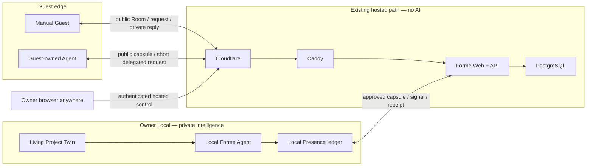

# R4 Technical Owner Review Brief v0.1

- 状态：**Owner review 进行中；不是批准记录**
- 更新：2026-07-26
- 实现与审计附件：
  [`R4-TECHNICAL-CONTROL-PACKET.md`](./R4-TECHNICAL-CONTROL-PACKET.md)
- 产品依据：
  [`R4-HERO-ENCOUNTER-DECISION-BRIEF.md`](./R4-HERO-ENCOUNTER-DECISION-BRIEF.md)
- Active gate：[GitHub #52](https://github.com/formehq/forme/issues/52)
- Draft review：[PR #64](https://github.com/formehq/forme/pull/64)

## 先说结论

你不需要逐行 review 那份 1,800 多行的 Technical Control Packet。

长 Packet 是给实现 Agent 和技术审计者的施工合同；这份 Brief 才是给
Owner 的判断界面。你只需要：

1. 先理解一张总地图；
2. 对五张决策卡分别回答 `批准 / 带条件批准 / 修改`；
3. 用四个具体场景检查系统行为是否符合直觉；
4. 只看 Agent 报告的 red/yellow exception。

五张卡关闭后，Agent 才会按你的答案重写长 Packet、重新审计并计算
新的 hash。之前那份 Packet 的 hash 已经失效，不应再被批准。

## 已经确认，不再重复问

- R4 的五项产品方向已经批准。
- Production target 使用你现有的
  **Cloudflare → Caddy → Hetzner → PostgreSQL** 路径。
- 现有服务器是 Forme 接入和部署的既有前提。本轮不重新审计或批准
  服务器本身，只负责 Forme 应用怎样开发、接入、发布和回滚。
- Owner Control 必须可以从任何地点通过 Web 登录。
- P0 仍然是一个 curated Third Place、一个必须完成的 Forme Project
  Room、Manual-first、minimum Agent interoperability、Owner publish 与
  Curator admit 分离、layered identity、server no AI。
- Private Twin、repo、notes、local runtime credential 和未选择的本地
  evidence 不进入 hosted Presence。

## 以后批准 revised Packet 代表什么

它会批准：

- R4 应用边界；
- 对 Guest 作出的公开承诺；
- 权限和生命周期模型；
- P0 cut；
- repo implementation 与 fixture/local tests。

它不会批准：

- production deployment 或 public route；
- Cloudflare/Caddy 配置修改；
- production PostgreSQL migration、seed 或 durable write；
- production secret installation；
- 真实 Guest interaction 或 external message；
- 新资源或增量 spend。

Exact schema/migration 仍有单独的 **Schema & Migration Manifest**。
真正部署仍有单独的 **Production Deployment & Provisioning Grant**。

## 十分钟总地图



系统里有三个真正的 state owner：

1. **Local Twin**：项目现在意味着什么。
2. **Local Presence**：Owner 准备、批准、接收和发送过什么。
3. **Hosted Presence**：什么正在公开、排队、返回、过期或撤回。

Guest 的消息到达 server 或 local inbox，不等于它已经成为 Twin truth。

授权也分三步：

```text
Revised Technical Packet
  → 允许 repo code 与 fixture/local tests

Schema & Migration Manifest
  → 允许精确 durable schema 与 migration/network preflight

Production Deployment & Provisioning Grant
  → 允许精确 deploy、route、secret、production write、public traffic、spend
```

## Forme 怎样开发并部署到现有服务器

建议的 application path 是：

```text
Git commit
  → tests
  → build OCI image
  → immutable registry digest
  → approved server deploy
  → Caddy route
  → Forme App
  → R4-specific PostgreSQL schema/roles
```

应用层遵守以下规则：

- 一个可以 self-host 的 Next.js Node application，不依赖 Vercel runtime。
- Caddy 是 Forme App 唯一的 HTTP 入口。
- 同一个 immutable image 提供 `app`、one-shot `migrate` 和 one-shot
  `janitor` command；它们使用分离的 PostgreSQL roles。
- App 接入既有 `app_net` 和数据库网络；浏览器不能直接访问 PostgreSQL。
- PostgreSQL 是唯一 authoritative hosted store；R4 P0 不使用 Redis。
- Migration 是独立、hash-checked 的 one-shot step，不能在 app startup
  时偷偷运行。
- Retention janitor 是一个 scheduled one-shot command。
- CI 负责 test、build 和 push immutable digest；merge 到 `main` 不自动
  等于 production deployment。
- Production promotion 绑定 exact commit、schema manifest 和 image
  digest，并由后续 Production Grant 手动放行。
- Deploy 选择不可变 image digest，运行 preflight，启动并检查 health。
- App rollback 只切回兼容的旧 image，绝不自动反向执行 database
  migration。
- Exact domain、registry、Compose service、network name、DB role、secret
  name、deploy/rollback command 留给后续 Production Grant。

Forme 负责这些应用接入与发布合同；现有 server baseline 不在本轮 review。

## T1 — Guest 可以持续多久

### 你要判断什么

每次 Interaction 都重新发 invite，还是让熟悉的 Guest 在一段短时间内
回来几次？

### 推荐答案

只提供两个固定 preset：

| Preset | 有效期 | Accepted Interaction | 同时未结 |
|---|---:|---:|---:|
| `single_encounter` | 24 小时或 Projection 到期，取更早者 | 1 | 1 |
| `short_pass` | Owner 从 24 小时 / 3 天 / 7 天中选择，且不超过 Projection 到期 | 3 | 1 |

Invite 本身仍然只能兑换一次；兑换后得到绑定 exact Room + Projection
的私密 Guest Grant。它是一张 bearer pass，不是账号，也不证明真实身份。

Manual Guest：

- 在 Grant 有效期内，可以用私密 re-entry capability 恢复短期 cookie；
- 只有真正 accepted 的 Interaction 才消耗一次额度；
- 同一个 idempotent retry 不重复计数；
- 删除、拒绝或撤回不会返还已经消耗的额度；
- 每次 Interaction 都有自己的 reply URL、删除权和最多一个 Response。

Agent Guest：

- Grant 只能是 `manual_only` 或 `manual_plus_one_shot_agent`；
- `manual_plus_one_shot_agent` 表示 Guest 可以按剩余额度逐次 mint
  derivative token，不是整个 Grant 只能使用一次 Agent；
- 同一时刻最多存在一个未使用 Agent token；
- 每个 Agent token 只有 15 分钟、只能提交一次；
- Agent submission 消耗同一个 Grant 的一次额度；
- Agent 不能续签、再发 token、读取 private reply、删除 Interaction，
  也不能拿到可重复使用的 Manual credential。

生命周期：

- stale 或 unlisted：停止新提交；
- revoked Projection 或 retired Room：取消未来写权限；
- 删除或 revoke 某一个 Interaction 不会自动结束整个 Grant，也不会
  返还已经消耗的额度；结束/revoke Grant 是单独动作；
- 结束或 revoke Grant 只停止未来提交，不隐藏或删除已有
  Interaction/Response，也不移除它们各自的 reply/delete capability；
- successor Projection 不继承剩余额度；
- 延长时间、增加次数、开启 Agent 或迁移 successor 都必须创建新
  Grant，不能原地扩权；
- 每条 outgoing Response 仍然需要独立、准确的 Owner approval。

Grant re-entry capability 只负责恢复“未来还可以提交几次”的权限。每个
Interaction 仍有自己独立的 reply/delete capability；拿到 Grant 不能因此
读取或删除过去 Interaction 的 private reply。

### 你可以这样回复

- `T1 按推荐批准`
- `T1 保持一次性`
- `T1 带条件批准：...`

## T2 — Owner 在任何地方登录后能做什么

### 你要判断什么

“Anywhere Web Control”只是远程控制 hosted state，还是也要远程访问
private Twin、起草和发布内容？

### 推荐答案

使用三个逻辑 origin，exact hostname 留到 Production Grant：

```text
public origin   → Third Place / Room / Guest / paired-local API
control origin  → Owner dashboard 与普通 hosted-control，较长 session
approve origin  → sensitive mutation 的 15 分钟 step-up login
```

三个 origin 可以由同一个 immutable Next.js image 提供，再由 Caddy 按
Host 分流。

Cloudflare Access 保护 control 与 approve origin。Forme App 仍要验证
Access 的 signed assertion 和 route-specific audience，并且只把预先
登记的 Owner identity 映射到唯一 Controller。推荐使用已有
Cloudflare/identity-provider account + MFA；如果你希望 email OTP 成为
主要或 fallback 登录方法，需要在批准时明确写出。

Public Third Place 和 Guest routes 不要求 Access；Control page 和 control
API 必须登录。

普通查看与敏感 mutation 使用不同的 authorization boundary。配对、发出
或撤销 Grant、admit/unlist、emergency revoke、retire 和 Owner delete
必须经过 approve origin 的独立 short-session Access
policy/audience。实现不能把普通长期 Access token 的 `iat` 误当成
“刚刚重新认证”。

P0 中同一个人可以持有两个语义角色，但 receipt 分开：

- **Owner/Publisher**：控制 local pairing 与 exact local approval；
- **Curator**：决定 Projection 是否进入 Third Place。

Anywhere Web Control 可以：

- 查看已经存在于 hosted server 的完整 Projection、Guest request、
  inline Guest Capsule 和 published Response，以及 lifecycle/receipt
  status；
- 发出或撤销 Guest Grant；
- admit 或 unlist Projection；
- emergency-revoke Projection/Response；
- retire Room；
- 删除 abusive hosted Interaction；
- 创建 local pairing challenge。

Anywhere Web Control 不可以：

- 读取 private Twin、repo、notes 或 local evidence；
- 调用 local Agent；
- 取得 paired-local credential；
- 从 private context 起草内容；
- 绕过 local exact approval 发布 Projection/Response；
- 把 hosted signal 直接写成 Twin meaning。

因此，登录任意浏览器后读取 Guest request body 是推荐方案的一部分，
但它只是 hosted preview：不会 ACK local import，也不会产生 Twin
meaning。Control 页面必须 `no-store`，且永远不显示 local-only draft、
private Twin context 或 evidence。若你只想远程看 metadata/status，需要
在批准 T2 时改成 metadata-only。

Sensitive control action 还需要显式二次确认。P0 没有 public sign-up。

### 你可以这样回复

- `T2 按 hosted-control-only 推荐批准`
- `T2 hosted-control-only，但 remote 只看 metadata/status`
- `T2 hosted-control-only 批准，但整个 Control 都使用单一 15 分钟 session`
- `T2 还需要 remote drafting/publishing/responding`
- `T2 带条件批准：...`

第四种会改变“private intelligence stays local”的架构，需要重新设计，
不能当成普通 Control 页面功能偷偷加进去。

## T3 — OpenAI 可以看到哪些 private context

### 你要判断什么

Local Forme Agent 能不能用经过选择的 private context，帮助 Owner 起草
给 Guest 的回复？

### 推荐答案

只有两个人都作出相应选择时可以：

1. Guest 选择 `allow_owner_local_ai`；
2. Owner 主动开始 draft，并批准 exact manifest。

Manifest 会列出 request、public Projection、选中的 Owner Frame 字段、
选中的 corrected Reflection 和 allowlisted evidence。最终 packet 最多
32 KiB，没有 ambient repo access、没有 tools，通过 Owner 现有的 local
Codex authentication 发送给 OpenAI。

Forme server 永远看不到这份 private packet。

如果 Guest 选择 `manual_owner_only`，Guest content 和 private context
都不会发给 OpenAI；Owner 仍然可以手工写回复。

在发送前发现 deletion 会阻止 model call；已经 in-flight 的 bytes 无法
追回，这一点会直接告诉 Guest。

### 你可以这样回复

- `T3 按推荐批准`
- `T3 R4 只允许 manual response`
- `T3 带条件批准：...`

## T4 — Public、unlist、stale 和 revoke 分别意味着什么

### 你要判断什么

Owner publish、Curator unlist、Twin change 和 emergency revoke 之后，
别人究竟还能看到什么？

### 推荐答案

- Owner publication 与 Curator admission 是两个独立动作。
- Third Place 只展示 current、fresh、admitted Projection。
- Current 但 never-admitted 或 unlisted 的 Projection，拿到 direct URL
  的人仍可阅读，但不能发起新 Interaction。
- Curator unlist 不删除或作废已经 accepted 的 Interaction；它们仍可
  完成 Owner-reviewed Response。
- Stale Projection 最多在七天 hard expiry 前带醒目警告 direct-read，
  但不能发起新 Interaction。
- Revoke 立即停止返回 Projection body。
- Projection revoke 还会隐藏所有 linked published Response，旧 Guest
  只保留 body-free status/delete；local Presence 收到 tombstone 后
  purge request 与 linked Response body。
- Room retirement 结束 Room 和所有新写入，隐藏 hosted Projection 与
  Response；旧 Guest 同样只保留 body-free status/delete，local Presence
  在收到 retirement tombstone 后 purge。
- Successor Projection 需要新的 Curator admission 和 Guest Grant。
- 绑定 stale、superseded 或 expired origin 的旧 request，可以得到一个
  明确披露 origin state 的 Owner-reviewed Response。
- 绑定 revoked origin 的 request 不能再收到新 Response。

### 你可以这样回复

- `T4 按推荐批准`
- `T4 unlisted/never-admitted 也不允许 direct-read`
- `T4 带条件批准：...`

## T5 — 异步体验、删除、保留和 P0 cut

### 你要判断什么

这个有意保持异步和有限的 MVP，是否已经足够真实、诚实和有用？

### 推荐答案

- Guest 保存 private reply URL；Owner 显式运行 local sync。
- P0 没有 email notification、daemon、live chat、WebSocket 或 remote
  local tunnel。
- 一个 Guest Grant 在 T1 下最多有三个独立 Interaction；每个
  Interaction 最多一个 Response，不形成 conversation thread。
- Interaction 和 inline Guest Capsule 最长保存 30 天。
- Response 保存 7 天，并且绝不超过所属 Interaction 的寿命。
- Guest deletion 立即让 hosted content 不可读；physical purge 在
  下一次成功的 scheduled retention run 完成，目标延迟小于 24 小时；
  `lastSuccessfulPurgeAt` 超过 36 小时就进入 operator incident。
- Existing server backup 的保留周期属于 supplied infrastructure
  interface，本轮不猜数字。Production Deployment & Provisioning Grant
  必须给出可验证的实际 backup-retention horizon，并让 Guest 在提交前
  看到；在该值明确前不允许 production interaction。删除无法提前清除
  仍在该周期内的 backup copy。
- Production Deployment & Provisioning Grant 同样必须列出会接触
  transport metadata 的
  Cloudflare/Caddy/app/PostgreSQL log retention；应用日志不得记录
  Guest/Response body、cookie、token 或 secret。
- Offline local copy 在已知 expiry/deletion 时拒绝读取；更早发生的
  remote deletion 要在下一次 Presence run 才能收到并 purge。
- Guest 必须知道 Owner 可能已经读过或复制了 private submission；
  deletion 不能让已经被人读过的内容失忆。
- 已被别人复制的 public content 和已经发往 OpenAI 的 in-flight bytes
  无法追回。
- R4 P0 不增加 notes ingestion、Person Twin、open sign-up、多个必须
  resident、public search/feed、server AI、rich attachment 或跨 Room
  reusable Agent identity。

### 你可以这样回复

- `T5 按推荐批准`
- `T5 带条件批准：...`
- 指出你要求改变的 notification、retention 或 scope。

## 用四个故事检查自己的判断

### A. 熟悉的 collaborator 回来三次

Owner 发一个 `short_pass`。Guest 在同一个 exact Projection 有效期内，
最多提交三个相互独立的 Interaction，不需要每次重新找 Owner。
每条回复仍然等待 local Owner review。Guest 不会因此得到 profile、
thread、Twin 或 reusable Agent identity。

### B. Owner 不在本地电脑旁

Owner 在其他地方登录 Web Control，可以 curate、发出/撤销 Guest Grant、
查看完整 hosted Guest request/published Response 与 status，并做
emergency hosted control；不能查看 private Twin、运行 local Agent 或
绕过 local approval 发布新的 private-context Response。

### C. Guest 带着自己的 notes

Guest-owned Agent 在 Guest edge 选择并压缩 context，形成一个 bounded
Guest Capsule。Forme 不读取 raw notes，也不创建 Person Twin。Guest 再
选择 `manual_owner_only` 或明确同意 local Agent draft path。

### D. Project 改了，或者有人删除内容

新 Twin revision 在下一次 local sync 把 Projection 标成 stale，停止新
提交。Successor 需要重新 admit 和发 Grant。Unlist 只移除 discovery；
revoke 移除 body；Room retirement 结束整个 surface。Guest deletion
立即移除 hosted access，offline local copy 在下一次 Presence run 收到。
丢失 HTTP response 时，用原 idempotency key 恢复结果，不重复动作。

## 哪些部分完全交给 Agent 审计

只要没有改变 T1–T5，Owner 默认不需要读：

- repo layout、dependency pin 和 build command；
- canonical JSON、ID、hash、schema 与 size validation；
- filesystem lock、fsync、journal、outbox、inbox 与 recovery；
- PostgreSQL role、grant、constraint、transaction 与 migration order；
- Access assertion、proxy header、cookie、CSRF 与 secret handling；
- capability entropy、rate limit、retention scheduler 与 log redaction；
- lifecycle race、idempotency、delete recovery 与 rollback test；
- 后续 Production Grant 中的 exact deploy/environment inventory。

Agent 最终只向 Owner 返回：

- **Green**：技术细节没有改变任何决策卡结论；
- **Yellow**：存在需要 Owner 知情的 tradeoff 或运行条件；
- **Red**：实现会违反某张已批准决策卡。

## 你怎么回复最省力

可以一张一张聊，也可以直接：

```text
T1：...
T2：...
T3：...
T4：...
T5：...
```

五项关闭后：

1. Agent 按答案重写详细 Technical Control Packet；
2. 删除或替换旧的 Vercel/Supabase 与 strict one-use 内容；
3. 完成技术复核，只报告会改变决策卡的 exception；
4. 生成新的 packet version、commit 与 SHA-256；
5. Owner 最后批准那个准确的新对象。

当前未对齐的旧 Packet 不应被批准。
