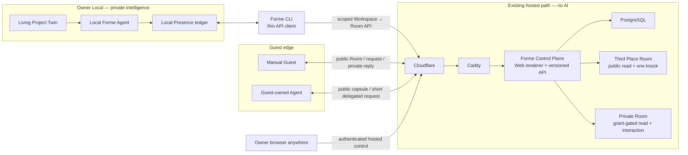
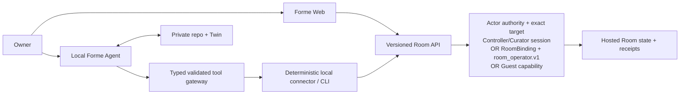

# R4 Technical Owner Review Brief v0.4

- 状态：**privacy-first/minimum-friction agency direction 已记录，T1
  public/private Room correction 已批准；broader boundary interpretation
  与 T2–T5 Owner review 进行中；不是最终 Packet 批准记录**
- 更新：2026-07-27
- 实现与审计附件：
  [`R4-TECHNICAL-CONTROL-PACKET.md`](./R4-TECHNICAL-CONTROL-PACKET.md)
- 产品依据：
  [`R4-HERO-ENCOUNTER-DECISION-BRIEF.md`](./R4-HERO-ENCOUNTER-DECISION-BRIEF.md)
- Active gate：[GitHub #52](https://github.com/formehq/forme/issues/52)
- Draft review：[PR #64](https://github.com/formehq/forme/pull/64)
- Agency recalibration：
  [`R4-AGENCY-FIRST-RECALIBRATION.md`](./R4-AGENCY-FIRST-RECALIBRATION.md)

## 先说结论

你不需要逐行 review 那份 1,800 多行的 Technical Control Packet。

长 Packet 是给实现 Agent 和技术审计者的施工合同；这份 Brief 才是给
Owner 的判断界面。你只需要：

1. 先理解一张总地图；
2. 先确认一条 agency 边界解释，再对剩余四张技术决策卡分别回答
   `批准 / 带条件批准 / 修改`；
3. 用五个具体场景检查系统行为是否符合直觉；
4. 只看 Agent 报告的 red/yellow exception。

T1 已在 2026-07-26 按“公共一敲门 + 私密短通行证”修正。P 与 T2–T5
关闭后，Agent 才会按你的答案重写长 Packet、重新审计并计算新的
hash。之前那份 Packet 的 hash 已经失效，不应再被批准。

2026-07-27 的 agency-first 方向直接修正了**尚未批准的 T2 推荐**，也
澄清了待决 T3–T5 的 framing：
Owner 批准的是可持续、可撤销的边界，而不是每一个机械 API 动作。Web
更像 GitHub 控制台，用来看状态、权限、异常和停止；绑定 exact Room 的
Agent 应能在边界内完成有用的日常工作。新的受众/隐私、替人承诺、扩权
和不可逆高影响动作仍返回 Owner。

## 已经确认，不再重复问

- R4 的五项产品方向已经批准。
- Production target 使用你现有的
  **Cloudflare → Caddy → Hetzner → PostgreSQL** 路径。
- 现有服务器是 Forme 接入和部署的既有前提。本轮不重新审计或批准
  服务器本身，只负责 Forme 应用怎样开发、接入、发布和回滚。
- Owner Control 必须可以从任何地点通过 Web 登录。
- Owner 已进一步确认 T2 的界面方向：hosted Forme 是
  management/control/status plane；每个 P0 Room 语义能力都必须有
  versioned API，Web 与 CLI 只是同一 API 的不同客户端；Agent authority
  应对应 local Repo/Workspace 与 Room，而不是自动继承整个 Controller
  account。独立 per-Room binding/credential 是下面的当前推荐方案，
  不是已经批准的 T2 结论。完整 T2 仍待 Owner 批准。
- Owner 已明确倾向 **privacy-first agency + minimum friction**。当前
  Agent 推荐用 authorship/commitment、irreversible/material consequence
  companion guards 和 no-self-expansion rule 来形式化它；这部分解释、
  下面的 exact T2 verbs 和所有实现仍待 Owner 判断。
- Room 现在有两个明确的 first-class kind：Third Place 中公开可遇见的
  Room，以及阅读和互动都需要 Owner Grant 的 Private Room。`unlisted`
  只是 curation/discovery 状态，不等于 private。
- Third Place Room 允许任何人阅读 current admitted Projection，并默认
  允许一次 bounded public knock；继续互动必须由 Owner 发 short pass。
- P0 仍然是一个 curated Third Place、一个必须完成的 Forme Project
  Room、Manual-first、minimum Agent interoperability、Owner publish 与
  Curator admit 分离、layered identity、server no AI。
- Private Twin、repo、notes、local runtime credential 和未选择的本地
  evidence 不进入 hosted Presence。

## 以后批准 revised Packet 代表什么

它会批准：

- R4 应用边界；
- 对 Guest 作出的公开承诺；
- 权限和生命周期模型；
- P0 cut；
- repo implementation 与 fixture/local tests。

它不会批准：

- production deployment 或 public route；
- Cloudflare/Caddy 配置修改；
- production PostgreSQL migration、seed 或 durable write；
- production secret installation；
- 真实 Guest interaction 或 external message；
- 新资源或增量 spend。

Exact schema/migration 仍有单独的 **Schema & Migration Manifest**。
真正部署仍有单独的 **Production Deployment & Provisioning Grant**。

## 十分钟总地图



系统里有三个真正的 state owner：

1. **Local Twin**：项目现在意味着什么。
2. **Local Presence**：Owner 准备、批准、接收和发送过什么。
3. **Hosted Presence**：什么正在公开、排队、返回、过期或撤回。

Guest 的消息到达 server 或 local inbox，不等于它已经成为 Twin truth。

授权也分三步：

```text
Revised Technical Packet
  → 允许 repo code 与 fixture/local tests

Schema & Migration Manifest
  → 允许精确 durable schema 与 migration/network preflight

Production Deployment & Provisioning Grant
  → 允许精确 deploy、route、secret、production write、public traffic、spend
```

## Forme 怎样开发并部署到现有服务器

建议的 application path 是：

```text
Git commit
  → tests
  → build OCI image
  → immutable registry digest
  → approved server deploy
  → Caddy route
  → Forme App
  → R4-specific PostgreSQL schema/roles
```

应用层遵守以下规则：

- 一个可以 self-host 的 Next.js Node application，不依赖 Vercel runtime。
- Caddy 是 Forme App 唯一的 HTTP 入口。
- 同一个 immutable image 提供 `app`、one-shot `migrate` 和 one-shot
  `janitor` command；它们使用分离的 PostgreSQL roles。
- App 接入既有 `app_net` 和数据库网络；浏览器不能直接访问 PostgreSQL。
- PostgreSQL 是唯一 authoritative hosted store；R4 P0 不使用 Redis。
- Migration 是独立、hash-checked 的 one-shot step，不能在 app startup
  时偷偷运行。
- Retention janitor 是一个 scheduled one-shot command。
- CI 负责 test、build 和 push immutable digest；merge 到 `main` 不自动
  等于 production deployment。
- Production promotion 绑定 exact commit、schema manifest 和 image
  digest，并由后续 Production Grant 手动放行。
- Deploy 选择不可变 image digest，运行 preflight，启动并检查 health。
- App rollback 只切回兼容的旧 image，绝不自动反向执行 database
  migration。
- Exact domain、registry、Compose service、network name、DB role、secret
  name、deploy/rollback command 留给后续 Production Grant。

Forme 负责这些应用接入与发布合同；现有 server baseline 不在本轮 review。

## T1 — 公共敲门与私密关系可以持续多久

- 状态：**Owner-approved correction — 2026-07-26**

### 你要判断什么

公开空间是否应该让任何人直接互动？Private Room 又应该如何让熟悉的
Guest 在一段短时间内回来？

### Owner 已批准的答案

最重要的区分不是“Public Guest 待得更久，还是 Private Guest 待得
更久”，而是：

> Public content 可以长期看，但 public write permission 很短；
> private content 默认看不到，但 Owner 批准后的关系可以稍长。

P0 使用同一套 Room/Projection implementation primitive，但是真实的
Private Room 与 Third Place Room 是两个不同 Room instance，拥有不同的
Room ID 和分别批准的 Projection。它们可以属于同一个 Forme entity/Twin：

| Room kind | 阅读 | 默认首次互动 | 后续互动 |
|---|---|---|---|
| `third_place_public` | current、fresh、admitted 时无需账号；没有 Guest 阅读时钟 | `public_encounter`：24 小时内 1 次 accepted Interaction | Owner 可另发 `short_pass`，仍基于 public Projection |
| `private_grant_only` | 只有有效 Owner Grant 才能读取它自己单独批准的 exact Projection | Owner 发 `single_encounter` 或 `short_pass` | 只在 Grant 剩余期限与额度内 |

`unlisted` 只是 Third Place 的发现/curation 状态，不是 Private Room。
知道一个 unlisted public URL 的人仍可能读取它；真正的 Private Room
必须在返回 Projection body 前验证 Owner-issued Grant。

`roomKind` 在 P0 创建后不可改变。Private Room 不能被 Curator admit 进
Third Place。已经公开过的 Room 不能靠改一个字段“重新变私密”；Owner
必须 revoke 旧 public Projection，再创建一个不同 ID、不同 Projection
approval 的 Private Room。

P0 的 Hero Room 仍是 public Forme Project Room，但同一个实现合同和
fixture 必须支持一个真实 grant-gated Private Room；这不增加第二个 Twin
或另一套交互系统。

#### Third Place Room：广场加门铃

- Public visitor 不需要 Owner 预先发 invite，就能取得一个绑定 exact
  Room + Projection 的 `public_encounter` capability。
- 它允许在 24 小时内 accepted 一次 bounded Interaction，同时最多一个
  未结 request。它是“敲一次门”，不是账号、身份或持续会话。
- “一次”是针对 capability/session，不声称能识别真实世界里的“同一个
  人”。基础 rate limit 与 Room public pool 才负责限制重复滥用。
- P0 默认每个 Room 在滚动 24 小时内最多 accepted 20 个 public
  encounters；达到上限后显示 `Room is resting`。Owner-issued pass 不消耗
  public pool。
- Capability issuance 也必须有独立的短期 abuse rate limit，不能只限制
  accepted submissions。短期 network/browser abuse key 不能进入 Guest
  identity，也不能被当作“这个人是谁”的证明。
- Guest request 与 Owner Response 默认仍是 private relay，不会因为入口
  在公共 Room 就变成公开评论。
- Owner 看过首条 request 后，可以 decline、respond once、删除，或者
  发一个新的 `short_pass`。熟悉的 Guest 也可以直接收到 short pass，
  不必先走 public encounter。
- 对匿名 public Guest，Owner 不是凭空“联系到对方”：Owner 创建一个
  绑定 exact Interaction 与目标 Room + Projection + preset 的独立 hosted
  `GrantOffer`。它显示在 reply/status surface，不进入 immutable Response
  Capsule，也不要求 Owner 先发 Response。Guest 通过已有 private reply
  capability 查看并接受，server 才原子创建新的 bearer Grant。不要把
  raw invite secret 塞进 Response body。已知 collaborator 仍可由 Owner
  通过既有渠道收到一次性 invite URL。
- `GrantOffer` 创建的是新额度，不会把 public encounter 原地扩权；因此
  完整路径最多是第一次 public knock 加 short pass 的三次额外
  Interaction。
- P0 每个 Interaction 同时最多一个 live Grant Offer。接受必须
  idempotent，并重新检查 offer 仍有效、reply capability 有权、exact
  target Room/Projection 仍 active/current/fresh/unrevoked、target mode
  不是 `closed`。Interaction deletion、origin revoke、origin Room
  retirement、target successor/expiry/revoke/retirement 都使 offer
  失效；Curator unlist 是否影响它仍是 T4 待批准的 lifecycle 选择。
- Public Room 上的 short pass 只延长对同一个 public Projection 的互动
  权，不会解锁任何 Private Room 内容。把 Guest 邀入 Private Room 必须
  另外签发绑定那个 Private Room + Projection 的 Grant。
- Capability issuance 与最终 submission 都必须原子地重新检查 exact
  Projection 仍 current、fresh、admitted，Room 仍是 `public_single`，
  public pool 仍有额度；不能靠先领 token 绕过后来发生的关闭。Exact
  unlist/stale effects 仍由待批准的 T4 决定。

Owner 独立控制 Room 的互动模式：

| Interaction mode | 新 public knock | 有效 Owner Grant |
|---|---:|---:|
| `public_single` | 允许 | 允许 |
| `invite_only` | 拒绝并永久作废尚未使用的 public capability | 允许 |
| `closed` | 拒绝并永久作废尚未使用的 public capability | 暂停新提交 |

Curator admission 只决定 Room 是否进入 Third Place，不替 Owner 打开
inbox。Owner 可以随时切换 interaction mode；打开 public intake、关闭
intake 与发 Grant 都是留下 receipt 的 Owner action。Curator 只能
admit/unlist。`closed` 不延长 Grant：若 Owner 在原 expiry 前重新打开，
尚未过期的 Owner Grant 才能继续使用。任何离开 `public_single` 的切换
都会永久作废当时未使用的 public encounter；之后重新打开需要发新的
capability。Private Room 只允许 `invite_only` 或 `closed`，永远不能设置
`public_single`。

#### Private Room：受邀会客室

- Private Room 不出现在 Third Place，Projection body 与新 Interaction
  都要求 Owner-issued Guest Grant。
- `single_encounter`：24 小时或 Projection 到期，取更早者；最多一次
  accepted Interaction。
- `short_pass`：Owner 选择 24 小时、3 天或 7 天，且不超过 Projection
  到期；最多三次 accepted Interaction，同时最多一个未结 request。
- UI 对熟悉 Guest 推荐 7 天 / 3 次，但 Owner 仍可选择更短。
- P0 Grant 绑定 exact Room + Projection。successor 不继承；“自动跟随
  Room 未来 Projection”的 relationship pass 留到 P1。
- Invite 只能兑换一次；兑换后得到的 bearer Grant 不是账号，也不能证明
  使用者就是 Owner 心里指定的那个人。

#### 两种 Room 共用的规则

- 只有真正 accepted 的 Interaction 才消耗一次额度；同一个 idempotent
  retry 不重复计数。
- 每个 Interaction 都有自己的 private reply URL、删除权和最多一个
  Response。
- Manual Guest 可以用 re-entry capability 恢复仍有效的 Grant。
- Grant 保留 `manual_only` 或 `manual_plus_one_shot_agent` mode。Agent
  Guest 与 Manual Guest 共用额度；每次只能 mint 一个绑定 exact Room +
  Projection、15 分钟、单次使用的 derivative token。它只允许读取该
  exact Projection 并创建一次 Interaction；不能续签、再发 token、读取
  private reply、删除 Interaction 或取得 reusable Manual credential。
- stale 或 expired Projection 停止所有新提交；revoke 或 Room retirement
  停止读取 body 和未来写入。
- 结束/revoke Grant 只停止未来 Grant 使用，不隐藏已有
  Interaction/Response，也不返还额度。
- 延时、增次、启用 Agent 或迁移 successor 都需要新 Grant，不能原地
  扩权。
- 每条 outgoing Response 仍需要独立、准确的 Owner approval。

## P — Privacy-first agency 在 R4 里怎样解释

- 状态：**Owner 已表达方向；下面的 formalization 待确认**

### Owner 已经说清楚的部分

在人类隐私边界内，尽量给 Twin/Agent 更大的 agency，并尽量减少
friction。人批准的是边界，不应是每一个机械动作。

### Agent 推荐你额外确认的解释

- **Primary perimeter — privacy:** 只有建立或扩大到当前 envelope 之外的
  source/provider/audience 时才重新授权；边界内不逐文件、逐 API 请示。
- **Companion guard — representation:** 新的 Owner-attributed
  claim/commitment 不能因为“没泄密”就自动替人发出。
- **Companion guard — consequence:** irreversible/materially high-impact
  effect 不能因为“没泄密”就自动执行。
- **Meta-rule — no self-expansion:** 已有 authority 不能给自己增加更宽的
  Room、scope、audience 或 budget；明确允许的 attenuated derivative
  token 不算扩权。

这四句只用于解释 R4 authority contract。它们不是要求每次弹 approval，
也不自动冻结 Forme 未来的完整 agency taxonomy。

### 你可以这样回复

- `P 按 privacy primary + representation/consequence companion guards + no-self-expansion 推荐解释批准用于 R4`
- `P 只确认 privacy boundary，其余三项继续讨论`
- `P 带条件批准：...`

## T2 — Owner 与 Agent 怎样控制 Room

- 状态：**Owner 的 Web/API/Repo-to-Room 方向已记录；完整 T2 待批准**

### 你要判断什么

“Anywhere Web Control”、Agent API 和 local private work 应该怎样分工？
一个 repo/workspace 的 local connector 被配对以后，Agent 究竟能通过它
控制哪些 Room 和哪些动作？

### 推荐答案

Owner 在 2026-07-27 给出的方向可以压缩成一句：

> Forme hosted service 像 GitHub 一样管理共享状态、权限和协作；
> Web 给人看和控制，API 是统一能力合同，CLI 是 Agent 方便使用的薄
> client；真正依赖 private repo/Twin 的思考和产出仍在 local Agent。

更准确地说，系统有一个 **Control Plane** 和一个 **Work Plane**：

| 层 | 负责什么 | 不负责什么 |
|---|---|---|
| Hosted Control Plane | Room/Projection/Interaction/Grant/curation 的共享状态、权限、队列、生命周期与 receipts | 不读取 Twin，不运行 Owner AI，不替 Owner 形成判断 |
| Forme Web | 人类查看、管理、批准 hosted access/control action 和理解 hosted state 的主要界面 | 不是 private repo 的远程桌面，也不取代 local publication/Response approval |
| Versioned API | 每个 P0 hosted Room read 与 state transition 的 canonical contract | 不是 generic execute endpoint，也不绕过权限或 approval |
| Forme CLI | P0 为 public/Guest（适用时）和 `room_operator.v1` lane 提供 thin client；Agent 经 typed gateway 请求 | 不复制 server logic；Controller/Curator boundary-action CLI delegation 留到 P1 |
| Local Agent Work Plane | 读取明确允许的 local context，理解、起草、准备 Projection/Response 和建议动作 | 不直接成为 hosted canonical authority |

权限默认采用“**窄 perimeter、宽 useful interior**”：一个 exact Room 的
standing operator 可以持续完成 routine transport 与 deterministic,
monotonic exposure-reducing lifecycle enforcement；新增 Room/audience、
private context、Owner-attributed content、scope 或不可逆后果才回到人。
因此 Web 是 cockpit 和 kill switch，不是 Agent 每执行一步都要排队的
approval inbox。

这里的“Room 所有功能都有 API”在 P0 的准确含义是：每一个**已经批准的
P0 hosted semantic operation** 都有 machine contract，但每个 caller
只能调用自己持有 capability 的那一部分。这里按 **capability lane**
分类，不假设 HTTP client 一定是人或 Agent：

- Public read/encounter lane：browser 或 Agent client 都可以 read Third
  Place/Room/Projection，并使用允许的 public encounter capability create
  一次 Interaction；public capability 本身没有 reply、delete、
  GrantOffer 或 redelegation authority。Accepted Interaction 另行产生
  private reply capability；
- Manual/reply/Grant lane：正常产品流程把 private reply/re-entry secret
  留给 Guest 的 manual holder。它可在 exact scope 内 read reply/status、
  delete 自己的 Interaction、接受 GrantOffer，并在 Grant mode 允许时
  mint one-shot Agent derivative。Owner 若另行把这个较强 root secret
  直接交给普通 Agent，属于 Forme 默认 delegation 之外的授权；
- Agent Guest derivative：只按 T1 读取 exact Room + Projection 并
  create 一次 Interaction；不能 read private reply、delete、接受
  GrantOffer、mint/redelegate、续签或恢复 Manual credential；
- paired local connector（pending T2）：inspect exact
  Room/Projection/status/receipts，typed sync/pull
  Interaction/tombstone，deterministic ACK/recovery/stale attestation，并
  push carrying a current exact Owner approval 的 Projection/Response；
- Controller：切换 intake mode，issue/revoke Grant/GrantOffer，
  emergency revoke、retire、Owner delete，以及管理 pairing/scope；
- Curator：admit/unlist；P0 可以与 Controller 是同一人，但 authority 和
  receipt 分开；
- internal operator：只运行 retention/health 等另行批准的 exact
  maintenance contract；
- 每一个上述 P0 operation 都有 versioned API。未来新增 Room 语义时，也
  必须同时定义 machine contract，不能成为 Web-only behavior；
- Web 必须使用同一套 application service/API contract，不能拥有绕过
  API authorization 的隐藏业务能力；
- P0 API 覆盖全部 semantic operation；P0 CLI 只覆盖适用的 public/Guest
  lane 与 `room_operator.v1` lane，命令不重写 server rules；
- Controller/Curator boundary operations 由 Web 作为同一 API 的 P0
  client；boundary-action CLI delegation 与 handoff 留到 P1；
- visual layout、页面导航和 login ceremony 不要求逐像素 CLI 等价，但
  它们所读取或改变的 hosted state 必须可以通过 API 表达；
- 每次 mutation 都绑定 exact target、expected version/state、
  idempotency key、caller role/action scope，并返回 receipt；
- server 不提供 model/chat endpoint、arbitrary SQL、generic tool call 或
  arbitrary code execution。API parity 不是 server-AI。

Web、CLI 和 Agent 不是三套 authority。它们只是同一套 capability model
的不同调用者：



#### Repo/Workspace ↔ Room 权限范围

Server 不能也不应该靠本地路径、Git remote 或“Agent 说自己在哪个 repo”
来判断权限。推荐由本地 workspace 保存关系，再通过 owner-controlled
pairing 为**每一个 Room** 创建独立 `RoomBinding`：

```text
one local workspace (local-only identity)
  → local mapping to one Forme entity/Twin
  → N independent exact RoomBindings
      → one exact Room ID
      → explicit action scopes
      → independent lifetime/revocation
      → one revocable Room-scoped credential
```

- 本地 repo 保留真实 path、workspace identity 和“这些 Room 属于同一个
  Twin”的 mapping。Server 只看到各 Room 独立的 opaque
  `hostBindingId`、credential digest/metadata 和 action scopes；它不得到
  repo path、local workspace ID 或 repo 内容，也不能靠多个 Room binding
  拼回一个 server-side private workspace identity。
- 一个 repo/workspace 可以显式绑定同一 entity 下的多个 Room，例如一个
  public Project Room 和一个 Private Room；本地把它们归在一起，但
  server 端是两个独立 Room ID、binding 和 credential，可以分别 expire、
  rotate 或 revoke，权限不互相继承。
- 每个 API request 必须指定 exact Room；server 同时检查 caller、
  opaque Room binding、Room、action scope 和当前 lifecycle。P0 没有
  account-wide Agent wildcard、ambient Room discovery 或 cross-entity
  batch action。
- 新增 Room、创建另一个 Room binding 或增加 action scope，都是新的
  sensitive Owner action；已有 binding 不能原地扩到另一个 Room，也
  不能由 Agent 自己扩权。
- Guest Agent 的 one-shot Room + Projection token 是另一条 delegation，
  不能兑换、恢复或继承 Owner-local `RoomBinding`。
- Paired credential 属于 Forme local connector，不进入 model prompt、
  Forme-managed model environment 或 generic tool output，也不把 raw
  secret 暴露给 Codex/OpenCode。Forme Agent 只能在获准的 typed tool
  gateway 中向 deterministic connector 请求 CLI/API operation。
- P0 的 model tool 默认只能返回 body-free status/control result。Connector
  可以把 Interaction body sync 到 local Presence，但 model 要看
  Guest/private bytes 仍必须走 T3 consent + exact manifest 的 packet-only
  draft run；这是两个隔离的 Forme-managed model context。没有一个
  Forme-managed model session 同时获得 private body 和 Room mutation
  tool。API scope 不能推导 model visibility。
- 如果 Owner 另外把通用 shell、connector config 或 local Presence path
  直接授权给普通 Codex/OpenCode，那是 Forme contract 之外的额外授权，
  P0 不能声称阻止它。详细 Packet 必须让 credential 与 private inbox
  默认位于 Forme-managed model roots 之外，并用 canary 验证两条 lane
  没有合并。

Agency-first 修正后的 P0 推荐，不再是“sync 可以站立授权、其余每一步
都签 15 分钟票”，而是在 exact `RoomBinding` 上编码一个固定、versioned
的 **`room_operator.v1` scope bundle**。它不新增 policy table、
delegation chain 或 custom-verb UI：

- 只绑定一个 exact active `RoomBinding` + Room；
- 可以 read exact Room/Projection/status/health/receipts；
- Agent 的标准 Room workflow 可以显式请求 typed `room sync`，pull
  Interaction 与 lifecycle tombstone；read-only CLI command 不能隐式
  pull private bytes 或产生 durable write；
- 可以 ACK deterministic import/delivery 和 idempotent recovery；
- connector 只在验证 local body 已不存在后记录 local deterministic
  purge receipt；P0 不新增 hosted purge-ACK endpoint；
- 只能 push 携带 still-current exact local Owner approval attestation 的
  Projection/Response；
- 只有在 canonical local Twin HEAD 确实 newer than exact Projection basis
  时，connector 才能 deterministic attest/mark stale，model 不能任意选择；
- P0 RoomBinding 从 pairing 起 30 天到期、不自动续期，Owner 可更早
  revoke；继续使用需要新的 pairing/rotation。所有 mutation 仍需要
  expected version、idempotency key、verification 和 receipt。

这不是 Controller account，也不是通用 Agent token。它默认**不能**：

- pairing、创建新 Room/binding、发现 sibling Room 或扩大自身 scope；
- 把 public Room 改成 private、增加新 audience 或跨 entity；
- issue 新 Private/relationship Grant，或扩大 Guest authority；
- change intake mode、park/decline/dispose Interaction；
- 创建新的 Owner-attributed claim、promise 或 commitment；
- 在没有独立 Curator delegation 时 admit Room；
- irreversible retire/delete、清除 durable evidence；
- 调用 arbitrary API/tool/code。

其中 safe-direction intake narrowing 与 internal `park` 仍可能符合
privacy-first agency；P0 先留在 Web，是因为它们的 lifecycle/UX 语义还没
验证，也是 August schedule cut，不是理念上永久禁止。

上面真正跨越推荐 human boundary 的能力仍有 API，但 P0 直接由
Owner/Curator 在 Web/approve origin 的 stepped-up session 中执行；暂缓
的 safe-direction operations 也先由 Web 完成。把 exact boundary action
再交给 Agent 的 `ControlActionGrant` 留到 P1，P0 不新增它的 schema、
issuance、consume 或 recovery path。

以后 Owner 可以给 exact Room 增加另一个明确的 standing policy，例如
Curator admission、relationship Grant 或 policy-compatible publication，
但 scope expansion 永远不能由已有 binding 自己批准。
**API/CLI availability 不等于 Agent authority；standing authority 也不
等于 account-wide authority。**

这个默认值让 Agent 真正完成一个 Room 的日常 transport 与 deterministic
lifecycle enforcement，同时把新边界和重大后果留给人，而不是把 Web
变成每次 sync、ACK 或 retry 都要点一次的审批队列。完整 verb、lifetime
与 revoke 行为仍属于待批准的 T2。

P0 agency demo 应至少证明一次：Agent 不再逐步请示就完成 typed sync →
deterministic ACK/stale → exact Owner-approved delivery → receipt；Owner 在
Web 看见 exact binding scope/history 并 revoke，下一次调用 fail closed。

#### Anywhere Web Control

使用三个逻辑 origin，exact hostname 留到 Production Grant：

```text
public origin   → Third Place / Room / Guest / paired-local API
control origin  → Owner dashboard 与普通 hosted-control，较长 session
approve origin  → sensitive mutation 的 15 分钟 step-up login
```

三个 origin 可以由同一个 immutable Next.js image 提供，再由 Caddy 按
Host 分流。

Cloudflare Access 保护 control 与 approve origin。Forme App 仍要验证
Access 的 signed assertion 和 route-specific audience，并且只把预先
登记的 Owner identity 映射到唯一 Controller。推荐使用已有
Cloudflare/identity-provider account + MFA；如果你希望 email OTP 成为
主要或 fallback 登录方法，需要在批准时明确写出。

Public Third Place 和 Guest routes 不要求 Access；Control page 和
Controller/Curator API 必须登录。Paired-local API 使用每个 Room 独立、
revocable 的 credential，而不是浏览器 cookie 或 Controller 的长期
token。P0 的 boundary action 由 stepped-up Owner/Curator Web session
直接调用同一 versioned API；不把 step-up browser session 或
Controller token 交给 Agent。

普通查看与敏感 mutation 使用不同的 authorization boundary。配对、扩大
scope、把 Room 打开到此前未授权的 public mode、发出新
Private/relationship Grant、admit/unlist、irreversible retire 和 Owner
delete 必须经过 approve origin 的独立 short-session Access
policy/audience。`room_operator.v1` 已授权的 sync、deterministic
ACK/recovery/stale attestation 和 exact Owner-approved transport 不重复要求
step-up。Emergency revoke 是减少暴露的 fast path：authenticated control
session 加显式确认和 receipt 即可，不等待第二次 step-up。实现不能把
普通长期 Access token 的 `iat` 误当成“刚刚重新认证”。

P0 中同一个人可以持有两个语义角色，但 receipt 分开：

- **Owner/Publisher**：控制 local pairing 与 exact local approval；
- **Curator**：决定 Projection 是否进入 Third Place。

Anywhere Web Control 可以：

- 查看已经存在于 hosted server 的完整 Projection、Guest request、
  inline Guest Capsule 和 published Response，以及 lifecycle/receipt
  status；
- 发出或撤销 Guest Grant，并为一次 public knock 发 short pass；
- 切换 Room 的 `public_single`、`invite_only` 或 `closed` interaction
  mode；
- admit 或 unlist Projection；
- emergency-revoke Projection/Response；
- retire Room；
- 删除 abusive hosted Interaction；
- 创建 local pairing challenge。

Anywhere Web Control 不可以：

- 读取 private Twin、repo、notes 或 local evidence；
- 调用 local Agent；
- 取得 paired-local credential；
- 从 private context 起草内容；
- 绕过 local exact approval 发布 Projection/Response；
- 把 hosted signal 直接写成 Twin meaning。

因此，登录任意浏览器后读取 Guest request body 是推荐方案的一部分，
但它只是 hosted preview：不会 ACK local import，也不会产生 Twin
meaning。Control 页面必须 `no-store`，且永远不显示 local-only draft、
private Twin context 或 evidence。若你只想远程看 metadata/status，需要
在批准 T2 时改成 metadata-only。

这里的 `hosted` 不等于 `public`。Private Room Projection、Guest request
和 Response 可以是 server 上受保护的 private content；Owner 登录后可以
查看和控制，但普通访客仍然不能读取。

跨推荐 human boundary 的 Owner/Curator Web action 需要显式二次确认；
operator envelope 内的 mutation 不需要。P0 没有 public sign-up。

### 你可以这样回复

- `T2 按 Web Control Plane + API parity + P0 operator CLI + independent per-Room binding + room_operator.v1 推荐批准`
- `T2 批准，但 paired connector/Agent 只能 read/pull，不能 push approved artifacts`
- `T2 Control Plane 批准，但 remote Web 只看 metadata/status`
- `T2 还需要 remote drafting/publishing/responding`
- `T2 带条件批准：...`

`room_operator.v1` 会让 deterministic stale attestation、sync 与 exact
Owner-approved artifact delivery 成为 standing delegated authority；
详细 Packet 必须精确定义 lifetime、revocation 和 verb list。发新 Grant、
扩权和不可逆删除仍不在其中。“remote drafting/publishing/responding”则会改变
“private intelligence stays local”的架构，需要另行设计，不能当成
Control 页面功能偷偷加进去。

## T3 — OpenAI 可以看到哪些 private context

### 你要判断什么

Local Forme Agent 能不能用经过选择的 private context，帮助 Owner 起草
给 Guest 的回复？

### 推荐答案

只有两个人都作出相应选择时可以：

1. Guest 选择 `allow_owner_local_ai`；
2. Owner 主动开始 draft，并批准 one exact manifest for one model
   invocation。

Manifest 会列出 request、它所绑定的 exact origin Projection、选中的
Owner Frame 字段、选中的 corrected Reflection 和 allowlisted evidence。
最终 packet 最多 32 KiB，没有 ambient repo access、没有 tools，通过
Owner 现有的 local Codex authentication 发送给 OpenAI。

P0 只需要完成一个真实 draft，因此不新增 `DraftContextGrant` 或多调用
window。新的 generation、instruction、evidence set、provider、
Interaction 或 expired manifest 需要重新构造并批准 manifest。Guest
deletion、origin revoke、Room retirement 或 Interaction expiry 会永久
关闭这条 P0 draft path，不能再签发 replacement manifest。这是一条
August bootstrap，而不是长期的 per-call 产品理念；以后可用 Owner 批准
的 persistent Local Context Policy 覆盖 repeated compatible use，但不
进入本轮。

Forme server 永远看不到这份 private packet。

T2 的 API/CLI parity 不改变这个边界。Paired connector 可以先把 request
durably sync 到 local Presence。普通 body-free control/tool session
不返回 Interaction/Response body；另一个独立的 draft run 只有在本 T3
的 consent 与 exact manifest 成立后，才由 packet builder 选择允许的
bytes。这个 Codex draft run 继续 packet-only、no-tools，不能调用 Room
API 或普通 CLI 绕过 manifest。没有一个 model session 同时持有 private
body 与 Room mutation tools。这个保证适用于 Forme-managed adapter；
Owner 另行授予普通 Agent ambient shell/filesystem access 会形成更宽的
外部 authority，不属于这个 P0 隔离声明。

如果 Guest 选择 `manual_owner_only`，Guest content 和 private context
都不会发给 OpenAI；Owner 仍然可以手工写回复。

在发送前发现 deletion 会阻止 model call；已经 in-flight 的 bytes 无法
追回，这一点会直接告诉 Guest。

### 你可以这样回复

- `T3 按推荐批准`
- `T3 R4 只允许 manual response`
- `T3 带条件批准：...`

## T4 — Public、unlist、stale 和 revoke 分别意味着什么

### 你要判断什么

Owner publish、Curator unlist、Twin change 和 emergency revoke 之后，
别人究竟还能看到什么？

### 推荐答案

- Owner publication 与 Curator admission 是两个独立动作。
- Third Place 只展示 current、fresh、admitted Projection。
- `third_place_public` Room 的 current、never-admitted 或 unlisted
  Projection，拿到 direct URL 的人仍可阅读；但只有 current、fresh、
  admitted 且 `public_single` 的 Room 才允许新的 public knock。
- Curator unlist 结束 Third Place discovery 和新的 public knock，但不
  冒充 Owner 去 revoke 已发出的 short pass。所有未使用的 public
  encounter capability 立即失效；现有 Owner-issued Grant 仍可在自己的
  期限、额度和 Projection 生命周期内使用。
- 已经由 Owner 发出、尚未接受的 `GrantOffer` 也不因 Curator unlist
  自动失效；unlist 是 discovery 决定，不替 Owner 撤回 relationship
  offer。接受时仍原子重查 private reply authority、offer expiry、source
  未 delete/revoke 且 source Room 未 retire、target Projection
  current/fresh/unrevoked、target Room 未 retire 且 mode 不是 `closed`，
  并且不会延长原 expiry。
- Private Room 永不进入 Third Place；没有有效 Owner Grant 时，direct
  URL 也不得返回 Projection body。
- `roomKind` 在 P0 不可原地从 public 改成 private。Owner 必须 revoke
  public Projection，再创建不同 Room ID 和单独批准的 private
  Projection。
- Owner 切到 `invite_only` 会拒绝尚未使用的 public encounter，但保留
  有效 Owner Grant；切到 `closed` 会暂停所有新提交。
- Unlist 或 interaction-mode change 不删除已经 accepted 的 Interaction；
  它们仍可完成 Owner-reviewed Response。
- Stale public Projection 最多在七天 hard expiry 前带醒目警告
  direct-read；持有未过期 Grant 的 Private Guest 也只能带警告读取。
  public 和 private lane 都不能发起新 Interaction。
- Revoke 立即停止返回 Projection body。
- Projection revoke 还会隐藏所有 linked published Response，旧 Guest
  只保留 body-free status/delete；local Presence 收到 tombstone 后
  purge request 与 linked Response body。
- Room retirement 结束 Room 和所有新写入，隐藏 hosted Projection 与
  Response；旧 Guest 同样只保留 body-free status/delete，local Presence
  在收到 retirement tombstone 后 purge。
- Public successor Projection 需要新的 Curator admission；public/private
  successor 都不继承 Guest Grant。
- 绑定 stale、superseded 或 expired origin 的旧 request，可以得到一个
  明确披露 origin state 的 Owner-reviewed Response。
- 绑定 revoked origin 的 request 不能再收到新 Response。

### 你可以这样回复

- `T4 按推荐批准`
- `T4 unlisted/never-admitted 也不允许 direct-read`
- `T4 带条件批准：...`

## T5 — 异步体验、删除、保留和 P0 cut

### 你要判断什么

这个有意保持异步和有限的 MVP，是否已经足够真实、诚实和有用？

### 推荐答案

- Guest 保存 private reply URL；Agent 的标准 Room workflow 显式先调用
  typed `room sync`，不再向 Owner 逐次请示。Owner 也可手工运行同一命令
  做恢复与诊断；read-only CLI command 不隐式 pull 或 durable write。
- P0 没有 email notification、daemon、live chat、WebSocket 或 remote
  local tunnel。
- 一个 public encounter 最多一个 Interaction；一个 Owner-issued
  short pass 最多三个独立 Interaction。每个 Interaction 最多一个
  Response，不形成 conversation thread。
- Interaction 和 inline Guest Capsule 最长保存 30 天。
- Response 保存 7 天，并且绝不超过所属 Interaction 的寿命。
- Guest deletion 立即让 hosted content 不可读；physical purge 在
  下一次成功的 scheduled retention run 完成，目标延迟小于 24 小时；
  `lastSuccessfulPurgeAt` 超过 36 小时就进入 operator incident。
- Existing server backup 的保留周期属于 supplied infrastructure
  interface，本轮不猜数字。Production Deployment & Provisioning Grant
  必须给出可验证的实际 backup-retention horizon，并让 Guest 在提交前
  看到；在该值明确前不允许 production interaction。删除无法提前清除
  仍在该周期内的 backup copy。
- Production Deployment & Provisioning Grant 同样必须列出会接触
  transport metadata 的
  Cloudflare/Caddy/app/PostgreSQL log retention；应用日志不得记录
  Guest/Response body、cookie、token 或 secret。
- Offline local copy 在已知 expiry/deletion 时拒绝读取；更早发生的
  remote deletion 要在下一次 Agent workflow 的显式 typed sync 或 Owner
  手工 `room sync` 才能收到并 purge。
- Guest 必须知道 Owner 可能已经读过或复制了 private submission；
  deletion 不能让已经被人读过的内容失忆。
- 已被别人复制的 public content 和已经发往 OpenAI 的 in-flight bytes
  无法追回。
- R4 P0 不增加 notes ingestion、Person Twin、open sign-up、多个必须
  resident、public search/feed、server AI、rich attachment 或跨 Room
  reusable Agent identity。

### 你可以这样回复

- `T5 按推荐批准`
- `T5 带条件批准：...`
- 指出你要求改变的 notification、retention 或 scope。

## 用五个故事检查自己的判断

### A. 陌生访客在 Third Place 敲一次门

Guest 不登录就能阅读 current admitted Projection，并在
`public_single` 模式下发送一个 bounded request。这个 capability 只能
accepted 一次，请求和回复仍然是 private。Owner 不升级关系时，Guest
不能继续发第二条。

### B. 熟悉的 collaborator 回来三次

Owner 发一个 `short_pass`。Guest 在同一个 exact Projection 有效期内，
最多提交三个相互独立的 Interaction，不需要每次重新找 Owner。
每条回复仍然等待 local Owner review。Guest 不会因此得到 profile、
thread、Twin 或 reusable Agent identity。若 Room 是 private，Grant
同时控制 Projection read；没有 Grant 时同一个 URL 返回 no body，拿到
exact Grant 后可以读取并成功提交一次 bounded request。若 Room 是
public，Grant 只延长互动权。

### C. Owner 不在本地电脑旁

Owner 在其他地方登录 Web Control，可以 curate、发出/撤销 Guest Grant、
切换 `public_single / invite_only / closed`、查看完整 hosted Guest
request/published Response 与 status，并做 emergency hosted control；
不能查看 private Twin、运行 local Agent 或绕过 local approval 发布新的
private-context Response。

同一个 Room 的 paired local connector 可以通过 CLI/API 查看状态、pull
signal、deterministic ACK/recover/stale attestation，并 push exact
locally approved Projection/Response。Forme Agent 的标准 Room workflow
显式请求 typed sync；只读命令不偷偷产生 pull/write。Agent 默认只收到
body-free control result；Guest/private body 仍走 T3 packet。它不能看见
另一个 Room，不能因为 Controller 在 Web 上有更大权限就继承那些权限，
也不能自行增加 scope。Web 和 CLI 对同一 mutation 返回相同语义的
receipt。

### D. Guest 带着自己的 notes

Guest-owned Agent 在 Guest edge 选择并压缩 context，形成一个 bounded
Guest Capsule。Forme 不读取 raw notes，也不创建 Person Twin。Guest 再
选择 `manual_owner_only` 或明确同意 local Agent draft path。

### E. Project 改了，或者有人删除内容

新 Twin revision 在下一次 local sync 把 Projection 标成 stale，停止新
提交。Public successor 需要重新 admit；所有 successor 都需要新 Grant。
Unlist 移除 discovery 和 public knock，但不删除 Owner 已发 private
continuation；revoke 移除 body；Room retirement 结束整个 surface。
Guest deletion 立即移除 hosted access，offline local copy 在下一次
Agent workflow 的显式 typed sync（或 Owner 手工 `room sync`）时收到。
丢失 HTTP response 时，用原 idempotency key 恢复结果，不重复动作。

## 哪些部分完全交给 Agent 审计

只要没有改变 Owner 对 P/T1–T5 的答案，Owner 默认不需要读：

- repo layout、dependency pin 和 build command；
- canonical JSON、ID、hash、schema 与 size validation；
- filesystem lock、fsync、journal、outbox、inbox 与 recovery；
- PostgreSQL role、grant、constraint、transaction 与 migration order；
- Access assertion、proxy header、cookie、CSRF 与 secret handling；
- capability entropy、rate limit、retention scheduler 与 log redaction；
- lifecycle race、idempotency、delete recovery 与 rollback test；
- 后续 Production Grant 中的 exact deploy/environment inventory。

Agent 最终只向 Owner 返回：

- **Green**：技术细节没有改变任何决策卡结论；
- **Yellow**：存在需要 Owner 知情的 tradeoff 或运行条件；
- **Red**：实现会违反某张已批准决策卡。

## 你怎么回复最省力

T1 已关闭。先确认 P，再看四张技术卡；可以一张一张聊，也可以直接：

```text
P：...
T2：...
T3：...
T4：...
T5：...
```

P 与 T2–T5 关闭后：

1. Agent 按答案重写详细 Technical Control Packet；
2. 删除或替换旧的 Vercel/Supabase、invite-only Guest 与单一 Room 内容；
3. 完成技术复核，只报告会改变决策卡的 exception；
4. 生成新的 packet version、commit 与 SHA-256；
5. Owner 最后批准那个准确的新对象。

当前未对齐的旧 Packet 不应被批准。
