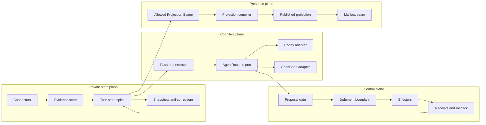

# Functional Decomposition v1

- Status: accepted D2 baseline
- Updated: 2026-07-15
- Inputs: `requirements-v1.md`, `../PRODUCT.md`
- Goal: identify stable responsibilities before selecting implementation details

## 1. System shape

Forme is one product entity built from four functional planes:

1. **Private state plane** — source evidence, Twin state, history, corrections.
2. **Cognitive plane** — scoped agent passes through Codex or OpenCode.
3. **Control plane** — proposal validation, owner judgment, authorization, effects, receipts.
4. **Presence plane** — explicit projection compilation and the future mailbox seam.



## 2. Module map

### F1. Workspace registry

Owns:

- workspace identity and type;
- configured source roots;
- read/write allowlists;
- connector configuration;
- current Twin ID and revision;
- local runtime preferences.

Does not own source contents, runtime sessions, or projection payloads.

### F2. Source connector interface

Initial connectors:

- local project directory;
- exported notes mirror, beginning with the existing Apple Notes spike.

Responsibilities:

- enumerate source records;
- assign stable source IDs;
- report content hashes and timestamps;
- preserve source/normalized/derived distinctions;
- report unreadable, locked, unsupported, or fidelity-limited items;
- emit changes since a known cursor.

Connectors are read-only in the agent lane. Any source write-back is a separate effector.

### F3. Evidence store

Owns immutable or append-only evidence references:

- source ID and connector ID;
- relative locator or content address;
- observed timestamp and hash;
- original-language excerpt when allowed;
- sensitivity and projection eligibility;
- provenance class: original, normalized, derived, Forme-owned.

Twin claims refer to evidence IDs, not ambient file paths.

### F4. Twin state spine

Owns the durable semantic state:

- Project Identity;
- Active Intent / Direction;
- Current State;
- Confirmed Decisions;
- Open Questions;
- Unresolved Tensions;
- Emerging Patterns;
- User Corrections;
- Allowed Projection Scope.

Every state change advances a revision and records the event that caused it. Runtime transcripts are not part of the canonical state.

### F5. Snapshot and change engine

Responsibilities:

- materialize Twin snapshots at meaningful boundaries;
- compare source and Twin revisions;
- distinguish mechanical change from semantic change candidates;
- produce deterministic change packets for Continuity and Reflection passes;
- mark dependent proposals/projections stale after correction.

### F6. Pass orchestrator

Runs bounded read-only passes:

- Continuity;
- Reflection;
- Action proposal;
- Projection draft;
- Verification.

It selects the minimum Twin slice, evidence set, proposal schema, runtime capabilities, and tool policy for each pass. It does not write canonical state.

### F7. AgentRuntime port

Base lifecycle:

- inspect runtime and authentication health;
- start or connect;
- run one bounded pass;
- stream normalized events;
- answer a permission request;
- cancel;
- close.

The port includes capability negotiation for structured output, permissions, sandbox, session resume, diff/revert, plugins, skills, MCP, and subagents.

### F8. Codex adapter

Responsibilities:

- map App Server or supported CLI lifecycle into the shared port;
- declare Codex-native sandbox and approval capabilities;
- map thread/turn/item events into normalized events;
- keep Codex identifiers in adapter metadata, not Twin state;
- support the existing local user-authenticated Codex path.

### F9. OpenCode adapter

Responsibilities:

- manage or connect to `opencode serve` through the official SDK/API;
- declare plugin, custom-tool, provider, permission, diff, and revert capabilities;
- install a deny-by-default Forme agent/tool policy;
- map sessions/messages/SSE events into normalized events;
- require external containment for capabilities not protected by a native OS sandbox.

### F10. Proposal gate

The only ingress from cognitive output into product state.

Responsibilities:

- validate against Forme-owned JSON Schema;
- reject unknown or oversized fields;
- verify evidence IDs and base Twin revision;
- calculate stable proposal/effect fingerprints;
- detect stale, duplicate, or contradictory proposals;
- persist a proposal as inferred/pending, never confirmed by default.

### F11. Judgment boundary

Owns:

- confirm, correct, reject, park, and ask-one-question decisions;
- authorization grants and expiry;
- confidence × reversibility × blast-radius evaluation;
- owner-visible action preview;
- invalidation triggered by correction.

It translates human judgment into append-only decision events.

### F12. Effector registry

Effectors are deterministic, narrow, typed operations. Each effector defines:

- input schema;
- read and write scope;
- precondition and base revision;
- dry-run behavior;
- idempotency key;
- execution behavior;
- rollback support;
- receipt shape.

The first effector should update a Forme-owned state or plan artifact. Generic model-authored shell commands are not effectors.

### F13. Receipt and rollback ledger

Owns append-only records correlating:

- proposal;
- evidence and base revision;
- human or policy authority;
- runtime run;
- effector and idempotency key;
- before/after references;
- final status;
- rollback status.

It is the product audit record, not a copy of runtime logs.

### F14. Projection scope manager

Owns the explicit allowlist of claims and fields eligible for a projection. A private claim must cross a user-visible confirmation boundary before entering this scope.

### F15. Projection compiler

A deterministic compiler that receives only:

- Allowed Projection Scope;
- selected confirmed claims;
- explicitly shareable unresolved hypotheses;
- freshness and provenance class;
- agency and reply boundaries.

It produces a versioned projection. It has no source connector or private evidence-store handle.

### F16. Projection publisher

Optional for the one-month build, depending on O3/O7.

Responsibilities:

- publish and revoke versioned projections;
- enforce audience and expiry;
- preserve the exact projection version used in an interaction;
- avoid local paths, private evidence, and raw notes.

### F17. Identity and mailbox seam

Interface-constraining now; build scope gated by O7.

Responsibilities:

- Forme identity and agent address;
- invite/relationship authorization;
- asynchronous message envelope;
- thread and delivery receipt;
- projection-version reference;
- reply attribution: agent-drafted, owner-approved, or explicitly auto-delegated;
- loop, spam, and rate controls.

An inbound message is untrusted input. It may create a proposal but may not directly update the receiving Twin.

### F18. Control nodes and views

One coherent Forme experience presents:

- Now;
- What Changed;
- What Forme Sees;
- What Forme Can Do;
- Shareable Projection.

The view reads durable state and emits judgment commands. It owns no private truth.

### F19. Wake scheduler

Uses wake/restart as the first timing primitive:

- render existing state first;
- determine whether meaningful catch-up is required;
- run only needed passes;
- remain correct without a resident intelligence process.

### F20. Observability and evaluation

Tracks:

- connector fidelity and unsupported-item counts;
- wake-to-visible and wake-to-fresh timing;
- proposal suppression and validation failures;
- reflection quality review;
- owner decisions and corrections;
- effect/rollback outcomes;
- runtime capability and contract-test status;
- projection privacy canaries.

Product telemetry must not contain private source content.

## 3. Stable boundaries

| Boundary | Input | Output | Forbidden coupling |
|---|---|---|---|
| Connector → Evidence | source records | evidence refs and change cursor | Connector cannot confirm semantic claims |
| Twin → Runtime | scoped context packet | none | Runtime cannot read the full Twin implicitly |
| Runtime → Proposal Gate | schema-constrained proposal | pending proposal or rejection | Runtime cannot call canonical writers |
| Judgment → Effector | authorized typed effect | receipt | Approval alone cannot mutate state |
| Effector → Twin | verified receipt | new Twin revision | Runtime transcript cannot substitute for receipt |
| Twin → Projection | allowed scope and selected claims | versioned projection | Compiler cannot read private sources |
| Mailbox → Twin | untrusted message | optional proposal | Incoming content cannot become truth directly |

## 4. Main-branch migration map

The existing implementation is evidence and reusable code, not something to discard.

| Existing main capability | Destination responsibility | Migration approach |
|---|---|---|
| `runner/scan.ts` and git delta | F2/F5 connector and change engine | Extract source enumeration and cursor semantics behind connector interface |
| `runner/agent-schema.ts` | F10 proposal gate | Generalize the read-only JSON boundary without weakening validation |
| `schema/card.schema.json` | Proposal presentation subtype | Preserve envelope, evidence, fingerprint, and decision ergonomics |
| `decisions.jsonl` | F11/F13 judgment and receipt ledgers | Extend append-only events; do not rewrite history |
| `runner/execution.ts` and hunks | F12 effectors | Wrap current hunk executor as one typed effector |
| `runner/state-diff.ts` | F5/F18 continuity projection | Feed from Twin revisions rather than ad hoc state only |
| `runner/taste.ts` | Future judgment-model pass | Keep read-only distillation and scoped aging behavior |
| Codex one-shot invocation | F8 Codex adapter | Preserve working path behind shared port |
| `spikes/apple-notes/` | F2 notes-mirror connector | Reuse export evidence; add manifest/fidelity interface and consent gate |
| console a/p/r, correction, question, undo | F11/F18 control nodes | Preserve validated interaction primitives |
| launchd wake/catch-up | F19 scheduler | Keep local-first timing primitive |

## 5. Dependency order

The critical path is:

```text
workspace registry
  → connector + evidence IDs
  → Twin state spine + revisions
  → scoped context packet
  → runtime port + one adapter pass
  → proposal gate
  → judgment event
  → one effector + receipt
  → projection scope + compiler
```

Mailbox work depends on the projection contract, identity, and delegation policy. It does not block the private Twin loop.

## 6. Build slices

### M0 — Contracts and runtime gate

- state revision and evidence-reference vocabulary;
- proposal, runtime event, receipt, projection, and message contracts;
- Codex and OpenCode discovery/smoke adapters;
- unauthorized-write, cancel, crash, restart, and contract-drift tests.

### M1 — Continuity vertical slice

- local project and notes-mirror connector fixtures;
- Twin state v0 and snapshots;
- wake/restart reconstruction;
- Now / What Changed / Next Move view.

### M2 — Cognition vertical slice

- cross-time reflection packet;
- evidence, uncertainty, correction, and invalidation;
- evaluation rubric that rejects summary-only output.

### M3 — Bounded Agency vertical slice

- one Forme-owned effector;
- owner approval;
- idempotent execution, receipt, crash injection, and rollback.

### M4 — Controlled Presence vertical slice

- Allowed Projection Scope;
- deterministic versioned projection;
- privacy canary, freshness, provenance class, and agency boundary.

### M5 — Optional invite-only mailbox

Only if O7 selects it and M1–M3 are already real:

- identity/invite;
- message relay;
- Projection Agent reply draft using projection only;
- owner-approved send and receipt;
- no autonomous agent loop.

## 7. Decisions deliberately deferred

- UI framework and final carrier;
- production hosting vendor;
- public identity/directory model;
- server-side runtime vendor;
- native Apple Notes write-back;
- generalized multi-agent orchestration;
- full Codex/OpenCode feature parity;
- fork or native runtime-core embedding.

None of these is required to implement and evaluate M0–M3.
