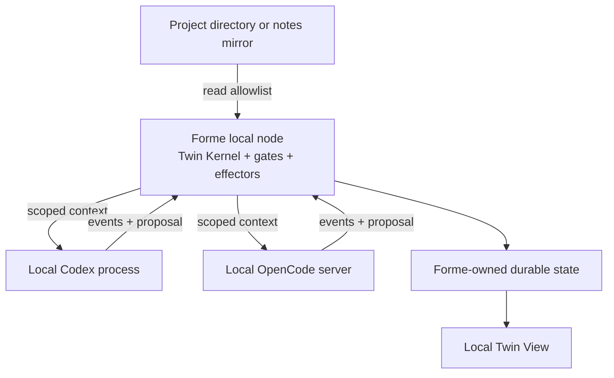
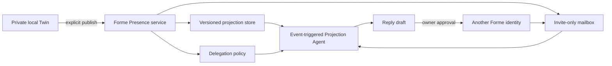
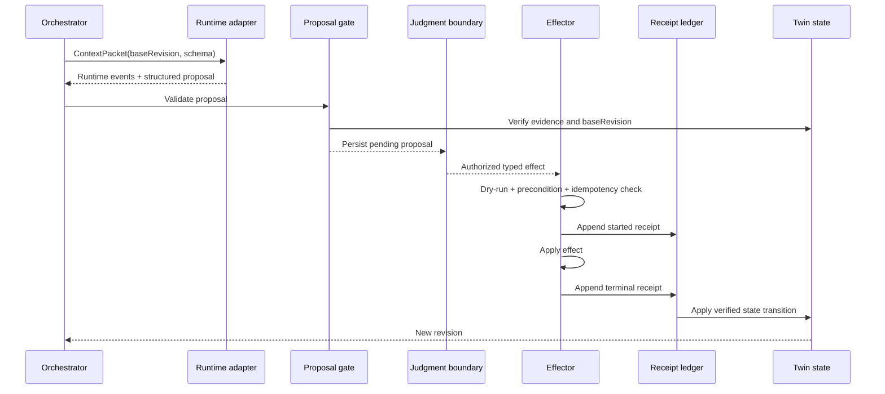

# Harness Architecture v1

- Status: accepted D3 baseline
- Updated: 2026-07-15
- Inputs: `../product/REQUIREMENTS.md`, `FUNCTIONAL_DECOMPOSITION.md`, `RUNTIME_STRATEGY.md`
- Implementation baseline: existing native TypeScript, Node.js, AJV, append-only ledgers, and local-first wake/catch-up path on `main`

## 1. Architecture decision

Forme is a local-first Living Project Twin with a pluggable agent execution layer.

- Canonical semantic state lives in Forme-owned files and append-only events.
- Codex and OpenCode are first-class runtimes behind a small shared port.
- Each adapter declares native capabilities; the product does not force feature parity.
- Agent output enters Forme only as a validated proposal.
- Deterministic effectors perform writes and produce receipts.
- External projections compile from an explicit allowlist and never read private sources at render time.
- A future server mailbox stores projections, messages, policies, and receipts—not the private Twin.

## 2. Deployment topology

### 2.1 MVP local node



Only one runtime needs to execute a given pass. Both may be installed and healthy. Runtime selection is based on user choice, required capabilities, and local availability.

For M0, Forme discovers user-operated local installations and existing authentication. Bundling, downloading, or centrally brokering runtime credentials is deferred.

### 2.2 Optional Presence server



The server-side Projection Agent is event-triggered, not a durable source of truth. It receives no local filesystem handle, raw note, private evidence, or complete Twin state.

## 3. Durable local layout

The exact vault root remains configurable. The proposed Forme-owned layout is:

```text
98_Forme/
  workspace.json
  evidence/
    manifest.jsonl
  twin/
    state.json
    state.md
    events.jsonl
    snapshots/
      <revision>.json
  proposals/
    pending/
    resolved/
  receipts/
    actions.jsonl
  projections/
    scope.json
    manifests.jsonl
    rendered/
  runtime/
    runs.jsonl
```

Rules:

- `state.json` is the machine-readable current projection of Twin events.
- `state.md` is a human-readable projection, not an independent truth source.
- `events.jsonl` and `actions.jsonl` are append-only.
- snapshots are immutable and addressed by Twin revision.
- runtime logs may reference a run but cannot define confirmed state.
- source content remains outside `98_Forme/` unless a connector intentionally creates a separate import mirror.

## 4. Core identifiers

All cross-module correlation uses opaque stable IDs:

| ID | Meaning |
|---|---|
| `workspaceId` | One bounded local project or notes workspace |
| `twinId` | Semantic entity maintained inside that workspace |
| `revision` | Monotonic Twin state revision |
| `evidenceId` | Immutable source observation/reference |
| `proposalId` | One agent-authored semantic or action proposal |
| `runId` | One bounded runtime execution |
| `effectId` | One deterministic requested effect/idempotency key |
| `receiptId` | One completed or terminal effect record |
| `projectionId` + `version` | One published view and immutable version |
| `messageId` + `threadId` | Asynchronous mailbox envelope and conversation |

Runtime-native session/thread IDs are adapter metadata. They are never used as Twin identity or revision.

## 5. Twin state model v0

The canonical state contains:

```ts
interface TwinState {
  schemaVersion: "0"
  twinId: string
  workspaceId: string
  revision: number
  updatedAt: string
  identity: ClaimSet
  activeIntent: ClaimSet
  currentState: ClaimSet
  confirmedDecisions: ClaimSet
  openQuestions: ClaimSet
  unresolvedTensions: ClaimSet
  emergingPatterns: ClaimSet
  userCorrections: CorrectionRef[]
  allowedProjectionScope: ProjectionScopeRef
}
```

Each claim includes:

- stable claim ID;
- status: inferred, confirmed, disputed, superseded, or unresolved;
- statement;
- evidence IDs;
- confidence for inferred claims;
- creation and last-evaluated revision;
- supersession or correction references;
- sensitivity and projection eligibility.

Only deterministic state-transition code advances `revision`.

## 6. Context packet

The pass orchestrator produces an immutable context packet:

```ts
interface ContextPacket {
  workspaceId: string
  twinId: string
  baseRevision: number
  pass: "continuity" | "reflection" | "action" | "projection" | "verification"
  claims: ScopedClaim[]
  evidence: ScopedEvidence[]
  recentCorrections: CorrectionRef[]
  allowedTools: string[]
  proposalSchemaId: string
  limits: {
    maxEvidenceItems: number
    maxOutputBytes: number
  }
}
```

The packet is the entire semantic read surface for that pass. Adapters may add runtime instructions but may not silently add private sources.

## 7. Runtime port and capability selection

The shared port is defined in `agent-runtime-strategy.md`. Selection follows:

1. filter healthy runtimes;
2. require capabilities for the pass;
3. honor explicit user preference;
4. prefer the adapter already validated for the active scene;
5. fail with a legible missing-capability result rather than silently weakening policy.

Example pass requirements:

| Pass | Required capabilities | Forbidden capabilities by default |
|---|---|---|
| Continuity | structured output | write, shell, external directory |
| Reflection | structured output | write, shell, external directory |
| Action proposal | structured output, custom Forme tools optional | direct write, unrestricted shell |
| Projection draft | structured output | private evidence, source filesystem, write |
| Verification | structured output; workspace diff if applicable | unrelated external access |

## 8. Proposal transaction



### Commit protocol

1. Validate proposal schema and size.
2. Verify evidence references and `baseRevision`.
3. Persist proposal as pending.
4. Record owner decision or matching authorization grant.
5. Recheck base revision and effect preconditions.
6. Calculate `effectId`; return the existing receipt if already terminal.
7. Append a started receipt before the external mutation.
8. Apply one deterministic effect.
9. Append succeeded, failed, or indeterminate terminal state.
10. Advance Twin state only from a verified receipt.

If a process crashes after step 7, recovery inspects the effector-specific world state and resolves the receipt before any retry. It never asks the model whether the action probably happened.

## 9. Permission and sandbox model

Forme uses layered enforcement:

1. **Context minimization** — do not provide data the pass does not need.
2. **Runtime permission policy** — deny generic write and external access.
3. **OS containment** — use native Codex sandbox or an external sandbox when execution risk requires it.
4. **Forme proposal gate** — validate output and revision.
5. **Typed effector allowlist** — the only canonical write surface.
6. **Owner/policy judgment** — authority for the specific effect.
7. **Receipt and rollback** — observable result and recovery.

Runtime permission prompts are not transactions. A tool call is not a canonical mutation. Only a completed Forme effector receipt can advance Twin state.

## 10. Projection compiler

Projection compilation is deterministic:

```text
Twin revision
  → explicit Projection Scope
  → eligibility and audience filter
  → projection manifest
  → optional agent-authored wording proposal
  → deterministic content validation
  → immutable projection version
  → publish/revoke command
```

An agent may propose wording, but it cannot add a claim that is absent from the projection manifest. The renderer accepts IDs and pre-approved display text, not a private source handle.

Required projection fields:

- projection ID and version;
- owner/twin pseudonymous identity;
- audience and expiry;
- source Twin revision;
- claims with confirmed/inferred/unresolved status;
- freshness and provenance class;
- allowed interaction intents;
- delegation/reply policy;
- explicit owner-only boundaries;
- published, superseded, or revoked state.

## 11. Mailbox protocol seam

The message envelope is designed now because it constrains projection identity and attribution, but implementation is gated by O7.

Safety rules:

- sender identity and recipient relationship are authenticated;
- every message references the projection version visible to the sender;
- inbound content is untrusted and cannot update the Twin directly;
- a Projection Agent can only read the referenced published projection, current thread, and delegation policy;
- MVP replies are owner-approved unless a future explicit narrow grant exists;
- reply attribution distinguishes agent-drafted from owner-approved and auto-delegated;
- automatic agent-to-agent recursion is disabled;
- rate, size, expiry, and turn limits are deterministic.

## 12. Adapter contract tests

Both adapters run the same tests:

1. discovery and version report;
2. authentication-health classification without exposing credentials;
3. start/connect and clean close;
4. structured proposal success;
5. invalid structured output rejection;
6. scoped-context canary absence;
7. generic write denial;
8. permission ask/allow/deny mapping;
9. cancellation terminal state;
10. process crash before proposal;
11. process crash after effect request but before receipt;
12. session deletion and restart from Twin revision;
13. upstream event/schema drift diagnostic.

Runtime-specific tests remain separate, including Codex native sandbox verification and OpenCode deny-policy/plugin/tool enforcement.

## 13. Migration plan from `main`

### Phase A — additive contracts

- Add new schemas alongside current cards and decision events.
- Wrap existing Codex invocation behind the port without changing behavior.
- Treat current decision cards as one proposal presentation subtype.

### Phase B — Twin state behind a feature flag

- Add evidence IDs, state revisions, snapshots, and ContextPacket.
- Keep the existing drift runner active in parallel.
- Generate Twin state without changing existing execution paths.

### Phase C — first closed loop

- Route one continuity/reflection proposal through the new gate.
- Reuse existing correction/decision controls.
- Wrap the current hunk executor as the first typed effector.
- Write both the current execution record and the new action receipt until equivalence is demonstrated.

### Phase D — controlled projection

- Implement Projection Scope and compiler.
- Generate a local immutable projection artifact.
- Add publication only after privacy canary and revoke behavior pass.

### Phase E — optional mailbox

- Implement only after O7 and after the private loop is stable.
- Keep it invite-only and owner-approved.

No phase requires rewriting historical ledgers or forking a runtime.

## 14. Verification gates

| Gate | Blocks | Required evidence |
|---|---|---|
| G0 Contract integrity | Adapter code | Schemas validate positive fixtures and reject adversarial fixtures |
| G1 Runtime containment | Agent passes | Unauthorized-write tests pass for selected adapter |
| G2 Crash equivalence | Effects | Injected failures yield zero or one resolved receipt |
| G3 Twin independence | Scene 1 | Session deletion and restart preserve state |
| G4 Reflection quality | Scene 2 | Owner accepts one cross-time insight as more than summary |
| G5 Effector reversibility | Scene 3 | Dry-run, receipt, and rollback work on a real Forme-owned artifact |
| G6 Projection privacy | Scene 4 | Out-of-scope canary cannot reach projection output |
| G7 Mailbox safety | Optional mailbox | Invite, attribution, no-recursion, and owner-approval tests pass |

## 15. Open decisions that may change implementation

- O3: static projection or interactive Q&A;
- O4: markdown console or local HTML Twin View;
- O7: mailbox implementation or protocol seam only;
- O8: project collaboration projection or personal collaboration profile.

These decisions do not change the private Twin, runtime port, proposal gate, or effector architecture.
