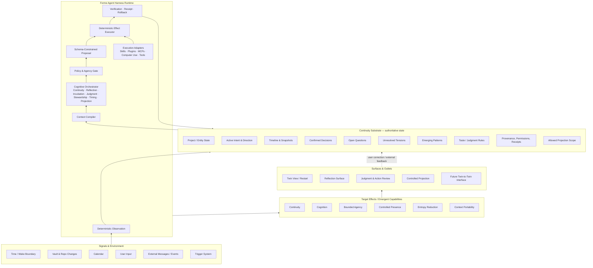

# Forme MVP Architecture Understanding Contract v0.1

> **Reference status (2026-07-23):** owner-authored working map from the rebuild transition. It remains useful for shared understanding and open architecture questions, but it is not the current implementation authority. Current product, architecture, gate, and decision authority lives in `docs/PRODUCT.md`, `docs/ARCHITECTURE.md`, `docs/CONTROL.md`, and `docs/DECISIONS.md`.

**Status:** Working contract

**Created:** 2026-07-17

**Authority:** Zayn is the only person who confirms or changes architectural intent. The local agent may propose changes but must not silently redefine the contract.
**Scope:** The one-month Living Project Twin MVP, not the complete Forme horizon.

> 这份文档不是一份穷尽实现细节的 tech spec。它的作用是让 Zayn 与本地 agent 在 build 过程中持续共享同一个系统模型，并能清楚识别代码实现、临时选择与长期架构之间的区别。

## 0. Contract purpose

This contract exists to preserve architecture understanding while implementation moves quickly. It must help both owner and agent answer:

1. What truth is Forme maintaining?
2. Which layer owns each responsibility?
3. Where may probabilistic interpretation occur?
4. Where may deterministic effects occur?
5. How does agency remain legible and reversible?
6. How does every surface remain connected to the same evolving entity?
7. Which choices are MVP implementation choices rather than long-term doctrine?

This contract is intentionally smaller than the White Paper and more semantic than a tech spec.

---

## 1. Architecture map



### Diagram legend

- **Solid architecture:** current MVP contract.
- **Dashed or future-labelled elements:** horizon direction, not required this month.
- **Upward flow:** signals become maintained state, interpretation, bounded action, effects, and surfaces.
- **Return flow:** judgment, verification, correction, and feedback update the substrate.

---

## 2. Layer semantics

### L0 — Signals & Environment

**Question answered:** What changed, and what caused the system to wake?

Includes time/wake boundaries, vault and repository changes, calendar events, explicit user input, external messages, and trigger events.

Rules:

- A trigger is not a notification.
- A signal becomes relevant only after interpretation and policy checks.
- The MVP timing primitive is the **wake/restart boundary**, not a general proactive timing engine.

### L1 — Continuity Substrate

**Question answered:** What does Forme currently believe the entity is, with what evidence and authority?

This is the load-bearing truth layer. For the MVP, it contains:

- Project / Entity Identity
- Active Intent / Direction
- Current State
- Timeline and Snapshots
- Confirmed Decisions
- Open Questions
- Unresolved Tensions
- Emerging Patterns
- User Corrections
- Taste / Judgment Rules
- Provenance and Receipts
- Permissions / Agency State
- Allowed Projection Scope

Rules:

- The substrate carries durable state; it is not itself the user experience.
- Inference must be distinguishable from confirmed meaning.
- A Living Dossier or `state.json` is an implementation of the substrate, not the definition of the Twin.
- The substrate must survive disposable sessions and runtime crashes.

### L2 — Forme Agent Harness Runtime

**Question answered:** How does Forme turn signals and state into interpretations, proposals, and verified effects?

Core responsibilities:

1. **Deterministic Observation** — collect bounded evidence without assigning meaning.
2. **Context Compiler** — assemble the minimum scoped context required for the current cognitive responsibility.
3. **Cognitive Orchestrator** — invoke specialized cognition, currently as sequential passes if useful.
4. **Policy & Agency Gate** — decide whether an output may be shown, shadowed, executed, or blocked.
5. **Schema-Constrained Proposal** — convert probabilistic reasoning into a typed, inspectable object.
6. **Deterministic Effect Executor** — perform authorized writes or external effects.
7. **Verification / Receipt / Rollback** — prove what happened and allow recovery.
8. **Execution Adapters** — Skills, Plugins, MCPs, Computer Use, and tools. These extend execution; they do not define Forme’s cognition.

### L3 — Target Effects / Emergent Capabilities

**Question answered:** What changes in the user’s life when the system works?

- **Continuity:** interruption no longer destroys trajectory.
- **Cognition:** patterns, tensions, and emerging change become visible.
- **Bounded Agency:** the system can act within earned and inspectable trust.
- **Controlled Presence:** the entity can remain externally present through scoped projection.
- **Entropy Reduction:** maintenance debt is absorbed without creating a new review burden.
- **Context Portability:** the entity does not restart from zero across tools and agents.

These are outcomes, not modules. A module earns its place only if it contributes to one or more of them.

### L4 — Surfaces & Outlets

**Question answered:** How does the same entity state become perceivable or interactive in a particular relationship?

Current and near-term surfaces:

- Twin View / Restart
- Reflection Surface
- Judgment and Action Review
- Controlled External Projection

Future surface:

- Twin-to-Twin interaction

Rules:

- Surfaces are projections of one substrate, not disconnected mini-products.
- Projection may read only from the explicit Allowed Projection Scope.
- A generated surface must preserve state type: confirmed, inferred, unresolved, or owner-only.

---

## 3. The canonical system loop

```text
Observe
→ Update evidence
→ Compile scoped context
→ Interpret through a cognitive responsibility
→ Produce a typed proposal
→ Apply policy and owner judgment
→ Execute a deterministic effect
→ Verify, receipt, and preserve rollback
→ Update the continuity substrate
→ Render the appropriate surface or projection
```

The loop is more important than any individual component. The MVP succeeds when Continuity, Cognition, Bounded Agency, and Controlled Presence emerge from **one shared loop**.

---

## 4. Architecture axioms

### AX-01 — The substrate carries truth; the runtime carries interpretation

LLM outputs never become authoritative merely because they are fluent. Durable state must preserve source, confidence, scope, and authority.

### AX-02 — Probabilistic interpretation, deterministic effect

The LLM lane is read-only and returns schema-constrained output. Authorized writes are performed by deterministic Forme code.

### AX-03 — One entity, many cognitive responsibilities

Internally, cognition may be divided into specialized agents or passes. Externally, Forme presents as one coherent entity.

### AX-04 — Surfaces do not own state

Twin View, cards, projection pages, and future adaptive interfaces are renderings of the substrate. They may not create private parallel truths.

### AX-05 — Agency must be earned, legible, and reversible

Every meaningful action has an agency level, evidence, permission basis, receipt, and recovery path.

### AX-06 — Projection is compiled, not leaked

External projection uses an explicit whitelist and never performs direct vault-wide retrieval at render time.

### AX-07 — Preserve unresolvedness where resolution would be false

Forme may maintain tensions, ambiguity, and immature ideas without collapsing them into tasks, decisions, or identity claims.

### AX-08 — The MVP is a vision slice, not the final ontology

One project, one timing primitive, sequential passes, and local static surfaces are deliberate MVP constraints. They must not silently become permanent architectural doctrine.

---

## 5. Current MVP slice

The MVP applies the architecture to one entity: **the Forme project**.

### Required loop

1. **Continuity:** at restart, reconstruct active intent, current state, meaningful changes, unresolved tensions, and next move.
2. **Cognition:** produce at least one non-trivial, evidence-backed reflection that is more than summary.
3. **Bounded Agency:** after owner confirmation, execute one real, reversible maintenance or update action.
4. **Controlled Presence:** generate an external project projection from the allowed scope only.

### Current boundaries

- **Entity scope:** one project, not the full person twin.
- **Source scope:** explicitly allowlisted Forme vault and repository paths.
- **Timing:** wake/restart is the first timing primitive.
- **Runtime:** no required resident daemon; wake-catchup preserves narrative continuity.
- **Cognition implementation:** sequential internal passes are acceptable.
- **Experience:** one Forme entity, not a visible bot team.
- **Projection:** deterministic local/static output is sufficient for the demo.

### Explicitly outside this month’s scope

- Full person twin
- General timing engine
- Always-on resident process
- Open-ended generative UI runtime
- Tool or plugin marketplace
- General multi-agent federation
- Twin-to-twin protocol
- Interactive public Q&A agent
- Broad autonomous computer use
- Vault-wide heuristic source discovery

---

## 6. Cognition-based multi-agent contract

Cognitive responsibilities are divided by **how the entity must be understood**, not by which tool is used.

| Responsibility | Primary question | Reads | Produces | Must not do |
|---|---|---|---|---|
| Continuity | Where is the entity, and what trajectory must resume? | state, snapshots, decisions, open loops | restart state, continuity diff | invent direction from sparse evidence |
| Reflection | What may be changing or repeating across time? | snapshots, decisions, language, tensions, artifacts | evidence-backed reflection with uncertainty | publish interpretation as confirmed truth |
| Incubation | What immature possibility should remain alive? | fragments, recurrence, unresolved material | emerging thread, resurfacing candidate | force premature categorization or action |
| Judgment | How does the owner tend to decide in this scope? | decisions, corrections, counterexamples | scoped taste rule, shadow prediction | turn past preference into permanent identity |
| Stewardship | What maintenance preserves system coherence? | drift, health state, contracts | bounded maintenance proposal or authorized effect | optimize away meaningful ambiguity |
| Timing | Is this the right moment to surface or act? | event, workflow boundary, urgency, state | intervention decision | treat every trigger as an interruption |
| Verification | Did the effect satisfy the contract? | proposal, effect, deterministic checks | receipt, anomaly, rollback signal | let the executor self-certify without evidence |
| Projection | What may this relationship see and interact with? | allowed projection scope | role-scoped projection | read the private vault directly |

### Coordination rule

Cognitive responsibilities may interpret and propose. Only the Policy & Agency Gate can admit a meaningful effect. Conflicts between responsibilities must become visible as tension or a decision object; they must not be resolved by whichever agent runs last.

Common legitimate tensions:

- clarity vs ambiguity
- action vs incubation
- entropy reduction vs preservation
- projection clarity vs privacy
- automation vs authorship
- current direction vs historical commitment

---

## 7. Cross-cutting invariants

These constraints apply to every layer.

### Authorship

Forme may extend the entity but may not claim final authority over the entity’s meaning or identity.

### Legibility

As autonomy grows, the owner’s ability to understand the system must not shrink.

### Reversibility

Meaningful effects preserve diff, receipt, and rollback where technically feasible.

### Non-finality

Learned rules have scope, evidence, recency, confidence, counterexamples, and an expiration or revalidation path.

### Privacy and projection agency

Private substrate, synthesized private state, public pattern, and public artifact are distinct levels. Promotion between them is explicit.

### Context minimization

Each cognitive responsibility receives only the context needed for the current task and authorized scope.

### Crash equivalence

A session is disposable. Durable truth, decisions, state, and receipts survive independently of a running process.

---

## 8. Architecture anti-goals

The MVP architecture is **not**:

- a generic agent shell with Forme branding
- a card product
- a dashboard-first product
- an automated project brief mistaken for a Twin
- a memory store or “remember everything” system
- a visible multi-bot collaboration UI
- a direct-vault public projection engine
- a web-app-first commitment
- an always-on daemon requirement
- an excuse to build generalized infrastructure before proving the experience
- a system where implementation becomes architectural truth without owner review

---

## 9. Agent build protocol

Every architecture-relevant implementation task must use this protocol.

### Before implementation

The local agent writes a short **Architecture Intent**:

```yaml
architecture_intent:
  task: ""
  target_effects: []        # Continuity / Cognition / Bounded Agency / Presence / Entropy / Portability
  layers_touched: []        # L0 / L1 / L2 / L3 / L4 / cross-cutting
  contract_refs: []         # e.g. AX-02, AX-05
  state_objects_read: []
  state_objects_written: []
  cognitive_responsibility: ""
  agency_level: "observe | propose | shadow | owner-confirmed effect | authorized autonomous effect"
  source_scope: []
  new_assumptions: []
  verification_plan: []
  rollback_plan: ""
  out_of_scope_check: ""
```

The agent must stop and raise a contract question before coding when:

- the change creates a new source of truth
- a surface begins owning durable state
- an LLM output would directly write to disk
- projection scope expands
- a new autonomous permission is implied
- two cognitive responsibilities conflict
- an MVP implementation choice is being promoted into long-term architecture

### After implementation

The agent writes an **Architecture Receipt**:

```yaml
architecture_receipt:
  implemented: ""
  files_and_modules: []
  actual_layers_touched: []
  data_flow_after_change: ""
  invariants_verified: []
  tests_or_evidence: []
  new_state_or_schema: []
  architecture_debt: []
  contract_drift_detected: false
  proposed_contract_changes: []
  rollback_or_recovery: ""
```

No “done” report is complete without stating whether the implementation changed the shared system model.

---

## 10. Contract change and drift protocol

### Code disagrees with contract

Do not silently update the contract to match the code. Record one of:

1. **Implementation defect** — code should return to the contract.
2. **Temporary exception** — bounded shortcut with owner-visible debt and removal condition.
3. **Architecture proposal** — evidence suggests the contract should change; owner must decide.
4. **Open question exposed** — neither code nor contract has earned certainty yet.

### Contract versioning

A contract revision must include:

- changed claim
- previous claim
- why it changed
- evidence or owner decision
- affected modules and artifacts
- migration or cleanup required
- whether the change is MVP-specific or horizon-level

Only Zayn upgrades a claim to confirmed architectural intent.

---

## 11. Owner re-entry checklist

After time away, Zayn should be able to regain architecture understanding by answering these questions from the map and current receipts:

1. What is the authoritative substrate right now?
2. What changed in the substrate since the last review?
3. Which cognitive responsibility produced each new interpretation?
4. Which effects were proposed, shadowed, or executed?
5. Where did owner judgment enter the loop?
6. What permissions are currently active?
7. Can every meaningful effect be inspected and reversed?
8. What may the external projection access?
9. Did any surface or module create a parallel source of truth?
10. Which implementation assumptions now deserve confirmation, rejection, or expiration?

If these cannot be answered in roughly five minutes, comprehension has decoupled and the architecture contract or receipts need repair.

---

## 12. Current open architecture questions

These are intentionally unresolved and must not be smuggled into code as settled truths:

1. What is the minimum stable entity-state schema after real use?
2. When do sequential passes become genuine long-lived specialized agents?
3. How should cognitive responsibilities negotiate conflicts without forcing every tension onto the owner?
4. How does Incubation preserve half-formed ideas without creating a new information graveyard?
5. What evidence is sufficient to promote a taste rule into autonomous authority?
6. How should permissions age, decay, and be re-certified?
7. What timing primitives follow wake/restart?
8. How do Person Twin and Project Twin remain distinct while sharing context?
9. What is the smallest safe protocol for future Twin-to-Twin exchange?
10. When does adaptive surface composition become necessary rather than decorative?

---

## 13. Definition of architectural success for the MVP

The architecture is successful if, by the demo:

- the same authoritative project state supports restart, reflection, action, and projection
- the owner can distinguish evidence, inference, confirmed meaning, and unresolved tension
- one real interpretation leads to one real bounded and reversible effect
- projection remains fresh without reading the private vault directly
- the implementation can be explained through this contract without hidden parallel logic
- Zayn can leave and return to both the project and the architecture without reconstructing either from scratch

---

## Changelog

- **v0.1 · 2026-07-17** — Initial architecture understanding contract created from the Forme vision, Living Project Twin MVP scope, cognition-based multi-agent discussion, trust boundaries, and current deterministic-effect constraints.
