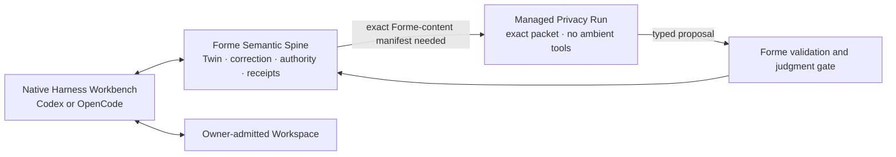

# Agent runtime strategy — curated 2026-07-15 research

- Status: dated research plus durable architecture guidance; Native
  Workbench/Managed Privacy dual-mode clarification added 2026-07-28
- Curated: 2026-07-24
- Original: [`harness-first/design/agent-runtime-strategy.md`](https://github.com/formehq/forme/blob/harness-first/design/agent-runtime-strategy.md)

This document preserves the useful conclusion of the Codex/OpenCode research:
Forme should consume a mature harness runtime rather than rebuild a generic
agent loop, while keeping durable product meaning and authority outside that
runtime.

Exact commands, versions, APIs, and capability claims are dated. Re-probe them
before implementing or upgrading an adapter.

## Durable decision

- **Codex is the first live MVP runtime.**
- **OpenCode remains a first-class architectural target and P1 live path.**
- **Forme does not require feature parity between them.**
- **The Twin boundary is runtime-neutral; each adapter remains runtime-native.**
- **A runtime session is disposable computation. The Twin is durable semantic
  state.**

This avoids two bad outcomes: rebuilding commodity harness machinery inside
Forme, or reducing mature runtimes to a lowest-common-denominator interface.

The Owner-confirmed 2026-07-28 clarification is authoritative in
[`../NATIVE-HARNESS-ARCHITECTURE.md`](../NATIVE-HARNESS-ARCHITECTURE.md):
Codex/OpenCode may act as the mature Native Harness Workbench; Forme is the
durable Semantic Spine; an exact packet/no-tools invocation is a Managed
Privacy Run, not the definition of every runtime session. NH1/NH2 still decide
the P0 default and authority boundary.

## Responsibility split

| Mature runtime | Forme |
| --- | --- |
| model and provider invocation | provider/runtime selection policy |
| native session, turn, streaming, retry, cancellation, and compaction | mapping a run to a bounded Forme operation |
| supported tools, MCP, skills, plugins, and subagents | deciding which capabilities a pass may receive |
| runtime permission prompts and available sandbox mechanisms | product policy and the hard semantic/write boundary |
| low-level messages, diffs, snapshots, and usage events | durable evidence, corrections, approvals, receipts, and recovery |
| generic file or shell capability inside a native Owner envelope | classify resulting evidence versus Forme-authoritative meaning/effect; protect canonical Forme state and external authority |

Neither Codex nor OpenCode is expected to provide Forme's domain guarantees:

- confirmed versus inferred meaning;
- correction propagation and stale-output invalidation;
- revision-bound owner authorization;
- deterministic effect compilation;
- product-level receipts;
- role-scoped projection policy;
- continuity across runtime, session, or model replacement.

## Runtime boundary

Invariant: every run has an explicit context/capability contract. A Native
Workspace Session may dynamically read only its Owner-admitted envelope and
cannot claim an exact manifest of dynamically selected content. A Managed
Privacy Run receives only its exact Forme-selected content packet and returns a
typed proposal; runtime-owned instructions/schema/metadata remain separately
disclosed. Neither may admit canonical Forme meaning, manufacture Owner
approval, expand authority, or bypass a Forme-authoritative gate.

## Integration ladder

Prefer the shallowest upstream-supported boundary that satisfies the product:

1. configuration and permission policy;
2. MCP, skills, or custom tools;
3. plugin hooks;
4. server/SDK adapter;
5. an upstream contribution of a generally useful extension point;
6. native host/core integration;
7. a maintained fork only after every earlier level is proven insufficient.

A fork requires a demonstrated blocker in a core Forme experience and an
explicit maintenance budget. Convenience alone is not enough.

## Two adapter surfaces, explicit capabilities

The architecture should expose two deliberately different surfaces:

1. **Native Workbench integration:** CLI/API/MCP/Skill/Plugin surfaces let an
   interactive Harness read restart context, Twin state, corrections, policy,
   typed Forme operations, and receipts while retaining its runtime-native
   workspace/session/tool behavior.
2. **Managed Privacy Run:** a runtime-native adapter starts and cancels one
   isolated exact-packet pass, receives lifecycle/output/audit events, and
   closes disposable resources.

The shared port should normalize only required identity, capability, lifecycle,
proposal, and audit semantics. Capabilities must be declared instead of
assumed. Examples include structured output, application permissions, OS
containment, session resume, workspace diff/revert, plugins, skills, MCP, and
subagents.

Adapter-native features may remain available behind those declarations. They
must not leak into the canonical Twin contract or silently broaden authority.

## Runtime gate

Both adapters should eventually face the same high-level questions, with
mode-specific pass conditions:

| Gate | Pass condition |
| --- | --- |
| Discovery | Forme identifies the actual runtime/version and can diagnose failure |
| Context contract | Native Session stays within its disclosed Owner envelope; Managed Run exposes only the approved packet |
| Structured proposal | invalid output cannot enter the Twin |
| Tool boundary | Native tools stay inside the Owner envelope; a Managed Run receives only its exact declared capability set |
| Unauthorized write | Native writes outside the Owner envelope fail closed; a Managed Run has no generic writer; neither path may write Forme canonical state directly |
| Permission lifecycle | native runtime prompts remain observable; any Forme authority transition maps to stable Forme events |
| Cancellation | cancellation cannot leave a hanging or half-admitted Forme-authoritative effect; ordinary native Workspace recovery follows the Harness contract |
| Crash equivalence | runtime loss cannot create half-written canonical state |
| Receipt correlation | every Forme-authoritative proposal, approval, effect, verification, and relevant runtime evidence remain linked |
| Restart | a new session resumes from Twin state, not transcript truth |
| Upgrade contract | upstream changes fail clearly under pinned adapter tests |

The current Codex R2/R3 path already proves the deliberately narrower Managed
Privacy side of this boundary: isolated packet visibility,
schema-constrained output, zero model-generated tools, local admission, exact
approval, and deterministic effects. It does not prove a Native Workbench
integration, a general-purpose Codex adapter, or OpenCode parity.

## Dated findings retained from the investigation

The July 15 investigation found supported external integration surfaces for
both runtimes:

- Codex exposed an App Server/CLI boundary suitable for external orchestration;
- OpenCode exposed a client/server model, TypeScript-oriented extension
  surfaces, and an HTTP/SDK path;
- both supplied substantially more generic harness functionality than Forme
  should rebuild;
- the inspected OpenCode configuration required special care around generic
  tools, external directories, plugins, and OS-level containment.

These are research findings, not permanent vendor guarantees. Use official
upstream interfaces, pin the tested version or commit, and protect upgrades
with contract tests.

## What this does not authorize

This strategy does not authorize:

- broader Codex or OpenCode visibility;
- generic shell or file mutation;
- direct runtime writes to the Twin;
- a runtime fork;
- live OpenCode work in P0;
- server-side AI, projection, messaging, or R4 implementation.

Each new visibility, capability, dependency, or effect still returns to the
owner stop gate.
